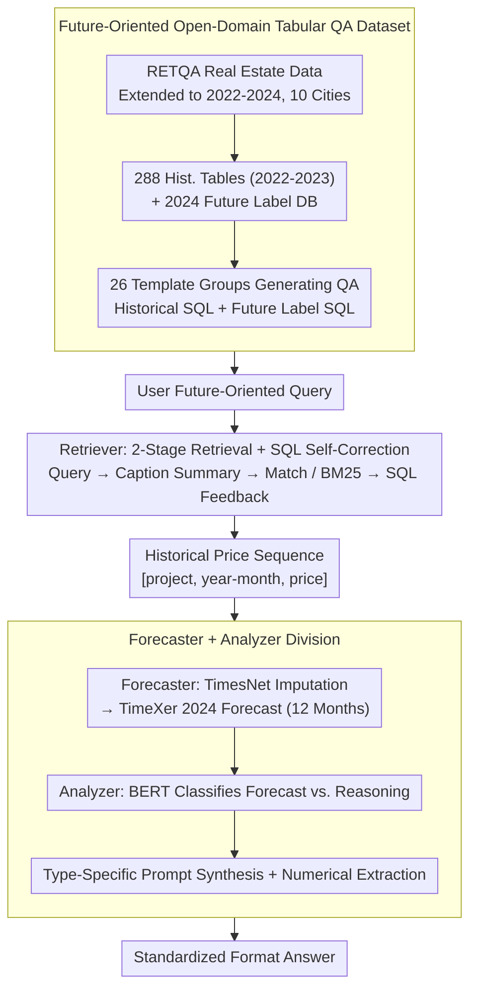

# ODTQA-FoRe: An Open-Domain Tabular Question Answering Dataset for Future Data Forecasting and Reasoning

**Conference**: ACL2026 Findings  
**arXiv**: [2606.02433](https://arxiv.org/abs/2606.02433)  
**Code**: https://github.com/jensenw1/ODTQA-FoRe  
**Area**: Time-series / Tabular QA  
**Keywords**: open-domain tabular QA, time-series forecasting, LLM agent, text-to-SQL, real estate

## TL;DR
ODTQA-FoRe introduces an open-domain tabular question answering task focused on future numerical forecasting and post-forecast reasoning. It provides the TimeFore three-agent framework, which chains table retrieval, SQL data acquisition, specialized time-series forecasting, and answer normalization into an evaluable baseline.

## Background & Motivation

**Background**: LLM + RAG has advanced open-domain and tabular QA. Many systems can retrieve tables from a database, generate SQL, and perform historical fact-based or numerical reasoning. Datasets like WikiTableQuestions, Spider, Open-WikiTable, NQ-TABLES, and RETQA cover closed/open-domain tabular QA, SQL generation, or multi-table retrieval.

**Limitations of Prior Work**: These tasks mostly address "historical data already in the database." They rarely handle future-oriented questions commonly asked by users, such as "What will the price of a certain residential complex be next year?" or "Which projects will have future prices exceeding a threshold?" LLMs themselves are unreliable for time-series forecasting, and in open-domain scenarios, users do not provide continuous historical sequences directly; systems must independently find tables, extract data, forecast, and then reason.

**Key Challenge**: Traditional ODTQA excels at retrieval and tabular reasoning, while time-series models excel at forecasting, but they are typically isolated. Future-oriented QA requires a system to simultaneously possess open-domain historical data acquisition capabilities, external numerical forecasting capabilities, and standardized answering capabilities for various question types.

**Goal**: The authors propose the ODTQA-FoRe task and dataset, requiring systems to autonomously locate historical data from large-scale candidate tables, forecast future prices for 2024, and answer direct forecasting or forecast-based reasoning questions. TimeFore is proposed as a strong baseline.

**Key Insight**: The paper focuses on the real estate vertical because it features continuous time series and real-world decision-making needs. While specific to one domain, the task format is transferable to any scenario with historical structured data and future forecasting needs, such as finance, retail, or climate.

**Core Idea**: An LLM agent is used for semantic understanding, table retrieval, SQL generation, and final explanation, while precise numerical forecasting is delegated to specialized time-series models such as TimesNet or TimeXer.

## Method

The paper follows two trajectories: the construction of the ODTQA-FoRe dataset and the development of the TimeFore framework. The dataset provides natural language questions, answers, historical data SQL, and future label SQL. TimeFore simulates a real system that only accesses historical databases during inference, completing answers through the roles of Retriever, Forecaster, and Analyzer.

### Overall Architecture

Data is derived from RETQA's real estate sales data and expanded to span from January 2022 to December 2024, covering 10 Chinese cities. December 31, 2023, is used as the reference date: 2022-2023 data is visible history, while 2024 data serves as future ground truth for evaluation only. After filtering, 11,149 projects remain, partitioned by project at a 6:2:2 ratio for training, validation, and testing to prevent project leakage.

The historical database consists of 288 tables aggregated by city, district, and year from 2022-2023, with an average of 845 rows per table. The future database consists of 2024 data used only for automated execution of ground-truth SQL. The QA generation phase uses 26 sets of templates: 7 for direct time-series forecasting and 19 for forecast-based reasoning. Authors manually reviewed 10 samples per group (260 QA total) before large-scale generation.

The TimeFore framework consists of three types of agents. The Retriever summarizes user questions into table caption-style text, matching captions directly or using BM25, then generates SQL via a few-shot LLM with an execution-feedback loop for correction. The Forecaster converts SQL results into numerical sequences and uses TimesNet for missing value imputation followed by TimeXer to forecast 12 months of 2024. The Analyzer uses a BERT classifier to determine if a question is direct forecasting or forecast-based reasoning, selects the corresponding prompt to synthesize data, and uses a numerical extraction module for standardized output.

### Key Designs

**1. Future-Oriented Open-Domain Tabular QA Dataset: Pushing QA from "History Search" to "Future Prediction"**

Existing ODTQA datasets focus on historical facts. ODTQA-FoRe addresses questions like "What will the price be next year?" To evaluate this fairly, ODTQA-FoRe provides four components per QA: natural language question, answer, historical SQL (data visible to the system), and future label SQL (executed on 2023-2024 ground truth to get an objective answer). This split ensures answers are derived from rigorous SQL execution on future data rather than subjective text matching.

**2. Retriever's Two-Stage Retrieval + SQL Self-Correction: Translating Questions into "Table Language"**

In open-domain scenarios, direct BM25 matching of user queries to 288 tables is unstable due to semantic gaps. The Retriever first uses a 5-shot prompt to compress queries into "table caption-style" summaries. If summary-to-caption matching fails, it reverts to BM25. After locating the table, it generates SQL via 5-shot examples and uses an execution feedback loop (up to 25 cycles) to fix syntax. This summary step translates colloquial questions into database-compatible terms, significantly reducing the semantic gap.

**3. Forecaster + Analyzer Division: Delegating Numerical Tasks to Specialized Models**

Experiments show that general LLM forecasting error is significantly higher than that of specialized models (e.g., Qwen3 30B MRE 0.1706 vs. TimeXer 0.1209). TimeFore outsources forecasting: the Forecaster uses an `imputationThenPredictionTool` (TimesNet + TimeXer), while the Analyzer uses a BERT classifier to route the query to a "forecasting" or "reasoning" prompt. A dedicated extraction module then formats the output. This role-based division is more reliable than a single LLM handling all steps.

### Loss & Training

TimeFore is not trained end-to-end. A BERT classifier handles query type classification. Time-series modules use official best hyperparameters. The imputation dataset includes 8,418 training sequences with at least 6 months of history. The forecasting dataset includes 5,806 training sequences with at least 9 months of history and 2 months of 2024 labels. LLM baselines use in-context learning with temperature 0.8. Inference uses SGLang on NVIDIA A800 GPUs.

## Key Experimental Results

### Dataset Scale

| Item | Value | Note |
|------|------|------|
| QA pairs | 28,507 | Post-filtering of invalid/empty results |
| Train / Val / Test | 16,944 / 5,742 / 5,821 | Split by project to avoid leakage |
| Question Types | 8,042 forecasting + 20,465 reasoning | 7 forecasting / 19 reasoning templates |
| Cities & Time | 10 Chinese cities, 2022-2024 | 22-23 History, 24 Future Labels |
| Candidate Hist. Tables | 288 | Avg. 845 rows per table |
| Project Count | 11,149 refined projects | Filtered from initial 60,183 |

### Main Results

| Model | Method | Forecast MSE | Forecast MAE | Forecast MRE | Reasoning Acc | Reasoning F1 |
|------|------|--------------|--------------|--------------|---------------|--------------|
| Qwen3 30B | Vanilla | 40,385,720.95 | 3698.36 | 0.1627 | 12.19 | 24.87 |
| Qwen3 30B | TimeFore | 31,572,410.36 | 2788.20 | 0.1326 | 31.59 | 60.25 |
| Qwen3 Next 80B | Vanilla | 30,942,598.21 | 3406.43 | 0.1586 | 24.45 | 46.62 |
| Qwen3 Next 80B | TimeFore | 22,442,845.96 | 2588.87 | 0.1181 | 36.31 | 58.41 |
| GPT OSS 20B | Vanilla | 105,115,117.20 | 4394.56 | 0.1838 | 21.52 | 44.25 |
| GPT OSS 20B | TimeFore | 29,757,828.58 | 2887.44 | 0.1280 | 27.80 | 49.11 |
| GPT OSS 120B | Vanilla | 47,324,931.58 | 3786.48 | 0.1683 | 21.60 | 41.06 |
| GPT OSS 120B | TimeFore | 18,493,634.83 | 2501.18 | 0.1151 | 31.37 | 51.86 |
| GLM4.5 Air | Vanilla | 139,922,250.13 | 3324.41 | 0.1415 | 23.59 | 48.72 |
| GLM4.5 Air | TimeFore | 90,865,440.59 | 2709.25 | 0.1172 | 35.46 | 61.24 |

### Specialized Forecasting Models Comparison

| Model | MSE | MAE | MRE | Observation |
|------|-----|-----|-----|------|
| TimesNet | 2.77E+07 | 3103.52 | 0.1254 | Stronger than general LLMs |
| TimeMixer | 2.78E+07 | 3108.29 | 0.1255 | Similar to TimesNet |
| TimeXer | 2.50E+07 | 2989.55 | 0.1209 | Best; used as TimeFore forecaster |
| WPMixer | 2.75E+07 | 3097.81 | 0.1248 | Close to TimesNet |
| AutoTimes | 2.93E+07 | 3204.13 | 0.1288 | Weaker than specialized models |
| Time-MoE | 2.95E+07 | 3164.47 | 0.1271 | Weaker than TimeXer |
| Qwen3 30B | 6.69E+07 | 4344.02 | 0.1706 | Direct LLM forecast is significantly worse |
| GLM 4.5 Air | 7.30E+07 | 4824.57 | 0.1869 | Largest error among direct forecasts |

### Ablation Study

| Module / Setting | Key Metric | Conclusion |
|-------------|----------|------|
| Retrieval Summary+BM25 | GPT OSS 120B F1 99.21 | Table retrieval is strong; not the main bottleneck |
| SQL Generation | Qwen3 30B ECR 99.85 | High executability and execution accuracy |
| Golden table captions | Max Acc gain ~1.02% | Table localization is not the primary error source |
| Golden history + predicted future | Max Acc gain ~1.93% | SQL/Historical data extraction is not the bottleneck |
| Golden history + golden future | Qwen3 30B +46.80% | Future forecasting error is the core bottleneck |
| Analyzer query classification | BERT F1 99.98 | Simple classifier is highly reliable |
| w/o Numerical Extraction | Qwen3 30B Valid Completion Rate -33.08% | Standardized output is vital for evaluation |

### Key Findings

- TimeFore outperforms Vanilla across all five LLMs, proving "direct LLM forecasting" is a poor baseline and specialized models are necessary.
- TimeXer is the superior forecasting backbone, with an MRE of 0.1209 compared to Qwen3 30B's 0.1706.
- System performance is gated by future data forecasting rather than table retrieval or SQL generation.

## Highlights & Insights

- The task definition bridges a practical gap: users ask "What will happen?" not just "What is in the DB?" merging ODTQA and forecasting is a natural evolution for benchmarks.
- TimeFore's division of labor follows engineering intuition: LLMs for language and orchestration, specialized models for numerical tasks.
- The ablation study is diagnostic, using "golden" history and future labels to pinpoint forecasting as the primary performance bottleneck.
- Using future SQL for label generation ensures objective, unique answers, which is crucial for future-oriented questions.

## Limitations & Future Work

- **Exogenous Variables**: Current forecasting uses price history only, ignoring macroeconomics, policy, and demand-supply factors.
- **Single Domain**: Dataset is limited to real estate; domain-agnostic claims require validation in finance or retail.
- **Template Constraints**: 26 templates may not cover all complex real-world user queries.
- **Forecasting Generalization**: TimeXer was optimal here, but its performance in non-stationary or high-frequency scenarios requires more study.
- **End-to-End Optimization**: Future work could involve sharing uncertainty estimations between modules to output confidence intervals.

## Related Work & Insights

- **vs WikiTableQuestions / Spider**: These lack open-domain future forecasting.
- **vs Open-WikiTable / RETQA**: These focus on historical/static information.
- **vs LLMTIME / TP-BERTa**: These focus on LLM forecasting but lack integration with open-domain retrieval and SQL.
- **Insight**: Future agent benchmarks should evaluate the "chain" of retrieval, tool usage, numerical modeling, and linguistic synthesis.

## Rating
- Novelty: ⭐⭐⭐⭐☆ Novel task combination; TimeFore is a logical modular assembly.
- Experimental Thoroughness: ⭐⭐⭐⭐☆ Comprehensive main experiments and ablations, though multi-domain validation is missing.
- Writing Quality: ⭐⭐⭐⭐☆ Clear pipeline and data construction descriptions.
- Value: ⭐⭐⭐⭐⭐ High benchmark value for the intersection of open-domain QA, LLM agents, and time-series forecasting.

<!-- RELATED:START -->

## Related Papers

- [\[ICML 2026\] PATRA: Pattern-Aware Alignment and Balanced Reasoning for Time Series Question Answering](../../ICML2026/time_series/patra_pattern-aware_alignment_and_balanced_reasoning_for_time_series_question_an.md)
- [\[ACL 2026\] TSAQA: Time Series Analysis Question And Answering Benchmark](tsaqa_time_series_analysis_question_and_answering_benchmark.md)
- [\[ACL 2025\] Time-MQA: Time Series Multi-Task Question Answering with Context Enhancement](../../ACL2025/time_series/time-mqa_time_series_multi-task_question_answering_with_context_enhancement.md)
- [\[AAAI 2026\] Harmonic Dataset Distillation for Time Series Forecasting](../../AAAI2026/time_series/harmonic_dataset_distillation_for_time_series_forecasting.md)
- [\[ICLR 2026\] Adapt Data to Model: Adaptive Transformation Optimization for Domain-shared Time Series Foundation Models](../../ICLR2026/time_series/adapt_data_to_model_adaptive_transformation_optimization_for_domain-shared_time_.md)

<!-- RELATED:END -->
