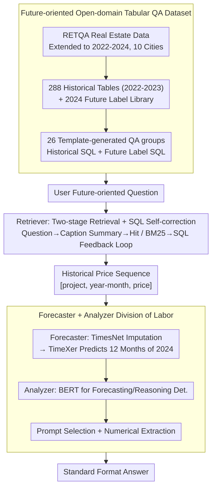

# ODTQA-FoRe: An Open-Domain Tabular Question Answering Dataset for Future Data Forecasting and Reasoning

**Conference**: ACL2026 Findings  
**arXiv**: [2606.02433](https://arxiv.org/abs/2606.02433)  
**Code**: https://github.com/jensenw1/ODTQA-FoRe  
**Area**: Time-Series / Tabular QA  
**Keywords**: open-domain tabular QA, time-series forecasting, LLM agent, text-to-SQL, real estate

## TL;DR
ODTQA-FoRe introduces an open-domain tabular QA task for future numerical forecasting and post-forecast reasoning. It also presents TimeFore, a three-agent framework that integrates table retrieval, SQL execution, specialized time-series forecasting, and answer normalization into an evaluable baseline.

## Background & Motivation

**Background**: LLM + RAG has advanced open-domain QA and tabular QA, with many systems capable of retrieving tables, generating SQL, and performing historical factual or numerical reasoning. Datasets like WikiTableQuestions, Spider, Open-WikiTable, NQ-TABLES, and RETQA cover closed/open-domain tabular QA, SQL generation, or multi-table retrieval.

**Limitations of Prior Work**: Most existing tasks focus on answering queries about "historical data already in the database." They rarely handle future-oriented questions common in real-world scenarios, such as "What will the price of a certain project be next year?" or "Which projects will have future prices exceeding a threshold?" LLMs are inherently unreliable for time-series forecasting, and in open-domain scenarios, users do not provide continuous historical sequences directly; the system must independently find tables, extract data, forecast, and reason.

**Key Challenge**: Traditional ODTQA excels at retrieval and tabular reasoning, while time-series models excel at forecasting, but the two are usually decoupled. Future-oriented QA requires a system to simultaneously possess open-domain historical data acquisition capabilities, external numerical forecasting capabilities, and standardized answering capabilities for different question types.

**Goal**: The authors propose the ODTQA-FoRe task and dataset, requiring systems to autonomously locate historical data from large-scale candidate tables, forecast future prices for 2024, and answer direct forecasting or forecast-based reasoning questions. They also propose TimeFore as a strong baseline.

**Key Insight**: The paper focuses on the real estate vertical because it contains continuous time-series data and real decision-making needs. While domain-specific, the task format is transferable to any scenario with historical structured data and future forecasting needs, such as finance, retail, or climate.

**Core Idea**: Utilize an LLM agent for semantic understanding, table retrieval, SQL generation, and final interpretation, while delegating precise numerical forecasting to specialized time-series models like TimesNet and TimeXer.

## Method

The paper comprises two main threads: the construction of the ODTQA-FoRe dataset and the TimeFore framework. The dataset provides natural language questions, answers, historical data SQL, and future label SQL. TimeFore simulates a real system that only accesses historical databases during inference, completing answers through three roles: Retriever, Forecaster, and Analyzer.

### Overall Architecture

Data is sourced from RETQA real estate sales and extended from January 2022 to December 2024, covering 10 Chinese cities. The authors set December 31, 2023, as the reference date: 2022-2023 data is visible history, while 2024 data serves as future ground truth used only for evaluation. After filtering, 11,149 projects remain, partitioned 6:2:2 at the project level for training, validation, and testing to prevent leakage.

The historical database aggregates 2022-2023 data into 288 tables by city, district, and year, averaging 845 rows per table. The future database consists of 2024 data and is used only for executing ground-truth SQL. During QA generation, 26 sets of templates were designed: 7 for direct time-series forecasting and 19 for forecast-based reasoning. The authors manually reviewed 10 samples per set (260 QA pairs) before large-scale generation.

The TimeFore framework consists of three types of agents. The Retriever summarizes user questions into table-caption-style text, attempting direct caption matching first, falling back to BM25 retrieval on failure, and then generating SQL via a few-shot LLM with an execution feedback correction loop. The Forecaster receives SQL results, converts `[project, year-month, price]` triplets into numerical sequences, uses TimesNet for imputation, and TimeXer to forecast 12 months for 2024. The Analyzer uses a BERT classifier to determine if a question is direct forecasting or reasoning-based, selects the corresponding prompt to synthesize historical and forecasted data, and uses a numerical extraction module to output standardized answers.

### Key Designs

**1. Future-Oriented Open-Domain Tabular QA: Moving from "Historical Query" to "Future Forecasting"**

Existing ODTQA datasets mostly answer historical facts already in databases. However, real users often ask future-oriented questions like "What will the price of community X be next year?" Simple historical queries are insufficient for evaluation; it is impossible to judge if a system correctly retrieved the history, forecasted, and reasoned. ODTQA-FoRe provides each QA with natural language questions, answers, historical SQL (data visible during reasoning), and future label SQL (executed on 2024 ground truth to get objective answers). This split ensures answers are derived from rigorous SQL execution rather than subjective text matching.

**2. Retriever's Two-Stage Retrieval + SQL Self-Correction: Translating Questions into "Table Language"**

In open-domain settings, retrieval quality determines the upper bound. Matching user queries directly to 288 tables via BM25 is unstable due to semantic gaps. The Retriever uses a 5-shot prompt to compress queries into "table caption" summaries. If a summary hits a caption, it is used; otherwise, it falls back to BM25. After locating a table, a 5-shot LLM generates SQL, refined by an execution feedback loop (up to 25 iterations). This "translation" significantly bridges the semantic gap. Ablations show table retrieval F1 at 97-99% and near-perfect SQL executability, indicating that retrieval is not the primary bottleneck.

**3. Forecaster + Analyzer Division: Leveraging LLM Strengths While Outsourcing Numerical Prediction**

Experiments show that general-purpose LLMs have significantly higher forecasting errors than specialized models (e.g., Qwen3 30B MRE 0.1706 vs. TimeXer 0.1209) and tend to provide explanations rather than evaluable values. TimeFore outsources forecasting: the Forecaster uses an `imputationThenPredictionTool` (TimesNet for imputation and TimeXer for 2024 forecasting). The Analyzer uses a BERT classifier to distinguish forecasting from reasoning, picking the right prompt and using a numerical extraction module for standardization. This division of labor is far more reliable than a single LLM handling all steps. Ablations confirm this: removing the numerical extraction module drops Qwen3 30B's valid completion rate by 33.08%.

### Loss & Training

TimeFore is not trained end-to-end. The BERT classifier is used for query type classification, and time-series modules are trained using their respective official best hyperparameters. The imputation dataset uses projects with at least 6 months of history (8,418 / 2,815 / 2,853 train/val/test). The forecasting dataset uses projects with 9 months of history and 2 months of 2024 data (5,806 / 1,975 / 1,963 train/val/test).

LLM baselines use in-context learning with temperature 0.8. Inference is performed using SGLang on a cluster of 20 NVIDIA A800-SXM4-80GB GPUs; BERT and time-series models are trained on a single RTX 4090.

## Key Experimental Results

### Dataset Scale

| Item | Value | Description |
|------|------|------|
| QA pairs | 28,507 | After deduplication and filtering |
| Train / Val / Test | 16,944 / 5,742 / 5,821 | Partitioned by project to avoid leakage |
| Question types | 8,042 forecasting + 20,465 reasoning | 7 forecasting templates, 19 reasoning templates |
| City and Time | 10 Chinese cities, 2022-2024 | 2022-2023 history, 2024 future labels |
| Candidate historical tables | 288 | Average 845 rows each |
| Projects | 11,149 refined projects | Filtered from 60,183 initial items |

### Main Results

| Model | Method | Forecast MSE | Forecast MAE | Forecast MRE | Reasoning Acc | Reasoning F1 |
|------|------|--------------|--------------|--------------|---------------|--------------|
| Qwen3 30B | Vanilla | 40,385,720.95 | 3698.36 | 0.1627 | 12.19 | 24.87 |
| Qwen3 30B | TimeFore | 31,572,410.36 | 2788.20 | 0.1326 | 31.59 | 60.25 |
| Qwen3 Next 80B | Vanilla | 30,942,598.21 | 3406.43 | 0.1586 | 24.45 | 46.62 |
| Qwen3 Next 80B | TimeFore | 22,442,845.96 | 2588.87 | 0.1181 | 36.31 | 58.41 |
| GPT OSS 20B | Vanilla | 105,115,117.20 | 4394.56 | 0.1838 | 21.52 | 44.25 |
| GPT OSS 20B | TimeFore | 29,757,828.58 | 2887.44 | 0.1280 | 27.80 | 49.11 |
| GPT OSS 120B | Vanilla | 47,324,931.58 | 3786.48 | 0.1683 | 21.60 | 41.06 |
| GPT OSS 120B | TimeFore | 18,493,634.83 | 2501.18 | 0.1151 | 31.37 | 51.86 |
| GLM4.5 Air | Vanilla | 139,922,250.13 | 3324.41 | 0.1415 | 23.59 | 48.72 |
| GLM4.5 Air | TimeFore | 90,865,440.59 | 2709.25 | 0.1172 | 35.46 | 61.24 |

### Specialized Model Comparison

| Model | MSE | MAE | MRE | Observations |
|------|-----|-----|-----|------|
| TimesNet | 2.77E+07 | 3103.52 | 0.1254 | Stronger than general LLMs |
| TimeMixer | 2.78E+07 | 3108.29 | 0.1255 | Similar to TimesNet |
| TimeXer | 2.50E+07 | 2989.55 | 0.1209 | Best; selected as TimeFore forecaster |
| WPMixer | 2.75E+07 | 3097.81 | 0.1248 | Close to TimesNet |
| AutoTimes | 2.93E+07 | 3204.13 | 0.1288 | Weaker than lightweight specialized models |
| Time-MoE | 2.95E+07 | 3164.47 | 0.1271 | Weaker than TimeXer |
| Qwen3 30B | 6.69E+07 | 4344.02 | 0.1706 | Direct LLM forecasting is significantly worse |
| GLM 4.5 Air | 7.30E+07 | 4824.57 | 0.1869 | Largest error among LLM forecasts |

### Ablation Study

| Module / Setting | Key Figures | Conclusion |
|-------------|----------|------|
| Table Retrieval Summary+BM25 | GPT OSS 120B F1 99.21, GLM 4.5 Air F1 97.59 | Generally strong; not the main bottleneck |
| SQL Generation | Qwen3 30B ECR 99.85, Qwen3 Next 80B EA 85.72 | High executability and accuracy |
| Golden table captions | Max Acc gain ~1.02% | Table location is not the primary error source |
| Golden history + predicted future | Max Acc gain ~1.93% | SQL/Historical data fetching is not the main bottleneck |
| Golden history + golden future | Qwen3 30B +46.80%, Qwen3 Next 80B +49.23%, GLM +44.73% | Future forecasting error is the 핵심 bottleneck |
| Analyzer query Classification | BERT fine-tuned F1 99.98 | Simple classifier is reliable |
| w/o Numerical Extraction | Qwen3 30B Valid Completion Rate drops 33.08% | Standardization is critical for evaluation |

### Key Findings

- TimeFore outperforms Vanilla across five LLMs, proving that direct LLM forecasting is a poor baseline and forecasting should be delegated to specialized models.
- TimeXer is the selected forecasting backbone with 0.1209 MRE, significantly lower than Qwen3 30B (0.1706) and GLM 4.5 Air (0.1869).
- The system bottleneck is not table retrieval or SQL, but future data forecasting; this is crucial for the design of future methods on ODTQA-FoRe.

## Highlights & Insights

- The task definition is practical: users ask "what will happens in the future," not just "what is in the database." Merging ODTQA and forecasting is a natural yet previously missing benchmark direction.
- TimeFore's division of labor aligns with engineering intuition: LLMs for language understanding and tool orchestration, time-series models for numerical forecasting, and BERT for classification. This is more reliable than a monolithic LLM approach.
- The ablation study is highly diagnostic. Rather than reporting only end-to-end scores, the authors use golden components to isolate error sources, clearly identifying forecasting as the primary bottleneck.
- Using future SQL to generate labels ensures objective, unique answers, which is critical for future-oriented evaluation to avoid subjective text matching.

## Limitations & Future Work

- **Lack of External Factors**: Current forecasting only uses historical price sequences, omitting exogenous variables like macroeconomics, policy, or regional supply-demand.
- **Single Domain**: The dataset only covers real estate. TimeFore is claimed to be domain-agnostic but needs validation in finance, retail, and climate domains.
- **Template Generation Limits**: While LLM rewriting improves naturalness, the 26 templates may not cover all complex user variations.
- **Backbone Generalization**: TimeXer is optimal for this dataset, but its suitability for cross-domain or highly non-stationary scenarios remains to be tested.
- **End-to-End Optimization**: The current pipeline is modular; future work could explore uncertainty estimates shared among Retriever, Forecaster, and Analyzer to output confidence intervals.

## Related Work & Insights

- **vs WikiTableQuestions / Spider**: Focus on given tables or SQL generation without open-domain future forecasting.
- **vs Open-WikiTable / NQ-TABLES / RETQA**: Advance open-domain retrieval and historical QA, while ODTQA-FoRe explicitly introduces 2024 future ground truth.
- **vs LLMTIME / TP-BERTa**: Focus on LLMs for time-series forecasting but lack integration with open-domain retrieval and SQL-based QA.
- **Insight**: Future agent benchmarks should evaluate the combination of "retrieval-tool use-numerical modeling-language answering" rather than just single-step text-to-SQL or forecasting.

## Rating
- Novelty: ⭐⭐⭐⭐☆ Novel task combination and clear dataset positioning; TimeFore is a reasonable modular framework.
- Experimental Thoroughness: ⭐⭐⭐⭐☆ Comprehensive main results, model comparisons, and ablations; lacks cross-domain validation.
- Writing Quality: ⭐⭐⭐⭐☆ Clear pipeline and data construction; template details are mostly in the appendix.
- Value: ⭐⭐⭐⭐⭐ High benchmark value for combining open-domain QA, LLM agents, and time-series forecasting.

<!-- RELATED:START -->

## Related Papers

- [\[ICML 2026\] PATRA: Pattern-Aware Alignment and Balanced Reasoning for Time Series Question Answering](../../ICML2026/time_series/patra_pattern-aware_alignment_and_balanced_reasoning_for_time_series_question_an.md)
- [\[ACL 2025\] Time-MQA: Time Series Multi-Task Question Answering with Context Enhancement](../../ACL2025/time_series/time-mqa_time_series_multi-task_question_answering_with_context_enhancement.md)
- [\[AAAI 2026\] Harmonic Dataset Distillation for Time Series Forecasting](../../AAAI2026/time_series/harmonic_dataset_distillation_for_time_series_forecasting.md)
- [\[ICLR 2026\] Adapt Data to Model: Adaptive Transformation Optimization for Domain-shared Time Series Foundation Models](../../ICLR2026/time_series/adapt_data_to_model_adaptive_transformation_optimization_for_domain-shared_time_.md)
- [\[AAAI 2026\] Detecting the Future: All-at-Once Event Sequence Forecasting with Horizon Matching](../../AAAI2026/time_series/detecting_the_future_all-at-once_event_sequence_forecasting_with_horizon_matchin.md)

<!-- RELATED:END -->
