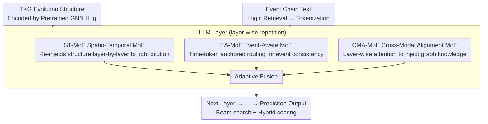

# STK-Adapter: Incorporating Evolving Graph and Event Chain for Temporal Knowledge Graph Extrapolation

**Conference**: ACL 2026  
**arXiv**: [2604.19042](https://arxiv.org/abs/2604.19042)  
**Code**: [GitHub](https://github.com/Zhaoshuyuan0246/STK-Adapter)  
**Area**: Time Series  
**Keywords**: Temporal Knowledge Graph Extrapolation, MoE Adapter, Cross-modal Alignment, Event Chain Modeling, Graph Structure Evolution

## TL;DR

This paper proposes STK-Adapter, which embeds three MoE modules into each layer of an LLM (ST-MoE for spatio-temporal structure, EA-MoE for event chain semantics, and CMA-MoE for deep cross-modal alignment). It labels the issues of spatio-temporal information loss and layer-wise dilution caused by shallow alignment in existing TKG-LLM methods, significantly outperforming SOTA on four benchmark datasets.

## Background & Motivation

**Background**: Temporal Knowledge Graph (TKG) extrapolation aims to predict future events based on historical data. Early methods (e.g., REGCN, TiRGN) model spatio-temporal dependencies in snapshot sequences via Graph Neural Networks but lose textual semantics by embedding events into latent spaces. With the rise of LLMs, methods like CoH linearize TKGs into text-based event chains for instruction tuning, but this process discards the topological structure of the TKG.

**Limitations of Prior Work**: (1) Shallow alignment—methods like GenTKGQA and TGL-LLM use simple MLPs to project TKG evolution representations into the LLM semantic space once, failing to preserve spatio-temporal information fully; (2) Layer-wise dilution—since LLMs are optimized for next-token prediction, hidden states lean toward textual semantics during fine-tuning, causing TKG structural features to decay across layers.

**Key Challenge**: Structural representations of TKGs and textual semantics of LLMs reside in different modal spaces, requiring deep, layer-wise alignment for the LLM to truly comprehend the graph structure. Existing "one-time projection" (shallow alignment) causes the LLM to gradually "forget" graph information during deep processing.

**Goal**: Design a flexible adapter that establishes dedicated processing channels at each LLM layer to capture and inject TKG evolution representations and event chain semantic dependencies progressively.

**Key Insight**: Leverage the advantages of Mixture-of-Experts (MoE) in handling heterogeneous data—achieving sparse computation through expert specialization while significantly enhancing model capacity. Introduce MoE into the PEFT framework by replacing single adapters with low-rank expert pools.

**Core Idea**: Embed three independent MoE modules in each LLM layer to handle TKG spatio-temporal feature extraction (ST-MoE), event chain semantic dependency modeling (EA-MoE), and cross-modal deep alignment (CMA-MoE). Integrate outputs through adaptive fusion to achieve progressive multi-modal alignment.

## Method

### Overall Architecture

STK-Adapter is integrated into every layer of an LLM (e.g., Llama3-8B). Inputs consist of: (1) TKG evolution structural representations $\text{H}_g^0 = [\text{H}_s^{(t)}; \text{H}_r^{(t)}]$ encoded by a pretrained graph encoder (e.g., LogCL); (2) Event chain text retrieved via temporal logic rules, which yields hidden representations after LLM tokenization. The three MoE modules process these in parallel at each layer before outputting to the next layer via adaptive fusion.

### Key Designs

**1. Spatial-Temporal MoE (ST-MoE): Re-injecting structure at every layer to counter deep dilution**

The fundamental flaw of shallow alignment is that TKG structural information is only projected at the first layer and becomes diluted by textual semantics in deeper LLM layers. ST-MoE addresses this by turning "injection" into a layer-wise iteration: a sparse activation router $f_{\text{ST\_router}}$ calculates routing weights based on the previous layer's TKG representation $\text{H}_g^{l-1}$ and activates Top-k experts. Each expert uses a bottleneck structure to model spatio-temporal patterns in a specialized low-dimensional subspace. The output is aggregated as $\overline{\text{H}}_g^l = \sum_{i \in \mathcal{A}^l} \text{gate}_i^l \cdot \text{E}^{(i)}(\text{H}_g^{l-1})$. This ensures structural features do not decay with depth.

**2. Event-Aware MoE (EA-MoE): Anchoring routing via temporal tokens to bind event-related tokens**

While ST-MoE captures graph-level spatio-temporal structures, it lacks fine-grained modeling for the complex temporal semantic dependencies in event chains. EA-MoE utilizes the same expert structure but modifies the router: all tokens under the same timestamp share the same routing signal. For the $j$-th token, the signal is derived from the hidden state of its corresponding temporal token $\tau(j)$, i.e., $\hat{\text{gate}}_j^l = f_{\text{EA\_router}}(\hat{\text{H}}_{\tau(j)}^l)$. This ensures that tokens belonging to the same event are processed by the same experts, allowing experts to specialize in specific temporal semantic patterns.

**3. Cross-Modality Alignment MoE (CMA-MoE): Layer-wise cross-modal attention for progressive knowledge injection**

To bridge the gap between structural and textual spaces, CMA-MoE performs TKG-guided cross-modal attention at each layer. Each expert takes the event chain representation $\hat{\text{H}}_{\text{text}}^l$ as Query and the TKG representation $\text{H}_g^{l-1}$ as Key and Value. Through $\text{Softmax}(\frac{QK^\top}{\sqrt{d_k}})V$, evolutionary graph knowledge is injected into the textual representation. The router is also driven by TKG representations, prioritizing alignment strategies from a spatio-temporal perspective.

### Loss & Training

The total loss comprises cross-entropy and load-balancing losses: $\mathcal{L} = -\sum_{i=1}^{|Y|} \log P(y_i | y_{<i}, \mathcal{C}, \mathcal{G}) + \alpha \sum_{j=1}^{n} f_j \cdot p_j$. The graph encoder is pretrained and frozen, and the LLM backbone is frozen, with only the STK-Adapter being fine-tuned for 2 epochs. Inference employs beam search (B=20) and a hybrid scoring strategy that fuses LLM decoding scores with topology-aware scores.

## Key Experimental Results

### Main Results

| Model | ICE14 Hit@1 | ICE18 Hit@1 | ICE15 Hit@1 | WIKI Hit@1 |
|------|-----------|-----------|-----------|----------|
| LogCL | 37.76 | 24.53 | 46.07 | 70.85 |
| LLM-DA (LogCL) | 37.71 | 22.83 | 40.90 | 79.10 |
| MESH | 35.22 | 23.61 | 38.62 | 75.03 |
| **Ours (LogCL)** | **41.16** | **25.95** | **48.82** | **82.43** |

### Ablation Study

| Configuration | ICE14 Hit@1 | WIKI Hit@1 | Description |
|------|-----------|----------|------|
| STK-Adapter | 37.26 | 82.14 | Full model (REGCN encoder) |
| w/o EA-MoE | 35.56 | 74.36 | Removing EA-MoE causes the largest drop |
| w/o ST-MoE | 37.03 | 80.11 | Removing ST-MoE |
| w/o CMA-MoE | 36.86 | 80.08 | Removing CMA-MoE |
| w/o ST- & CMA-MoE | 33.12 | 78.37 | Removing entire TKG branch |
| w LoRA | 32.47 | 72.10 | Replacing STK-Adapter with LoRA |

### Key Findings

- EA-MoE contributes the most—removing it causes WIKI Hit@1 to drop from 82.14% to 74.36% (-7.78pp), indicating that event chain semantic modeling is more critical than raw graph structure.
- Replacing STK-Adapter with LoRA leads to a significant performance decline (-4.79pp on ICE14, -10.04pp on WIKI), proving that specialized adapter design is superior to general PEFT methods.
- STK-Adapter is compatible with different graph encoders (REGCN, TiRGN, CognTKE, LogCL) and consistently outperforms the corresponding LLM-DA baselines.
- Consistent performance advantages are maintained across different LLM backbones (Llama3-8B, Qwen2.5-7B, Mistral-7B).

## Highlights & Insights

- The concept of layer-wise injection of TKG information fundamentally solves the "information dilution" problem—it doesn't rely on a one-time projection but forces a refresh of structural information at every layer. This design is transferable to any scenario requiring the continuous injection of external structured knowledge into LLMs.
- The event-aware router design is clever—using temporal tokens as anchors to ensure event tokens share routing paths simultaneously ensures processing consistency and implicitly models temporal structures.
- The encoder-agnostic design allows STK-Adapter to serve as a plug-and-play component for any pretrained graph encoder, reducing engineering implementation costs.

## Limitations & Future Work

- Evaluation is limited to four relatively small TKG datasets; verification on large-scale TKGs is needed.
- The model uses a fixed count of 4 experts and Top-1 routing; larger expert counts or different routing strategies remain unexplored.
- The frozen graph encoder may limit the potential of STK-Adapter; joint end-to-end training might yield further improvements.

## Related Work & Insights

- **vs GenTKGQA/TGL-LLM**: These use shallow projection (MLP) to align TKGs with LLMs, whereas STK-Adapter achieves deep alignment via layer-wise MoE.
- **vs CoH**: Pure text linearization loses topological structure, while STK-Adapter preserves and continuously injects graph structures.
- **vs LLM-DA**: Fuses TKG scores only during inference, whereas STK-Adapter implements deep integration during training.

## Rating

- Novelty: ⭐⭐⭐⭐ The three-MoE layer-wise injection framework is novel, though the combination of MoE and adapters has precedents.
- Experimental Thoroughness: ⭐⭐⭐⭐⭐ 4 datasets + multi-encoder compatibility + multi-LLM compatibility + detailed ablation.
- Writing Quality: ⭐⭐⭐⭐ Clearly structured but formula-heavy; the method section is somewhat lengthy.
- Value: ⭐⭐⭐⭐ Provides a clear advancement in the TKG+LLM field, with the encoder-agnostic design being highly practical.

<!-- RELATED:START -->

## Related Papers

- [\[ACL 2025\] ANRE: Analogical Replay for Temporal Knowledge Graph Forecasting](../../ACL2025/time_series/anre_analogical_replay_for_temporal_knowledge_graph_forecasting.md)
- [\[ACL 2025\] G2S: A General-to-Specific Learning Framework for Temporal Knowledge Graph Forecasting with Large Language Models](../../ACL2025/time_series/g2s_a_general-to-specific_learning_framework_for_temporal_knowledge_graph_foreca.md)
- [\[ICML 2026\] Beyond Extrapolation: Knowledge Utilization Paradigm with Bidirectional Inspiration for Time Series Forecasting](../../ICML2026/time_series/beyond_extrapolation_knowledge_utilization_paradigm_with_bidirectional_inspirati.md)
- [\[NeurIPS 2025\] Simple and Efficient Heterogeneous Temporal Graph Neural Network](../../NeurIPS2025/time_series/simple_and_efficient_heterogeneous_temporal_graph_neural_network.md)
- [\[ICLR 2026\] Routing Channel-Patch Dependencies in Time Series Forecasting with Graph Spectral Decomposition](../../ICLR2026/time_series/routing_channel-patch_dependencies_in_time_series_forecasting_with_graph_spectra.md)

<!-- RELATED:END -->
