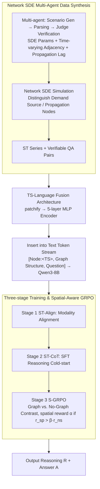

# STReasoner: Empowering LLMs for Spatio-Temporal Reasoning in Time Series via Spatial-Aware Reinforcement Learning

**Conference**: ACL2026  
**arXiv**: [2601.03248](https://arxiv.org/abs/2601.03248)  
**Code**: https://github.com/LingFengGold/STReasoner  
**Area**: Spatio-Temporal Reasoning / Autonomous Driving  
**Keywords**: Spatio-temporal Time Series, Spatial-Aware Reinforcement Learning, S-GRPO, Synthetic Data, Multimodal LLM  

## TL;DR
STReasoner utilizes Network SDE to synthesize spatio-temporal time series data with graph structures and textual semantics. Through a time series encoder, three-stage training, and spatial-aware S-GRPO, it empowers LLMs to perform explicit reasoning based on temporal dynamics and spatial dependencies.

## Background & Motivation
**Background**: Traffic networks, power grids, disease propagation, river systems, and climate systems can all be represented as time series on nodes coupled with spatial graph structures. Most existing spatio-temporal models optimize for prediction accuracy, such as future flow or numerical values; meanwhile, LLMs/Time Series Language Models can handle QA or multi-step reasoning but typically neglect the spatial dependencies between nodes.

**Limitations of Prior Work**: Real-world decision-making scenarios require more than just predicting a value; they necessitate answering "what caused a change at a specific location and time." For instance, in traffic congestion, if a user asks "which source node caused Node 2 to be congested at 9:00," the model must trace upstream nodes, propagation delays, and time series variations, rather than merely observing the value of Node 2 at 9:00.

**Key Challenge**: Spatio-temporal reasoning requires concurrent numerical precision, graph structure dependency, and natural language explanation. Existing forecasting models lack explicit reasoning; existing LLMs lack spatio-temporal priors; standard RL only rewards the final answer, potentially causing models to rely on superficial temporal patterns without truly utilizing the graph structure.

**Goal**: Ours proposes three complementary objectives: constructing controllable and text-aligned spatio-temporal reasoning data; defining ST-Bench to cover multiple reasoning capabilities; and training STReasoner to fuse time series, graphs, and text while using spatial-aware RL rewards to ensure true reliance on spatial structures.

**Key Insight**: The paper achieves a closed loop starting from data synthesis. First, Network SDE and a multi-agent generator create data with explicit spatial propagation, time lags, and semantic descriptions. Then, a TS-LM is trained on this data. Finally, a contrastive S-GRPO—where rewards are given only if performance with graph input exceeds that without graph input—is used to enhance spatial grounding.

**Core Idea**: Spatio-temporal reasoning is modeled as $f:(Q,T,G)\to(R,A)$. Through "time series encoding + graph-text prompts + spatial dependency rewards," the LLM's reasoning process is forced to be sensitive to both temporal dynamics and graph structures.

## Method

### Overall Architecture
STReasoner aims to solve the following: given a graph $G=(V,E)$, time series $T_i$ for each node, and a natural language query $Q$, the LLM outputs an intermediate reasoning process $R$ and a final answer $A$, thereby learning the mapping $f:(Q,T,G)\to(R,A)$. The pipeline consists of three layers: the data layer uses Network SDE with a multi-agent pipeline to synthesize spatio-temporal data containing graph structures, temporal dynamics, and textual semantics; the model layer patchifies each node's time series and feeds them into a 5-layer MLP encoder, then inserts the embeddings into the text token stream in node order, which is fed into Qwen3-8B alongside graph descriptions and questions; the training layer employs a three-stage process of Align, SFT, and S-GRPO to sequentially achieve modality alignment, reasoning cold-start, and spatial-aware reinforcement.

### Key Designs

**1. Network SDE Multi-Agent Data Synthesis: Creating a Controllable, Text-Aligned Spatio-Temporal World**

Spatio-temporal reasoning requires numerical accuracy, graph dependency, and linguistic semantics, but these are rarely available and verifiable simultaneously in real-world data. Ours uses Network SDE to build an interpretable underlying world model: the continuous latent process of each node is determined by drift, diffusion, and neighbor coupling terms. It distinguishes between demand source nodes (with exogenous temporal patterns like sine waves or mean reversion) and propagation nodes (driven primarily by neighbors). Edge weights are time-varying adjacencies, simulating directional shifts like morning and evening peaks. Each edge also includes propagation lag, corresponding to delays in traffic, pollution, or disease spread. A multi-agent pipeline manages the process: Scenario Generation Agent produces descriptions (e.g., traffic, energy); Scenario Parsing Agent extracts nodes, edges, and dependencies; Judge Agent verifies logic; SDE Parameters and Time-Varying Adjacency Agents provide weights and lags. Finally, the simulation module integrates the Network SDE to obtain spatio-temporal series. Since the underlying dynamics are known, QA pairs are automatically generated and verifiable.

**2. Time Series-Language Fusion Architecture: Balancing Numerical Precision and Token Cost**

Representing time series purely as text is token-expensive, while pure image representation loses numerical precision. STReasoner uses a lightweight 5-layer MLP as a time series encoder: the input sequence is patchified, and the encoded patch embeddings are inserted into the text stream as special tokens in node order, e.g., `[Node1:<TS1>, Node2:<TS2>, ..., Graph, Question]`. Graph structures are provided via text. It also adopts value-preserving normalization from ChatTS to maintain original values rather than just shapes. This preserves both global trends and numerical precision while keeping token costs significantly lower than long-text representations.

**3. Three-stage Training & Spatial-Aware GRPO: Optimizing for True Usage of Graph Structure**

Standard GRPO only evaluates final answer correctness; a model might guess the answer from temporal trends without using the graph. It is necessary to build capabilities in stages and explicitly reward spatial grounding. Stage 1 uses ST-Align for large-scale modality alignment pre-training. Stage 2 uses ST-CoT for SFT cold-start, with CoT trajectories sampled via Claude-4.5-Sonnet and filtered through rejection sampling. Stage 3 is the core S-GRPO: for the same question, two sets of responses are generated—one with explicit spatial structure $o^{sp}$ and one without $o^{ns}$. A spatial reward $\alpha$ is added only if the graph-based reward significantly outperforms the non-graph reward ($r^{sp} > \beta r^{ns}$); otherwise, only the raw $r^{sp}$ is used. Advantages are then normalized within the group for the GRPO update. This contrastive design requires "the graph to actually be helpful" to gain extra points, directly embedding "spatial structure utilization" into the reward function.

### Loss & Training
The overall reward is a weighted combination of format and task rewards; outputs must follow `<think>...</think><answer>...</answer>`. Discrete labels get a score of 1 for correct and 0 for incorrect; sequence prediction tasks are scored using relative error, with a small bonus for exact length matches. The single-sample reward is $r = (1-\lambda)r_{task} + \lambda r_{format}$, with $\lambda=0.5$. In practice, Stage 1 trains ST-Align for 1000 steps, Stage 2 trains ST-CoT for 400 steps (LR $1e-5$), and Stage 3 RL uses ST-RL for 1 epoch with a group size of 8, spatial reward parameters $\alpha=0.1, \beta=0.8$, and LR $1e-7$.

## Key Experimental Results

### Main Results
The main table includes four tasks: T1 Causal/Source Reasoning, T2 Spatial Entity Recognition, T3 Spatial Correlation Reasoning, and T4 In-context Forecasting. T1-T3 use ACC, while T4 uses MAE. STReasoner outperforms closed-source LLMs on reasoning tasks at a much lower cost.

| Model | Input | T1 ACC | T2 ACC | T3 ACC | T4 MAE | Est. Cost |
| :--- | :--- | :--- | :--- | :--- | :--- | :--- |
| GPT-5.2 | Text | 83.09 | 38.78 | 58.79 | 63.99 | $22.48 |
| GPT-5.2 | Image | 86.47 | 40.54 | 65.08 | 64.70 | $6.69 |
| Claude-4.5-Sonnet | Text | 78.64 | 41.93 | 77.87 | 63.74 | $45.80 |
| Qwen3-8B | Text | 21.26 | 5.28 | 5.53 | 94.03 | $3.85 |
| Qwen3-8B SFT+S-GRPO | Text | 89.37 | 65.41 | 81.34 | 66.35 | $3.85 |
| Qwen3-VL-8B SFT+S-GRPO | Image | 91.79 | 69.43 | 83.92 | 67.29 | $0.66 |
| ChatTS-8B | TS Encoder | 56.52 | 19.51 | 41.08 | 85.14 | $0.27 |
| Time-R1-7B | Text | 60.39 | 29.65 | 48.62 | 68.15 | $3.85 |
| STReasoner-8B | TS Encoder | 95.65 | 75.71 | 87.12 | 65.59 | $0.27 |

### Ablation Study
All three training stages are essential. Align alone cannot reason, SFT is crucial for cold-start, and S-GRPO improves spatial tasks more than standard GRPO.

| Configuration | T1 ACC | T2 ACC | T3 ACC | T4 MAE | Description |
| :--- | :--- | :--- | :--- | :--- | :--- |
| STReasoner: Align+SFT+S-GRPO | 95.65 | 75.71 | 87.12 | 65.593 | Complete three-stage |
| Align+SFT+GRPO | 91.79 | 69.60 | 86.12 | 69.961 | Removing spatial-aware reward |
| SFT+S-GRPO | 91.30 | 67.76 | 83.98 | 69.014 | No alignment pre-training |
| Align+SFT | 88.41 | 63.32 | 80.97 | 66.653 | No RL |
| SFT | 90.34 | 61.47 | 81.47 | 71.096 | SFT cold-start only |
| S-GRPO | 47.34 | 23.20 | 39.20 | 91.921 | No SFT, sparse rewards |
| Align | 3.38 | 8.79 | 3.77 | 75.360 | Alignment only |

### Key Findings
- STReasoner's strength lies in T1-T3 spatio-temporal reasoning rather than pure forecasting. T4 MAE is competitive but not dominant, indicating its core value is explanation and reasoning.
- Using time series as image prompts is cheaper and stronger than text, but still inferior to a dedicated TS encoder. Images preserve global shapes, text preserves values; STReasoner aims to preserve both.
- Align alone scores poorly, confirming modality alignment is not reasoning. SFT is a necessary cold-start for RL; direct S-GRPO fails due to sparse rewards.
- S-GRPO improves performance by approximately 5.10% over standard GRPO and increases the proportion of responses that explicitly use spatial information.

## Highlights & Insights
- The primary highlight is the contrastive reward for spatial usage, which directly optimizes for graph utilization rather than just providing the graph as input.
- The data synthesis pipeline is comprehensive. Network SDE controls temporal dynamics, time-varying adjacency controls spatial dependency, and propagation lag controls the delay, making it ideal for verifiable QA.
- ST-Bench's four-task division (Cause, Entity, Correlation, Prediction) addresses "Why, Who, How, and What next," aligning closely with decision-making needs.
- Results show that closed-source models do not have an inherent advantage in structured numerical reasoning; with proper data and reward design, an 8B model can outperform large model APIs.

## Limitations & Future Work
- Training and evaluation rely heavily on synthetic data. While zero-shot results on CausalRivers are strong, real-world noise, missing values, and latent variables are more complex.
- The TS encoder is a simple 5-layer MLP, sufficient for these structured signals but potentially inadequate for high-dimensional multivariate sensors or asynchronous sampling.
- Graph structures are explicitly provided. Many real-world scenarios require simultaneous graph inference and reasoning.
- S-GRPO relies on paired rollouts (w/ and w/o graph), increasing training costs. Future work could explore lighter spatial usage discriminators.

## Related Work & Insights
- **vs. TS-LMs**: ChatTS and Time-MQA connect time series to LLMs but lack graph structures and spatial rewards.
- **vs. ST-Forecasting Models**: Traditional STGNNs excel at numerical prediction but cannot generate natural language reasoning chains.
- **vs. Standard GRPO/RL Reasoning**: DeepSeek-R1 style rewards focus on final answers; S-GRPO requires the graph structure to provide performance gains, making it more suitable for multimodal structured reasoning.
- **Insights for Autonomous Driving**: Many traffic scenarios involve "which upstream segment caused this congestion" or "when will an incident reach downstream." These spatial rewards are transferable to vehicle-infrastructure cooperation and multi-sensor diagnostics.

## Rating
- Novelty: ⭐⭐⭐⭐⭐ 
- Experimental Thoroughness: ⭐⭐⭐⭐☆ 
- Writing Quality: ⭐⭐⭐⭐☆ 
- Value: ⭐⭐⭐⭐⭐ 

<!-- RELATED:START -->

## Related Papers

- [\[ICML 2026\] Nested Spatio-Temporal Time Series Forecasting](../../ICML2026/time_series/nested_spatio-temporal_time_series_forecasting.md)
- [\[NeurIPS 2025\] Learning with Calibration: Exploring Test-Time Computing of Spatio-Temporal Forecasting](../../NeurIPS2025/time_series/learning_with_calibration_exploring_test-time_computing_of_spatio-temporal_forec.md)
- [\[ICML 2026\] Learning Long Range Spatio-Temporal Representations over Continuous Time Dynamic Graphs with State Space Models](../../ICML2026/time_series/learning_long_range_spatio-temporal_representations_over_continuous_time_dynamic.md)
- [\[ICML 2026\] PATRA: Pattern-Aware Alignment and Balanced Reasoning for Time Series Question Answering](../../ICML2026/time_series/patra_pattern-aware_alignment_and_balanced_reasoning_for_time_series_question_an.md)
- [\[ICLR 2026\] SciTS: Scientific Time Series Understanding and Generation with LLMs](../../ICLR2026/time_series/scits_scientific_time_series_understanding_and_generation_with_llms.md)

<!-- RELATED:END -->
