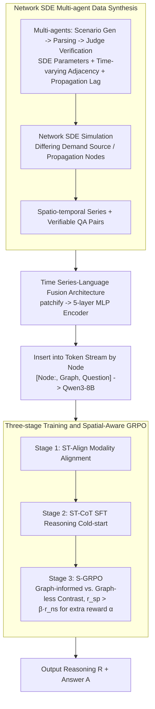

# STReasoner: Empowering LLMs for Spatio-Temporal Reasoning in Time Series via Spatial-Aware Reinforcement Learning

**Conference**: ACL2026  
**arXiv**: [2601.03248](https://arxiv.org/abs/2601.03248)  
**Code**: https://github.com/LingFengGold/STReasoner  
**Area**: Spatio-Temporal Reasoning / Autonomous Driving  
**Keywords**: Spatio-temporal time series, Spatial-aware reinforcement learning, S-GRPO, Synthetic data, Multi-modal LLM  

## TL;DR
STReasoner utilizes Network SDEs to synthesize spatio-temporal time series data with graph structures and textual semantics. By integrating a time-series encoder, a three-stage training pipeline, and a spatial-aware S-GRPO, the model learns to perform explicit reasoning based on temporal dynamics and spatial dependencies.

## Background & Motivation
**Background**: Transportation networks, power grids, disease transmission, and river/climate systems can be represented as time series on nodes combined with spatial graph structures. Most existing spatio-temporal models optimize for prediction accuracy, such as future flow or values. While LLMs or time-series language models can handle Q&A or multi-step reasoning, they typically ignore spatial dependencies between nodes.

**Limitations of Prior Work**: Real-world decision-making goes beyond predicting a specific value; it requires answering "what caused a change, where, and when." For instance, in traffic congestion, if a user asks "which source node caused Node 2 to be congested at 9:00," the model must track upstream nodes, propagation delays, and time-series fluctuations rather than just observing the value of Node 2 at 9:00.

**Key Challenge**: Spatio-temporal reasoning requires numerical precision, graph structure dependency, and natural language explanation simultaneously. Existing forecasting models lack explicit reasoning; existing LLMs lack spatio-temporal priors; standard RL only rewards the final answer, allowing models to rely on superficial temporal patterns without truly utilizing the graph structure.

**Goal**: The authors propose three objectives: constructing controllable and text-aligned spatio-temporal reasoning data; defining ST-Bench to cover diverse reasoning capabilities; and training STReasoner to fuse time series, graphs, and text while ensuring spatial grounding via spatial-aware RL rewards.

**Key Insight**: The paper creates a closed loop starting from data synthesis. It first uses Network SDEs and a multi-agent generator to create data with clear spatial propagation, time lags, and semantic descriptions. Then, a TS-LM is trained on this data. Finally, a contrastive S-GRPO reinforces spatial grounding by "granting rewards only when performance with graph input significantly exceeds performance without graph input."

**Core Idea**: Spatio-temporal reasoning is modeled as $f:(Q,T,G)\to(R,A)$. Through "time series encoding + graph-text prompts + spatial dependency rewards," the LLM's reasoning process is forced to be sensitive to both temporal dynamics and graph structures.

## Method

### Overall Architecture
STReasoner aims to solve: given a graph $G=(V,E)$, time series $T_i$ for each node, and a natural language query $Q$, the LLM outputs an intermediate reasoning process $R$ and a final answer $A$. The pipeline consists of three layers: the data layer uses Network SDEs with a multi-agent pipeline to synthesize spatio-temporal data containing graph structures, temporal dynamics, and text semantics; the model layer patchifies each node's time series and feeds them into a 5-layer MLP encoder, inserting embeddings into the text token stream alongside graph descriptions and questions for Qwen3-8B; the training layer utilizes a three-stage process of Align, SFT, and S-GRPO for modality alignment, reasoning cold-start, and spatial-aware reinforcement.

### Key Designs

**1. Network SDE Multi-agent Data Synthesis: Creating a Controllable, Text-aligned Spatio-Temporal World**
Spatio-temporal reasoning requires numerical precision, graph dependency, and linguistic semantics. Since real-world data rarely provides all three in a verifiable way, the authors use Network SDEs to build an interpretable world model. The continuous latent process of each node is determined by drift, diffusion, and neighbor coupling terms. Nodes are distinguished as demand source nodes (with exogenous patterns like sine or mean-reversion) and propagation nodes (driven by neighbors). Edge weights use a time-varying adjacency matrix to simulate directional shifts (e.g., morning/evening peaks), and each edge includes a propagation lag. A multi-agent pipeline manages the process: Scenario Generation Agent produces context (traffic, energy, health), Parsing Agent extracts nodes/edges/patterns, Judge Agent verifies logic, and SDE/Adjacency Agents define parameters. This ensures the underlying dynamics are fully known, making automatically generated QA pairs verifiable.

**2. Time Series-Language Fusion Architecture: Balancing Numerical Precision and Token Cost**
Representing time series as pure text is token-expensive, while pure image representation loses precision. STReasoner uses a lightweight 5-layer MLP as a time series encoder. Input sequences are patchified, and encoded patch embeddings are inserted into the text stream as special tokens following node order (e.g., `[Node1:<TS1>, Node2:<TS2>, ..., Graph, Question]`). It adopts the value-preserving normalization from ChatTS to maintain original values rather than just shapes, significantly reducing token consumption.

**3. Three-stage Training and Spatial-Aware GRPO: Optimizing for True Usage of Graph Structure**
Standard GRPO only evaluates final answer correctness, allowing models to guess based on temporal trends without using the graph. STReasoner introduces spatial grounding rewards. Stage 1 (ST-Align) performs large-scale alignment pre-training. Stage 2 (ST-CoT) uses SFT for cold-starting, with CoT trajectories sampled from Claude-4.5-Sonnet and filtered via rejection sampling. Stage 3 (S-GRPO) generates two sets of responses for the same question: one with access to spatial structure $o^{sp}$ and one without $o^{ns}$. A spatial reward $\alpha$ is added only if the graph-informed reward significantly outperforms the graph-less one ($r^{sp} > \beta r^{ns}$). This contrastive design forces the model to utilize the spatial structure.

### Loss & Training
The reward is weighted between format and task performance. Outputs must follow `<think>...</think><answer>...</answer>`. Discrete labels are scored 1 or 0; sequence prediction is scored by relative error. The single-sample reward is $r = (1-\lambda)r_{task} + \lambda r_{format}$ with $\lambda = 0.5$. Implementation: Stage 1 trained for 1000 steps, Stage 2 for 400 steps (LR: $1e-5$). Stage 3 S-GRPO trained for 1 epoch with group size 8, $\alpha = 0.1, \beta = 0.8$ (LR: $1e-7$).

## Key Experimental Results

### Main Results
The benchmark covers four tasks: T1 Causal/Source Reasoning, T2 Spatial Entity Recognition, T3 Spatial Correlation Reasoning, and T4 In-context Forecasting. T1-T3 use ACC, and T4 uses MAE.

| Model | Input Mode | T1 ACC | T2 ACC | T3 ACC | T4 MAE | Est. Cost |
| :--- | :--- | :--- | :--- | :--- | :--- | :--- |
| GPT-5.2 | Text | 83.09 | 38.78 | 58.79 | 63.99 | $22.48 |
| GPT-5.2 | Image | 86.47 | 40.54 | 65.08 | 64.70 | $6.69 |
| Claude-4.5-Sonnet | Text | 78.64 | 41.93 | 77.87 | 63.74 | $45.80 |
| Qwen3-8B | Text | 21.26 | 5.28 | 5.53 | 94.03 | $3.85 |
| Qwen3-8B SFT+S-GRPO | Text | 89.37 | 65.41 | 81.34 | 66.35 | $3.85 |
| Qwen3-VL-8B SFT+S-GRPO | Image | 91.79 | 69.43 | 83.92 | 67.29 | $0.66 |
| ChatTS-8B | TS Encoder | 56.52 | 19.51 | 41.08 | 85.14 | $0.27 |
| Time-R1-7B | Text | 60.39 | 29.65 | 48.62 | 68.15 | $3.85 |
| **STReasoner-8B** | **TS Encoder** | **95.65** | **75.71** | **87.12** | **65.59** | **$0.27** |

### Ablation Study
All three stages are essential. Alignment alone lacks reasoning; SFT is crucial for cold-start; S-GRPO outperforms standard GRPO in spatial tasks.

| Configuration | T1 ACC | T2 ACC | T3 ACC | T4 MAE | Description |
| :--- | :--- | :--- | :--- | :--- | :--- |
| **Ours: Align+SFT+S-GRPO** | **95.65** | **75.71** | **87.12** | **65.593** | Full pipeline |
| Align+SFT+GRPO | 91.79 | 69.60 | 86.12 | 69.961 | No spatial reward |
| SFT+S-GRPO | 91.30 | 67.76 | 83.98 | 69.014 | No alignment |
| Align+SFT | 88.41 | 63.32 | 80.97 | 66.653 | No RL |
| SFT | 90.34 | 61.47 | 81.47 | 71.096 | SFT cold-start only |
| S-GRPO | 47.34 | 23.20 | 39.20 | 91.921 | No SFT, sparse reward |
| Align | 3.38 | 8.79 | 3.77 | 75.360 | Alignment only |

### Key Findings
- STReasoner achieves its primary gains in T1-T3 (reasoning tasks) rather than pure forecasting. T4 MAE is competitive but its core value lies in explanation.
- Using time series as image prompts is cheaper and stronger than text but still inferior to a dedicated TS encoder.
- SFT is the necessary cold-start for RL; direct S-GRPO fails due to sparse rewards.
- S-GRPO improves performance by $5.10\%$ on average compared to standard GRPO and increases the proportion of responses that explicitly cite spatial information.

## Highlights & Insights
- The primary highlight is transforming "whether spatial information is actually used" into a contrastive reward, rather than just providing a graph in the prompt.
- The synthesis pipeline using Network SDEs allows for highly controllable temporal dynamics and spatial lags, ideal for verifiable reasoning.
- ST-Bench tasks (Cause, Entity, Correlation, Prediction) align well with real-world decision-making needs.
- The results show that closed-source models do not have an inherent advantage in structured numerical reasoning; an 8B model with proper rewards can outperform them at much lower costs.

## Limitations & Future Work
- The reliance on synthetic data for training. Real-world data involves noise, missing values, and hidden variables.
- The 5-layer MLP encoder is sufficient for structured signals but may struggle with high-dimensional multivariate sensors or asynchronous sampling.
- The graph structure is explicitly provided. Future work should explore inferring the graph structure from data while reasoning.
- S-GRPO requires paired rollouts (w/ and w/o graph), increasing training costs.

## Related Work & Insights
- **vs TS-LMs**: Previous works like ChatTS lack graph structures and spatial rewards.
- **vs ST-Forecasting**: Traditional GNNs predict values but lack natural language reasoning chains.
- **vs DeepSeek-R1 Style RL**: Standard GRPO rewards final answers; S-GRPO specifically rewards the performance gain provided by the graph structure.

## Rating
- **Novelty**: ⭐⭐⭐⭐⭐ (Integrates SDE synthesis, TS-LM, and S-GRPO)
- **Experimental Thoroughness**: ⭐⭐⭐⭐☆ (Strong main/ablation results, but real-world coverage is a work in progress)
- **Writing Quality**: ⭐⭐⭐⭐☆ (Clear methodology, though some details are in appendices)
- **Value**: ⭐⭐⭐⭐⭐ (Opens new avenues for LLM reasoning on spatio-temporal dynamics)

<!-- RELATED:START -->

## Related Papers

- [\[ICML 2026\] Nested Spatio-Temporal Time Series Forecasting](../../ICML2026/time_series/nested_spatio-temporal_time_series_forecasting.md)
- [\[NeurIPS 2025\] Learning with Calibration: Exploring Test-Time Computing of Spatio-Temporal Forecasting](../../NeurIPS2025/time_series/learning_with_calibration_exploring_test-time_computing_of_spatio-temporal_forec.md)
- [\[ICML 2026\] Learning Long Range Spatio-Temporal Representations over Continuous Time Dynamic Graphs with State Space Models](../../ICML2026/time_series/learning_long_range_spatio-temporal_representations_over_continuous_time_dynamic.md)
- [\[ICML 2026\] PATRA: Pattern-Aware Alignment and Balanced Reasoning for Time Series Question Answering](../../ICML2026/time_series/patra_pattern-aware_alignment_and_balanced_reasoning_for_time_series_question_an.md)
- [\[ACL 2026\] Time-RA: Towards Time Series Reasoning for Anomaly Diagnosis with LLM Feedback](time-ra_towards_time_series_reasoning_for_anomaly_diagnosis_with_llm_feedback.md)

<!-- RELATED:END -->
