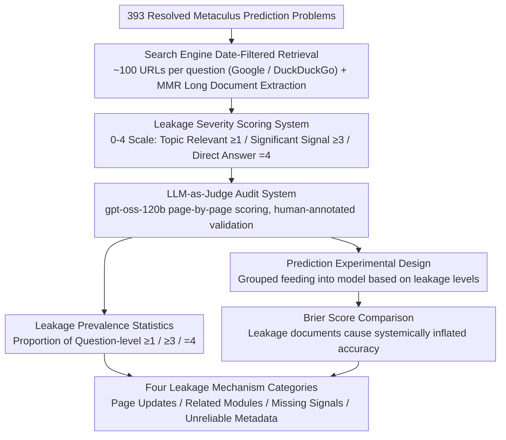

# Temporal Leakage in Search-Engine Date-Filtered Web Retrieval: A Retrospective Forecasting Case Study

**Conference**: ACL 2026  
**arXiv**: [2602.00758](https://arxiv.org/abs/2602.00758)  
**Code**: [GitHub](https://github.com/theolivecode/WebDataLeakageAudit)  
**Area**: Time Series  
**Keywords**: Temporal leakage, date filtering, retrospective forecasting, search engine audit, evaluation reliability

## TL;DR

This paper systematically audits the date filters of Google and DuckDuckGo, finding that search engine date filtering fails significantly in retrospective forecasting (RF) evaluations—$71\%$ (Google) and $81\%$ (DuckDuckGo) of questions contain at least one page with major post-cutoff information leakage, causing prediction Brier scores to artificially drop from $0.24$ to $0.10$.

## Background & Motivation

**Background**: Retrospective Forecasting (RF) is a mainstream method for evaluating the predictive capabilities of LLMs—testing on questions with known answers while requiring that retrieved evidence be strictly limited to the period before the question's public announcement date. In practice, almost all RF systems rely on search engine date filters to enforce information cutoffs.

**Limitations of Prior Work**: (1) Previous work only mentioned the potential unreliability of date filters through a few manual cases, lacking systematic quantitative research; (2) It is unclear whether temporal leakage is a rare edge case or a systemic issue; (3) The actual impact of leakage on downstream prediction accuracy has not been quantified.

**Key Challenge**: The validity of the entire RF evaluation paradigm is built on the assumption that "date filtering can exclude post-cutoff information"—if this assumption does not hold, all RF evaluation results based on date-filtered searches are untrustworthy.

**Goal**: Systematically audit the date filters of two major search engines, quantify the prevalence and mechanisms of temporal leakage, and measure its actual impact on prediction accuracy.

**Key Insight**: Using 393 resolved prediction problems from the Metaculus platform, the study retrieves approximately 100 URLs for each problem and uses LLM-as-Judge to score the leakage severity of each page on a scale of 0-4.

**Core Idea**: Search engine date filtering is unreliable for time-retrospective retrieval—it is systematically undermined by four leakage mechanisms: page updates, related content modules, unreliable metadata, and missing signals.

## Method

### Overall Architecture

The study does not train any models but audits the reliability of search engine date filters at three levels: first, a leakage audit—assigning leakage scores page-by-page to approximately 39K (Google) and 35K (DuckDuckGo) retrieved URLs; second, downstream impact—comparing the difference in LLM prediction accuracy when fed leaked vs. non-leaked documents; and finally, mechanism analysis—categorizing four temporal leakage pathways and supporting them with specific URLs.

### Key Designs

**1. Leakage Severity Scoring System (0-4 Scale): Refining "whether leakage exists" into "to what extent it leaks"**

A simple binary "leakage/no leakage" classification cannot distinguish between an irrelevant remark and a line that directly reveals the answer, which have completely different impacts on prediction decisions. Therefore, the authors defined a 0-4 scale: $0$ = No post-cutoff information or irrelevant to the question; $1$ = Topic-related but uninformative; $2$ = Weak directional signal; $3$ = Significant signal, supporting strong reasoning or decisive for some sub-answers; $4$ = Directly reveals the answer. For "missing signals" (where a key source should have mentioned expected information but said nothing), the leakage score is capped at $3$ to avoid over-interpreting an omission. This grading is the basis for all subsequent statistics—only by distinguishing levels can "topic-related" ($\ge1$) and "major leakage" ($\ge3$) be analyzed separately.

**2. LLM-as-Judge Audit System: Automating leakage detection across ~73K URLs**

Over 70,000 URLs are impossible to audit manually, so leakage scoring is delegated to an LLM. Each scoring request bundles the question title, background, resolution criteria, resolved answer, cutoff date, page body, and the aforementioned grading standards with examples. gpt-oss-120b (temperature=$0.5$) outputs the leakage assessment in JSON format. To prove the reliability of this automated scoring, the authors performed human validation: after merging scores 0-1, the exact match accuracy was $76.1\%$, the quadratic weighted Kappa was $0.85$, and the F1 for direct leakage (score $4$) reached $0.82$, indicating the judge is sufficiently reliable for critical judgments like "whether the answer is directly revealed."

**3. Prediction Experimental Design (Downstream Impact Quantification): Proving leakage doesn't just exist, it truly inflates scores**

Quantifying the leakage ratio is not enough; it must be proven that leakage truly leads to systemically inflated prediction accuracy. The authors specifically selected binary questions that opened in 2025, falling after the LLM's knowledge cutoff. Retrieved documents were grouped by leakage level and fed to gpt-oss-120b for prediction, comparing the Brier scores. Using 2025 questions ensures a fair "no-retrieval" control group—the model cannot cheat via pre-training memory. This design makes "leakage → inflated accuracy" an observable causal chain rather than just a correlation.

### Loss & Training

No model training is involved. For long documents exceeding 7680 tokens, MMR is used to extract the most relevant passages (256-token chunks, maximum 30 chunks, Qwen-0.6B embedding model, $\lambda=0.7$).

## Key Experimental Results

### Main Results

**Prevalence of Leakage**

| Metric | Google | DuckDuckGo |
|------|--------|------------|
| Number of Evaluated Questions | 393 | 389 |
| Total Retrieved URLs | 38,879 | 34,454 |
| % of URLs w/ Post-cutoff Info | 33.2% | 34.5% |
| Question-level: ≥1 (Topic-related) | 98.5% | 98.2% |
| Question-level: ≥3 (Significant Signal) | **71.0%** | **81.2%** |
| Question-level: 4 (Direct Answer) | **41.0%** | **54.8%** |

**Impact on Prediction Accuracy (93 Binary Questions from 2025)**

| Retrieval Condition | Avg Sources | Mean Brier | Median Brier |
|----------|---------|-----------|-------------|
| No Retrieval (Baseline) | — | 0.244 | 0.090 |
| Score 0 (No Post-cutoff Info) | 73.5 | 0.242 | 0.102 |
| Score 2-4 (Weak to Full Leakage) | 9.6 | 0.128 | 0.023 |
| **Score 3-4 (Strong to Full Leakage)** | **4.8** | **0.108** | **0.014** |
| Score 4 only (Full Leakage) | 2.6 | 0.129 | 0.014 |

### Ablation Study

**Leakage Rate by Cutoff Year**

| Cutoff Year | Google Leakage Rate | DuckDuckGo Leakage Rate |
|---------|-------------|-----------------|
| 2021 | 46.3% | 47.1% |
| 2022 | 46.5% | 48.0% |
| 2023 | 34.5% | 31.4% |
| 2025 | 26.6% | 27.7% |

### Key Findings

- Leakage is systemic rather than incidental—nearly all questions (98%+) have at least one topic-related post-cutoff info piece.
- The Brier score for non-leaked documents (0.242) is almost identical to the no-retrieval baseline (0.244)—indicating that "clean" date-filtered retrieval provides almost no useful information.
- The Brier for score 3-4 leakage (0.108) is lower than for score 4 alone (0.129), as score 3 documents provide context that helps the model interpret evidence more reliably.
- Earlier cutoff dates (2021-2022) have the highest leakage rates (>46%), while more recent ones are lower (2025: ~27%)—as older pages have had more time to accumulate updates.
- Four leakage mechanisms: **Direct Page Updates** (most common), **Related Content Sidebars** (no leakage in main body but present in sidebar), **Missing Signals** (omissions in comprehensive sources implying the answer), and **Unreliable Metadata** (incorrect self-reported timestamps).

## Highlights & Insights

- This work poses a fundamental challenge to the entire RF evaluation methodology—almost all LLM prediction systems claiming "near-human predictive capability" rely on date-filtered searches, and their performance may be systemically overestimated.
- The "Missing Signal" leakage mechanism is particularly subtle—a timeline covering up to 2025 that fails to mention an expected event in itself suggests the answer, yet cannot be excluded by any metadata filtering.
- Comparing non-leaked retrieval to no-retrieval reveals nearly identical Brier scores, suggesting that even if date filtering worked perfectly, historical documents are of extremely limited help for prediction.

## Limitations & Future Work

- Only Google and DuckDuckGo were audited; leakage patterns in other engines might differ.
- Leakage detection and prediction experiments used the same model (gpt-oss-120b), which may introduce shared interpretation bias.
- MMR document processing might miss leakage signals scattered in excluded passages.
- The study diagnoses the problem but does not experimentally evaluate mitigation strategies (such as Wayback Machine retrieval or frozen snapshot databases).

## Related Work & Insights

- **vs FutureSearch (2025)**: The latter proposed frozen web snapshots but still used active Google search for ranking—this paper provides empirical support for abandoning active date-filtered search.
- **vs Paleka et al. (2026)**: The latter qualitatively raised concerns about date filter unreliability; this paper provides the first systematic quantification—confirming leakage as a systemic problem across ~73K URLs.
- **vs ForecastBench (Karger et al., 2025)**: The latter uses prospective benchmarks to avoid leakage but has a slower iteration speed—the two methods are complementary.

## Rating

- Novelty: ⭐⭐⭐⭐ First study to systematically quantify search engine date filtering leakage, filling an important methodological gap.
- Experimental Thoroughness: ⭐⭐⭐⭐⭐ ~73K URL audit, dual-engine comparison, downstream impact quantification, human validation, and temporal analysis.
- Writing Quality: ⭐⭐⭐⭐⭐ Clear motivation, rigorous experimental design, and specific leakage mechanism classification supported by URL evidence.
- Value: ⭐⭐⭐⭐⭐ Directly and profoundly impacts RF evaluation methodology; all systems using date-filtered search need to be re-examined.

<!-- RELATED:START -->

## Related Papers

- [\[NeurIPS 2025\] StRap: Spatio-Temporal Pattern Retrieval for Out-of-Distribution Generalization](../../NeurIPS2025/time_series/strap_spatio-temporal_pattern_retrieval_for_out-of-distribution_generalization.md)
- [\[ICML 2026\] Semantics-Enhanced Retrieval-Augmented Time Series Forecasting](../../ICML2026/time_series/semantics-enhanced_retrieval-augmented_time_series_forecasting.md)
- [\[AAAI 2026\] Task-Aware Retrieval Augmentation for Dynamic Recommendation](../../AAAI2026/time_series/task-aware_retrieval_augmentation_for_dynamic_recommendation.md)
- [\[ICML 2026\] Nested Spatio-Temporal Time Series Forecasting](../../ICML2026/time_series/nested_spatio-temporal_time_series_forecasting.md)
- [\[ACL 2026\] STK-Adapter: Incorporating Evolving Graph and Event Chain for Temporal Knowledge Graph Extrapolation](stk-adapter_incorporating_evolving_graph_and_event_chain_for_temporal_knowledge_.md)

<!-- RELATED:END -->
