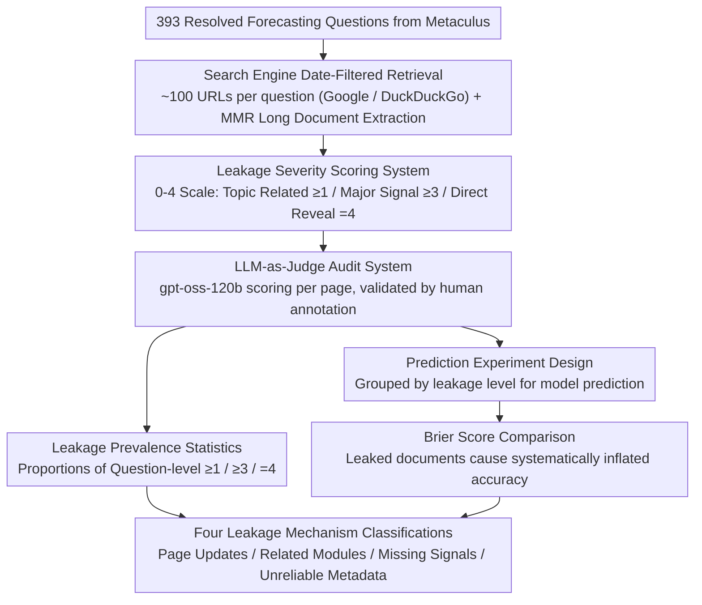

# Temporal Leakage in Search-Engine Date-Filtered Web Retrieval: A Retrospective Forecasting Case Study

**Conference**: ACL 2026  
**arXiv**: [2602.00758](https://arxiv.org/abs/2602.00758)  
**Code**: [GitHub](https://github.com/theolivecode/WebDataLeakageAudit)  
**Area**: Time Series  
**Keywords**: Temporal Leakage, Date Filtering, Retrospective Forecasting, Search Engine Audit, Evaluation Reliability

## TL;DR

This paper performs a systematic audit of Google and DuckDuckGo’s date filters, discovering that search engine date filtering fail significantly in retrospective forecasting evaluations—71% (Google) and 81% (DuckDuckGo) of questions contain at least one page with major post-cutoff information leakage, causing the predictive Brier score to artificially drop from 0.24 to 0.10.

## Background & Motivation

**Background**: Retrospective Forecasting (RF) is a mainstream method for evaluating LLM predictive capabilities—backtesting on questions with known answers, requiring retrieved evidence to be strictly limited to dates before the question's publication. In practice, almost all RF systems rely on search engine date filters to enforce information cutoffs.

**Limitations of Prior Work**: (1) Previous work only mentioned unreliable date filtering through a small number of manual cases, lacking systematic quantitative research; (2) It remained unclear whether temporal leakage is a rare edge case or a systemic issue; (3) The actual impact of leakage on downstream prediction accuracy had not been quantified.

**Key Challenge**: The validity of the entire RF evaluation paradigm rests on the assumption that "date filtering can exclude post-cutoff information"—if this assumption fails, all RF evaluation results based on date-filtered searches are untrustworthy.

**Goal**: Systematically audit the date filters of two major search engines, quantify the prevalence and mechanisms of temporal leakage, and measure its actual impact on prediction accuracy.

**Key Insight**: Using 393 resolved forecasting questions from the Metaculus platform, approximately 100 URLs were retrieved for each question, and an LLM-as-Judge was used to rate the leakage severity of each page on a scale of 0-4.

**Core Idea**: Search engine date filtering is unreliable for temporal backtesting—it is systematically undermined by four leakage mechanisms: page updates, related content modules, unreliable metadata, and missing signals.

## Method

### Overall Architecture

The study does not train any models but audits the reliability of search engine date filters at three levels: leakage audit—scoring the leakage of approximately 39K (Google) and 35K (DuckDuckGo) retrieved URLs page by page; downstream impact—comparing the difference in LLM prediction accuracy when fed leaked vs. non-leaked documents; and mechanism analysis—categorizing four temporal leakage pathways with specific URL evidence.

### Key Designs

**1. Leakage Severity Scoring System (Level 0-4): Refining "Leakage Presence" into "Leakage Magnitude"**

A simple "leakage present/absent" binary classification cannot distinguish between an irrelevant comment and a line that directly reveals the answer, which have completely different impacts on predictive decisions. Thus, the authors defined a 0-4 scale: $0$ = No post-cutoff information or irrelevant to the question; $1$ = Topic-related but uninformative; $2$ = Weak directional signal; $3$ = Major signal supporting strong reasoning or decisive for partial sub-answers; $4$ = Direct reveal of the answer. Notably, for "missing signals" (where a key source should have mentioned expected information but said nothing), the score is capped at $3$ to avoid over-interpreting an omission. This grading system is the foundation for all subsequent statistics—enabling separate reporting of "topic-related" ($\ge1$) and "major leakage" ($\ge3$).

**2. LLM-as-Judge Audit System: Automated Leakage Detection at a Scale of ~73K URLs**

Since it is impossible to manually review over 70,000 URLs, leakage scoring is delegated to an LLM. Each scoring request includes the question title, background, resolution criteria, resolved answer, cutoff date, page body, and the scoring criteria with examples. gpt-oss-120b (temperature=$0.5$) outputs the leakage assessment in JSON format. To ensure reliability, the authors validated this with human annotations: after merging scores 0-1, the exact match accuracy was $76.1\%$, quadratic weighted Kappa was $0.85$, and the F1 for direct leakage (score $4$) reached $0.82$, indicating the judge is sufficiently reliable for critical determinations like "direct revelation."

**3. Prediction Experiment Design (Quantifying Downstream Impact): Proving Leakage Systematically Inflates Scores**

Simply counting leakage proportions is insufficient; it must be demonstrated that leakage indeed causes systematic inflation of predictive accuracy. The authors specifically selected binary questions opening in 2025 (after the LLM knowledge cutoff) and fed retrieved documents grouped by leakage level to gpt-oss-120b for prediction, comparing Brier scores. Using 2025 questions ensures a fair "no retrieval" baseline—the model cannot cheat via pre-training memory. This design establishes "leakage → inflated accuracy" as an observable causal chain rather than mere correlation.

### Loss & Training

No model training is involved. For documents exceeding 7680 tokens, MMR is used to extract the most relevant passages (256-token chunks, maximum 30 chunks, Qwen-0.6B embedding model, $\lambda=0.7$).

## Key Experimental Results

### Main Results

**Prevalence of Leakage**

| Metric | Google | DuckDuckGo |
|------|--------|------------|
| Evaluated Questions | 393 | 389 |
| Total Retrieved URLs | 38,879 | 34,454 |
| URLs with Post-Cutoff Info | 33.2% | 34.5% |
| Question-level: ≥1 (Topic Related) | 98.5% | 98.2% |
| Question-level: ≥3 (Major Signal) | **71.0%** | **81.2%** |
| Question-level: 4 (Direct Reveal) | **41.0%** | **54.8%** |

**Impact on Prediction Accuracy (93 Binary Questions from 2025)**

| Retrieval Condition | Avg Sources | Mean Brier | Median Brier |
|----------|---------|-----------|-------------|
| No Retrieval (Baseline) | — | 0.244 | 0.090 |
| Score 0 (No leakage) | 73.5 | 0.242 | 0.102 |
| Score 2-4 (Weak to Full) | 9.6 | 0.128 | 0.023 |
| **Score 3-4 (Major to Full)** | **4.8** | **0.108** | **0.014** |
| Score 4 only (Full Leakage) | 2.6 | 0.129 | 0.014 |

### Ablation Study

**Leakage Rate Changes by Cutoff Year**

| Cutoff Year | Google Leakage Rate | DuckDuckGo Leakage Rate |
|---------|-------------|-----------------|
| 2021 | 46.3% | 47.1% |
| 2022 | 46.5% | 48.0% |
| 2023 | 34.5% | 31.4% |
| 2025 | 26.6% | 27.7% |

### Key Findings

- Leakage is systemic rather than sporadic—nearly all questions (98%+) have at least one topic-related piece of post-cutoff information.
- The Brier score for non-leaked documents (0.242) is nearly identical to the no-retrieval baseline (0.244)—indicating that "clean" date-filtered retrieval provides almost no useful information.
- Brier scores for level 3-4 leakage (0.108) are lower than for level 4 alone (0.129), as level 3 documents provide context that helps the model interpret evidence more reliably.
- Leakage rates are highest for earlier cutoff dates (2021-2022, >46%) and lower for more recent dates (2025: ~27%)—because older pages have more time to accumulate updates.
- Four leakage mechanisms: **Direct Page Updates** (most common), **Related Content Sidebars** (main text is clean but sidebar leaks), **Missing Signals** (omissions in synthesis sources imply the answer), and **Unreliable Metadata** (incorrect self-reported timestamps).

## Highlights & Insights

- This work poses a fundamental challenge to the entire RF evaluation methodology—almost all LLM forecasting systems claiming "near-human predictive ability" rely on date-filtered searches, meaning their performance may be systematically overestimated.
- The "Missing Signal" leakage mechanism is particularly subtle—a timeline covering up to 2025 that fails to mention an expected event implicitly suggests the answer, yet cannot be excluded by any metadata filter.
- Comparing non-leaked retrieval with no retrieval reveals nearly identical Brier scores, suggesting that even if date filtering worked perfectly, historical documents provide extremely limited help for forecasting.

## Limitations & Future Work

- Only two search engines (Google and DuckDuckGo) were audited; leakage patterns in other engines may differ.
- The same model (gpt-oss-120b) was used for both leakage detection and the prediction experiment, potentially introducing shared interpretive biases.
- MMR document processing might miss leakage signals scattered in excluded passages.
- The study diagnoses the problem but does not experimentally evaluate mitigation strategies (e.g., Wayback Machine retrieval or frozen snapshot databases).

## Related Work & Insights

- **vs FutureSearch (2025)**: Proposed using frozen webpage snapshots but still used active Google searches for ranking—this paper provides empirical support for moving away from active date-filtered searches.
- **vs Paleka et al. (2026)**: Qualitatively raised concerns about date filtering unreliability; this paper provides the first systematic quantification—confirming leakage is a systemic issue across ~73K URLs.
- **vs ForecastBench (Karger et al., 2025)**: Used prospective benchmarks to avoid leakage but suffers from slow iteration—the two approaches are complementary.

## Rating

- Novelty: ⭐⭐⭐⭐ First study to systematically quantify search engine date filtering leakage, filling a major methodological gap.
- Experimental Thoroughness: ⭐⭐⭐⭐⭐ Audit of ~73K URLs, dual-engine comparison, downstream impact quantification, human validation, and temporal analysis.
- Writing Quality: ⭐⭐⭐⭐⭐ Clear motivation, rigorous experimental design, and concrete leakage mechanism classification with URL evidence.
- Value: ⭐⭐⭐⭐⭐ Direct and profound impact on RF evaluation methodology; all systems using date-filtered search need to be re-evaluated.

<!-- RELATED:START -->

## Related Papers

- [\[NeurIPS 2025\] StRap: Spatio-Temporal Pattern Retrieval for Out-of-Distribution Generalization](../../NeurIPS2025/time_series/strap_spatio-temporal_pattern_retrieval_for_out-of-distribution_generalization.md)
- [\[AAAI 2026\] Task-Aware Retrieval Augmentation for Dynamic Recommendation](../../AAAI2026/time_series/task-aware_retrieval_augmentation_for_dynamic_recommendation.md)
- [\[ICML 2026\] Nested Spatio-Temporal Time Series Forecasting](../../ICML2026/time_series/nested_spatio-temporal_time_series_forecasting.md)
- [\[ACL 2026\] STK-Adapter: Incorporating Evolving Graph and Event Chain for Temporal Knowledge Graph Extrapolation](stk-adapter_incorporating_evolving_graph_and_event_chain_for_temporal_knowledge_.md)
- [\[ACL 2026\] Test of Time: Rethinking Temporal Signal of Benchmark Contamination](test_of_time_rethinking_temporal_signal_of_benchmark_contamination.md)

<!-- RELATED:END -->
