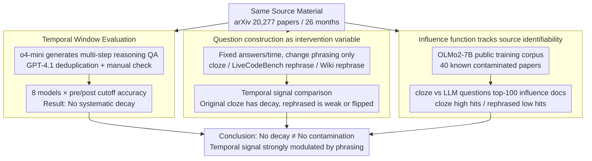

# Test of Time: Rethinking Temporal Signal of Benchmark Contamination

**Conference**: ACL2026  
**arXiv**: [2509.00072](https://arxiv.org/abs/2509.00072)  
**Code**: None  
**Area**: LLM Evaluation / Benchmark Contamination / Temporal Analysis  
**Keywords**: Benchmark Contamination, Temporal Signal, LLM Evaluation, Question Rephrasing, Influence Function

## TL;DR
This paper demonstrates that "performance decay after cutoff" is not robust evidence of benchmark contamination: as long as the same set of source documents is converted from original fill-in-the-blank questions to LLM-rephrased questions, the temporal decay signal changes significantly or even disappears.

## Background & Motivation
**Background**: Large Language Model (LLM) evaluation increasingly relies on public benchmarks, but public questions, solutions, and derivative discussions are likely to enter training corpora. Since most frontier models do not disclose training data, researchers often use indirect probes to judge contamination. A popular practice is temporal analysis: comparing model performance on questions released before and after the training cutoff. If performance is significantly worse after the cutoff, this post-cutoff performance decay is interpreted as the pre-cutoff questions being memorized.

**Limitations of Prior Work**: This inference seems intuitive but conflates "question release time" with "question construction method." Many temporal benchmarks take original questions directly from web pages, competitions, or papers; others let LLMs generate new questions based on the same source material. Although both share source materials, their surface forms, retrieval cues, and memorability are completely different. Thus, the same model might appear to be memorizing in one format while appearing to perform genuine reasoning in another.

**Key Challenge**: The temporal decay signal aims to measure the contamination relationship between training corpora and test questions, but what is actually observed is "whether the model can trace the test input back to text seen during training." If a question is rephrased far enough by an LLM, even if the source paper is in the training set, the model may not link the current question to the source document. Conversely, cloze tests or original snippets expose strong memorization cues.

**Goal**: The authors aim to answer three questions: first, whether LLM-generated arXiv reasoning questions truly lack post-cutoff decay; second, whether this lack is caused by the question generation method rather than the absence of contamination in the source material; third, whether the internal mechanism of the model can explain why cloze and LLM-generated questions provide different signals.

**Key Insight**: The crucial control variable of the paper is "same source material, different question phrasing." The authors construct LLM-synthesized QA and cloze QA around the same set of arXiv papers, then migrate this idea to LiveCodeBench and Wikipedia current events, and finally perform influence function analysis using the training corpus of the open-data model OLMo2.

**Core Idea**: By using the question construction method as an intervention variable, it is proven that temporal contamination signals are highly sensitive to surface form transformations and cannot serve as sufficient evidence for contamination conclusions in isolation.

## Method

### Overall Architecture
The paper does not propose a new model but builds a three-layer verification framework to deconstruct the inference that "performance decay after cutoff = contamination." The performance layer compares pre- and post-cutoff accuracy of LLM-generated arXiv reasoning questions across 26 months and 8 frontier models; the intervention layer replaces the same source papers with cloze questions and extends rephrasing experiments to LiveCodeBench and Wikipedia QA, changing only the phrasing while keeping answers and release times constant; the mechanism layer uses influence functions on OLMo2-7B-Instruct with public training data to track which training documents most influence the model's answers. The final output is a set of contamination probe results that decouple "actual contamination" into "surface traceability" and "presence of source material in training."

### Key Designs

**1. Temporal window evaluation: Confirming whether LLM-generated questions are stably "decay-free"**

The first step in questioning the temporal decay signal is to reproduce and amplify the scenario where it should appear. The authors use the arXiv API to crawl 20,277 math/physics papers spanning 26 months and use o4-mini to generate QA requiring more than 5 reasoning steps from materials like theorems. After deduplication by GPT-4.1 and manual inspection, 1,643 questions corresponding to 1,098 papers are retained; monthly accuracy is normalized as $Accuracy_m=C_m/Q_m$, and pre/post comparisons are made around each model's cutoff. If these questions do not decay across multiple models, fields, and cutoffs, it indicates that "source material from public arXiv" itself is insufficient to create temporal decay—the issue must lie in whether the question phrasing retains memorizable cues from the original text.

**2. Question construction as an intervention variable: Fixing answers and time, varying "closeness to original text"**

Temporal signals aim to measure contamination, but actually measure "whether the model can trace the test input back to text seen during training," which are conflated by the question format. The authors extract the question construction method as an intervention variable: constructing cloze questions for arXiv abstracts, masking 5 semantically key phrases each; for 400 questions from LiveCodeBench, using o4-mini to rephrase variable names, semantic backgrounds, and symbols while keeping algorithmic solutions fixed; for Wikipedia current events, constructing dated MCQs by rephrasing only the question statements while keeping options and answers. Complexity, answers, and release times are kept as fixed as possible; the only change is "how close the phrasing is to the original." Once temporal decay appears in original/cloze forms but weakens or reverses in LLM-rephrased forms, it proves that the temporal signal is not a stable indicator of contamination but is strongly modulated by benchmark construction.

**3. Influence function tracking source doc identifiability: Explaining why the same source gives different signals**

Performance curves only show phenomena and cannot answer "whether the model actually uses the source paper as a key training point" when answering. The authors choose OLMo2-7B-Instruct because its training data is public, confirming that certain arXiv papers are indeed in the training set. For 40 known contaminated papers, they construct both cloze and LLM-generated QA, then rank the top-100 influential documents among 10,000 training samples containing these papers. Influence scores are approximated using Kronfluence / EK-FAC, with the core form being $I_f(z) \approx -\nabla_\theta f(\theta_s)^\top (G+\lambda I)^{-1}\nabla_\theta L(z,\theta_s)$. Results show that cloze questions have high hit rates for source documents while LLM-rephrased questions have low hit rates, confirming the internal mechanism explanation that "rephrasing weakens the traceability of source documents."

### Loss & Training
This paper does not propose training a new model but proposes evaluation and analysis pipelines. The question generation phase uses o4-mini with high reasoning effort, and the filtering phase uses GPT-4.1 to remove duplicate or simple samples. Manual inspection ensures deterministic answers, at least 5 intermediate reasoning steps, clear question intent, and derivability from source material. Model evaluation is run via the OpenRouter API without web search to reduce the interference of hidden retrieval on temporal analysis. Influence function experiments use the public training corpus of OLMo2-7B-Instruct and EK-FAC to approximate the inverse-curvature vector product for computable training point attribution on large models.

## Key Experimental Results

### Main Results
LLM-generated arXiv multi-step QA does not show systematic post-cutoff decay. In physics, most models actually show a slight improvement after the cutoff; the average change across 16 model-field observations is +2.19 percentage points, with a 95% CI of [+0.61, +3.78] and a paired t-test $p=0.010$.

| Setting | Model / Statistic | Pre-cutoff | Post-cutoff | Gap(Post-Pre) | Conclusion |
|------|---------------|------------|-------------|---------------|------|
| Physics, LLM-generated QA | DeepSeek-R1 | 21.1 | 22.7 | +1.6 pp | No decay |
| Physics, LLM-generated QA | Gemini-2.5-Flash | 33.3 | 39.2 | +5.9 pp | Higher post-cutoff |
| Physics, LLM-generated QA | Llama-3.3-70B | 15.1 | 15.5 | +0.4 pp | Essentially flat |
| Physics, LLM-generated QA | o4-mini | 36.8 | 40.5 | +3.7 pp | Higher post-cutoff |
| Total Math + Physics | Mean of 16 obs | - | - | +2.19 pp | Disproves "inevitable decay" |

### Ablation Study
When the same source paper is converted into a cloze question, temporal decay reappears; when LiveCodeBench or Wiki QA is semantically rephrased by an LLM, the originally more prominent decay is weakened or removed.

| Intervention | Metric / Model | Original or cloze gap | LLM-transformed gap | Note |
|------|-------------|------------------|---------------------|------|
| RealMath arXiv cloze | GPT-4o-mini, LLM judge | -3.83 pp | N/A | Decay appears in cloze form |
| RealMath arXiv cloze | Llama-3.1-405B, LLM judge | -5.25 pp | N/A | Large models also show decay |
| RealMath arXiv cloze | Claude-3.5-Sonnet, BLEU | -6.60 pp | N/A | Lexical matching also decays |
| Wiki-based QA | GPT-3.5-turbo | -2.65 pp | -0.62 pp | Rephrasing significantly weakens decay |
| Wiki-based QA | GPT-4 | -1.04 pp | +2.81 pp | Becomes an improvement after rephrasing |
| Wiki-based QA | GPT-4o-mini | -7.59 pp | -4.99 pp | Decay remains but magnitude reduced |

Mechanism experiments further show that cloze questions make it easier for the model to trace back to source documents in training, while LLM-generated QA makes this tracing difficult.

| Question Format | Top-1 hit rate | Top-3 hit rate | Sample size | Meaning |
|----------|----------------|----------------|--------|------|
| Cloze questions | 77.5% | 100.0% | 40 contaminated papers | Source paper is often most influential |
| LLM-generated QA | 17.5% | 25.0% | 40 contaminated papers | Same source harder to trace after generation |

### Key Findings
- The most critical finding is not "no contamination," but "no decay does not equal no contamination." Influence function experiments show LLM-generated QA can originate from known training documents, yet temporal decay remains unnoticeable.
- Question construction is a strong confounding factor. Direct source text/cloze questions act more like memorization probes, whereas LLM-rephrased questions act more like semantic transfer or reasoning probes; both have different sensitivities to contamination.
- Cross-domain validation of LiveCodeBench and Wiki QA is important as it shows this phenomenon is not unique to arXiv theorem QA but is a more general benchmark transformation effect.

## Highlights & Insights
- Decoupling contamination detection from simply "looking at cutoff curves" to causal comparison of "same source, different phrasing" is the most valuable design of this paper. It warns that subsequent benchmarks should report not only the release date but also how questions were constructed from source materials.
- The use of influence functions is clever: it does not attempt to prove contamination in all black-box models but establishes a mechanism example on open-data models, showing that the presence of source documents in the training set does not guarantee that LLM-rephrased questions will trigger memorized retrieval.
- Implications for evaluation practice are direct: if a benchmark relies on temporal freshness, it is better to test original, cloze, semantically rephrased, and structure-preserving variants simultaneously; looking only at a scalar accuracy gap leads to easy overinterpretation.

## Limitations & Future Work
- The arXiv temporal window is 26 months; although covering multiple model cutoffs, it may still be affected by monthly variations in paper difficulty, field popularity, and question generation quality.
- Influence function experiments include only 40 known contaminated papers, primarily due to computational costs; the mechanism is clear, but the statistical scale is relatively small.
- LLM-generated questions and cloze questions differ not only in "rephrasing" but also potentially in difficulty, answer granularity, and scoring reliability. Future work could design finer continuous perturbation intensities to quantify the relationship between phrasing distance and temporal signals.
- The paper primarily discusses contamination detection and has not yet provided a complete new metric to replace temporal analysis. More robust directions might involve combinations of temporal splitting, near-duplicate detection, influence functions or membership inference, and multi-version surface consistency tests.

## Related Work & Insights
- **vs Time Travel / LiveCodeBench type temporal analysis**: These works treat pre/post-cutoff differences as contamination clues; this paper points out that these clues are highly sensitive to question construction and are thus better suited as warning signals rather than standalone evidence.
- **vs rephrasing / perturbation contamination probes**: Existing work often observes performance drops after rephrasing and interprets this as fragile reasoning or contamination. This paper conversely shows that rephrasing can also remove temporal decay, indicating that "score changes after rephrasing" must be interpreted in conjunction with construction mechanisms.
- **vs RealMath**: RealMath found that LLM-generated research-level math QA did not show obvious post-cutoff decay; this paper extends this phenomenon to a larger temporal window, more models, and the physics domain, using cloze comparisons to explain the underlying cause.
- **vs Training data auditing methods**: Direct auditing requires model developers to disclose data, which is difficult in reality. This paper's small-scale open-data influence-function experiment provides a mechanistic reference for black-box evaluation but cannot yet replace large-scale data auditing.

## Rating
- Novelty: ⭐⭐⭐⭐☆ Decoupling temporal contamination signals from benchmark construction is a sharp problem setting.
- Experimental Thoroughness: ⭐⭐⭐⭐☆ Provides four sets of evidence (arXiv, LiveCodeBench, Wiki, and influence functions), though the mechanism experiment sample is small.
- Writing Quality: ⭐⭐⭐⭐☆ Arguments are clear, experiments progress logically, though some tables are dense.
- Value: ⭐⭐⭐⭐⭐ Direct cautionary significance for LLM benchmark freshness, contamination detection, and question generation standards.

<!-- RELATED:START -->

## Related Papers

- [\[NeurIPS 2025\] Learning with Calibration: Exploring Test-Time Computing of Spatio-Temporal Forecasting](../../NeurIPS2025/time_series/learning_with_calibration_exploring_test-time_computing_of_spatio-temporal_forec.md)
- [\[NeurIPS 2025\] SynTSBench: Rethinking Temporal Pattern Learning in Deep Learning Models for Time Series](../../NeurIPS2025/time_series/syntsbench_rethinking_temporal_pattern_learning_in_deep_learning_models_for_time.md)
- [\[ACL 2026\] TSAQA: Time Series Analysis Question And Answering Benchmark](tsaqa_time_series_analysis_question_and_answering_benchmark.md)
- [\[ACL 2026\] STReasoner: Empowering LLMs for Spatio-Temporal Reasoning in Time Series via Spatial-Aware Reinforcement Learning](streasoner_empowering_llms_for_spatio-temporal_reasoning_in_time_series_via_spat.md)
- [\[ICLR 2026\] Uni-NTFM: A Unified Foundation Model for EEG Signal Representation Learning](../../ICLR2026/time_series/uni-ntfm_a_unified_foundation_model_for_eeg_signal_representation_learning.md)

<!-- RELATED:END -->
