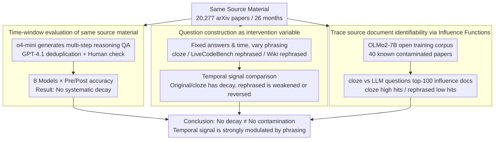

# Test of Time: Rethinking Temporal Signal of Benchmark Contamination

**Conference**: ACL2026  
**arXiv**: [2509.00072](https://arxiv.org/abs/2509.00072)  
**Code**: None  
**Area**: LLM Evaluation / Benchmark Contamination / Temporal Analysis  
**Keywords**: Benchmark Contamination, Temporal Signal, LLM Evaluation, Question Rephrasing, Influence Functions

## TL;DR
This paper demonstrates that "performance degradation after cutoff" is not robust evidence of benchmark contamination: as long as the same set of source documents is changed from original text cloze questions to LLM-rephrased questions, the temporal decay signal significantly changes or even disappears.

## Background & Motivation
**Background**: Large language model (LLM) evaluation increasingly relies on public benchmarks, but public questions, solutions, and derivative discussions likely enter the training corpora. Since most frontier models do not disclose their training data, researchers often use indirect probes to judge contamination. One popular approach is temporal analysis: comparing model performance on questions published before and after the training cutoff. If performance is significantly worse after the cutoff, this post-cutoff performance decay is interpreted as evidence that pre-cutoff questions were memorized.

**Limitations of Prior Work**: This inference, while intuitive, confounds "question publication time" with "question construction methodology." Many temporal benchmarks take original questions directly from web pages, competitions, or papers; others use LLMs to generate new questions based on the same source material. Although they share the same source material, their surface forms, retrieval cues, and memorability differ completely. Consequently, the same model might appear to memorize in one format while demonstrating true reasoning in another.

**Key Challenge**: Temporal decay signals aim to measure the contamination relationship between training corpora and test questions, but what is actually observed is "whether the model can trace the test input back to text seen during training." If a question is rephrased sufficiently far by an LLM, the model may not link the current question to the source document even if the source paper is in the training set; conversely, cloze tests or original snippets expose strong memorization cues.

**Goal**: The authors aim to answer three questions: first, whether LLM-generated arXiv reasoning questions truly lack post-cutoff decay; second, whether this absence is caused by the question generation method rather than a lack of contamination in the source material; third, whether the differing signals between cloze and LLM-generated questions can be explained via internal model mechanisms.

**Key Insight**: The key control variable of the paper is "same source material, different phrasing." The authors construct LLM-synthesized QA and cloze QA around the same set of arXiv papers, then extend this idea to LiveCodeBench and Wikipedia current events, and finally analyze the training corpus of the open-data model OLMo2 using influence functions.

**Core Idea**: By using question construction methods as an intervention variable, it is proven that temporal contamination signals are highly sensitive to surface form transformations and cannot serve as sufficient evidence for contamination conclusions in isolation.

## Method

### Overall Architecture
The paper does not propose a new model but builds a three-layer verification framework to deconstruct the inference "post-cutoff performance decay = contamination": the performance layer compares the pre/post cutoff accuracy of LLM-generated arXiv reasoning questions across 8 frontier models over 26 months; the intervention layer replaces the same source papers with cloze questions and extends rephrasing experiments to LiveCodeBench and Wikipedia QA, changing only the phrasing while keeping answers and publication times fixed; the mechanism layer uses influence functions on OLMo2-7B-Instruct, which has open training data, to track which training documents most influence the model's answers. The final output is a set of contamination probe results that decouple "contamination status" into "surface phrasing traceability" and "source material presence in training."

### Key Designs

**1. Time-window evaluation of same source material: Confirming if LLM-generated questions are stably "decay-free"**

To challenge the temporal decay signal, the first step is to replicate and amplify the scenario where it should appear. The authors used the arXiv API to scrape 20,277 math/physics papers spanning 26 months, used o4-mini to generate QA requiring 5+ reasoning steps from materials like theorems, and retained 1,643 questions corresponding to 1,098 papers after GPT-4.1 deduplication and human checking. Monthly accuracy was normalized by $Accuracy_m=C_m/Q_m$, and pre/post comparisons were made around each model's cutoff. If these questions do not show decay across multiple models, domains, and cutoffs, it proves that "source material from public arXiv" is not sufficient to create temporal decay—the issue must lie in whether the phrasing retains memorizable original cues.

**2. Question construction as intervention variable: Fixing answers and time, varying "closeness to original text"**

Temporal signals intend to measure contamination, but actually measure "whether the model can trace the test input back to text seen in training," which are confounded by question format. The authors used construction methods as intervention variables: constructing cloze questions for arXiv abstracts (masking 5 semantic key phrases); rephrasing 400 LiveCodeBench questions with o4-mini (changing variable names, semantic context, and symbols while keeping the algorithmic solution); and constructing dated MCQs for Wikipedia current events by rephrasing the question statement while keeping options and answers. Complexity, answers, and publication times are held constant; the only change is "how close the phrasing is to the original text." If temporal decay appears in original/cloze forms but weakens or reverses in LLM-rephrased forms, it proves the signal is not a stable contamination metric.

**3. Trace source document identifiability via Influence Functions: Mechanistically explaining different signals from the same source**

Performance curves only show phenomena but cannot answer "whether the model actually treats the source paper as a key training point." The authors selected OLMo2-7B-Instruct because its open training data allows confirming that specific arXiv papers are in the training set. For 40 known contaminated papers, they constructed both cloze and LLM-generated QA, then ranked the top-100 influential documents among 10,000 training samples. Influence scores were approximated using Kronfluence / EK-FAC, with the core form $I_f(z) \approx -\nabla_\theta f(\theta_s)^\top (G+\lambda I)^{-1}\nabla_\theta L(z,\theta_s)$. Results showed high hits for source documents in cloze questions and low hits for LLM-rephrased questions, mechanistically confirming that "rephrasing weakens the traceability of the source document."

### Loss & Training
This work does not propose training a new model but rather a process for evaluation and analysis. The question generation phase used o4-mini with high reasoning effort; the filtering phase used GPT-4.1 to remove duplicate or simple samples, with human checks ensuring deterministic answers, at least 5 intermediate reasoning steps, clear intent, and derivability from source material. Model evaluation was run via the OpenRouter API without web search to reduce hidden retrieval interference in temporal analysis. Influence function experiments used the public training corpus of OLMo2-7B-Instruct and EK-FAC to approximate the inverse-curvature vector product for computable training point attribution in large models.

## Key Experimental Results

### Main Results
LLM-generated arXiv multi-step QA did not show systematic post-cutoff decay. In the physics domain, most models slightly improved after the cutoff; the average change across 16 model-domain observations was +2.19 percentage points, 95% CI [+0.61, +3.78], paired t-test $p=0.010$.

| Setting | Model / Statistic | Pre-cutoff | Post-cutoff | Gap (Post-Pre) | Conclusion |
|------|---------------|------------|-------------|---------------|------|
| Physics, LLM-generated QA | DeepSeek-R1 | 21.1 | 22.7 | +1.6 pp | No drop |
| Physics, LLM-generated QA | Gemini-2.5-Flash | 33.3 | 39.2 | +5.9 pp | Higher post-cutoff |
| Physics, LLM-generated QA | Llama-3.3-70B | 15.1 | 15.5 | +0.4 pp | Essentially flat |
| Physics, LLM-generated QA | o4-mini | 36.8 | 40.5 | +3.7 pp | Higher post-cutoff |
| Math + Physics Aggregate | 16 obs. mean | - | - | +2.19 pp | Disproves "inevitable drop" |

### Ablation Study
When the same source papers were converted to cloze questions, temporal decay reappeared; when LiveCodeBench or Wiki QA were semantically rephrased by an LLM, the originally obvious decay was weakened or removed.

| Intervention | Metric / Model | Original or cloze gap | LLM-transformed gap | Description |
|------|-------------|------------------|---------------------|------|
| RealMath arXiv cloze | GPT-4o-mini, LLM judge | -3.83 pp | N/A | Drop appears in cloze |
| RealMath arXiv cloze | Llama-3.1-405B, LLM judge | -5.25 pp | N/A | Drop in large models |
| RealMath arXiv cloze | Claude-3.5-Sonnet, BLEU | -6.60 pp | N/A | Drop in literal match |
| Wiki-based QA | GPT-3.5-turbo | -2.65 pp | -0.62 pp | Rephrasing weakens drop |
| Wiki-based QA | GPT-4 | -1.04 pp | +2.81 pp | Becomes gain after rephrasing |
| Wiki-based QA | GPT-4o-mini | -7.59 pp | -4.99 pp | Drop reduced but remains |

Mechanism experiments further showed that cloze questions make it easier for the model to trace back to source documents in training, while LLM-generated QA makes such tracing difficult.

| Question Format | Top-1 hit rate | Top-3 hit rate | Sample size | Meaning |
|----------|----------------|----------------|--------|------|
| Cloze questions | 77.5% | 100.0% | 40 papers | Source papers often most influential |
| LLM-generated QA | 17.5% | 25.0% | 40 papers | Harder to trace same material after generation |

### Key Findings
- The most critical finding is not "no contamination," but "no decay does not equal no contamination." Influence function experiments show LLM-generated QA can originate from known training documents, yet temporal decay remains insignificant.
- Question construction is a strong confounding factor. Original text/cloze questions act like memorization probes, whereas LLM-rephrased questions act like semantic transfer or reasoning probes; they have different sensitivities to contamination.
- Cross-domain validation of LiveCodeBench and Wiki QA is important as it shows the phenomenon is not unique to arXiv theorem QA but is a more general benchmark transformation effect.

## Highlights & Insights
- Decoupling contamination detection from "looking at cutoff curves" to "same source, different phrasing" causal comparison is the most valuable design. It warns that future benchmarks should report not just publication dates but also how questions were constructed from source materials.
- The use of influence functions is clever: it does not attempt to prove contamination for all black-box models, but establishes a mechanistic example on an open-data model, showing that source document presence in training does not guarantee LLM-rephrased questions will trigger memorized retrieval.
- The implications for evaluation practice are direct: if a benchmark relies on temporal freshness, it should ideally test original-text, cloze, semantic-rephrased, and structure-preserving variants simultaneously; looking only at a scalar accuracy gap risks overinterpretation.

## Limitations & Future Work
- The arXiv time window is 26 months; although it covers multiple model cutoffs, it may still be affected by monthly variations in paper difficulty, domain popularity, and question generation quality.
- The influence function experiment includes only 40 known contaminated papers, primarily due to computational costs; the mechanistic conclusion is clear, but the statistical scale is relatively small.
- LLM-generated questions and cloze questions differ not just in "rephrasing" but potentially in difficulty, answer granularity, and grading reliability. Future work could design finer continuous perturbation strengths to quantify the relationship between phrasing distance and temporal signals.
- This paper primarily discusses contamination detection and has not yet provided a complete new metric to replace temporal analysis. More robust directions may involve combining temporal splitting, near-duplicate detection, influence functions or membership inference, and multi-version phrasing consistency testing.

## Related Work & Insights
- **vs Time Travel / LiveCodeBench temporal analysis**: These works treat pre/post cutoff differences as contamination clues. This paper points out such clues are highly sensitive to question construction and are better suited as warning signals rather than standalone evidence.
- **vs rephrasing / perturbation contamination probes**: Existing work often observes performance drops after rephrasing and interprets this as fragile reasoning or contamination. This paper conversely shows rephrasing can also remove temporal decay, indicating that "score changes after rephrasing" must be interpreted alongside the construction mechanism.
- **vs RealMath**: RealMath found LLM-generated research-level math QA had no obvious post-cutoff decay. This paper extends this phenomenon to a larger time window, more models, and the physics domain, explaining the reason using cloze comparisons.
- **vs Training data auditing**: Direct auditing requires developers to disclose data, which is difficult in practice. This paper’s small-scale open-data influence-function experiment provides a mechanistic reference for black-box evaluation, though it cannot yet replace large-scale data auditing.

## Rating
- Novelty: ⭐⭐⭐⭐☆ Decoupling temporal contamination signals from benchmark construction is an astute problem setting.
- Experimental Thoroughness: ⭐⭐⭐⭐☆ Provides four sets of evidence (arXiv, LiveCodeBench, Wiki, influence functions), though the mechanism experiment sample is small.
- Writing Quality: ⭐⭐⭐⭐☆ Clear arguments with progressive experimental layers; some table information is dense.
- Value: ⭐⭐⭐⭐⭐ Direct warning significance for LLM benchmark freshness, contamination detection, and question generation standards.

<!-- RELATED:START -->

## Related Papers

- [\[NeurIPS 2025\] Learning with Calibration: Exploring Test-Time Computing of Spatio-Temporal Forecasting](../../NeurIPS2025/time_series/learning_with_calibration_exploring_test-time_computing_of_spatio-temporal_forec.md)
- [\[NeurIPS 2025\] SynTSBench: Rethinking Temporal Pattern Learning in Deep Learning Models for Time Series](../../NeurIPS2025/time_series/syntsbench_rethinking_temporal_pattern_learning_in_deep_learning_models_for_time.md)
- [\[ACL 2026\] STReasoner: Empowering LLMs for Spatio-Temporal Reasoning in Time Series via Spatial-Aware Reinforcement Learning](streasoner_empowering_llms_for_spatio-temporal_reasoning_in_time_series_via_spat.md)
- [\[ICLR 2026\] Uni-NTFM: A Unified Foundation Model for EEG Signal Representation Learning](../../ICLR2026/time_series/uni-ntfm_a_unified_foundation_model_for_eeg_signal_representation_learning.md)
- [\[ICLR 2026\] Decentralized Attention Fails Centralized Signals: Rethinking Transformers for Medical Time Series](../../ICLR2026/time_series/decentralized_attention_fails_centralized_signals_rethinking_transformers_for_me.md)

<!-- RELATED:END -->
