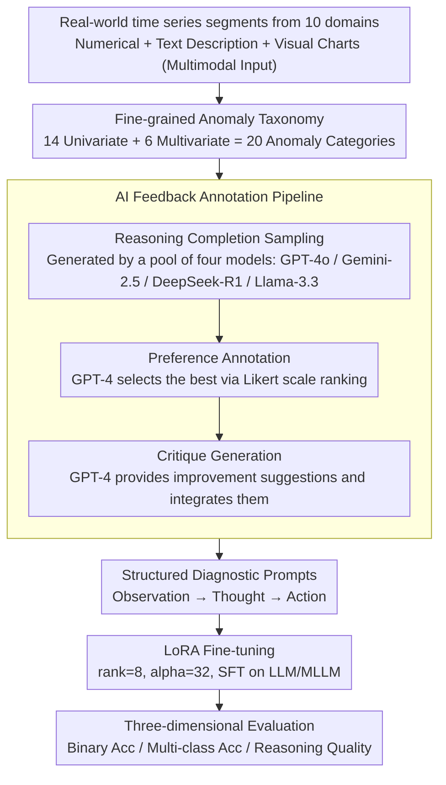

# Time-RA: Towards Time Series Reasoning for Anomaly Diagnosis with LLM Feedback

**Conference**: ACL 2026 Findings  
**arXiv**: [2507.15066](https://arxiv.org/abs/2507.15066)  
**Code**: [yyysjz1997/Time-RA](https://github.com/yyysjz1997/Time-RA)  
**Area**: Time Series Analysis / LLM Reasoning  
**Keywords**: Time series anomaly detection, anomaly reasoning diagnosis, multimodal benchmark, LLM fine-tuning, AI feedback annotation

## TL;DR

Ours defines the new task of Time-RA, upgrading time series anomaly detection from binary classification to generative reasoning diagnosis (detection + classification + explanation). It constructs the first multimodal benchmark RATs40K containing approximately 40,000 samples, 10 domains, and 20 anomaly types, validating the feasibility of this paradigm through an AI feedback annotation pipeline and LLM fine-tuning.

## Background & Motivation

**Background**: Time series anomaly detection (TSAD) is critical in fields such as finance, healthcare, AIOps, and industrial systems. Current deep learning methods primarily treat it as a binary classification task (normal vs. abnormal), lacking fine-grained classification of anomaly types and root cause explanations.

**Limitations of Prior Work**: (1) Traditional TSAD only outputs binary labels and does not provide specific anomaly categories or diagnostic reasoning required for root cause analysis; (2) Existing benchmark datasets lack explanatory reasoning labels and fine-grained anomaly classifications; (3) Most multimodal TSAD datasets are synthetic or limited in scope, failing to capture real-world complexity; (4) The reasoning capabilities of multimodal LLMs in the time series domain remain under-explored.

**Key Challenge**: Anomalies are "detected" but the "why" remains unknown—understanding the root cause is essential for preventive or corrective actions, yet current methods stop at detection.

**Goal**: (1) Define the new Time-RA task—upgrading TSAD from discriminative to generative reasoning diagnosis; (2) Construct a large-scale multimodal benchmark dataset to support this task; (3) Systematically evaluate the performance of LLMs/MLLMs in time series reasoning diagnosis.

**Key Insight**: Structure the time series anomaly diagnosis into a three-stage "Observation-Thought-Action" process, aligning it with the diagnostic reasoning of human analysts, enabling LLMs to learn this capability through structured prompting.

**Core Idea**: Redefine TSAD as a multi-objective generation task (detection + classification + reasoning), training LLMs to perform human-like diagnostic reasoning via multimodal datasets (numerical + text + images) and an AI feedback annotation pipeline.

## Method

### Overall Architecture

Time-RA upgrades "detecting anomalies" to "diagnosing anomalies." The pipeline follows four steps: first, collect approximately 40,000 time series segments from 10 real-world domains, combined with textual descriptions and visual charts to form multimodal inputs; next, use an AI feedback annotation pipeline to automatically label each sample with "detection label + anomaly category + diagnostic reasoning"; then, perform LoRA fine-tuning on LLMs/MLLMs using structured diagnostic prompts to teach them to reason like human analysts; finally, evaluate across three dimensions: binary classification accuracy, multi-class classification accuracy, and reasoning quality.

### Key Designs

**1. Fine-grained Anomaly Taxonomy: Providing an "Anomaly Vocabulary" for the Model to Learn**

Traditional time series anomaly datasets only provide "normal/abnormal" binary labels, leaving the model unable to identify the specific type or explain the root cause. Ours defines 14 univariate anomalies (point anomalies, trend shifts, non-linear pattern anomalies, etc.) and 6 multivariate anomalies (trend deviations, joint contextual anomalies, etc.) for a total of 20 categories. Each category includes a formal definition, sample time series, and real-world scenario descriptions. Each sample thus carries both a binary label and a specific anomaly category, allowing the model to learn to distinguish between different anomaly patterns and provide targeted explanations—the prerequisite for "generative diagnosis."

**2. AI Feedback Annotation Pipeline: Replacing Manual Annotation of 40,000 Samples with Model Mutual Evaluation**

Manual writing of diagnostic explanations for 40,000 samples is impractical. Ours uses a three-stage pipeline to automate and refine the annotation. The first stage is reasoning completion sampling, using GPT-4o, Gemini-2.5, DeepSeek-R1, and Llama-3.3-70B to generate diagnostic reasoning and anomaly classifications. The second stage is preference annotation, where GPT-4 ranks the outputs using a Likert scale to select the best result. The third stage is critique generation, where GPT-4 provides specific improvement suggestions for the best result and integrates them into the final label. The process produced 158,000 model outputs and over 150,000 feedback data points. This refinement via "multi-model generation + preference ranking + critique improvement" brings annotation quality close to expert levels.

**3. Structured Diagnostic Prompting: Deconstructing Diagnosis into "Observation-Thought-Action"**

Simply asking an LLM "is this time series abnormal" yields fragmented and uncontrollable answers. Ours uses structured prompts to simulate a human analyst's mindset: first setting the persona ("Time Series Anomaly Detection Expert"), then dividing the task into Observation (input series and domain knowledge), Thought (analyzing behavior patterns, variable relationships, deviation laws), and Action (outputting anomaly category). The prompt also embeds a full list of anomaly categories, natural language definitions, and few-shot examples. This Observation-Thought-Action structure stabilizes output in terms of clarity, consistency, and interpretability, providing clear format targets for fine-tuning.

### Loss & Training

Standard SFT objective: $$\max_\theta \mathbb{E}_{(x,y) \sim \mathcal{D}} [\log P_\theta(y|x)]$$, where input $x = \{T, D, V\}$ includes time series data, text descriptions, and visual charts, and output $y = \{y_l, a, r\}$ includes the detection label, anomaly category, and reasoning explanation. Parameter-efficient fine-tuning is performed using LoRA (rank=8, alpha=32).

## Key Experimental Results

### Main Results

| Model | Setting | Label F1 | Action F1 | RCS (Reasoning Consistency) |
|--------|------|------|----------|------|
| DeepSeek-7B | Zero-shot | 0.47 | 0.07 | 2.17 |
| DeepSeek-7B | SFT | Gain | Gain | Gain |
| Qwen2.5-7B | Zero-shot | Lower | Lower | Lower |
| Qwen2.5-7B | SFT | Significant Gain | Significant Gain | Significant Gain |

### Dataset Comparison

| Dataset | Samples | Modalities | Domains | Anomaly Types | Reasoning Labels |
|------|---------|------|------|------|------|
| RATs40K (Ours) | 39,574 | TS+Text+Image | 10 | 20 (14+6) | AI Feedback (avg 103 tokens) |
| LLMAD | 37,000 | TS+Text+Image | 3 | 8 | 100 manual entries |
| AnomLLM | 3,200 | TS+Text | - | 8 | Synthetic |
| VisualTimeAnomaly | 12,400 | TS+Text+Image | - | 9 | Synthetic |

### Key Findings

- LLM anomaly detection and reasoning capabilities improved significantly after SFT, validating the effectiveness of the Time-RA task paradigm.
- Visual modalities (time series charts) contribute positively to diagnostic accuracy; multimodal input outperforms text-only input.
- The fine-tuned models demonstrate strong "plug-and-play" transfer capabilities on unseen real-world datasets, outperforming traditional TSAD baselines.
- Performance decreases as anomaly categories become more complex or involve more cross-variable relationships, indicating that Time-RA remains an open frontier.

## Highlights & Insights

- **Paradigm Redefinition of TSAD**: Moving from binary classification to a three-layer output of "detection + classification + reasoning" essentially upgrades anomaly detection to anomaly diagnosis, aligning better with the needs of operational analysts. This task definition is a major contribution.
- **Engineering Value of the AI Feedback Annotation Pipeline**: The three-stage process of multi-model pool + preference ranking + critique improvement is a reusable paradigm for large-scale, high-quality annotation suitable for any scenario requiring reasoning labels.
- **Scale and Diversity of RATs40K Dataset**: With 10 real domains, 20 anomaly types, and approximately 40,000 samples, it fills the data gap in the field of time series reasoning diagnosis.

## Limitations & Future Work

- Although refined by GPT-4, AI feedback labels may still contain biases; expert validation only covered a subset.
- There is significant room for improvement in absolute performance for binary and multi-class classification in current evaluations.
- The high anomaly ratio (83.7%) may lead to a model bias toward predicting anomalies.
- Future work: Introduce online/streaming anomaly detection settings, integrate domain-specific knowledge graphs to enhance reasoning, and develop interactive diagnostic systems.

## Related Work & Insights

- **vs. Traditional TSAD (e.g., Anomaly Transformer)**: Traditional methods only output binary labels; Ours adds anomaly classification and reasoning explanations to provide actionable diagnostic information.
- **vs. LLMAD/AnomLLM**: These prior works explored LLMs for TSAD but had small data scales, simplistic annotations, and lacked reasoning; RATs40K surpasses them in scale, diversity, and annotation depth.

## Rating

- Novelty: ⭐⭐⭐⭐⭐ First to define the time series anomaly reasoning diagnosis task and construct the first large-scale multimodal reasoning benchmark.
- Experimental Thoroughness: ⭐⭐⭐⭐ Extensive multi-model evaluation and transfer experiments, though more comparisons with traditional methods could be included.
- Writing Quality: ⭐⭐⭐⭐ Clear task definition and detailed dataset construction process.
- Value: ⭐⭐⭐⭐⭐ Opens a new direction for the time series analysis community; dataset and code are fully open-sourced.

<!-- RELATED:START -->

## Related Papers

- [\[ICML 2026\] AnomSeer: Reinforcing Multimodal LLMs to Reason for Time-Series Anomaly Detection](../../ICML2026/time_series/anomseer_reinforcing_multimodal_llms_to_reason_for_time-series_anomaly_detection.md)
- [\[ICLR 2026\] Reasoning on Time-Series for Financial Technical Analysis](../../ICLR2026/time_series/reasoning_on_time-series_for_financial_technical_analysis.md)
- [\[ICML 2026\] IMPACT: Influence Modeling for Open-Set Time Series Anomaly Detection](../../ICML2026/time_series/impact_influence_modeling_for_open-set_time_series_anomaly_detection.md)
- [\[ICML 2026\] Adaptive Time Series Reasoning via Segment Selection](../../ICML2026/time_series/adaptive_time_series_reasoning_via_segment_selection.md)
- [\[ICLR 2026\] Rating Quality of Diverse Time Series Data by Meta-learning from LLM Judgment](../../ICLR2026/time_series/rating_quality_of_diverse_time_series_data_by_meta-learning_from_llm_judgment.md)

<!-- RELATED:END -->
