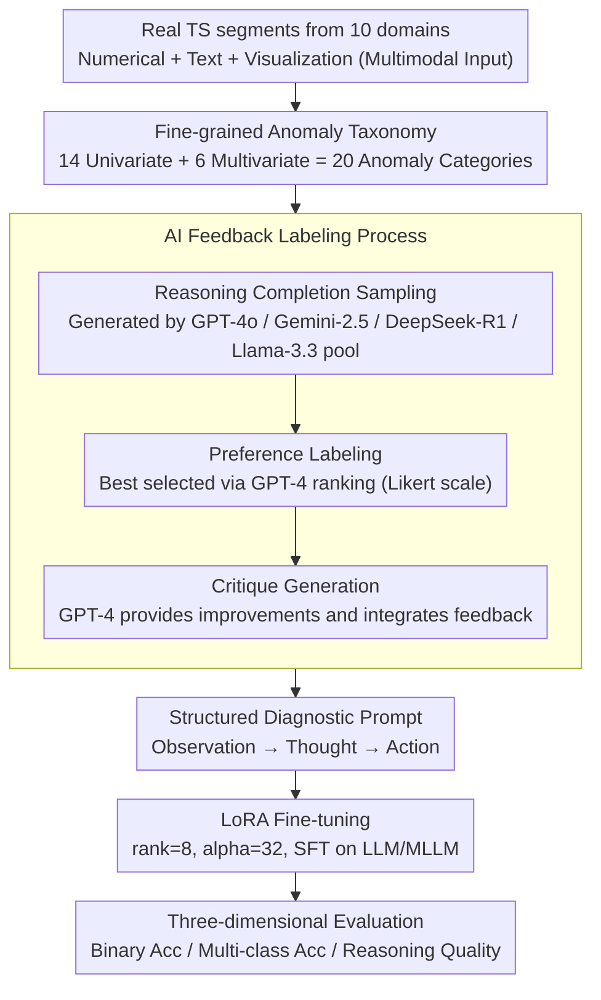

# Time-RA: Towards Time Series Reasoning for Anomaly Diagnosis with LLM Feedback

**Conference**: ACL 2026 Findings  
**arXiv**: [2507.15066](https://arxiv.org/abs/2507.15066)  
**Code**: [yyysjz1997/Time-RA](https://github.com/yyysjz1997/Time-RA)  
**Area**: Time Series Analysis / LLM Reasoning  
**Keywords**: Time Series Anomaly Detection, Anomaly Reasoning Diagnosis, Multimodal Benchmark, LLM Fine-tuning, AI Feedback Labeling

## TL;DR

Defining the new Time-RA task, this work upgrades time series anomaly detection from binary classification to generative reasoning diagnosis (detection + classification + root cause explanation). It constructs RATs40K, the first multimodal benchmark comprising ~40,000 samples across 10 domains and 20 anomaly types, validating the feasibility of this paradigm through an AI feedback labeling pipeline and LLM fine-tuning.

## Background & Motivation

**Background**: Time Series Anomaly Detection (TSAD) is critical in fields such as finance, healthcare, AIOps, and industrial systems. Current deep learning methods primarily treat this as a binary classification task (normal vs. abnormal), lacking fine-grained classification and causal explanation.

**Limitations of Prior Work**: (1) Traditional TSAD only outputs binary labels without providing specific anomaly categories or diagnostic reasoning required for root cause analysis; (2) existing benchmarks lack explanatory reasoning annotations and fine-grained classification; (3) multimodal TSAD datasets are mostly synthetic or limited in scope, failing to capture real-world complexity; (4) the reasoning capabilities of multimodal LLMs remain under-explored in the time series domain.

**Key Challenge**: The "detected" anomaly lacks an explanation of "why it is abnormal"—understanding the root cause is essential for preventive or corrective actions, yet current methods stop at detection.

**Goal**: (1) Define the new Time-RA task—upgrading TSAD from discriminative to generative reasoning diagnosis; (2) build a large-scale multimodal benchmark to support this task; (3) systematically evaluate the capabilities of LLMs/MLLMs in time series reasoning diagnosis.

**Key Insight**: Structure the time series anomaly diagnosis into a three-stage "Observation-Thought-Action" workflow, aligning with the diagnostic reasoning process of human analysts, allowing LLMs to learn this capability through structured prompting.

**Core Idea**: Redefine TSAD as a multi-objective generation task (detection + classification + reasoning), training LLMs to perform human-like diagnostic reasoning using a multimodal dataset (numerical + text + image) and an AI feedback labeling pipeline.

## Method

### Overall Architecture

Time-RA upgrades "anomaly detection" to "anomaly diagnosis." The pipeline consists of four steps: first, collecting ~40,000 time series segments from 10 real-world domains, combined with text descriptions and visualizations to form multimodal inputs; second, using an AI feedback labeling process to automatically generate "detection labels + anomaly categories + diagnostic reasoning" for each sample; third, fine-tuning LLMs/MLLMs using LoRA with structured diagnostic prompts to emulate human analyst reasoning; and finally, evaluating performance across three dimensions: binary classification accuracy, multi-class classification accuracy, and reasoning quality.

### Key Designs

**1. Fine-grained Anomaly Taxonomy: Providing a "Vocabulary" for Learning**

Traditional datasets only provide "normal/abnormal" labels, leaving models unable to identify types or explain causes. This work defines 14 univariate anomalies (e.g., point anomalies, trend shifts, non-linear pattern anomalies) and 6 multivariate anomalies (e.g., trend deviation, joint contextual anomalies), totaling 20 categories. Each category includes a formal definition, sample time series, and real-world scenarios. This allows the model to learn to distinguish patterns and provide specific explanations—the prerequisite for "generative diagnosis."

**2. AI Feedback Labeling Process: Replacing Humans with Model Peer-Review for 40k Annotations**

Manually writing reasoning for 40,000 samples is impractical. A three-stage pipeline automates and refines labeling: (1) Reasoning Completion Sampling, where a pool of four strong models (GPT-4o, Gemini-2.5, DeepSeek-R1, Llama-3.3-70B) generates reasoning and classifications; (2) Preference Labeling, where GPT-4 ranks these outputs using a Likert scale to select the best; (3) Critique Generation, where GPT-4 refines the best result. This yields 158k model outputs and 150k+ feedback points, achieving annotation quality nearing expert levels.

**3. Structured Diagnostic Prompt: Splitting Diagnosis into "Observation-Thought-Action"**

Asking an LLM "is this abnormal?" results in fragmented answers. This work uses structured prompts to simulate an analyst's mindset: first setting the persona ("Expert in TSAD"), then dividing the task into Observation (input data and domain knowledge), Thought (analyzing patterns, relationships, and deviations), and Action (outputting the final category). Prompts embed the full taxonomy and few-shot examples, leading to stable, clear, and consistent outputs.

### Loss & Training

Standard SFT objective: $$\max_\theta \mathbb{E}_{(x,y) \sim \mathcal{D}} [\log P_\theta(y|x)]$$, where input $x = \{T, D, V\}$ includes time series data, text descriptions, and visual charts, and output $y = \{y_l, a, r\}$ includes detection labels, anomaly categories, and reasoning explanations. LoRA (rank=8, alpha=32) is used for parameter-efficient fine-tuning.

## Key Experimental Results

### Main Results

| Model | Setting | Label F1 | Action F1 | RCS (Reasoning Consistency) |
|--------|------|------|----------|------|
| DeepSeek-7B | Zero-shot | 0.47 | 0.07 | 2.17 |
| DeepSeek-7B | SFT | Gain | Gain | Gain |
| Qwen2.5-7B | Zero-shot | Lower | Lower | Lower |
| Qwen2.5-7B | SFT | Sig. Gain | Sig. Gain | Sig. Gain |

### Dataset Comparison

| Dataset | Samples | Modalities | Domains | Anomaly Types | Reasoning Labels |
|------|---------|------|------|------|------|
| RATs40K (Ours) | 39,574 | TS+Text+Image | 10 | 20 (14+6) | AI Feedback (avg 101 tokens) |
| LLMAD | 37,000 | TS+Text+Image | 3 | 8 | 100 Human |
| AnomLLM | 3,200 | TS+Text | - | 8 | Synthetic |
| VisualTimeAnomaly | 12,400 | TS+Text+Image | - | 9 | Synthetic |

### Key Findings

- SFT significantly enhances anomaly detection and reasoning, validating the Time-RA paradigm.
- The visual modality (TS charts) positively contributes to diagnostic accuracy; multimodal input outperforms text-only.
- Fine-tuned models demonstrate strong "plug-and-play" transferability on unseen real-world datasets, surpassing traditional TSAD baselines.
- Performance drops as anomaly categories become more complex or involve intricate cross-variable relationships, indicating that Time-RA remains an open frontier.

## Highlights & Insights

- **Paradigm Redefinition of TSAD**: Moving from binary classification to a tripartite "Detection+Classification+Reasoning" output essentially upgrades anomaly detection to anomaly diagnosis, aligning closer to real-world operational needs.
- **Engineering Value of AI Feedback Labeling**: The three-stage pipeline (multi-model pool + preference ranking + critique) provides a reusable framework for generating large-scale, high-quality reasoning labels.
- **Scale and Diversity of RATs40K**: Spanning 10 domains and 20 types across ~40k samples, it addresses the data scarcity in time series reasoning diagnosis.

## Limitations & Future Work

- AI feedback labels refined by GPT-4 may still contain biases; expert validation was limited to a subset.
- Absolute performance in binary and multi-class classification still has significant room for improvement.
- The high anomaly ratio (83.7%) in the dataset might bias the model towards predicting anomalies.
- Future work: Exploring online/streaming detection, integrating domain-specific knowledge graphs, and developing interactive diagnostic systems.

## Related Work & Insights

- **Comparison with Traditional TSAD (e.g., Anomaly Transformer)**: Traditional methods only output binary labels; Ours adds classification and reasoning to provide actionable insights.
- **Comparison with LLMAD/AnomLLM**: Earlier works explored LLMs for TSAD but faced small scales, simple labels, or lacked reasoning; RATs40K surpasses them in scale, diversity, and depth of annotation.

## Rating

- Novelty: ⭐⭐⭐⭐⭐ First to define TS reasoning diagnosis and build a large-scale multimodal benchmark.
- Experimental Thoroughness: ⭐⭐⭐⭐ Extensive evaluation and transfer experiments, though more comparisons with traditional methods could be included.
- Writing Quality: ⭐⭐⭐⭐ Clear task definition and detailed dataset construction process.
- Value: ⭐⭐⭐⭐⭐ Opens a new direction for the time series community; dataset and code are fully open-sourced.

<!-- RELATED:START -->

## Related Papers

- [\[ICLR 2026\] Reasoning on Time-Series for Financial Technical Analysis](../../ICLR2026/time_series/reasoning_on_time-series_for_financial_technical_analysis.md)
- [\[ICLR 2026\] Towards Multimodal Time Series Anomaly Detection with Semantic Alignment and Condensed Interaction](../../ICLR2026/time_series/towards_multimodal_time_series_anomaly_detection_with_semantic_alignment_and_con.md)
- [\[ICLR 2026\] ICDiffAD: Implicit Conditioning Diffusion Model for Time Series Anomaly Detection](../../ICLR2026/time_series/icdiffad_implicit_conditioning_diffusion_model_for_time_series_anomaly_detection.md)
- [\[ICML 2026\] Adaptive Time Series Reasoning via Segment Selection](../../ICML2026/time_series/adaptive_time_series_reasoning_via_segment_selection.md)
- [\[ICLR 2026\] Rating Quality of Diverse Time Series Data by Meta-learning from LLM Judgment](../../ICLR2026/time_series/rating_quality_of_diverse_time_series_data_by_meta-learning_from_llm_judgment.md)

<!-- RELATED:END -->
