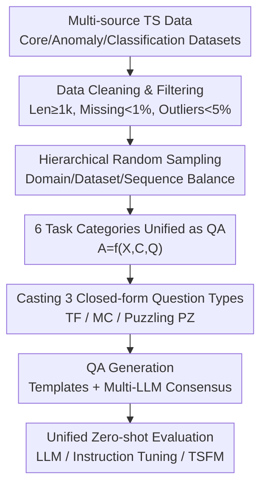

# TSAQA: Time Series Analysis Question And Answering Benchmark

**Conference**: ACL 2026  
**arXiv**: [2601.23204](https://arxiv.org/abs/2601.23204)  
**Code**: https://huggingface.co/datasets/TSAQA/TSAQA-Benchmark (Dataset)  
**Area**: Time Series / TSQA Benchmark / LLM Evaluation  
**Keywords**: Time Series QA, Unified Benchmark, Analysis Capability Evaluation, Pushing Problems, Time Series Foundation Models

## TL;DR
TSAQA is a unified time series question answering benchmark: it casts 6 types of temporal analysis tasks (anomaly detection, classification, representation, comparison, data transformation, and temporal relations) into 3 closed-form question types (true/false TF, multiple-choice MC, and the newly proposed puzzling PZ). Across 13 domains with 210k samples, LLMs and time series foundation models are evaluated under a unified zero-shot protocol—results indicate that even the strongest commercial model, Gemini-2.5-Flash, achieves an average accuracy of only 65.08%, leaving significant room for improvement.

## Background & Motivation

**Background**: Traditional time series research focuses on a narrow set of tasks such as forecasting, anomaly detection, imputation, and classification, treating sequences as isolated numerical signals. Recent advances in LLMs have inspired "Time Series Question Answering (TSQA)"—restructuring temporal tasks into natural language queries to allow models to answer complex questions about temporal patterns and dynamics.

**Limitations of Prior Work**: Existing TSQA benchmarks are **fragmented across task coverage, modalities, and evaluation designs**. Some focus only on specific domains (e.g., EngineMT-QA for aero-engines in ITFormer), while others include many open-ended questions (Time-MQA). Open-ended answers are difficult to standardize objectively, making fair comparisons across models challenging. In short, a large-scale benchmark with broad tasks, unified question types, and reproducible scoring is missing.

**Key Challenge**: To comprehensively evaluate a model's **time series analysis capability**, one must cover various analysis tasks from basic to advanced while ensuring **objective and reproducible** evaluation. However, more complex tasks (such as trend/seasonality description) tend to favor open-ended answers, which are naturally difficult to standardize—there is a tension between coverage breadth and evaluation objectivity.

**Goal**: Construct a large-scale unified benchmark that (1) incorporates diverse tasks into a single QA framework; (2) ensures objectivity and reproducibility via closed-form question types; and (3) provides a standardized evaluation protocol across a wide range of domains.

**Key Insight**: By **forcibly casting all tasks**—even those originally open-ended like "describing trends"—into closed-form formats (TF/MC/PZ), the benchmark expands task coverage while maintaining objective, automatically scorable evaluation.

**Core Idea**: Use a "unified QA format $A=f(X,C,Q)$ + 3 closed-form question types + 6 task categories + 13 domains + 210k samples" to consolidate fragmented TSQA into a standardized benchmark. It introduces the **puzzling PZ task** as a human-like cognitive test to probe the understanding of temporal structures.

## Method

### Overall Architecture
TSAQA represents each instance uniformly as: time series input $X$ + context $C$ + question $Q$, where the model outputs answer $A$, namely $A=f(X,C,Q)$. Both $C$ and $Q$ are expressed in natural language. Tasks are divided into two groups totaling 6 categories—**Regular Analysis** (anomaly detection, classification) and **Advanced Analysis** (representation, comparison, data transformation, temporal relations)—all projected into 3 closed-form question types (TF/MC/PZ). The construction pipeline involves: collecting and cleaning multi-source public data → ensuring domain/dataset/sequence balance via hierarchical random sampling → generating QA for each task (via templates or multi-LLM consensus) → splitting into 7/1/2 train/val/test → evaluating LLMs and TSFMs under a unified zero-shot protocol.

### Key Designs

**1. Task Spectrum: From Basic Attributes to Structural and Relational Reasoning**

Addressing the narrow task coverage of existing benchmarks, TSAQA explicitly arranges tasks along a spectrum from "basic analysis attributes" to "complex structural/relational reasoning." **Regular Analysis** includes anomaly detection (judging if input contains anomalies) and classification (identifying semantic categories). **Advanced Analysis** includes representation (inferring intrinsic properties like trend/seasonality/dispersion), comparison (analyzing relative similarities/differences between two sequences), data transformation (understanding relationships between original and transformed sequences, e.g., Fourier transform), and temporal relations (capturing temporal dependencies between patches). This spectrum allows evaluation across different hierarchies of temporal understanding.

**2. Three Closed-form Question Types + New Puzzling (PZ): Objectivity for Task Breadth**

Addressing the difficulty of scoring open-ended high-level analysis, all tasks are cast into closed formats: **TF** (True/False) judges an assertion about the input; **MC** (Multiple Choice) selects the correct assertion; **PZ (puzzling)** is the new format proposed here—given the first patch of a sequence and the remaining patches in shuffled order, the model must reorder them back into the correct temporal sequence. PZ corresponds to realistic, human-like cognitive tests and has been proven effective in computer vision (e.g., jigsaw puzzles) for evaluating general cognitive abilities. These types enable large-scale, reproducible objective evaluation.

**3. Multi-source Collection + Strict Filtering + Hierarchical Sampling: Ensuring Domain Balance**

Addressing data bias, sources are split into: **Core datasets** (real-world multi-domain data from TSFM benchmarks like Lotsa, Time-300B, UTSD), **anomaly detection datasets** (ECG, SMD, MGAB, etc.), and **classification datasets** (univariate UCR Archive, selecting classes ≤4 and length <400 with text descriptions). Strict filtering keeps only sequences with length ≥1k, missingness ≤1%, and outlier rates ≤5%. Except for classification and anomaly tasks, samples are drawn via **Hierarchical Random Sampling** to ensure balance. Samples have random lengths in $[32, 256]$ and use z-score normalization to reduce data bias.

**4. Task-specific QA Generation + Multi-LLM Consensus: Controlled Templates + Reduced Bias**

Addressing the variance in "ground truth" across tasks, the authors customize generation: **Data Transformation** uses Fourier/Wavelet/First-order Difference to generate sequences where the correct transform is calculated and distractors are sampled, then formatted via templates. **Temporal Relations** test local continuity, reasoning, and context via TF (is this the immediate successor?), MC (choose the next segment), and PZ (order 4 shuffled successors). Semantic tasks like **Representation/Comparison** use **Multi-LLM Consensus**: GPT-4o generates QA and assigns confidence based on metadata and 1–3 sub-themes; then GPT-4.1, Gemini-2.5-Flash, and Claude-3.5-Sonnet jointly produce consensus answers to mitigate single-model bias. Each task is allocated 30k samples (60k for temporal relations due to PZ), totaling 210k.

### Mechanism Example
Take "Temporal Relation - Puzzling (PZ)": A real sequence is sampled and cut into patches. The first patch $\mathbf{x}$ acts as the anchor. The four subsequent patches are shuffled as candidates $[\mathbf{y}_1, \mathbf{y}_2, \mathbf{y}_3, \mathbf{y}_4]$. The prompt asks: "Given the first segment, please reorder the remaining shuffled segments back into the correct temporal order." The model must understand the structural continuity of adjacent segments to succeed—this explains why models perform worst on PZ (strong models score ~50, weak models score single digits).

## Key Experimental Results

### Main Results (Zero-shot, Average Accuracy, Selected)

| Model | A.D. (TF) | Classification (MC) | Representation (TF/MC) | Data Trans. (MC) | Temp. Rel. (PZ) | Overall |
| :--- | :--- | :--- | :--- | :--- | :--- | :--- |
| Gemini-2.5-Flash | 52.08 | 49.07 | 85.48/81.08 | 84.49 | 54.56 | **65.08** |
| GPT-4.1 | 55.85 | 50.38 | 92.97/89.36 | 79.09 | 45.77 | 62.82 |
| Claude-3.5-Sonnet | 51.27 | 41.23 | 74.39/78.45 | 82.15 | 54.56 | 61.19 |
| GPT-4o | 54.32 | 47.20 | 88.15/84.15 | 75.58 | 45.61 | 60.73 |
| Qwen3-8B | 50.60 | 50.52 | 77.35/66.87 | 67.14 | 21.93 | 51.04 |
| LLaMA3.1-8B | 54.92 | 50.20 | 68.10/62.26 | 40.95 | 6.80 | 44.93 |

The strongest commercial model (Gemini-2.5-Flash) achieves only 65.08%, highlighting the challenge.

### Instruction Tuning

| Model | Zero-shot Overall | Fine-tuned Overall | Gain |
| :--- | :--- | :--- | :--- |
| LLaMA3.1-8B | 44.93 | 85.26 | +40.33 |
| Qwen3-8B | 51.04 | 84.29 | +33.25 |
| Ministral-8B | 44.65 | 74.74 | +30.09 |

Instruction tuning significantly boosts performance, though PZ remains difficult (scoring ~60 even after tuning).

### Key Findings
- **Anomaly Detection and Classification are disproportionately hard**: Even top models score near 50 (random) on A.D. (TF) and Classification (MC), suggesting difficulties in mapping traditional numerical tasks to linguistic interfaces.
- **PZ is the bottleneck**: In zero-shot settings, weaker models collapse on PZ (LLaMA3.2-1B scores 6.76). Understanding temporal structures remains unsolved.
- **Representation and Transformation are easier**: Models score high (80–90+) on trend/seasonality and transformation identifies, likely because these are more easily described by metadata.
- **TSAQA transcends general LLMs**: Evaluations show the benchmark also distinguishes dedicated time series foundation models (TSFMs).

## Highlights & Insights
- **Standardizing closed-form questions** is the most pragmatic design choice: it trades question format flexibility for objective, automated scoring, bypassing the standardization issues of open-ended TSQA.
- **The PZ (Puzzling) task is a transferable idea**: Borrowing jigsaw self-supervision from CV to TS directly probes the model's understanding of temporal direction and continuity with a unique ground truth.
- **Multi-LLM consensus** serves as a practical template for labeling semantic tasks: single-model generation + self-check filtering + multi-model agreement reduces individual model bias without requiring human gold labels.

## Limitations & Future Work
- Closed-form questions **sacrifice the evaluation of open-ended generation**—TSAQA cannot evaluate if a model can "explain" its analysis clearly.
- Label quality for semantic tasks is bounded by the consensus LLMs' own capabilities, potentially inheriting their blind spots.
- Sequence lengths are limited to $[32, 256]$ with z-score normalization; long-term, multivariate coupling, and non-stationary real-world scenarios are underrepresented.
- Future work could include open-ended/interpretability evaluations, extension to longer/multivariate series, and generalizing PZ to more structural reasoning types.

## Related Work & Insights
- **vs. Time-MQA / ITFormer**: The former is hard to standardize due to open-ended QA; the latter is domain-specific. TSAQA emphasizes **standardized large-scale evaluation under a unified protocol** (6 tasks, 3 types, 13 domains).
- **vs. TSandLanguage / TimeSeriesExam**: Most prior works focus on forecasting or single domains/task types. TSAQA is broader in terms of tasks, types, and domains.
- **vs. SciTS / TSRBench**: While concurrent works focus on scientific multivariate data or multimodal (text+plot) inputs, TSAQA differentiates itself through **standardized analysis evaluation** rather than multimodal expansion.

## Rating
- Novelty: ⭐⭐⭐⭐ Unified closed-form framework + new PZ task.
- Experimental Thoroughness: ⭐⭐⭐⭐⭐ Comprehensive coverage across LLMs, tuning, and TSFMs.
- Writing Quality: ⭐⭐⭐⭐ Clear task spectrum and pipeline definitions.
- Value: ⭐⭐⭐⭐ Provides a standardized evaluation platform for the TSQA community.

<!-- RELATED:START -->

## Related Papers

- [\[ICML 2026\] PATRA: Pattern-Aware Alignment and Balanced Reasoning for Time Series Question Answering](../../ICML2026/time_series/patra_pattern-aware_alignment_and_balanced_reasoning_for_time_series_question_an.md)
- [\[ACL 2026\] ODTQA-FoRe: An Open-Domain Tabular Question Answering Dataset for Future Data Forecasting and Reasoning](odtqa-fore_an_open-domain_tabular_question_answering_dataset_for_future_data_for.md)
- [\[ACL 2025\] Time-MQA: Time Series Multi-Task Question Answering with Context Enhancement](../../ACL2025/time_series/time-mqa_time_series_multi-task_question_answering_with_context_enhancement.md)
- [\[ACL 2026\] Test of Time: Rethinking Temporal Signal of Benchmark Contamination](test_of_time_rethinking_temporal_signal_of_benchmark_contamination.md)
- [\[ICLR 2026\] Reasoning on Time-Series for Financial Technical Analysis](../../ICLR2026/time_series/reasoning_on_time-series_for_financial_technical_analysis.md)

<!-- RELATED:END -->
