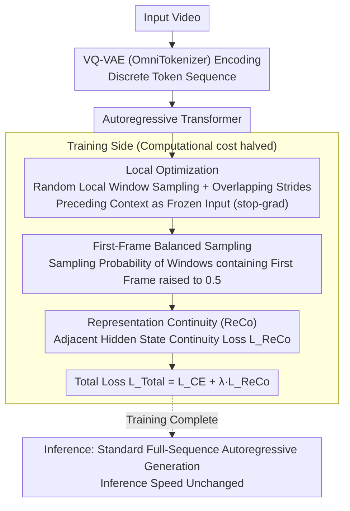

# Accelerating Training of Autoregressive Video Generation Models via Local Optimization with Representation Continuity

**Conference**: ACL 2026 Findings  
**arXiv**: [2604.07402](https://arxiv.org/abs/2604.07402)  
**Code**: None  
**Area**: Video Generation  
**Keywords**: Autoregressive video generation, training acceleration, local optimization, representation continuity, Lipschitz continuity

## TL;DR
The authors propose the Local Optimization + Representation Continuity (ReCo) training strategy. By optimizing within local windows and constraining smooth transitions of hidden states, they achieve a 2x acceleration in training autoregressive video generation models without sacrificing generation quality.

## Background & Motivation

**Background**: Autoregressive models have demonstrated superior inference speed and performance over diffusion models in image generation. However, in video generation, the video token sequences are significantly longer than those of images, leading to extremely high training costs which require full-sequence autoregressive modeling.

**Limitations of Prior Work**: Intuitively, training could be accelerated by reducing the number of training frames (the Fewer-Frames method), where training occurs on short sequences and inference is performed iteratively. However, experiments reveal that this leads to severe error accumulation and temporal inconsistency. Since each block during inference is generated based on a previous (potentially erroneous) block without global context, errors amplify exponentially.

**Key Challenge**: There is a trade-off between training efficiency and generation consistency. Reducing training frames lowers computational load but disrupts temporal coherence between video frames, causing a significant degradation in FVD (e.g., FFS increases from 73.65 to 229.32).

**Goal**: To halve the training cost while maintaining baseline-level video quality and temporal consistency.

**Key Insight**: The authors approach the problem from two levels: (1) Training strategy: replacing full-sequence optimization with local window optimization, using out-of-window context as frozen conditions; (2) Representation space: starting from Lipschitz continuity, constraining the magnitude of change in hidden states between adjacent time steps to suppress error propagation.

**Core Idea**: Optimize autoregressive loss within randomly sampled local windows (Local Opt.) while using a representation continuity loss (ReCo) to ensure smooth transitions of hidden states. This significantly reduces computation during training while maintaining full-sequence generation consistency during inference.

## Method

### Overall Architecture
Input videos are first encoded into discrete token sequences using a VQ-VAE (OmniTokenizer) and then modeled by an autoregressive Transformer. The key modifications are entirely on the training side: instead of calculating loss on the full sequence, a local window is randomly sampled to optimize only the intra-window autoregressive loss. Previous tokens outside the window serve as frozen context (stop-gradient). Simultaneously, continuity constraints are applied to adjacent hidden states within the window. Inference remains standard full-sequence autoregressive generation, so inference speed is unaffected.

### Key Designs

**1. Local Optimization: Backpropagation only on local windows to reduce training computation by half**

Video token sequences are much longer than image sequences, making full-sequence autoregressive training expensive. Simple fewer-frame training leads to exponential error magnification due to the lack of global context. Given a complete sequence $\mathbf{E}$, this method randomly samples a starting position $s$ and window length $W$, calculating cross-entropy only within the window $\mathbf{E}_\mathcal{W} = (\mathbf{e}_s, ..., \mathbf{e}_{s+W-1})$. $\mathbf{E}_{<s}$ serves as frozen context without gradient backpropagation. Overlapping windows with stride $S < W$ ensure that the same token is optimized multiple times under different contexts. This avoids exposure bias by conditioning on ground-truth context and builds robust representations, while inference remains standard.

**2. First-Frame Balanced Sampling: Increasing first-frame exposure to bridge the training-generation gap**

By comparing the loss distributions of training and generated samples, the authors found that the Local Opt. model exhibits significantly higher loss on the first frame during generation—and the quality of the first frame directly affects all subsequent frames. The solution is straightforward: increase the sampling probability of "windows containing the first frame" to 0.5, forcing the model to optimize the beginning of the video more frequently. This adjustment reduced the FVD on FFS from 190.46 to 127.11 and further improved the training speedup to 2.0x.

**3. Representation Continuity (ReCo): Using Lipschitz constraints to suppress error from exponential to linear**

Optimizing only on independent windows can lead to abrupt changes in the representation space, magnifying errors during cross-window concatenation. Viewing the autoregressive model as a discrete-time dynamical system and inspired by Lipschitz continuity, a continuity loss is added to adjacent hidden states: $\mathcal{L}_{ReCo} = \frac{1}{W-1}\sum_{i=s}^{s+W-2}\|\mathbf{h}_{i+1} - \mathbf{h}_i\|_2^2$. The total loss is $\mathcal{L}_{Total} = \mathcal{L}_{CE} + \lambda \cdot \mathcal{L}_{ReCo}$. By suppressing the local Lipschitz constant, error propagation is restricted to a linear growth range $\|\epsilon_{t+1}\| \leq L \cdot \|\epsilon_t\| + \delta_t$ rather than exponential, recovering full-sequence consistency to baseline levels while halving computation.

### Loss & Training
The total loss consists of two parts: (1) Standard intra-window cross-entropy loss $\mathcal{L}_{CE}$; (2) Representation continuity regularization term $\mathcal{L}_{ReCo}$ with weight $\lambda=0.1$. The sampling probability for the first-frame window is set to 0.5. The model is trained for 300 epochs with a learning rate of $1\times10^{-4}$.

## Key Experimental Results

### Main Results

| Dataset | Metric | ReCo★ | Baseline★ | Gain |
|---------|---------|-------|-----------|------|
| FFS | FVD↓ | 42.5 | 46.1 | -7.8% |
| SKY | FVD↓ | 58.8 | 62.7 | -6.2% |
| UCF101 | FVD↓ | 251.4 | 254.5 | -1.2% |
| Taichi | FVD↓ | 98.3 | 105.5 | -6.8% |

Training Speed: ReCo is approximately 2x faster than the Baseline.

### Ablation Study

| Configuration | FFS FVD↓ | SKY FVD↓ | Training Speed |
|---------------|----------|----------|----------------|
| Baseline | 73.65 | 89.09 | 1.0× |
| Fewer-Frames | 229.32 | 292.41 | 2.5× |
| Local-Opt. | 190.46 | 256.94 | 1.7× |
| Local-Opt. (w/ first frame) | 134.73 | 186.63 | 1.7× |
| Local-Opt. (w/ balanced) | 127.11 | 179.84 | 2.0× |
| ReCo (Full method) | 72.6 | 87.5 | 2.0× |

### Key Findings
- While the Fewer-Frames method is 2.5x faster, FVD deteriorates by more than 3x, confirming the theoretical analysis of error accumulation.
- The First-Frame Balanced Sampling strategy in Local Opt. contributes significantly, reducing FVD from 190 to 127.
- ReCo further reduces FVD from 127 to 72.6, matching or slightly exceeding the Baseline (73.7), validating the effectiveness of Lipschitz regularization.
- On the MSR-VTT text-to-video task, ReCo* achieved CLIP Scores and FVD comparable to a 7B baseline using only 50% of the training cost.

## Highlights & Insights
- **Dynamical Systems Perspective**: Treating autoregressive models as discrete dynamical systems and using Lipschitz continuity theory to guide regularization provides a novel tool for understanding and improving autoregressive generation.
- **Training-Inference Decoupling**: Local Opt. only modifies the training pipeline (local window optimization) while maintaining standard full-sequence generation during inference. This "training-only trick" philosophy is highly practical.
- **Loss Distribution Analysis**: Identifying the first-frame bottleneck by comparing loss distributions between training and generation samples led to the design of the balanced sampling strategy. This data-driven improvement approach is transferable to other sequence generation tasks.

## Limitations & Future Work
- Experiments were primarily conducted on small-scale models (110M-770M) and short videos (17 frames), without testing on commercial large-scale models.
- The $\lambda$ hyperparameter for ReCo may require tuning for different datasets and resolutions.
- Text-to-video experiments were only evaluated zero-shot on MSR-VTT; broader validation across more benchmarks is needed.
- The combined effects of ReCo with other acceleration techniques (e.g., KV-cache compression, quantization) have not been explored.

## Related Work & Insights
- **vs Fewer-Frames**: Fewer-Frames only reduces training frames and iterates during inference, causing heavy error accumulation. ReCo resolves the issue on the training side via Local Opt. + continuity constraints while keeping full-sequence generation during inference.
- **vs LARP**: LARP improves video quality through a better tokenizer. ReCo is orthogonal to LARP—ReCo♠ (combined with LARP) achieved 56.1 FVD on UCF (compared to LARP's original 57.0).

## Rating
- Novelty: ⭐⭐⭐⭐ The application of a dynamical systems perspective and Lipschitz regularization in autoregressive video generation is quite novel, though the core concepts (local optimization + smoothing) have precedents in NLP.
- Experimental Thoroughness: ⭐⭐⭐⭐ Comprehensive testing across 4 datasets, 2 model scales, and text-to-video extensions with detailed ablations, though large-scale validation is missing.
- Writing Quality: ⭐⭐⭐⭐⭐ The logical chain from problem analysis → theoretical proof → method design → experimental validation is very clear, with intuitive and effective visualizations.

<!-- RELATED:START -->

## Related Papers

- [\[ICML 2026\] Light Forcing: Accelerating Autoregressive Video Diffusion via Sparse Attention](../../ICML2026/video_generation/light_forcing_accelerating_autoregressive_video_diffusion_via_sparse_attention.md)
- [\[CVPR 2026\] Accelerating Autoregressive Video Diffusion via History-Guided Cache and Residual Correction](../../CVPR2026/video_generation/accelerating_autoregressive_video_diffusion_via_history-guided_cache_and_residua.md)
- [\[NeurIPS 2025\] Autoregressive Adversarial Post-Training for Real-Time Interactive Video Generation](../../NeurIPS2025/video_generation/autoregressive_adversarial_posttraining_for_realtime_interac.md)
- [\[ICCV 2025\] VPO: Aligning Text-to-Video Generation Models with Prompt Optimization](../../ICCV2025/video_generation/vpo_aligning_text-to-video_generation_models_with_prompt_optimization.md)
- [\[ICLR 2026\] MoAlign: Motion-Centric Representation Alignment for Video Diffusion Models](../../ICLR2026/video_generation/moalign_motion-centric_representation_alignment_for_video_diffusion_models.md)

<!-- RELATED:END -->
