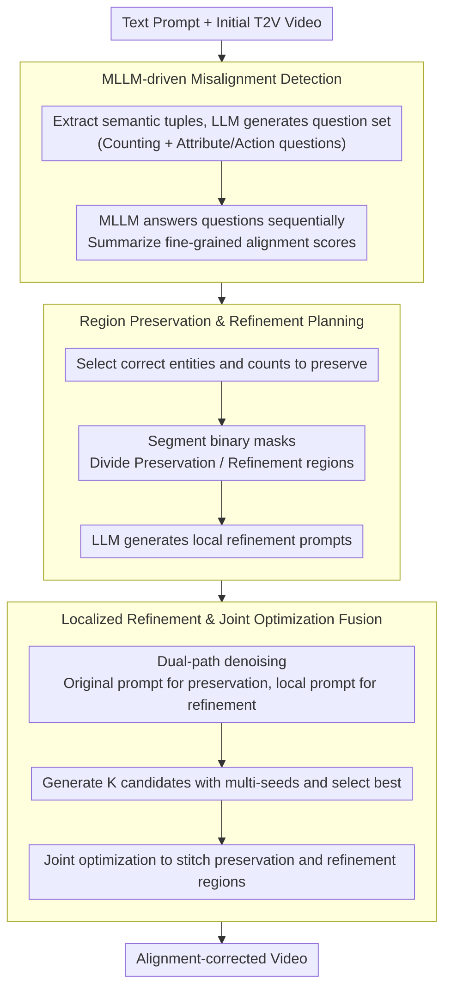

# Self-Correcting Text-to-Video Generation with Misalignment Detection and Localized Refinement

**Conference**: ACL 2026 Findings  
**arXiv**: [2411.15115](https://arxiv.org/abs/2411.15115)  
**Code**: [video-repair](https://video-repair.github.io/)  
**Area**: Video Generation  
**Keywords**: Text-to-Video Generation, Self-Correction, Localized Refinement, Text-Video Alignment, Diffusion Models

## TL;DR

VideoRepair is introduced as the first training-free, model-agnostic self-correction framework for text-to-video generation. It utilizes MLLMs to detect fine-grained text-video misalignments, preserving correct regions while selectively refining problematic ones. It consistently improves alignment quality across four different T2V backbone models on EvalCrafter and T2V-CompBench.

## Background & Motivation

**Background**: Text-to-video (T2V) diffusion models have achieved significant progress in generation quality but still struggle with following complex text prompts—specifically those involving multiple objects, attribute binding, and spatial relationships. Common errors include incorrect object counts, confused attribute binding, or regional deformations.

**Limitations of Prior Work**: Existing compositional T2V methods improve compositionality but lack explicit feedback mechanisms to detect and correct misalignments. Image-domain refinement frameworks face issues such as high computational overhead, dependency on external generators, or the introduction of visual inconsistencies. A critical issue is that even in misaligned videos, the correctly generated regions should often be preserved rather than regenerated.

**Key Challenge**: Global regeneration wastes correctly generated content, while simple inpainting/editing lacks the semantic guidance necessary to introduce or correct entities that do not match the text. A mechanism is needed to precisely locate problematic regions while preserving faithful content.

**Goal**: Design a training-free video refinement framework capable of automatically detecting errors, planning the repair, and performing localized corrections.

**Key Insight**: Analogy is drawn to how humans revise creative works—modifying only the erroneous parts while keeping the correct ones. Fine-grained evaluation questions generated by an MLLM identify misaligned regions, followed by using the diffusion model’s inherent regeneration capabilities for selective refinement.

**Core Idea**: Preserving correct regions and selectively refining erroneous ones—converting MLLM evaluation feedback into actionable generation guidance.

## Method

### Overall Architecture

VideoRepair mimics human revision—correcting only what is wrong and keeping what is right, performing "localized rework" on a generated video instead of regenerating from scratch. It connects three phases: first, an MLLM decomposes the text prompt into answerable questions to check for misalignments; second, it plans "which entities to keep, which regions to refine, and what local prompts to use"; finally, it applies different guidance to preservation and refinement regions during the denoising process, seamlessly blending them through joint optimization. The entire pipeline is training-free and compatible with any T2V diffusion model.

### Key Designs

**1. MLLM-driven Misalignment Detection: Quantifying "Where it went wrong" via QA**

T2V models often fail in counting, attribute binding, and spatial relations, but global regeneration lacks a "where it failed" signal. VideoRepair first extracts semantic tuples (entities, attributes, relations, actions) from the prompt to generate an evaluation set $Q$, categorized into counting questions $Q_c$ (e.g., "Is there one bear?") and other attribute/action/scene questions $Q_{others}$. The MLLM answers these for the initial video: counting questions return a triplet (judgment, required count, actual count), while others return binary judgments, culminating in a fine-grained alignment score in $[0,1]$.

This provides a diagnostic result rather than a vague scalar, explicitly distinguishing "wrong count" from "wrong color," which guides the next stage on what to keep versus redo.

**2. Region Preservation & Refinement Planning: Translating Diagnostics to Pixel-level Instructions**

Diagnostics must be translated into specific pixels and prompts. This step performs three tasks: (a) MLLM identifies key entities $O^*$ and counts $N^*$ that are already correct based on previous QA; (b) a segmentation model, driven by pointing prompts, extracts binary masks $\mathbf{M}$ for these entities across every frame to define boundaries between "preservation" and "refinement" regions; (c) the LLM generates a local refinement prompt $p^r$ that excludes preserved entities, describing only what the refinement area should contain.

The mask determines "where to change," and the local prompt determines "what to change to," converting abstract feedback into executable instructions while avoiding interference from already correct components in the original prompt.

**3. Localized Refinement & Joint Optimization Fusion: Introducing New Entities while Preserving Correct Areas**

Standard mask inpainting often fails to introduce new entities, while simple editing cannot freely correct misalignments. VideoRepair circumvents this via dual-path denoising. Shields are downsampled to latent space; the preservation region uses original noise, while the refinement region is re-sampled. Each denoising step runs the diffusion model twice: the preservation region receives the original prompt $p$, and the refinement region receives the local prompt $p^r$, yielding candidates $\hat{V}_{pres}$ and $\hat{V}_{refine}$.

To ensure seamless transitions at boundaries, joint optimization integrates them:

$$V_1 = \arg\min_{\tilde{V}} \|M_{pres} \otimes (\tilde{V} - \hat{V}_{pres})\|^2 + \|M_{refine} \otimes (\tilde{V} - \hat{V}_{refine})\|^2$$

Masked constraints force each region toward its respective candidate, maintaining the preservation area while the refinement area follows new guidance, ensuring global consistency.

### Loss & Training

Ours is completely training-free, reusing off-the-shelf T2V diffusion models for inference. To mitigate randomness, the system generates $K$ candidates using different seeds for the same plan, selecting the best based on evaluation scores; BLIP-BLEU scores serve as a tie-breaker for equal scores.

## Key Experimental Results

### Main Results

| T2V Backbone | Method | EvalCrafter Avg↑ | Visual Quality | Motion Quality | Temporal Consistency |
|--------|------|------|----------|------|------|
| Wan 2.1-1.3B | Original | 44.83 | 63.2 | 61.0 | 62.1 |
| Wan 2.1-1.3B | + VideoRepair | 49.01 | 65.1 | 61.6 | 62.0 |
| VideoCrafter2 | Original | 45.97 | 61.8 | 62.6 | 62.9 |
| VideoCrafter2 | + VideoRepair | 48.83 | 62.1 | 62.4 | 62.0 |
| CogVideoX-5B | Original | 45.01 | 65.8 | 61.0 | 61.8 |
| CogVideoX-5B | + VideoRepair | 46.41 | 64.8 | 61.1 | 61.9 |

### Ablation Study

| Configuration | Key Metrics | Description |
|------|---------|------|
| vs LLM paraphrasing | 43.12-45.81 | Simple prompt rewriting yields limited or negative gains |
| vs SLD | 43.72-47.11 | Effective in some cases but severely damages visual/temporal quality |
| vs OPT2I | 45.63-48.69 | Obvious improvement but lower than VideoRepair |
| VideoRepair | 46.41-49.01 | Consistently optimal without harming quality metrics |

### Key Findings

- VideoRepair yields consistent improvements across all four T2V backbones, verifying its model-agnostic nature.
- A key advantage is its ability to maintain visual quality, motion quality, and temporal consistency—whereas methods like SLD may achieve similar alignment scores but at the cost of catastrophic quality drops (e.g., temporal consistency dropping from 62.1 to 21.0).
- Significant gains are observed in Counting and Color subcategories, which are current T2V model weaknesses.

## Highlights & Insights

- **"Preserve Correct, Refine Wrong" Paradigm**: An intuitive yet technically non-trivial approach. Compared to global regeneration or simple inpainting, localized preservation-refinement is superior in efficiency and quality. This paradigm is transferable to any generative task requiring post-processing.
- **Evaluation Feedback-Driven Generation**: Direct translation of MLLM QA results into a refinement plan (masks + prompts) creates a closed loop between evaluation and generation. This self-correction is more scalable than human-in-the-loop feedback.
- **Training-free & Model-agnostic**: No additional training required, allowing plug-and-play integration with any T2V diffusion model.

## Limitations & Future Work

- Requires double the diffusion model forward passes (preservation + refinement), doubling inference overhead.
- Relies on MLLM evaluation accuracy—misjudgments by the MLLM can lead to unnecessary or missing modifications.
- Currently supports only single-turn refinement; iterative refinement might lead to error accumulation.
- Potential exploration: Integrating this with T2V training for online self-correction or introducing user interaction feedback.

## Related Work & Insights

- **vs SLD/OPT2I**: SLD uses global semantic guidance but harms visual quality; OPT2I optimizes prompts without pixel-level repair. VideoRepair's regional strategy balances alignment and quality.
- **vs Image Inpainting/Editing**: Inpainting cannot introduce new entities well, and editing struggles with free-form alignment correction. VideoRepair's dual-path denoising overcomes these limitations.

## Rating

- Novelty: ⭐⭐⭐⭐ First training-free video self-correction framework; original region-preservation paradigm.
- Experimental Thoroughness: ⭐⭐⭐⭐⭐ Evaluated across four backbones, two benchmarks, with comprehensive ablations and quality metrics.
- Writing Quality: ⭐⭐⭐⭐ Three-stage flowchart is clear, and method description is systematic.
- Value: ⭐⭐⭐⭐ Provides a universal and practical post-processing solution for enhancing T2V generation.

<!-- RELATED:START -->

## Related Papers

- [\[CVPR 2025\] PhyT2V: LLM-Guided Iterative Self-Refinement for Physics-Grounded Text-to-Video Generation](../../CVPR2025/video_generation/phyt2v_llm-guided_iterative_self-refinement_for_physics-grounded_text-to-video_g.md)
- [\[AAAI 2026\] GenVidBench: A 6-Million Benchmark for AI-Generated Video Detection](../../AAAI2026/video_generation/genvidbench_a_6-million_benchmark_for_ai-generated_video_detection.md)
- [\[ICML 2026\] Self-Refining Video Sampling](../../ICML2026/video_generation/self-refining_video_sampling.md)
- [\[CVPR 2026\] M4V: Multimodal Mamba for Efficient Text-to-Video Generation](../../CVPR2026/video_generation/m4v_multimodal_mamba_for_efficient_text-to-video_generation.md)
- [\[CVPR 2026\] VISTA: A Test-Time Self-Improving Video Generation Agent](../../CVPR2026/video_generation/vista_a_test-time_self-improving_video_generation_agent.md)

<!-- RELATED:END -->
