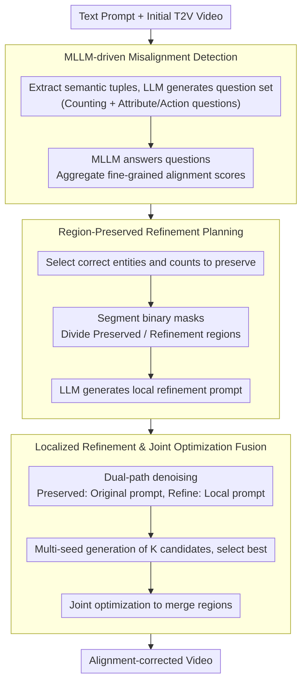

# Self-Correcting Text-to-Video Generation with Misalignment Detection and Localized Refinement

**Conference**: ACL 2026 Findings  
**arXiv**: [2411.15115](https://arxiv.org/abs/2411.15115)  
**Code**: [video-repair](https://video-repair.github.io/)  
**Area**: Video Generation  
**Keywords**: Text-to-Video Generation, Self-Correction, Localized Refinement, Text-Video Alignment, Diffusion Models

## TL;DR

VideoRepair is proposed as the first training-free, model-agnostic self-correction framework for text-to-video (T2V) generation. It utilizes MLLMs to detect fine-grained text-video misalignments, preserves correctly generated regions, and selectively refines problematic areas. The method consistently improves alignment quality across four T2V backbone models on EvalCrafter and T2V-CompBench.

## Background & Motivation

**Background**: Text-to-video (T2V) diffusion models have made significant strides in generation quality but still struggle to follow complex text prompts—especially those involving multiple objects, attribute binding, and spatial relationships. Common errors include incorrect object counts, attribute binding confusion, or regional deformations.

**Limitations of Prior Work**: Existing compositional T2V methods improve compositionality but lack explicit feedback mechanisms to detect and correct misalignments. Image-space refinement frameworks suffer from high computational overhead, dependency on external generators, or the introduction of visual inconsistencies. A key observation is that even in misaligned videos, correctly generated regions should be preserved rather than regenerated.

**Key Challenge**: Global regeneration wastes correctly generated content, while simple inpainting/editing lacks the semantic guidance to introduce or correct entities that do not match the text. A mechanism is needed to precisely localize problematic areas while preserving faithful content.

**Goal**: Design a training-free video refinement framework capable of automatically detecting errors, planning refinements, and performing localized corrections.

**Key Insight**: Analogy is drawn to how humans revise creative works—modifying only faulty parts while keeping correct ones. MLLMs are used to generate fine-grained evaluation questions to identify misaligned regions, and the diffusion model's inherent regeneration capability is utilized for selective refinement.

**Core Idea**: Preserve correct regions and selectively refine error regions—translating MLLM evaluation feedback into actionable generation guidance.

## Method

### Overall Architecture

VideoRepair mimics the human revision process: it performs "localized rework" on a generated video rather than regenerating it from scratch. The framework consists of three stages: first, an MLLM decomposes the text prompt into questions to check for misalignments; second, it plans "which entities to preserve, which regions to refine, and which local prompts to use"; finally, it applies different guidance to preserved and refined regions during the denoising process, merging them seamlessly via joint optimization. The process is training-free and compatible with any T2V diffusion model.

### Key Designs

**1. MLLM-driven Misalignment Detection: Quantifying "What is Wrong" into Q&A**

T2V models often fail in counting, attribute binding, and spatial relations. VideoRepair extracts semantic tuples (entities, attributes, relations, actions) from the prompt to generate an evaluation question set $Q$, categorized into counting questions $Q_c$ and other questions $Q_{others}$. The MLLM answers these for the initial video: $Q_c$ returns triples (judgment, required count, actual count), and others return binary judgments, aggregated into an alignment score in $[0,1]$. This provides fine-grained, element-wise diagnostic results, explicitly distinguishing "wrong count" from "wrong color," which guides the next stage on what to keep versus redo.

**2. Region-Preserved Refinement Planning: Translating Diagnosis to Pixel-level Instructions**

To operationalize the diagnosis, three steps are taken: (a) the MLLM identifies correct entities $O^*$ and their counts $N^*$; (b) a segmentation model, driven by pointing prompts, extracts binary masks $\mathbf{M}$ for these entities across frames; (c) the LLM generates a local refinement prompt $p^r$ that excludes preserved entities. The mask defines "where to change," and the local prompt defines "what to change," turning abstract feedback into executable instructions while avoiding interference from already-correct parts.

**3. Localized Refinement and Joint Optimization Fusion: Introducing Entities without Disturbing Correct Regions**

To overcome the limitations of standard inpainting (difficulty introducing new entities) and editing (lack of alignment correction), VideoRepair uses dual-path denoising. The mask is downsampled to latent space; the preserved region uses original noise, while the refinement region is re-sampled. Each step runs two diffusion passes: one for the preserved region with original prompt $p$, and one for the refinement region with local prompt $p^r$, producing candidates $\hat{V}_{pres}$ and $\hat{V}_{refine}$. A joint optimization ensures seamless transitions:

$$V_1 = \arg\min_{\tilde{V}} \|M_{pres} \otimes (\tilde{V} - \hat{V}_{pres})\|^2 + \|M_{refine} \otimes (\tilde{V} - \hat{V}_{refine})\|^2$$

This per-region constraint allows the video to maintain global consistency while accepting new guidance in the refined area, preserving visual and temporal quality more effectively than global semantic guidance (SLD).

### Loss & Training

The framework is entirely training-free and performs inference using off-the-shelf T2V diffusion models. To mitigate randomness, $K$ candidates are generated per plan using different seeds, and the best is selected based on MLLM scores, with BLIP-BLEU used as a tiebreaker.

## Key Experimental Results

### Main Results

| T2V Backbone | Method | EvalCrafter Avg↑ | Visual Quality | Motion Quality | Temporal Consistency |
|--------|------|------|----------|------|------|
| Wan 2.1-1.3B | Original | 44.83 | 63.2 | 61.0 | 62.1 |
| Wan 2.1-1.3B | + VideoRepair | 49.01 | 65.1 | 61.6 | 62.0 |
| VideoCrafter2 | Original | 45.97 | 61.8 | 62.6 | 62.9 |
| VideoCrafter2 | + VideoRepair | 48.83 | 62.1 | 62.4 | 62.0 |
| CogVideoX-5B | Original | 45.01 | 65.8 | 61.0 | 61.8 |
| CogVideoX-5B | + VideoRepair | 46.41 | 64.8 | 61.1 | 61.9 |

### Ablation Study

| Configuration | Key Metrics | Description |
|------|---------|------|
| vs LLM paraphrasing | 43.12-45.81 | Simple prompt rewriting offers limited gain or degradation |
| vs SLD | 43.72-47.11 | Effective in some cases but severely damages visual/temporal quality |
| vs OPT2I | 45.63-48.69 | Significant improvement but lower than VideoRepair |
| VideoRepair | 46.41-49.01 | Consistently optimal without harming quality metrics |

### Key Findings

- VideoRepair yields consistent improvements across all four T2V backbones, validating its model-agnostic nature.
- A key advantage is its ability to improve alignment without sacrificing visual quality, motion quality, or temporal consistency. Methods like SLD, while sometimes close in alignment scores, significantly degrade these metrics (e.g., temporal consistency dropping from 62.1 to 21.0).
- Significant gains are observed in Count and Color subcategories, which are current weak points for T2V models.

## Highlights & Insights

- **"Preserve Correct, Refine Error" Paradigm**: A naturally intuitive yet technically non-trivial approach. Compared to global regeneration or simple inpainting, region-preserved refinement is superior in both efficiency and quality. This paradigm is transferable to other generative tasks requiring post-processing correction.
- **Evaluation Feedback-Driven Generation**: Directly translating MLLM Q&A results into refinement plans (masks + prompts) establishes a closed loop between evaluation and generation. This self-correction paradigm is more scalable than manual feedback.
- **Training-free & Model-agnostic**: Requires no additional training, allowing plug-and-play application to any T2V diffusion model.

## Limitations & Future Work

- Requires two diffusion model forward passes (preserve + refine), doubling inference overhead.
- Depends on the accuracy of the MLLM's evaluation—misjudgments can lead to unnecessary modifications or omissions.
- Currently supports only a single round of refinement; iterative refinement might lead to error accumulation.
- Future work: Integration with T2V training for online self-correction or incorporating interactive user feedback.

## Related Work & Insights

- **vs SLD/OPT2I**: SLD uses global semantic guidance but damages visual quality; OPT2I optimizes prompts without pixel-level refinement. VideoRepair's region-preserved strategy balances alignment precision with quality retention.
- **vs Image Inpainting/Editing**: Inpainting fails to introduce new entities, and editing cannot freely correct misalignments. VideoRepair's dual-path denoising overcomes these constraints.

## Rating

- Novelty: ⭐⭐⭐⭐ First training-free video self-correction framework with a novel region-preserved refinement paradigm.
- Experimental Thoroughness: ⭐⭐⭐⭐⭐ Comprehensive testing across four backbones, two benchmarks, and extensive ablation/quality metrics.
- Writing Quality: ⭐⭐⭐⭐ Clear three-stage flowcharts and systematic methodology description.
- Value: ⭐⭐⭐⭐ Provides a general and practical post-processing improvement solution for T2V generation.

<!-- RELATED:START -->

## Related Papers

- [\[CVPR 2025\] PhyT2V: LLM-Guided Iterative Self-Refinement for Physics-Grounded Text-to-Video Generation](../../CVPR2025/video_generation/phyt2v_llm-guided_iterative_self-refinement_for_physics-grounded_text-to-video_g.md)
- [\[AAAI 2026\] GenVidBench: A 6-Million Benchmark for AI-Generated Video Detection](../../AAAI2026/video_generation/genvidbench_a_6-million_benchmark_for_ai-generated_video_detection.md)
- [\[ICML 2026\] Self-Refining Video Sampling](../../ICML2026/video_generation/self-refining_video_sampling.md)
- [\[CVPR 2026\] M4V: Multimodal Mamba for Efficient Text-to-Video Generation](../../CVPR2026/video_generation/m4v_multimodal_mamba_for_efficient_text-to-video_generation.md)
- [\[CVPR 2026\] LocalDPO: Direct Localized Detail Preference Optimization for Video Diffusion Models](../../CVPR2026/video_generation/mind_the_generative_details_direct_localized_detail_preference_optimization_for_.md)

<!-- RELATED:END -->
