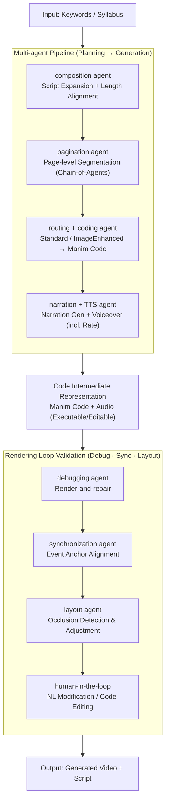

# TeachMaster: Generative Teaching via Code

**Conference**: ACL2026  
**arXiv**: [2601.04204](https://arxiv.org/abs/2601.04204)  
**Code**: None  
**Area**: Video Generation / Educational Agents / Multimodal Content Generation  
**Keywords**: Generative Teaching, Code Intermediate Representation, Multi-Agent, Manim, Educational Video Generation  

## TL;DR
TeachMaster proposes the Generative Teaching paradigm, using code as an interpretable intermediate representation for educational videos. It employs a collaboration of planning, code generation, narration, debugging, synchronization, and layout agents to generate complete course videos, achieving near-human quality while reducing the production cost of a 45-hour course to approximately 0.3% of traditional methods.

## Background & Motivation
**Background**: Online education facilitates large-scale course distribution, yet high-quality course content still relies on manual design, recording, editing, and iterative revisions. While video generation models can produce visuals directly from text, mainstream E2E (end-to-end) video generation excels more at short clips or visual fragments than at ensuring pedagogical structure, narrative logic, and editability.

**Limitations of Prior Work**: Educational videos differ from typical short videos. They require accurate scripts, hierarchical knowledge organization, synchronization between visuals and narration, and the step-by-step unfolding of key concepts, all while allowing for subsequent teacher modifications. Pixel-level generation models like Sora are black boxes with limited duration and difficult editing; agents mimicking human software operations involve high trajectory collection and training costs.

**Key Challenge**: Scalable educational content production requires automation, but educational quality demands structure, controllability, and traceable modifications. Pure video generation is highly automated but uncontrollable, whereas pure manual production is high-quality but expensive and slow to update.

**Goal**: The authors aim to transform teachers from manual producers into high-level directors. With only instructional intent or a course syllabus as input, a team of generative agents completes the script, pages, animations, voiceovers, debugging, and rendering, ultimately producing teachable, editable, and deployable video courses.

**Key Insight**: The paper argues that educational videos do not necessitate direct pixel-level generation. For explanatory, conceptual, and visualization-based courses, code itself serves as a superior intermediate representation: it expresses layout, animation, color, timelines, and object relationships, while remaining easy to debug, synchronize, and manually edit.

**Core Idea**: Connecting pedagogical semantics and video rendering via code. The "syllabus-to-video" process is decomposed into a three-stage multi-agent pipeline—content planning, presentation generation, and quality validation—turning educational video generation into an interpretable, editable, and verifiable procedural production process.

## Method
The crux of TeachMaster is not a single large model generating a video, but an engineering pipeline oriented towards course production. Inputs can be keywords or a syllabus, and outputs include the generated video $V_{out}$ and the lecture script $L_{out}$. The system first converts abstract instructional intent into page-level blueprints, then transforms these blueprints into executable Manim code and narrations, finally producing deliverable videos through debugging, synchronization, layout optimization, and human interfaces.

### Overall Architecture
The workflow is divided into three stages. The first stage is content planning: a composition agent expands raw input into a full script and aligns it with the target duration through length refinement; a pagination agent then segments the long script into page-level units, using Chain-of-Agents for long-text processing to split, paginate, and merge script fragments.

The second stage is presentation generation. Each page blueprint enters a routing agent, which decides whether to use standard code generation or an image-enhanced coding agent for photorealistic or complex image assets. Subsequently, a narration agent generates voiceover scripts based on the current page, the previous script, and the visual code, while a TTS agent converts these scripts into audio and estimates speech rates.

The third stage is quality validation. A debugging agent performs render-and-repair on generated code, fixing syntax or runtime errors based on error logs; a synchronization agent inserts wait-and-trigger logic based on audio rates and event anchors in the code; a layout agent detects occlusion and crowding to adjust geometric positions; finally, a human-in-the-loop interface allows for natural language modifications or direct code editing.

### Key Designs
**1. Code as an intermediate semantic medium for educational videos: Making generation results executable, inspectable, and editable.**

Educational content emphasizes accuracy and maintainability, but pixel-level generation like Sora is a black box—changing a formula’s position or adjusting animation rhythm requires regenerating the entire segment. TeachMaster does not directly generate final pixels; instead, it generates Python/Manim programs where visual objects, geometric relationships, colors, motion trajectories, waiting times, and text elements are all captured in code. Each rendered segment is then synthesized with narration audio into a complete video. This makes code an editable intermediate layer, allowing both teachers and the system to pinpoint problems and perform local modifications without re-rendering the whole video from scratch.

**2. Multi-agent task division from content planning to presentation generation: Aligning each step with a clear quality goal.**

Single-stream generation often fails to balance visual appeal, script completeness, and duration control. Course production naturally consists of scripting, paginating, illustrating, and narrating. TeachMaster assigns specialized agents: the composition agent performs semantic skeletonization, content expansion, and length refinement; the pagination agent handles page granularity; the routing agent selects modes; the coding agent generates visual code; the narration agent writes coherent voiceovers; and the TTS agent generates audio. By decomposing the course into these sub-tasks with clear boundaries, each module can optimize for its specific quality target.

**3. Debugging, synchronization, and layout validation in the rendering loop: Turning multimodal misalignment into executable code repairs.**

Failed instructional videos often suffer from "layout clashes" (subtitles blocking images), audio-visual desynchronization, or unrenderable code rather than "content errors." TeachMaster treats these as executable validations: the debugging agent repairs code via error stacks; the synchronization agent aligns event anchors with narration segments based on speech rate; the layout agent detects overlaps and finds optimal coordinates. Since the intermediate representation is code, these checks form an "execute-error-fix" loop, rather than requiring frame-by-frame manual review.

### Loss & Training
The paper presents a system framework rather than an end-to-end trained video model. The visual synthesis engine can switch: one calls the Gemini-3 API, and the other uses a local Qwen3-32B to generate high-fidelity Manim code. To enhance the code generation capabilities of Qwen3-32B, the authors constructed 3735 pairs of high-quality human-annotated data, categorized by difficulty and trained using curriculum learning.

The training configuration utilized 8 NVIDIA A800 40GB GPUs, with a LoRA rank of 128, LoRA alpha of 256, DeepSpeed ZeRO-3, and a learning rate of $1 \times 10^{-5}$. The TTS agent uses Minimax. The system supports asynchronous task queues for multi-user course generation.

## Key Experimental Results

### Main Results
Video quality and efficiency were compared across human-made videos, Sora 2, and TeachMaster (Gemini and Qwen versions). Quality metrics were scored by GPT-5.2 on a scale of 1 to 10, with preference validation by 3 human experts on 300 random videos (81.71% consistency).

| Method | Spatial Clarity | Visual Richness | Pedagogical Logic | Text-Video Consistency | Factual Accuracy | Overall Quality | Production Time (min) | Video Duration (min) | Prod/Video Ratio |
| :--- | :--- | :--- | :--- | :--- | :--- | :--- | :--- | :--- | :--- |
| Human | 8.22 | 7.31 | 8.38 | 8.29 | 9.24 | 8.29 | 795.00 | 32.50 | 24.46 |
| Sora 2 | 7.36 | 6.36 | 7.55 | 7.64 | 8.96 | 7.57 | 3.20 | 0.25 | 12.80 |
| TeachMaster-Gemini | 7.97 | 6.98 | 7.97 | 7.63 | 8.99 | 7.91 | 88.43 | 35.97 | 2.46 |
| TeachMaster-Qwen | 7.42 | 6.42 | 7.49 | 7.66 | 8.94 | 7.59 | 112.80 | 32.55 | 3.47 |

Script quality and cross-modal alignment scores highlight the value of the code-centric paradigm. TeachMaster-Gemini achieved 8.95 in overall script quality, slightly surpassing human scores (8.84). TeachMaster-Qwen scored 8.79 in overall cross-modal alignment, higher than humans (8.13) and Sora 2 (6.65).

### Ablation Study
While the paper lacks traditional module-deletion ablation, efficiency gains are demonstrated through deployment and feedback data.

| Dimension | Value / Observation | Meaning |
| :--- | :--- | :--- |
| Deployment Scale | Served >1000 educators, >30,000 mins content | The system is used in real-world multi-disciplinary settings. |
| Discipline Coverage | Over 40 disciplines | Code-centric representation generalizes to AI, Biology, Linguistics, etc. |
| Manual Intervention | >75.2% of pages require no human modification | The validation loop resolves most generation issues. |
| Edit Efficiency | Avg 1.88 interaction rounds to complete a page | The human-in-the-loop interface reduces post-editing costs. |
| 45h Course Cost | Approx. $83.70 | Roughly 0.3% of traditional online course production costs. |

### Key Findings
- TeachMaster's quality isn't just about being "longer than Sora 2." It is significantly more stable in script structure, cross-modal alignment, and pedagogical logic because content is organized into pages and code rather than generated as one-off clips.
- Sora 2's production time appears short, but it only generates 0.25-minute videos (Prod/Video ratio 12.80). TeachMaster-Gemini generates 35.97-minute content with a ratio of 2.46, making it suitable for course-level production.
- Human videos still hold the highest overall quality but at extreme time costs. TeachMaster's value lies in achieving quality slightly lower than or exceeding humans in specific metrics while cutting costs by over an order of magnitude.
- The Qwen version excels in cross-modal alignment, demonstrating that local code models, while visually less rich, can maintain better synchronization by explicitly binding code objects to narration.

## Highlights & Insights
- The most critical insight is that educational video generation does not need to be pixel-centric. For knowledge explanation, code is closer to "controllable semantics" than video frames and is more suitable for debugging, syncing, and manual editing.
- The system positions the teacher as a high-level director rather than a worker replaced by AI. Teachers maintain control over pedagogical goals and logic, while agents handle tedious implementation—a positioning more acceptable in educational settings.
- The multi-agent approach is not for "complexity's sake" but reflects actual course production stages: scripting, paginating, drawing, dubbing, pacing, and reviewing. Each stage has clear I/O, facilitating engineering.
- TeachMaster provides inspiration for scientific content generation. Paper walkthroughs, course visualizations, and lab demos can follow the "semantic blueprint -> code -> rendering -> synchronization" path without relying solely on black-box models.

## Limitations & Future Work
- Evaluation relies heavily on GPT-5.2 scoring and expert consistency check. While scalable, final educational effectiveness requires long-term metrics like learner performance and retention.
- The system is ideal for animations and conceptual visualization but may lag behind professional video models for real experiment footage, human lectures, or high-realism cinematic sequences.
- Qwen3-32B's code generation relies on 3735 pairs of human-annotated data; migrating to other animation frameworks or low-resource languages involves additional costs.
- Engineering metrics like agent failure rates or layout conflict resolution success rates are not detailed.

## Related Work & Insights
- **vs E2E Video Gen**: Models like Sora 2 generate pixels directly but are black boxes unsuitable for long courses. TeachMaster trades some visual realism for structural control and editability.
- **vs AI Slide Systems**: Traditional AI slide or tutoring systems often produce static content. TeachMaster generates scripts, animations, and synchronized video simultaneously.
- **vs SW-operation Agents**: Having agents mimic human editing software is action-space intensive. TeachMaster generates structured code, which is easier to debug.
- **vs Code2Video / Paper2Video**: TeachMaster extends these by placing code generation into a course-level multi-agent production line with real-world deployment data.

## Rating
- Novelty: ⭐⭐⭐⭐☆ (Systematic multi-agent flow for Generative Teaching is highly innovative.)
- Experimental Thoroughness: ⭐⭐⭐⭐☆ (Strong multi-dimensional evaluation and cost statistics; module-level ablation could be more granular.)
- Writing Quality: ⭐⭐⭐⭐☆ (Motivation is clear; system flow and data support the arguments.)
- Value: ⭐⭐⭐⭐⭐ (Significant practical value for educational content production and editable multimodal generation.)

<!-- RELATED:START -->

## Related Papers

- [\[ICLR 2026\] Arbitrary Generative Video Interpolation](../../ICLR2026/video_generation/arbitrary_generative_video_interpolation.md)
- [\[CVPR 2026\] PhysVid: Physics Aware Local Conditioning for Generative Video](../../CVPR2026/video_generation/physvid_physics_aware_local_conditioning_for_generative_video_models.md)
- [\[CVPR 2026\] Generative Neural Video Compression via Video Diffusion Prior](../../CVPR2026/video_generation/generative_neural_video_compression_via_video_diffusion_prior.md)
- [\[CVPR 2026\] LightMover: Generative Light Movement with Color and Intensity Controls](../../CVPR2026/video_generation/lightmover_generative_light_movement_with_color_and_intensity_controls.md)
- [\[CVPR 2026\] Generative Video Motion Editing with 3D Point Tracks](../../CVPR2026/video_generation/generative_video_motion_editing_with_3d_point_tracks.md)

<!-- RELATED:END -->
