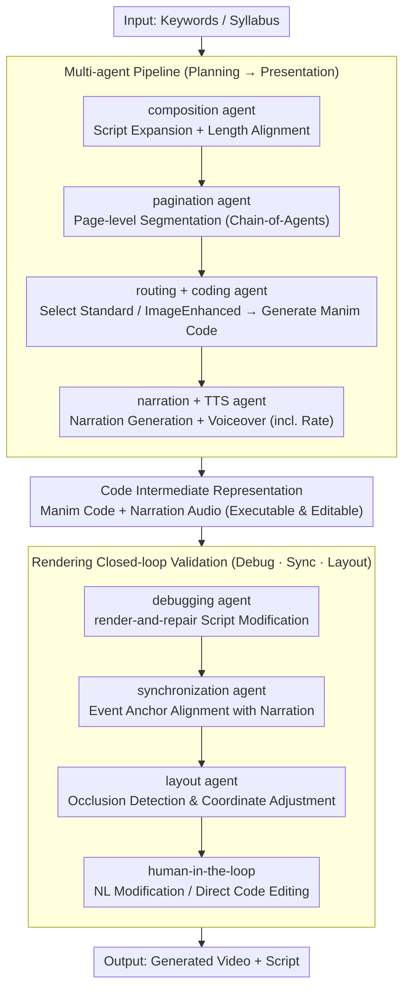

# TeachMaster: Generative Teaching via Code

**Conference**: ACL2026  
**arXiv**: [2601.04204](https://arxiv.org/abs/2601.04204)  
**Code**: None  
**Area**: Video Generation / Educational Agents / Multimodal Content Generation  
**Keywords**: Generative Teaching, Code Intermediate Representation, Multi-agent, Manim, Educational Video Generation

## TL;DR
TeachMaster proposes the Generative Teaching paradigm, using code as an interpretable intermediate representation for educational videos. It employs collaborating agents for planning, code generation, narration, debugging, synchronization, and layout to produce full-course videos, achieving near-human quality while reducing the production cost of a 45-hour course to approximately 0.3% of traditional methods.

## Background & Motivation
**Background**: While online education enables large-scale distribution, high-quality course content still relies on manual design, recording, editing, and iterative revisions. Although video generation models can produce visuals directly from text, mainstream E2E models excel at short clips rather than ensuring instructional structure, narrative logic, and editability.

**Limitations of Prior Work**: Educational videos differ from typical short videos. They require precise scripts, hierarchical knowledge organization, synchronization between visuals and narration, and the step-by-step unfolding of key concepts, all while remaining editable for teachers. Pixel-level models like Sora are black boxes with limited duration and difficult editing; agents that mimic software operations suffer from high trajectory data requirements and training costs.

**Key Challenge**: Scalable educational production requires automation, yet educational quality demands structure, controllability, and traceable modifications. Pure video generation is automated but uncontrollable, while manual production is high-quality but expensive and slow to update.

**Goal**: The authors aim to transform teachers from manual creators into high-level directors. By inputting only instructional intent or a course syllabus, a suite of generative agents completes the script, pages, animations, narration, debugging, and rendering to produce teachable, editable, and deployable video courses.

**Key Insight**: This paper argues that educational videos do not require direct pixel-level generation. For explanatory, conceptual, and visualization-based courses, code itself serves as a superior intermediate representation: it expresses layout, animation, color, timelines, and object relationships while being easy to debug, synchronize, and edit manually.

**Core Idea**: Use code to bridge instructional semantics and video rendering. The "syllabus-to-video" process is decomposed into a multi-agent pipeline of content planning, presentation generation, and quality validation, transforming educational video generation into an interpretable, editable, and verifiable procedural production process.

## Method
The essence of TeachMaster is not a single large model generating a video, but an engineering pipeline oriented towards course production. Given keywords or a syllabus, it outputs a generated video $V_{out}$ and a script $L_{out}$. The system converts abstract instructional intent into page-level blueprints, transforms these blueprints into executable Manim code and narration, and finally produces deliverable videos through debugging, synchronization, layout optimization, and human interfaces.

### Overall Architecture
The workflow involves three stages. The first stage is content planning: a composition agent expands raw input into a full script and aligns it with target durations through length refinement; a pagination agent then segments the long script into page-level units. Long text processing utilizes Chain-of-Agents to split scripts into segments before merging them.

The second stage is presentation generation. Each page blueprint enters a routing agent, which decides between standard code generation or an image-enhanced coding agent to include photo-realistic or complex image assets. Subsequently, a narration agent generates a script based on the current page, previous page content, and visual code, while a TTS agent converts narration into audio and estimates speech rate.

The third stage is quality validation. A debugging agent performs render-and-repair on the generated code, fixing syntax or runtime errors based on traceback logs. A synchronization agent inserts wait and trigger logic based on speech rates and event anchors in the code. A layout agent detects occlusion and crowding to adjust geometric coordinates. Finally, a human-in-the-loop interface allows for natural language modifications or direct code editing.

### Key Designs
**1. Code as Intermediate Semantic Medium: Making generations executable, inspectable, and editable.**

Educational content requires accuracy and maintainability, but pixel-level generation like Sora is a black box—moving a formula or adjusting animation pacing requires regenerating the entire clip. TeachMaster generates Python/Manim programs instead: visual objects, geometric relationships, colors, motion paths, wait times, and text elements are all captured in code. Each rendered segment and its corresponding audio are then synthesized into the final video. This allows both teachers and the system to precisely locate issues and perform local modifications, such as replacing an image or adjusting a timeline, without re-rendering everything from scratch.

**2. Multi-agent Division of Labor: Aligning each step with clear quality goals.**

Single-stream generation often fails to balance aesthetic appeal, script completeness, and duration control. Course production naturally consists of scripting, pagination, illustration, and voiceover. TeachMaster decouples these into specialized agents: the composition agent performs semantic skeletonization, content expansion, and length refinement; the pagination agent handles page-level segmentation; the routing agent selects modes; the coding agent generates visual code; the narration agent writes coherent scripts; and the TTS agent provides audio and timing data. By breaking the course into modular sub-tasks with clear inputs and outputs, coordination becomes a controllable process rather than a one-shot gamble.

**3. Debugging, Synchronization, and Layout Validation in a Rendering Loop: Converting multimodal errors into executable code fixes.**

Failures in instructional videos are often not about "content errors," but rather subtitles blocking diagrams, animations running faster than narration, or code failing to render. TeachMaster treats these as executable validation tasks. The debugging agent utilizes actual rendering error stacks to fix code, reverting to templates if retry thresholds are exceeded. The synchronization agent aligns event anchors in the code with semantic units in the narration based on speech rate. The layout agent detects overlaps and uses heuristic scanning to find optimal coordinates, writing them back to the code. This closed-loop "execute-error-fix" approach handles 75.2% of page issues without human intervention.

### Loss & Training
The paper presents a system framework rather than an end-to-end trained video model. The visual synthesis engine can switch between calling Gemini-3 API or using a local Qwen3-32B model to generate high-fidelity Manim code. To enhance Qwen3-32B's coding capabilities, the authors constructed 3735 pairs of high-quality human-annotated data, categorized by difficulty and trained via curriculum learning.

The training configuration utilized 8 NVIDIA A800 40GB GPUs, with LoRA rank 128, LoRA alpha 256, DeepSpeed ZeRO-3, and a learning rate of $1 \times 10^{-5}$. The TTS agent uses Minimax. The deployment supports asynchronous task queues for multi-user course generation.

## Key Experimental Results

### Main Results
Video quality and efficiency were compared across Human videos, Sora 2, and TeachMaster (Gemini and Qwen versions). Quality metrics were scored by GPT-5.2 on a 1-10 scale, validated by 3 human experts on 300 random videos with an 81.71% agreement rate.

| Method | Spatial Clarity | Visual Richness | Instructional Logic | Img-Text Consist. | Factual Acc. | Overall Quality | Production Time (min) | Video Duration (min) | Prod/Video Ratio |
| :--- | :--- | :--- | :--- | :--- | :--- | :--- | :--- | :--- | :--- |
| Human | 8.22 | 7.31 | 8.38 | 8.29 | 9.24 | 8.29 | 795.00 | 32.50 | 24.46 |
| Sora 2 | 7.36 | 6.36 | 7.55 | 7.64 | 8.96 | 7.57 | 3.20 | 0.25 | 12.80 |
| Ours-Gemini | 7.97 | 6.98 | 7.97 | 7.63 | 8.99 | 7.91 | 88.43 | 35.97 | 2.46 |
| Ours-Qwen | 7.42 | 6.42 | 7.49 | 7.66 | 8.94 | 7.59 | 112.80 | 32.55 | 3.47 |

Script quality and cross-modal alignment highlight the value of the code-centric paradigm. TeachMaster-Gemini achieved an overall script quality of 8.95 (slightly higher than Human 8.84), while TeachMaster-Qwen scored 8.79 in cross-modal alignment (higher than Human 8.13 and Sora 2 6.65).

| Method | Script Struct. | Narrative Coh. | Accuracy | Complet. | Consist. | Script Overall | Semantic Cov. | Ref. Accuracy | AV Symmetry | Align. Overall |
| :--- | :--- | :--- | :--- | :--- | :--- | :--- | :--- | :--- | :--- | :--- |
| Human | 8.90 | 9.11 | 9.05 | 8.32 | 8.84 | 8.84 | 8.17 | 7.94 | 8.28 | 8.13 |
| Sora 2 | 3.14 | 6.57 | 1.86 | 6.00 | 4.39 | 4.39 | 6.64 | 6.59 | 6.73 | 6.65 |
| Ours-Gemini | 8.89 | 9.00 | 9.67 | 8.22 | 8.95 | 8.95 | 8.63 | 8.11 | 8.57 | 8.44 |
| Ours-Qwen | 8.50 | 9.00 | 8.17 | 7.67 | 8.34 | 8.34 | 8.93 | 8.57 | 8.87 | 8.79 |

### Ablation Study
While a traditional ablation via module removal was not provided, the paper demonstrates efficiency gains through deployment and user feedback statistics.

| Dimension | Value / Observation | Meaning |
| :--- | :--- | :--- |
| Deployment Scale | Served >1000 educators, generated >30,000 mins | Not just a demo; used across multiple disciplines. |
| Subject Coverage | Over 40 disciplines | Code representation generalizes to AI, Biology, Linguistics, etc. |
| Human Intervention | >75.2% of pages need no intervention | Validation loops handle most generation issues. |
| Iteration Needs | Avg. 1.88 interaction rounds for fix | Human-in-the-loop reduces post-editing costs. |
| 45h Course Cost | Approx. $83.70 | Approx. 0.3% of traditional production costs. |

### Key Findings
- TeachMaster's quality is characterized by stability in script structure and instructional logic, outperforming Sora 2 for long-form content by organizing data into pages/code rather than short pixel clips.
- While Sora 2 has low absolute production time, its Prod/Video Ratio is 12.80 (for 0.25 min video); TeachMaster-Gemini reduces this ratio to 2.46 for 35.97 min videos, making it viable for course-level production.
- Human-made videos still lead in overall quality, but at extreme time costs. TeachMaster's value lies in achieving quality comparable to humans while reducing costs by orders of magnitude.
- The Qwen version leads in cross-modal alignment, suggesting that local code generation models, while slightly lower in visual richness, maintain better synchronicity by explicitly binding code objects to narration units.

## Highlights & Insights
- The most significant insight is that educational video generation does not need to be pixel-centric. For explanatory scenarios, code is much closer to "controllable semantics" and is better suited for debugging, synchronization, and manual editing.
- The system positions the teacher as a high-level director rather than a content laborer. Teachers retain control over instructional logic while agents handle tedious implementation—a setup more acceptable in educational settings.
- The multi-agent approach is not for complexity's sake but mirrors real-world production steps: scripting, pagination, drawing, narration, pacing, and review.
- This has implications for scientific content generation. Thesis explanation videos or experimental demos can follow the "semantic blueprint -> code -> render -> sync" path rather than relying on black-box video models.

## Limitations & Future Work
- Evaluation primarily relies on GPT-5.2 scoring and expert consistency; final educational impact requires long-term metrics such as learner performance and retention.
- While excellent for animations and conceptual visualization, the code-centric paradigm may struggle with real-world lab footage, human-centric teaching, or highly realistic cinematic shots.
- Qwen3-32B's code generation depends on 3735 human-annotated pairs and high compute; migrating to other animation frameworks or low-resource languages remains costly.
- Engineering metrics like agent failure rates or specific layout conflict resolution rates were not detailed, which would be beneficial for replication.

## Related Work & Insights
- **vs E2E Video Generation**: Sora 2 generates pixels directly but is a black box unsuitable for long courses. TeachMaster trades some visual realism for structural control and editability.
- **vs AI Slide Systems**: Traditional systems often generate static content or short silent clips. TeachMaster integrates script, animation, narration, and synchronized video into a complete course.
- **vs Software Agents**: Agents mimicking manual editing require vast trajectory data. TeachMaster generates structured code, offering a more constrained and debuggable action space.
- **vs Code2Video**: While prior work used code for specific diagrams, TeachMaster expands this into a multi-agent production line for full courses with real-world cost data.

## Rating
- Novelty: ⭐⭐⭐⭐☆ The code-centric approach is known, but the systematic "Generative Teaching" pipeline and deployment scale are highly innovative.
- Experimental Thoroughness: ⭐⭐⭐⭐☆ Includes multi-dimensional metrics, human consistency, and deployment stats, though modular ablations could be more detailed.
- Writing Quality: ⭐⭐⭐⭐☆ Clearly defines motivation and pipeline; data effectively supports the efficiency arguments.
- Value: ⭐⭐⭐⭐⭐ Highly valuable for educational production and editable multimodal generation, particularly for large-scale online learning.

<!-- RELATED:START -->

## Related Papers

- [\[CVPR 2026\] MoReGen: Multi-Agent Motion-Reasoning Engine for Code-based Text-to-Video Synthesis](../../CVPR2026/video_generation/moregen_multi-agent_motion-reasoning_engine_for_code-based_text-to-video_synthes.md)
- [\[ICLR 2026\] Arbitrary Generative Video Interpolation](../../ICLR2026/video_generation/arbitrary_generative_video_interpolation.md)
- [\[CVPR 2026\] PhysVid: Physics Aware Local Conditioning for Generative Video](../../CVPR2026/video_generation/physvid_physics_aware_local_conditioning_for_generative_video_models.md)
- [\[CVPR 2026\] Generative Neural Video Compression via Video Diffusion Prior](../../CVPR2026/video_generation/generative_neural_video_compression_via_video_diffusion_prior.md)
- [\[CVPR 2026\] LightMover: Generative Light Movement with Color and Intensity Controls](../../CVPR2026/video_generation/lightmover_generative_light_movement_with_color_and_intensity_controls.md)

<!-- RELATED:END -->
