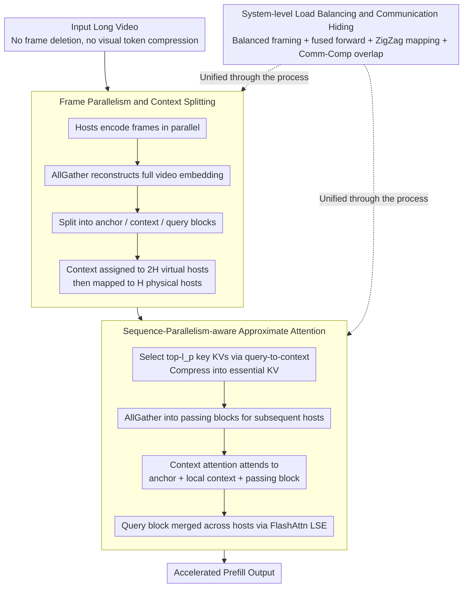

# APB-V: Accelerating Long-Video Understanding via Sequence-Parallelism-aware Approximate Attention

**Conference**: ACL2026  
**arXiv**: [2601.21444](https://arxiv.org/abs/2601.21444)  
**Code**: https://github.com/thunlp/APB  
**Area**: Video Understanding / Multimodal Inference Acceleration  
**Keywords**: Long-Video Understanding, Sequence Parallelism, Approximate Attention, Multi-GPU Inference, KV Compression  

## TL;DR
APB-V accelerates long-video LMM inference using sequence-parallelism-aware approximate attention and system-level load balancing. While retaining full visual embeddings, it achieves 12.72$\times$, 1.70$\times$, and 1.18$\times$ speedups relative to FlashAttn, ZigZagRing, and APB respectively under 64-frame 1440p settings, without significant performance loss.

## Background & Motivation
**Background**: Long-video understanding relies on LMMs to encode large numbers of frames into visual tokens, which are then fed into long-context LLM backbones. As video duration, resolution, and frame counts increase, costs for visual encoding, attention, and FFN during the prefill stage grow rapidly.

**Limitations of Prior Work**: Existing methods fall into two categories. One optimizes attention or KV cache, but typically only alleviates part of the LLM backbone burden and cannot handle visual encoding and FFN costs. The other explicitly compresses input tokens (e.g., token pruning or pooling), which reduces computation but risks losing fine-grained video evidence. The paper notes that SlowFast, while achieving less than 3$\times$ speedup, suffers an approximately 25% drop in accuracy.

**Key Challenge**: Long-video inference requires more computational resources to handle longer inputs without sacrificing critical frames and detailed evidence through crude compression. Single-GPU optimizations often fall into efficiency-performance trade-offs, while multi-GPU sequence parallelism encounters communication and load balancing bottlenecks.

**Goal**: APB-V aims to solve efficiency and performance simultaneously through "increased parallel computation + suppressed quadratic attention costs." It does not compress visual embeddings but instead performs approximate attention, communication compression, and system-level scheduling across multiple GPUs/hosts.

**Key Insight**: Long-video scenarios are naturally suited for parallelism: frame-level visual encoding is independent, and LLM input sequences can be split into blocks. However, precise sequence parallelism is communication-heavy. Therefore, each host should only exchange the specific key KVs truly required by subsequent queries.

**Core Idea**: Use local KV compression and passing blocks to approximate global attention. Only key context blocks are transferred between hosts. Multi-GPU performance for long-video inference is released via frame parallelism, ZigZag load balancing, fused forward, and communication-computation overlap.

## Method

### Overall Architecture
APB-V aims to accelerate the prefill of long-video LMMs without deleting a single frame or compressing any visual tokens. It assumes each host holds a full copy of the LMM. The input video is distributed by frame to each host for parallel encoding. After an AllGather to reconstruct the full video embedding, the input sequence is partitioned into an initial anchor block, a trailing query block, and intermediate context blocks. Context blocks are distributed to $2H$ virtual hosts and mapped back to $H$ physical hosts. In each attention layer, a host compresses only the key KVs from its local context that are most relevant to the query into a "passing block" to be sent to subsequent hosts. This significantly reduces the remote KV access for each query, and the saved communication time is overlapped with computation at the algorithmic and system levels.

### Key Designs

**1. Frame Parallelism and Context Splitting: Distributing Frame Encoding and Long-Sequence Prefill Across Hosts**

The bottleneck in long-video processing is that a single GPU must bear both visual encoding for all frames and prefill for all tokens. APB-V exploits the fact that "frame-level encoding is naturally independent," allowing each host to encode a subset of frames. An AllGather then merges the visual embeddings. The sequence is split into an initial anchor block $B_a$, a trailing query block $B_{qr}$, and context blocks $B^{(h)}$. The anchor provides global prefix information, the query is the actual question, and the context comprises the main video evidence. By chaining frame and sequence parallelism, no single card is burdened with the entire video.

**2. Sequence-Parallelism-aware Approximate Attention: Transferring Only Query-Essential KVs Across Hosts**

Precise sequence parallelism requires exchanging all KVs between hosts, which is too communication-intensive. StarAttn avoids inter-host communication entirely but loses long-range dependencies. APB-V takes a middle path: each virtual host uses query-to-context attention scores to select the $l_p$ most important KV pairs from the local context, compresses them into "essential KV," and distributes them as "passing blocks" via AllGather. Consequently, context block attention only considers the anchor, local context, and these compressed passing blocks. Query block results are merged across hosts using FlashAttn's LSE. By transferring only key KVs related to the current question, it maintains dependencies better than StarAttn while saving significant communication and computation compared to precise parallelism.

**3. System-level Load Balancing and Communication Hiding: Implementing Approximate Attention for High-Throughput Multi-GPU Systems**

Algorithmic approximation alone is insufficient—short query separate forwards become memory-bound, passing block lengths vary across hosts, and inter-host communication causes stalls. APB-V implements three optimizations: visual load balancing by assigning $F^{(h)}=\lfloor F/H\rfloor+\mathbb{I}[h<F\bmod H]$ frames to equalize host workloads; fused context-query forward to include short queries in context calculations to avoid memory-bound execution; ZigZag mapping to place the $h$-th and $(2H-1-h)$-th virtual hosts on the same physical host to cancel out unbalanced passing block lengths; and overlapped communication to run passing block transmission in parallel with attention computation.

### Loss & Training
APB-V is an inference acceleration framework and does not train new LMMs or introduce task losses. In experiments, the APB baseline's retaining heads are trained on NextQA, while APB-V itself relies on hyperparameter control of anchor length and passing length: default $l_a=n/64$ and $l_p=n/128$, maintaining computation levels similar to APB under 8 physical and $2H$ virtual hosts.

## Key Experimental Results

### Main Results
APB-V was tested on VNBench and LongVideoBench using InternVL3-2B, Qwen2.5VL-3B, and Qwen2.5VL-7B. Core figures demonstrating "no significant performance drop" are retained below.

| Dataset / Model | FullAttn | APB | APB-V | Conclusion |
|---------------|----------|-----|-------|------|
| VNBench / InternVL3-2B Overall | 44.89 | 41.11 | 43.26 | APB-V approaches FullAttn, significantly better than APB |
| VNBench / Qwen2.5VL-3B Overall | 52.81 | 43.93 | 50.67 | Retains most accuracy, far superior to token pruning methods |
| VNBench / Qwen2.5VL-7B Overall | 58.44 | 49.93 | 56.22 | Minimal performance loss on synthetic long-video tasks |
| LongVideoBench / InternVL3-2B Overall | 55.35 | 55.20 | 55.42 | APB-V slightly exceeds FullAttn |
| LongVideoBench / Qwen2.5VL-7B Overall | 58.38 | 59.16 | 59.76 | APB-V outperforms APB and FullAttn on real long videos |

Regarding speed, when Qwen2.5-VL-3B processes 64-frame 1440p video, APB-V achieves 12.72$\times$, 1.70$\times$, and 1.18$\times$ speedups relative to FlashAttn, ZigZagRing, and APB, respectively.

### Ablation Study
| Config | 16-frame req/s | 32-frame req/s | 56-frame req/s | Note |
|------|------------|------------|------------|------|
| APB-V | 1.846 | 0.916 | 0.471 | Full system is fastest |
| -O | 1.827 | 0.911 | 0.470 | Removing comm-comp overlap has minor impact |
| -O-F | 1.646 | 0.854 | 0.450 | Removing fused forward decreases speed |
| -O-F-Z | 1.618 | 0.813 | 0.415 | Removing ZigZag increases load imbalance |
| -O-F-Z-V | 0.381 | 0.189 | 0.107 | Removing all system optimizations is ~4$\times$ slower |
| FlashAttn | 0.226 | 0.092 | 0.042 | Single GPU exact attention is slowest |

### Key Findings
- On synthetic long-video tasks, token pruning methods (e.g., SlowFast) significantly damage fine-grained capabilities like retrieval/counting; APB-V avoids this by retaining full visual embeddings.
- On real long videos, APB-V achieves an Overall of 59.76 on Qwen2.5VL-7B, higher than FullAttn (58.38) and APB (59.16), suggesting approximate attention might offer better trade-offs through system settings and embedding preservation.
- Passing blocks are more critical than anchor blocks: in counting tasks, removing passing blocks dropped average accuracy from 30.00 to 17.33, while removing anchors only dropped it to 25.33.
- Multi-host scalability is strong: at $H=8$, APB-V reaches 6.171/2.013 req/s on 720p 16/56-frame settings, outperforming ZigZagRing (5.595/1.666) and APB (4.891/1.766).

## Highlights & Insights
- Instead of "seeing less video," the paper retains visual tokens and performs approximation at the attention computation layer. This is vital for long-video QA, where answers often hide in short segments of subtitles, actions, or objects.
- APB-V addresses algorithmic and system challenges in tandem: it solves memory-bound issues for short query forwards, load imbalance for passing blocks, and communication wait times.
- Case studies show that regions containing the "secret word is Nick" are more frequently selected for passing blocks, indicating that query-aware KV selection successfully propagates relevant evidence.

## Limitations & Future Work
- APB-V is primarily designed for decoder-only Transformer-based LMMs; it is incompatible with convolutional or non-standard architectures.
- The method relies on multi-GPU inference and degrades to FlashAttn on a single GPU, making it unsuitable for resource-constrained deployment.
- The paper focuses on applications where TTFT/end-to-end prefill time is limited (e.g., surveillance, autonomous driving); further analysis is needed for gains in multi-round interaction or decoding stages.
- Passing length and anchor length remain hyperparameters requiring tuning. Experiments indicate that undersized passing lengths significantly degrade performance.

## Related Work & Insights
- **vs FlashAttn / ZigZagRing**: FlashAttn is single-GPU exact; ZigZagRing is precise sequence parallelism. APB-V trades precision for superior scalability via approximation and compression.
- **vs SlowFast / Token Pruning**: SlowFast accelerates via token reduction but loses fine-grained evidence; APB-V preserves input embeddings for precise retrieval.
- **vs StarAttn**: StarAttn avoids inter-host communication but lacks long-range dependencies; APB-V uses compressed communication to allow key KVs to flow across hosts.
- **Key Insight**: The core of long-context multimodal inference is not simply reducing tokens, but allowing "remote evidence relevant to the query" to flow across devices at low cost.

## Rating
- Novelty: ⭐⭐⭐⭐ Combining approximate attention with sequence parallelism is not entirely new, but the system design tailored for long-video LMMs is solid.
- Experimental Thoroughness: ⭐⭐⭐⭐⭐ Covers two long-video benchmarks, three LMMs, multiple resolutions/frames/hosts, and extensive ablations.
- Writing Quality: ⭐⭐⭐⭐ Architecture and system diagrams are clear; math notation is dense but supported by visuals.
- Value: ⭐⭐⭐⭐⭐ Highly practical for multi-GPU long-video LMM deployment, especially for accelerating TTFT in high-resolution, long-frame sequences.

<!-- RELATED:START -->

## Related Papers

- [\[CVPR 2026\] VecAttention: Vector-wise Sparse Attention for Accelerating Long Context Inference](../../CVPR2026/video_understanding/vecattention_vector-wise_sparse_attention_for_accelerating_long_context_inferenc.md)
- [\[CVPR 2026\] Seeing the Scene Matters: Revealing Forgetting in Video Understanding Models with a Scene-Aware Long-Video Benchmark](../../CVPR2026/video_understanding/seeing_the_scene_matters_revealing_forgetting_in_video_understanding_models_with.md)
- [\[CVPR 2026\] Video Panels for Long Video Understanding](../../CVPR2026/video_understanding/video_panels_for_long_video_understanding.md)
- [\[CVPR 2025\] SEAL: SEmantic Attention Learning for Long Video Representation](../../CVPR2025/video_understanding/seal_semantic_attention_learning_for_long_video_representation.md)
- [\[ICLR 2026\] VideoNSA: Native Sparse Attention Scales Video Understanding](../../ICLR2026/video_understanding/videonsa_native_sparse_attention_scales_video_understanding.md)

<!-- RELATED:END -->
