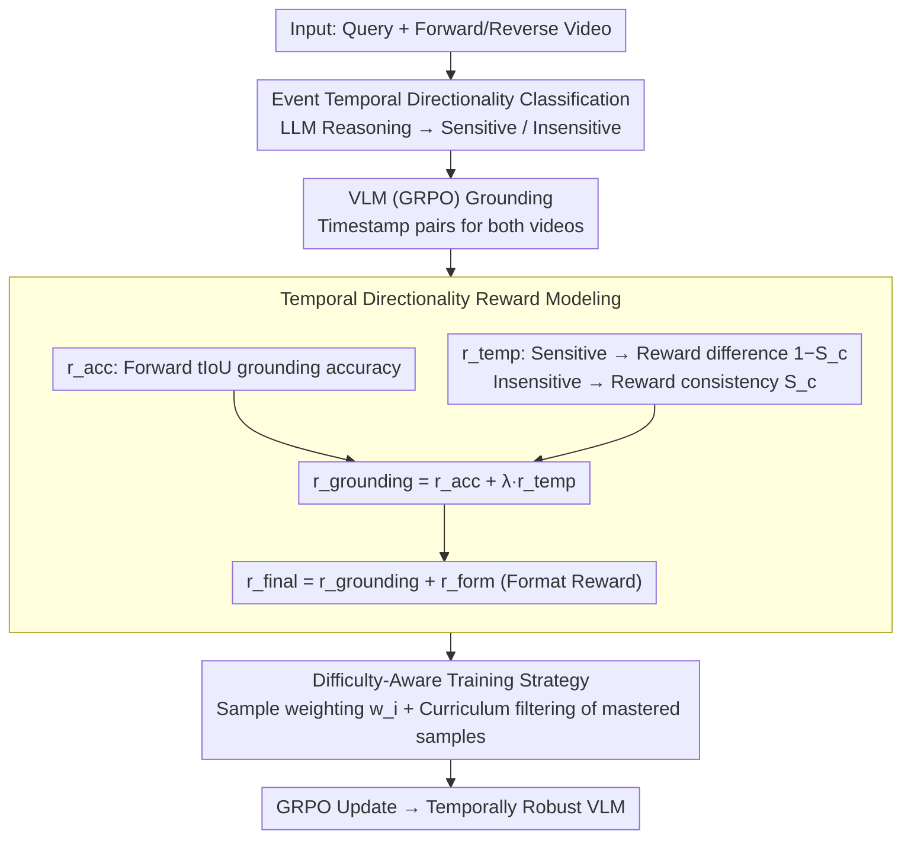

# ArrowGEV: Grounding Events in Video via Learning the Arrow of Time

**Conference**: ACL 2026 Findings  
**arXiv**: [2601.06559](https://arxiv.org/abs/2601.06559)  
**Code**: [Yes](https://arxiv.org/abs/2601.06559) (Code / Model / Data are all public)  
**Area**: Video Understanding  
**Keywords**: Grounding Events in Video, Temporal directionality, Reinforcement Learning, Vision-Language Models, Temporal understanding

## TL;DR

Proposes ArrowGEV, a reinforcement learning framework inspired by the physics concept "Arrow of Time," which models temporal directionality in videos by distinguishing between time-sensitive and time-insensitive events, enhancing the grounding accuracy and temporal understanding of VLMs.

## Background & Motivation

**Background**: Grounding Events in Video (GEV) is a fundamental task in video analysis. Recently, Vision-Language Models (VLMs) have become mainstream through end-to-end reasoning, utilizing large-scale timestamp annotation training, temporal token embeddings, or video segment adaptation for event localization.

**Limitations of Prior Work**: Existing methods only align events with timestamps in forward-moving videos, ignoring the intrinsic temporal structure and directionality of events. Experiments show that VLMs fail to distinguish semantic changes between forward and reversed videos—for example, "picking up a cup" becomes "putting down a cup" when reversed, yet models still incorrectly localize the original event in the reversed video.

**Key Challenge**: VLMs overfit to textual timestamps rather than video semantics, lacking an understanding of event temporal directionality, which leads to insufficient generalization in tasks requiring temporal reasoning.

**Goal**: Enhance VLM grounding accuracy and temporal structure understanding by explicitly modeling temporal directionality.

**Key Insight**: Drawing from the "Arrow of Time" in physics, events are categorized into time-sensitive (semantic changes upon reversal) and time-insensitive (invariant upon reversal), allowing for the design of differentiated reward signals.

**Core Idea**: Use reversed videos as additional training signals—penalizing grounding for time-sensitive events in reversed videos, while enforcing consistency for time-insensitive events.

## Method

### Overall Architecture

ArrowGEV transforms "temporal directionality" into a reinforcement learning reward signal. Based on the GRPO framework, each sample is fed with both forward and reversed videos. The system first determines the temporal structure category of the event and then calculates differentiated rewards for the grounding results of both directions. After training, the VLM not only aligns timestamps in forward videos but also learns whether an event remains valid when reversed, making it more robust to temporal sequences.

### Key Designs

**1. Event Temporal Directionality Classification: Identifying semantic changes upon reversal**

Existing VLMs only align timestamps in forward videos and fail to distinguish whether reversal changes the event semantics. ArrowGEV uses LLM reasoning to assign a category label $c(q)\in\{\text{sensitive},\text{insensitive}\}$ to each query. For instance, "opening a door" is time-sensitive (reversal makes it "closing a door"), while "a ball is on the table" is time-insensitive (true in both forward and backward play). This classification is the prerequisite for differentiated rewards.

**2. Temporal Directionality Reward Modeling: Integrating grounding accuracy and directionality**

To address the issue of VLMs overfitting to timestamps, ArrowGEV designs a unified reward $r_{\text{grounding}}=r_{\text{acc}}+\lambda\cdot r_{\text{temp}}$. Here, $r_{\text{acc}}$ measures forward grounding accuracy using tIoU, while $r_{\text{temp}}$ encodes directionality: rewarding consistency ($S_c$) for time-insensitive events and rewarding divergence ($1-S_c$) for time-sensitive events. Consequently, the model is forced to observe semantic changes in the video rather than memorizing timestamps—"opening a door" should not be found in a reversed video, while "ball on table" should match in both.

**3. Difficulty-Aware Training Strategy: Dynamically maintaining learning signals**

As RL training progresses, samples become easier, weakening the gradient signal. ArrowGEV maintains difficulty through two methods: first, sample weighting $w_i=\exp((1-\text{avg\_tIoU})/\tau)$ to focus on unlearned difficult samples; second, dynamic curriculum filtering, where mastered samples (worst IoU $>\eta=0.7$) are removed from the training set at the end of each epoch. Together, they ensure the model focuses on informative samples throughout training.

### Loss & Training

The final reward adds a format reward to the grounding reward: $r_{\text{final}}=r_{\text{grounding}}+r_{\text{form}}(o)$, where $r_{\text{form}}$ requires the output to follow the `<think>...</think><answer>$t_s$ to $t_e$</answer>` template. The backbone is Qwen2.5-VL-7B-Instruct, with videos sampled at 2 FPS.

## Key Experimental Results

### Main Results

| Method | Charades-STA R1@0.5 | ActivityNet R1@0.5 | TVGBench R1@0.5 |
|------|-------------------|-------------------|-----------------|
| Gemini-2.5-Pro | 25.5 | 31.9 | 25.7 |
| GPT-5 | 18.3 | 33.0 | 18.8 |
| TimeSuite* | 67.1 | - | - |
| ArrowGEV (Ours) | **Significant Gain** | **Significant Gain** | **Significant Gain** |

### TDD Metric (Temporal Directionality Understanding)

The Temporal Directionality Discrepancy (TDD) metric is introduced: $\text{TDD}(m) = \frac{R1@m(\text{fwd}) - R1@m(\text{rev})}{R1@m(\text{fwd})}$. For time-sensitive events, TDD should approach 1 (able to distinguish directions); for time-insensitive events, TDD should approach 0 (consistent results).

### Key Findings

- ArrowGEV significantly improves grounding accuracy across three GEV benchmarks.
- Substantial improvement in VLM temporal directionality understanding (TDD metric).
- Performance gains extend to OOD general video understanding and reasoning tasks (TempCompass, MVBench, VideoMME, etc.).
- Time-sensitive events constitute a significant portion of common benchmarks, particularly in Charades-STA.

## Highlights & Insights

- The "Arrow of Time" concept from physics is introduced to video understanding, providing a novel and intuitive perspective.
- Utilizes reversed videos as "free" training signals without requiring additional annotations.
- Proposes the TDD metric, providing the first quantitative evaluation of a model's understanding of event temporal directionality.
- Difficulty-aware training strategies (weight adjustment + curriculum filtering) effectively maintain learning efficiency.

## Limitations & Future Work

- Event classification relies on LLM reasoning, which may introduce classification noise.
- Validated only on 7B models; the effectiveness on larger models remains to be explored.
- The 2 FPS sampling rate may be insufficient to capture extremely rapid events.
- Future work could explore more fine-grained temporal directionality modeling.

## Related Work & Insights

- GRPO / DeepSeek-R1: Foundations for the RL training paradigm.
- TimeSuite / ChatVTG: Supervised learning methods for the GEV task.
- Self-supervised learning related to temporal directionality (shuffle-and-learn, order prediction).
- Treating temporal directionality as a fundamental inductive bias for video understanding is a promising direction.

## Rating

- Novelty: ⭐⭐⭐⭐⭐ Unique perspective using physics-inspired temporal directionality modeling.
- Experimental Thoroughness: ⭐⭐⭐⭐ Three GEV benchmarks + six general benchmarks, comprehensive ablation.
- Writing Quality: ⭐⭐⭐⭐ Clear motivation and persuasive pilot study.
- Value: ⭐⭐⭐⭐ Reveals defects in VLM temporal directionality understanding and provides an effective solution.

<!-- RELATED:START -->

## Related Papers

- [\[NeurIPS 2025\] Seeing the Arrow of Time in Large Multimodal Models](../../NeurIPS2025/video_understanding/seeing_the_arrow_of_time_in_large_multimodal_models.md)
- [\[AAAI 2026\] Learning Time in Static Classifiers](../../AAAI2026/video_understanding/learning_time_in_static_classifiers.md)
- [\[CVPR 2026\] Video-CoE: Reinforcing Video Event Prediction via Chain of Events](../../CVPR2026/video_understanding/video-coe_reinforcing_video_event_prediction_via_chain_of_events.md)
- [\[CVPR 2025\] Localizing Events in Videos with Multimodal Queries](../../CVPR2025/video_understanding/localizing_events_in_videos_with_multimodal_queries.md)
- [\[CVPR 2026\] Learning to Refuse: Refusal-Aware Reinforcement Fine-Tuning for Hard-Irrelevant Queries in Video Temporal Grounding](../../CVPR2026/video_understanding/learning_to_refuse_refusal-aware_reinforcement_fine-tuning_for_hard-irrelevant_q.md)

<!-- RELATED:END -->
