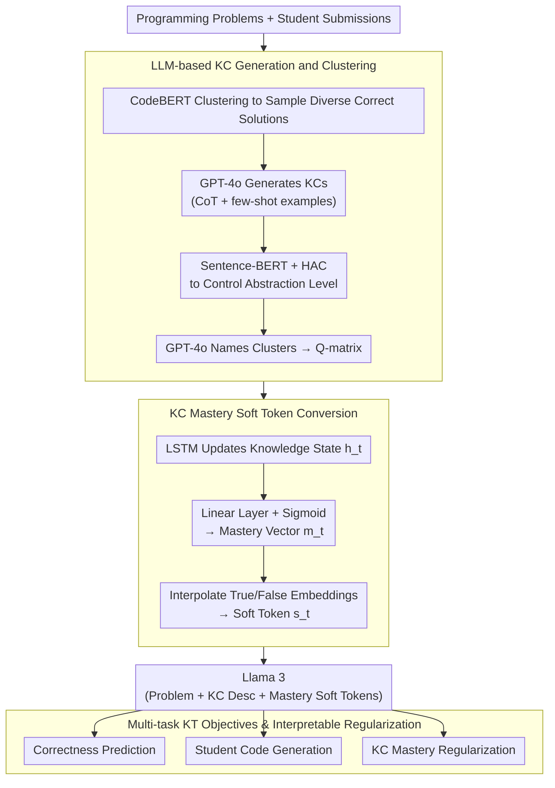

# Automated Knowledge Component Generation and Interpretable Knowledge Tracing in Coding Problems

**Conference**: ACL2026 Findings  
**arXiv**: [2502.18632](https://arxiv.org/abs/2502.18632)  
**Code**: https://github.com/umass-ml4ed/kcgen-kt  
**Area**: AI in Education / Knowledge Tracing  
**Keywords**: Knowledge Component, Knowledge Tracing, Programming Education, LLM, Interpretable Student Modeling  

## TL;DR
This paper utilizes LLMs to automatically generate and cluster Knowledge Components (KCs) for open-ended programming problems. It proposes KCGen-KT, which converts student mastery levels for each KC into soft tokens for Llama 3 input, improving both correctness prediction and student code generation on CodeWorkout and FalconCode.

## Background & Motivation
**Background**: Knowledge Tracing (KT) requires estimating students' mastery of fine-grained knowledge points, often relying on Knowledge Components (KCs) as skill labels. Traditional KCs are typically authored by instructors or experts and manually mapped to problems.

**Limitations of Prior Work**: Manual KC design is costly and prone to bias, and open-ended programming problems are significantly harder to label than multiple-choice questions. A single programming problem may have multiple correct solutions involving different skills; student errors are also diverse, making it impossible to rely on fixed options.

**Key Challenge**: KT models require fine-grained, interpretable, and transferable KCs; however, finer granularity increases the cost of manual design and labeling. Existing automated KC generation focuses mostly on multiple-choice questions, providing insufficient support for open-ended student code submissions.

**Goal**: The authors aim to use LLMs to automatically generate KCs required for programming problems and allow these natural language KC descriptions to directly assist KT models in predicting future correctness and code submissions while maintaining explanations for weak student mastery.

**Key Insight**: The paper connects KC generation and KT modeling into a closed loop: it first uses real correct student code to help the LLM identify skills, then uses those skill descriptions and student mastery as part of the LLM input to predict the next submission.

**Core Idea**: Generate readable KCs using LLMs, control abstraction levels via clustering, and project each student's mastery level into differentiable soft text tokens. This allows LLM-based KT to acquire both semantic knowledge and interpretable student states.

## Method

### Overall Architecture
The method consists of two parts forming a closed loop. The first part is an automated KC generation and labeling pipeline: diverse correct student submissions are sampled for each problem, GPT-4o generates necessary KCs via prompts, Sentence-BERT embeddings and Hierarchical Agglomerative Clustering (HAC) merge similar KCs, and finally, GPT-4o names each cluster and maps problems to clusters to generate a Q-matrix. The second part is the KCGen-KT model: it maintains a "mastery vector" for each student across all KCs, converts mastery values into soft tokens, and feeds them into Llama 3 along with the next problem description and KC metadata to predict "correctness" and "likely student code."

### Key Designs

**1. LLM-based KC Generation and Clustering: Extracting Readable KCs with Controllable Granularity**

Open-ended programming problems cannot be labeled like multiple-choice questions—multiple correct approaches exist, and looking only at the prompt or a single solution misses necessary skills. Letting an LLM generate KCs freely often results in overly fine-grained, repetitive, or non-generalizable KCs. This work first clusters correct student code using CodeBERT embeddings and samples representative solutions from different clusters (using them as few-shot examples). GPT-4o then generates KCs using Chain-of-Thought based on the problem and these diverse solutions. Finally, Sentence-BERT vectorizes the KC descriptions, HAC merges similar skills, and GPT-4o names the clusters and maps problems to tags to form the Q-matrix. Clustering serves to control the layer of abstraction, converging scattered skills into a stable, reusable KC set.

**2. KC Mastery Soft Token Conversion: Connecting Continuous Mastery to LLM Text Space**

LLMs excel at reading text descriptions, but student "mastery" of a KC is a continuous value that cannot be input as a standard token. The model uses an LSTM to update a 512-dimensional knowledge state $h_t$, producing a $k$-dimensional mastery vector $m_t\in[0,1]^k$ via a linear layer and sigmoid. For the $j$-th KC, mastery is interpolated into a soft token $s_t^j=m_t^j\cdot emb^{true}+(1-m_t^j)\cdot emb^{false}$. This soft token preserves continuous "how much mastered" information and remains differentiable, allowing mastery states to merge end-to-end into the LLM representation space without information loss from discretization.

**3. Multi-task KT Objectives and Interpretable Regularization: Balancing Accuracy and Profiling**

Optimizing solely for prediction accuracy might lead to uninterpretable hidden states. KCGen-KT adopts three objectives: correctness prediction via a sigmoid classifier on Llama 3 hidden states, token-by-token student code generation, and a KC regularization term. This term predicts correctness using the average of relevant KC mastery levels, enforcing a "high mastery ↔ high correctness probability" constraint. The total loss is $\mathcal{L}_{KCGen-KT}=\lambda(\mathcal{L}_{CodeGen}+\mathcal{L}_{CorrPred})+(1-\lambda)\mathcal{L}_{KC}$. This KC loss is the key to interpretability: it forces the mastery vector to correspond to educational meaning (identifying weak skills) rather than devolving into black-box numbers.

### Loss & Training
The training target consists of three parts: BCE loss for correctness prediction, token-level negative log-likelihood for code generation, and a BCE regularization between KC mastery and correctness. The model is based on instruction-tuned Llama 3 8B, fine-tuned using LoRA with 8-bit quantization. In KCGen-KT, the learning rates are 1e-5 for Llama 3, 5e-4 for LSTM, and 1e-4 for the mastery linear layer. Experiments were repeated across 5 random train-validation-test splits.

## Key Experimental Results

### Main Results
Two datasets involving real open-ended programming submissions were used: CodeWorkout (246 students, 50 Java problems, 10,834 first submissions) and FalconCode (3,267 students, 157 Python problems, 28,617 first submissions).

| Dataset | Method | AUC | F1 | Accuracy | CodeBLEU |
|--------|------|-----|----|----------|----------|
| CodeWorkout | Code-DKT | 0.766 | 0.672 | 0.724 | - |
| CodeWorkout | TIKTOC* | 0.788 | 0.666 | 0.726 | 0.507 |
| CodeWorkout | Ours (Human KCs) | 0.797 | 0.706 | 0.727 | 0.557 |
| CodeWorkout | Ours (Generated KCs) | 0.816 | 0.727 | 0.746 | 0.580 |
| FalconCode | Code-DKT | 0.709 | 0.552 | 0.617 | - |
| FalconCode | TIKTOC* | 0.728 | 0.585 | 0.633 | 0.427 |
| FalconCode | Ours (Human KCs) | 0.752 | 0.599 | 0.700 | 0.473 |
| FalconCode | Ours (Generated KCs) | 0.771 | 0.645 | 0.712 | 0.498 |

LLM-generated KCs outperformed human KCs in both datasets across correctness prediction and code generation tasks, with statistically significant gains (p < 0.05).

### Ablation Study
| Configuration | AUC | F1 | Accuracy | CodeBLEU | Notes |
|------|-----|----|----------|----------|------|
| KCGen-KT | 0.812 | 0.723 | 0.724 | 0.569 | CodeWorkout Baseline |
| w/o Correct Sol. | 0.789 | 0.674 | 0.704 | 0.529 | Incomplete KCs without correct student solutions |
| w/ Incorrect Sol. | 0.773 | 0.651 | 0.700 | 0.516 | Adding incorrect solutions introduces noise |
| w/o KC Loss | 0.791 | 0.680 | 0.709 | 0.540 | Interpretable mastery regularization contributes |
| w/o ICL Ex. | 0.782 | 0.677 | 0.705 | 0.539 | KCs become too abstract without examples |
| Code → AST | 0.784 | 0.691 | 0.715 | 0.546 | AST is less effective than raw code text |
| Generated Code | 0.807 | 0.706 | 0.721 | 0.557 | LLM solutions lack diversity of real student code |

### Key Findings
- KC abstraction levels must be balanced. In CodeWorkout, 50 medium-granularity clusters achieved 0.816 AUC, while compressing to 10 high-level KCs dropped performance to 0.794 AUC.
- Real correct student submissions are vital. Removing them or using LLM-generated code reduced KC coverage, as real solutions contain richer strategic diversity.
- Human evaluation supported the quality of generated KCs: readability/interpretability was 98.6% for LLM-generated vs 94.6% for baseline; mapping precision was 93.2% vs 92.5%.
- Learning curve analysis showed LLM-generated KCs better fit the power law of practice: weighted $R^2$ was 0.21, higher than 0.18 for human-written KCs.

## Highlights & Insights
- The key of this paper is not just "labeling with LLMs," but turning labels into semantic inputs usable by downstream KT models, maintained via end-to-end trainable soft tokens.
- Sampling diverse correct code is a clever design. The skill set for open-ended problems is defined not just by the prompt but by the feasible solution space; student code exposes this space better than a single "gold" answer.
- The fact that generated KCs outperformed human KCs is remarkable: human labels may be too coarse or use outdated systems, whereas LLMs can generate more natural, function-level skill descriptions better suited for LLM-based KT.

## Limitations & Future Work
- KC generation depends on in-context examples; without human examples, zero-shot generation tends toward abstraction, missing low-level skills.
- There is a lack of reliable ground-truth labeling for multi-KC problems, so KC correctness labeling still requires further verification.
- Experiments were restricted to CS education (Java/Python); generalization to math, science, or conversational tutoring requires validation.
- While human evaluation proved interpretability and mapping quality, the ultimate value depends on improving learning outcomes, which needs classroom deployment/AB testing.

## Related Work & Insights
- **vs Code-DKT**: Code-DKT uses student code content for KT but lacks natural language KC semantics and explicit mastery explanations; KCGen-KT utilizes code, problems, and KC descriptions simultaneously.
- **vs TIKTOC**: TIKTOC uses Llama 3 for generative KT but does not explicitly model KC mastery; KCGen-KT’s advantage stems from KC semantics and the KC loss.
- **vs Manual KC Labeling**: Manual labels are costly and may not fit the granularity required by downstream models; LLM-generated KCs performed better in both prediction and interpretability assessments here.
- **Insight**: LLMs in educational contexts should not just be answer generators but "knowledge structure generators" that help build interpretable student models.

## Rating
- Novelty: ⭐⭐⭐⭐ Automated KC generation exists, but integration with soft-token LLM KT is novel.
- Experimental Thoroughness: ⭐⭐⭐⭐⭐ Solid analysis across two real datasets, strong baselines, abstraction levels, ablation, human eval, and learning curves.
- Writing Quality: ⭐⭐⭐⭐ Clear methodological chain; educational motivation and model details are well-explained.
- Value: ⭐⭐⭐⭐⭐ Significant practical value for programming education, intelligent tutoring, and interpretable knowledge tracing.

<!-- RELATED:START -->

## Related Papers

- [\[AAAI 2026\] SUGAR: Learning Skeleton Representation with Visual-Motion Knowledge for Action Recognition](../../AAAI2026/video_understanding/sugar_learning_skeleton_representation_with_visual-motion_knowledge_for_action_r.md)
- [\[CVPR 2025\] Seq2Time: Sequential Knowledge Transfer for Video LLM Temporal Grounding](../../CVPR2025/video_understanding/seq2time_sequential_knowledge_transfer_for_video_llm_temporal_grounding.md)
- [\[CVPR 2026\] Towards Spatio-Temporal World Scene Graph Generation from Monocular Videos](../../CVPR2026/video_understanding/towards_spatio-temporal_world_scene_graph_generation_from_monocular_videos.md)
- [\[CVPR 2026\] RAGTrack: Language-aware RGBT Tracking with Retrieval-Augmented Generation](../../CVPR2026/video_understanding/ragtrack_language-aware_rgbt_tracking_with_retrieval-augmented_generation.md)
- [\[CVPR 2026\] Hear What Matters! Text-conditioned Selective Video-to-Audio Generation](../../CVPR2026/video_understanding/hear_what_matters_text-conditioned_selective_video-to-audio_generation.md)

<!-- RELATED:END -->
