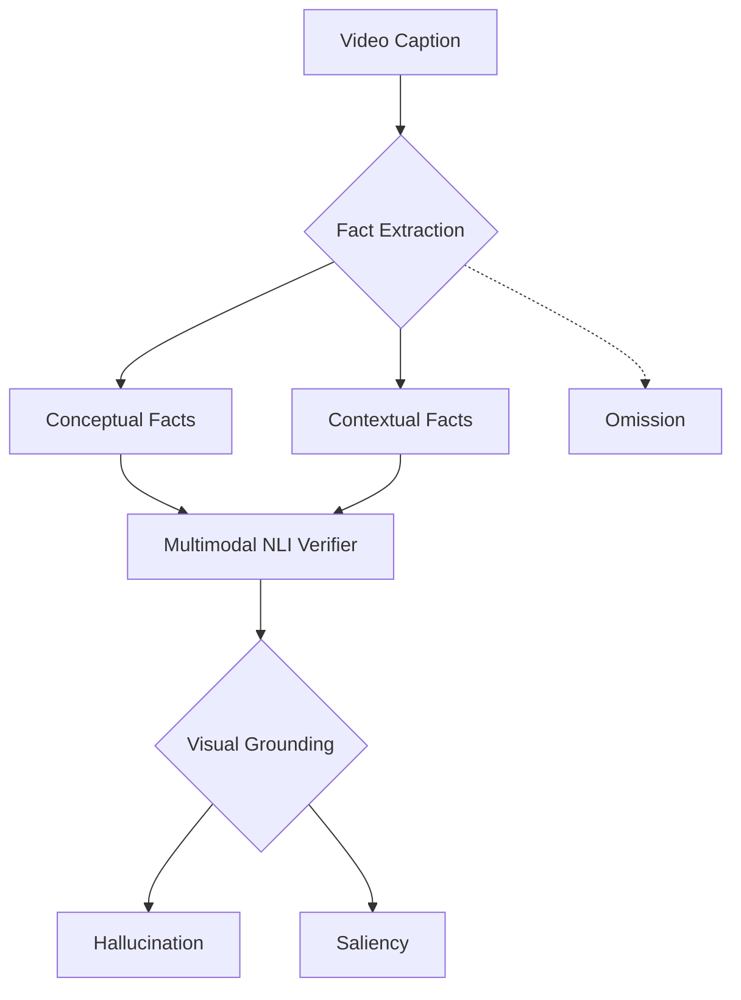

# DualFact: A Multimodal Fact Verification Framework for Procedural Video Understanding

**Conference**: ACL 2026  
**arXiv**: [2604.25584](https://arxiv.org/abs/2604.25584)  
**Code**: https://github.com/OguzCennet/DualFact (Available)  
**Area**: Video Understanding / Fact Verification / Evaluation  
**Keywords**: Procedural Video Captioning, Dual-Layer Facts, Implicit Argument Completion, Multimodal NLI, Hallucination/Saliency/Omission

## TL;DR
The authors decompose the factual evaluation of procedural video captions (e.g., cooking, furniture making) into **dual-layer facts**: conceptual facts (abstract roles like Action/Ingredient/Tool/Location) and contextual facts (observable predicate–argument relations in video, e.g., stir(soup, pot)). They construct two benchmarks, YouCook3-Fact and CraftBench-Fact, which annotate Video-Implicit Arguments (VIA) and contrastive facts. They propose MultiFactScore, which uses multimodal/textual NLI to verify facts at the role level, further subdividing errors into Hallucination, Saliency, and Omission. Experiments reveal that SOTA MLLM captions are "fluent but factually incomplete"; evaluating captions in isolation overestimates Hallucinations by approximately half, and only video-grounded evaluation can distinguish between saliency and true hallucination.

## Background & Motivation

**Background**: Evaluation of procedural video captioning (cooking, woodworking, furniture assembly) primarily relies on two types of metrics: **lexical** (BLEU / ROUGE / METEOR / SPICE) and **vision–language** (CLIPScore / EMScore / PACScore / UniEval). A few fact-based evaluations (FaithScore / CapMAS / FactVC / FIFA) perform "atomic proposition extraction + verification."

**Limitations of Prior Work**: (i) Lexical metrics only measure surface overlap—"add salt to bowl" vs. "add salt to pot" yields a high BLEU but incorrect roles; (ii) embedding metrics look at global similarity and fail to capture predicate–argument structures; (iii) existing fact-based evaluations flatten facts into untyped propositions, failing to distinguish "missing ingredient" vs. "missing tool" vs. "swapped action roles," and cannot handle "implicit arguments" (e.g., the "it" in "stir it" is visible but unstated) unique to procedural videos.

**Key Challenge**: The "facts" of procedural videos are inherently **dual-layered**: one layer involves abstract task semantics (what step is being done, what roles are needed), and the other involves grounded predicate–argument structures (what is actually executed in the video). Mixing them in evaluation makes it impossible to locate the source of error or distinguish "fluent but missing key entities" from "complete hallucination."

**Goal**: (i) Define a role-aware, interpretable factual evaluation framework for procedural video captions; (ii) explicitly model implicit arguments; (iii) decompose errors into Hallucination, Saliency, and Omission, using video grounding to distinguish "visible but task-irrelevant (saliency)" from "completely absent (hallucination)."

**Key Insight**: Borrowing the conceptual–contextual dichotomy from semantics—the former standardizes paraphrases like "cut / slice / chop"; the latter preserves the actual predicate–arguments observed in the video. By decoupling the two layers, error types can be refined to the role level.

**Core Idea**: Dual-layer fact representation + Video-Implicit Argument (VIA) completion + contrastive negative facts + multimodal NLI verification + three-tier error decomposition.

## Method

### Overall Architecture
The MultiFactScore pipeline of DualFact consists of four stages:

1.  **Dataset Construction**: Re-segment YouCook2 into atomic clauses, complete implicit arguments (VIA: completing "stir it" to "stir the soup with a spoon in the pot"), manually annotate conceptual facts $\mathcal{F}^{con}$ and contextual facts $\mathcal{F}^{ctx}$, and automatically generate contrastive negative facts $\mathcal{F}_g^-$ (replacing tool/object while maintaining syntax). Simultaneously, CraftBench is built to cover furniture, woodworking, and metalworking.
2.  **Fact Generation**: Use LLaMA-3.3-70B-Instruct to extract predicted facts $\mathcal{F}_p = \text{LLM}_{\text{extract}}(\hat{C}; \Phi)$ from the model-generated caption $\hat{C}$, and use the same LLM to transform $\mathcal{F}_g^+$ into $\mathcal{F}_g^-$ (few-shot prompting to preserve structure while changing values).
3.  **NLI Verification**: Train a multimodal NLI model $\mathcal{M}_{nli}(V, f_i) \to \{\text{SUPPORTED}, \text{REFUTED}\}$, where positive labels are supported and negative labels are refuted; textual NLI is not trained but prompted using a pre-trained LLM.
4.  **Error Decomposition + Caption-level Scoring**: Use PaliGemma2-10B to judge if a fact is visually grounded $G(f_i)$, then categorize errors into Hallucination, Saliency, or Omission based on a grounding × verifier label matrix; the caption-level score is $\text{MultiFactScore} = |\{f_i \in F : \hat{y}_i = \text{SUPPORTED}\}| / |F|$.

### Key Designs

1.  **Dual-Layer Fact Representation (conceptual + contextual)**:
    -   **Function**: Splits the facts of each instructional step into two independently verifiable sets.
    -   **Mechanism**: **Conceptual facts** $\mathcal{F}^{con}$ are abstract role–value assignments (e.g., Action=cut / Ingredient=tomato / Tool=knife / Location=board), ignoring literal paraphrases (standardizing "cut/slice/chop" as Action=cut). **Contextual facts** $\mathcal{F}^{ctx}$ are predicate–argument relationships, such as cut(tomato, board) or stir(mixture, bowl), requiring entities to appear in the correct semantic roles. A caption may be conceptually correct but contextually wrong (e.g., "pour water into flour" vs. "pour flour into water" have correct conceptual roles but inverted contextual arguments).
    -   **Design Motivation**: Procedural captions have high surface variation (cut/slice) but stable underlying structures. De-coupling the layers allows precise diagnosis of whether an error is in "role type," "role content," or "argument order," providing finer signals than flat facts.

2.  **Implicit Argument Completion (VIA) + Contrastive Negative Fact Construction**:
    -   **Function**: Completes omitted parameters like "stir it" to "stir the soup with a spoon in the pot" and generates semantically opposite but syntactically aligned negative variants for each positive fact.
    -   **Mechanism**: VIA involves annotators filling in missing parameters (patient/tool/location) based on the video, producing YouCook3-VIA / CraftBench-VIA variants (over 7K implicit arguments annotated). Negative facts are created via few-shot LLMs by replacing tool/object/location with plausible alternatives (e.g., "add salt to bowl" → "add pepper to bowl") to challenge the NLI model.
    -   **Design Motivation**: Many procedural instructions contain implicit arguments; without completion, evaluation confuses "omission" with "hallucination." Negative samples must be "plausible but wrong" to truly test the NLI model rather than providing trivial counter-examples.

3.  **Hallucination / Saliency / Omission Error Decomposition + Multi-source Grounding**:
    -   **Function**: Refines "caption error" into three categories and uses visual grounding to distinguish between "caption-only misjudgment" and "actual error."
    -   **Mechanism**: Defines $G(f_i) \in \{0,1\}$ to indicate if a fact is visually grounded (judged by PaliGemma2). **Hallucination** = $\neg G(f_i) \land f_i \in \mathcal{F}^R$ (absent from video + refuted by verifier); **Saliency** = $G(f_i) \land f_i \in \mathcal{F}^R$ (present in video but not part of gold facts); **Omission** = $e_i \in \mathcal{F}_g^+ \land e_i \notin \mathcal{F}_p$ (required by gold but missing from caption). Three eval modes are introduced: cap-only, text-grounded, and mm-grounded.
    -   **Design Motivation**: Evaluating captions in isolation classifies selecting an irrelevant object from the video as hallucination (when it is actually saliency); grounding is necessary to distinguish these, which is essential for MLLM failure analysis.

### Loss & Training
-   **NLI Training**: Multimodal NLI is trained on $(V, f_i)$ pairs (SUPPORTED / REFUTED); textual NLI uses zero-shot/few-shot prompts.
-   **Fact Extractor**: LLaMA-3.3-70B-Instruct (Unsloth interface) with few-shot prompts.
-   **Grounding**: PaliGemma2-10B-PT-448 for visual grounding judgment.
-   **Per-Video Accuracy**: $$\text{Acc}(v) = \frac{1}{|T(v)|}\sum_{t \in T(v)}(\frac{1}{|t|}\sum_{i \in t} \mathbb{I}[\hat{y}_i = y_i])$$, averaging within and then across roles.
-   **MultiFactScore**: At the caption level, $$\text{MultiFactScore} = |\{f_i \in F : \hat{y}_i = \text{SUPPORTED}\}| / |F|$$.

## Key Experimental Results

### Main Results
NLI verification accuracy on Qwen2.5-VL captions for YouCook3-Fact:

| Mode | Input | Action | Object | Location | Tool | Avg (Concept) |
|------|------|--------|--------|----------|------|----------------|
| Multimodal | $\mathcal{F}_g^+, \mathcal{F}_g^-, V$ | 92.50 | 81.53 | 90.50 | 86.30 | **88.07** |
| Multimodal | $\mathcal{F}_p, V$ | 94.27 | 93.15 | 92.58 | 94.04 | 93.41 (model-model bias) |
| Textual | $\mathcal{F}_g^+, \mathcal{F}_g^-, C$ | 98.81 | 99.06 | 99.02 | 98.77 | 98.92 |
| Textual | $\mathcal{F}_p, C$ | 55.06 | 27.01 | 40.48 | 35.32 | **39.47** |

| Mode | Input | act/ing | act/in | act/on | act/to | act/with | Avg (Ctx) |
|------|------|---------|--------|--------|--------|----------|------------|
| Multimodal | $\mathcal{F}_g, V$ | 78.68 | 83.43 | 80.35 | 82.67 | 77.80 | 79.89 |
| Textual | $\mathcal{F}_p, C$ | 16.72 | 20.52 | 19.76 | 29.21 | 21.92 | **21.23** |

> Qwen2.5-VL captions retain only **39.47%** conceptual accuracy and **21.23%** contextual accuracy relative to gold facts, indicating MLLM captions frequently miss key roles.

### Ablation Study
Error Decomposition:

| Fact Type | Eval Mode | Omission | Hallucination | Saliency |
|-----------|-----------|----------|---------------|----------|
| Ingredient | cap-only | 65.43 | 34.57 | – |
| Ingredient | cap-grounded | 65.43 | **16.89 (−17.68)** | 17.68 |
| Tool | cap-only | 49.80 | 50.20 | – |
| Location | cap-only | 40.03 | 59.97 | – |

> "Cap-only" modes treat any gold inconsistency as hallucination; incorporating visual grounding nearly halves ingredient hallucinations (17% shifts to saliency). However, action errors remain 100% hallucinations even under mm-grounded evaluation, indicating deeper semantic failures.

### Key Findings
-   **MLLM captions are "fluent but factually incomplete"**: Contextual fact accuracy (~21%) is far lower than verifier performance on gold facts (~94%), proving the issue lies in the captions, not the verifier.
-   **Cap-only evaluation overestimates hallucinations by ~half**: Only grounding allows distinguishing between "hallucination" vs. "incorrectly selecting another visible object."
-   **Different failure modes for Conceptual and Contextual errors**: Conceptual errors are usually "missing entities," while contextual errors are often "argument swaps." Action errors are the hardest, remaining true hallucinations under mm-grounding.
-   **Model–model consistency bias**: Verifying model-generated facts results in higher accuracy than verifying gold facts (88.07 → 93.41), warning of systematic biases in LLM-as-judge setups.
-   **Caption-based conceptual facts correlate highest with human judgment**: Spearman ρ = 0.429 (vs. CIDEr 0.140), validating the dual-layer design.

## Highlights & Insights
-   The **Conceptual vs. Contextual dichotomy** is the primary conceptual contribution, applicable to any procedural task evaluation.
-   **VIA (Implicit Argument Completion)** serves as a systematic labeling resource for 7K+ implicit arguments, reusable by the community.
-   The **Hallucination / Saliency / Omission decomposition** serves as a best practice for fact-based metrics.
-   Empirical warning of **model–model consistency bias**, showing inflated accuracy when the verifier and captioner are from the same family.

## Limitations & Future Work
-   **Domain coverage**: limited to cooking and furniture crafting; lacks verification in surgical or industrial assembly scenes.
-   **Pipeline dependency**: Relies on fact extraction accuracy (LLaMA-3.3-70B), which may introduce systematic bias.
-   **Missing attributes**: Size, color, and spatial relationships (critical for "quality" such as cut thickness) are not modeled.
-   **Grounding degradation**: PaliGemma2 grounding accuracy drops under occlusion or fine-grained spatial relations.

## Related Work & Insights
-   **vs. FaithScore / CapMAS / FactVC / FIFA**: These use flat untyped propositions; DualFact's dual-layer role-aware tags allow locating specific errors (e.g., tool mismatch).
-   **vs. CLIPScore / EMScore / PACScore / UniEval**: Embedding-based metrics are insensitive to role swaps ("water into flour" vs. "flour into water"), which DualFact handles via predicate–argument structures.
-   **Insight**: Dual-layer fact representation can be transferred to any role-based narrative evaluation, such as medical summaries (symptom/treatment) or legal fact summaries.

## Rating
- Novelty: ⭐⭐⭐⭐ The combination of dual-layer facts, VIA, and three-tier error decomposition is a clear innovation in evaluation methodology.
- Experimental Thoroughness: ⭐⭐⭐⭐ Extensive coverage across two datasets, NLI modes, human evaluation, and baseline correlations.
- Writing Quality: ⭐⭐⭐⭐ The error taxonomy and organization are clear and intuitive.
- Value: ⭐⭐⭐⭐ Provides a role-aware, interpretable framework and high-quality datasets for procedural video evaluation.

## Related Papers

- [\[ACL 2026\] VISTA: Verification In Sequential Turn-based Assessment](vista_verification_in_sequential_turn-based_assessment.md)
- [\[ACL 2026\] GameplayQA: A Benchmarking Framework for Decision-Dense POV-Synced Multi-Video Understanding of 3D Virtual Agents](gameplayqa_a_benchmarking_framework_for_decision-dense_pov-synced_multi-video_un.md)
- [\[AAAI 2026\] EmoVid: A Multimodal Emotion Video Dataset for Emotion-Centric Video Understanding and Generation](../../AAAI2026/video_understanding/emovid_a_multimodal_emotion_video_dataset_for_emotion-centric_video_understandin.md)
- [\[AAAI 2026\] Beyond Fact Retrieval: Episodic Memory for RAG with Generative Semantic Workspaces](../../AAAI2026/video_understanding/beyond_fact_retrieval_episodic_memory_for_rag_with_generative_semantic_workspace.md)
- [\[AAAI 2026\] MambaMia: State-Space Hierarchical Compression for Hour-Long Video Understanding in Large Multimodal Models](../../AAAI2026/video_understanding/state-space_hierarchical_compression_with_gated_attention_an.md)

<!-- RELATED:END -->

<!-- RELATED:START -->

## Related Papers

- [\[ACL 2026\] VISTA: Verification In Sequential Turn-based Assessment](vista_verification_in_sequential_turn-based_assessment.md)
- [\[ACL 2026\] GameplayQA: A Benchmarking Framework for Decision-Dense POV-Synced Multi-Video Understanding of 3D Virtual Agents](gameplayqa_a_benchmarking_framework_for_decision-dense_pov-synced_multi-video_un.md)
- [\[AAAI 2026\] EmoVid: A Multimodal Emotion Video Dataset for Emotion-Centric Video Understanding and Generation](../../AAAI2026/video_understanding/emovid_a_multimodal_emotion_video_dataset_for_emotion-centric_video_understandin.md)
- [\[AAAI 2026\] MambaMia: State-Space Hierarchical Compression for Hour-Long Video Understanding in Large Multimodal Models](../../AAAI2026/video_understanding/state-space_hierarchical_compression_with_gated_attention_an.md)
- [\[ACL 2026\] CRAFT: Critic-Refined Adaptive Key-Frame Targeting for Multimodal Video Question Answering](craft_critic-refined_adaptive_key-frame_targeting_for_multimodal_video_question_.md)

<!-- RELATED:END -->
