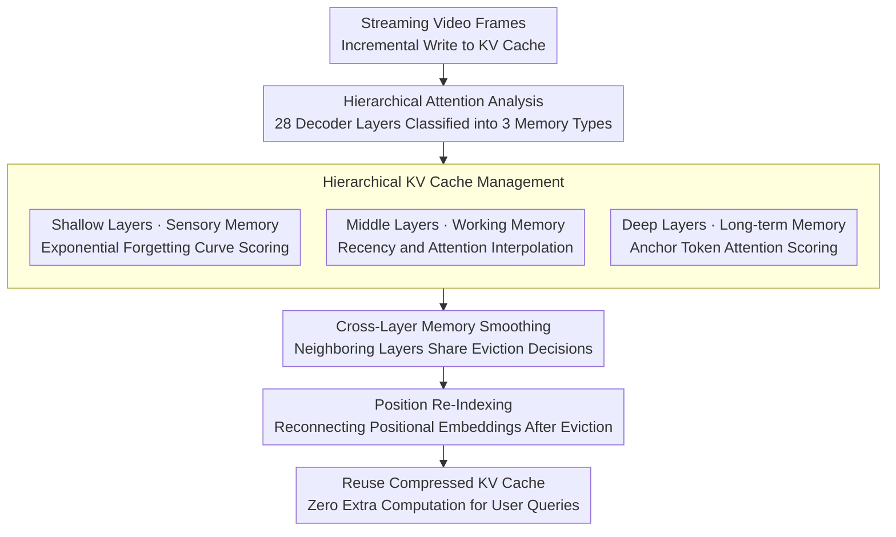

# HERMES: KV Cache as Hierarchical Memory for Efficient Streaming Video Understanding

**Conference**: ACL 2026  
**arXiv**: [2601.14724](https://arxiv.org/abs/2601.14724)  
**Code**: [GitHub](https://github.com/haowei-freesky/HERMES)  
**Area**: Video Understanding / Streaming Inference  
**Keywords**: Streaming Video, KV Cache Management, Hierarchical Memory, Real-time Response, Training-free

## TL;DR

This paper proposes HERMES, which conceptualizes the KV cache as a hierarchical memory framework (Shallow = Sensory, Middle = Working, Deep = Long-term) based on a mechanistic analysis of the hierarchical attention preferences in MLLM decoders. HERMES achieves training-free, efficient streaming video understanding, maintaining or improving accuracy while reducing video tokens by 68%, with a TTFT latency under 30ms—10 times faster than previous SOTA.

## Background & Motivation

**Background**: MLLMs have made significant progress in offline video understanding, but extending them to streaming video inputs remains challenging. It is necessary to simultaneously maintain understanding performance, real-time responsiveness, and low GPU memory overhead. Existing streaming methods are categorized into external memory (storing content as descriptions or patches for retrieval) and internal memory (managing directly within the KV cache).

**Limitations of Prior Work**: (1) External memory methods require retrieval and multimodal pre-filling when a query arrives, leading to high latency and a lack of end-to-end coherence; (2) Cache methods like ReKV and LiveVLM offload video segments to CPU/disk, requiring additional retrieval operations during querying, which results in significant latency; (3) Existing methods use coarse-grained eviction strategies (such as applying FIFO uniformly across all layers), ignoring differences in attention preferences between layers.

**Key Challenge**: The KV cache is inherently a latent memory of the model, suitable for training-free management in streaming scenarios. However, existing methods do not exploit differences in inter-layer attention patterns—different layers "remember" video information in distinct ways.

**Goal**: Design a KV cache management method based on hierarchical attention analysis that can be integrated into existing MLLMs without training, enabling true real-time streaming video QA.

**Key Insight**: An attention visualization analysis of the 28-layer decoder in LLaVA-OV-7B reveals three distinct hierarchical memory patterns.

**Core Idea**: Shallow layers exhibit a strong recency preference (sensory memory), managed via exponential decay; deep layers focus on frame-level "anchor tokens" (long-term memory), managed via attention weights; middle layers transition between the two (working memory), managed via interpolation. Cross-layer smoothing and position re-indexing are added to ensure consistency.

## Method

### Overall Architecture

HERMES aims to solve the persistent problem in streaming video QA: balancing understanding performance, real-time response, and GPU memory constraints. It starts by treating the KV cache as the model's intrinsic "latent memory," managing it directly without training. The methodology centers on an observation—attention visualization of the 28-layer LLaVA-OV-7B decoder shows distinct "memory styles": shallow layers prefer recent frames (sensory memory), deep layers fixate on frame-level anchor tokens (long-term memory), and middle layers transition between them (working memory). Accordingly, HERMES incorporates three components: hierarchical KV cache management using different scoring and eviction strategies per layer type; cross-layer memory smoothing to prevent inconsistency caused by independent layer evictions; and position re-indexing to restore position embeddings after eviction. During inference, the compressed KV cache is reused directly, requiring zero extra computation when the user asks a question.

### Key Designs

**1. Hierarchical KV Cache Management: Different "Forgetting Rules" for Different Layers**

Existing cache methods use coarse global eviction policies (e.g., FIFO for all layers), ignoring variations in inter-layer attention preferences. Based on attention analysis, HERMES assigns token importance scores for three types of layers: shallow layers use an exponential forgetting curve $S_i^l = \alpha_i^l \cdot e^{-k\Delta t_i}$ where newer tokens are more important; deep layers use attention weights based on pseudo-queries $S_i^l = \alpha_i^l \cdot W_i^l$ to retain only anchors; middle layers use a layer-dependent weight $\omega_l$ to interpolate between recency and attention scores: $S_i^l = (1-\omega_l) A_i^l + \omega_l R_i^l$.

This differentiation is grounded in direct observation—attention visualizations clearly show distinct memory functions per layer. Uniform FIFO or pure attention eviction cannot satisfy the opposing needs of shallow layers ("freshness") and deep layers ("anchors"). Further evidence shows deep anchor tokens are spaced exactly by the number of tokens per frame (196), confirming deep layers capture key points frame-by-frame.

**2. Cross-Layer Memory Smoothing: Preventing Disparate Fates for the Same Token**

If layers evict independently, information from the same frame might be retained in some layers but dropped in others, fragmenting visual memory and breaking end-to-end inference coherence. HERMES enables adjacent layers to share parts of their eviction decisions, maintaining consistency in the retention/eviction of the same video token across multiple layers, thus balancing hierarchical flexibility with inference coherence.

**3. Position Re-Indexing: Reconnecting Positional Embeddings After Eviction**

Removing intermediate tokens creates jumps in position embeddings. Position-based attention mechanisms like RoPE are sensitive to this, leading to anomalous calculations. After each eviction, HERMES re-maps the positions of retained tokens into a continuous range $[0, |M|)$, avoiding attention disorder caused by positional discontinuity and ensuring the compressed cache remains functional.

### Loss & Training

Completely training-free. The design draws from Ebbinghaus's Forgetting Curve theory and hierarchical memory models in cognitive psychology. To calculate deep attention weights, a generic guidance prompt serves as a pseudo-query. The exponential forgetting rate $k$ and interpolation parameters are manually set hyperparameters.

## Key Experimental Results

### Main Results

**Streaming Video Benchmarks (LLaVA-OV-7B)**

| Method | StreamingBench | EgoSchema | MVBench | Video-MME | Average |
|------|---------------|-----------|---------|-----------|------|
| Full (No Comp.) | 53.2 | 58.1 | 69.3 | 61.8 | 60.6 |
| ReKV | 51.8 | 55.2 | 67.1 | 59.4 | 58.4 |
| StreamMem | 52.1 | 56.8 | 68.5 | 60.1 | 59.4 |
| **HERMES** | **59.3** | **58.9** | **69.8** | **62.4** | **62.6** |

### Ablation Study

**Efficiency Comparison (Single A800 GPU)**

| Method | TTFT (ms) | GPU Memory | Token Reduction |
|------|----------|---------|-----------|
| Full | ~3000+ | Linear Growth | 0% |
| ReKV | ~1500 | Req. CPU Mem | ~50% |
| **HERMES** | **<30** | **Constant** | **68%** |

### Key Findings

- HERMES improved performance on streaming benchmarks by 11.4% while reducing video tokens by 68%, proving that removing redundant tokens actually benefits inference quality.
- TTFT is < 30ms with constant GPU memory, eliminating OOM risks as input frames increase and requiring zero extra computation when a query arrives.
- The hierarchical memory model generalizes across multiple MLLMs beyond LLaVA-OV.
- The recency preference in shallow layers aligns with Ebbinghaus's forgetting curve, and the anchor pattern in deep layers matches the per-frame token count (196).

## Highlights & Insights

- The hierarchical memory concept inspired by cognitive psychology corresponds precisely to transformer layer attention patterns—this is not just an analogy but a finding supported by quantitative attention analysis.
- The zero-latency design is critical for real-time applications; methods like ReKV reduce storage but still suffer from retrieval latency during querying.
- The training-free, plug-and-play nature allows for direct application to existing MLLMs, lowering the barrier for practical deployment.

## Limitations & Future Work

- Determination of hierarchical boundaries (shallow/middle/deep) depends on the analysis of specific models; different architectures may need recalibration.
- Using pseudo-queries instead of real user queries might introduce bias in specific scenarios.
- Validation was limited to video streaming; applicability to text or multimodal streaming has not been explored.
- The exponential forgetting rate $k$ and interpolation parameters require manual tuning.

## Related Work & Insights

- **vs ReKV/LiveVLM**: These require CPU offloading and retrieval, causing high latency; HERMES reuses the KV cache directly on the GPU.
- **vs StreamMem**: Uses chat template tokens to guide compression but lacks fine-grained management; HERMES achieves precision through hierarchical analysis.
- **vs StreamingLLM**: The attention sink mechanism preserves initial tokens but ignores layer differences; HERMES uses hierarchical specialization for smarter eviction.

## Rating

- Novelty: ⭐⭐⭐⭐⭐ The conceptualization of hierarchical memory and differentiated management strategies based on attention analysis is highly novel.
- Experimental Thoroughness: ⭐⭐⭐⭐⭐ Multiple streaming benchmarks, efficiency analysis, attention visualization, and ablation studies.
- Writing Quality: ⭐⭐⭐⭐⭐ The logical chain from mechanistic analysis to methodological design is very clear.
- Value: ⭐⭐⭐⭐⭐ A practical solution for real-time streaming video understanding with 10x TTFT acceleration.

<!-- RELATED:START -->

## Related Papers

- [\[CVPR 2026\] FluxMem: Adaptive Hierarchical Memory for Streaming Video Understanding](../../CVPR2026/video_understanding/fluxmem_adaptive_hierarchical_memory_for_streaming_video_understanding.md)
- [\[NeurIPS 2025\] InfiniPot-V: Memory-Constrained KV Cache Compression for Streaming Video Understanding](../../NeurIPS2025/video_understanding/infinipot-v_memory-constrained_kv_cache_compression_for_streaming_video_understa.md)
- [\[CVPR 2026\] MuKV: Multi-Grained KV Cache Compression for Long Streaming Video Question-Answering](../../CVPR2026/video_understanding/mukv_multi-grained_kv_cache_compression_for_long_streaming_video_question-answer.md)
- [\[CVPR 2026\] OASIS: On-Demand Hierarchical Event Memory for Streaming Video Reasoning](../../CVPR2026/video_understanding/oasis_on-demand_hierarchical_event_memory_for_streaming_video_reasoning.md)
- [\[ICCV 2025\] VideoLLaMB: Long Streaming Video Understanding with Recurrent Memory Bridges](../../ICCV2025/video_understanding/videollamb_long_streaming_video_understanding_with_recurrent_memory_bridges.md)

<!-- RELATED:END -->
