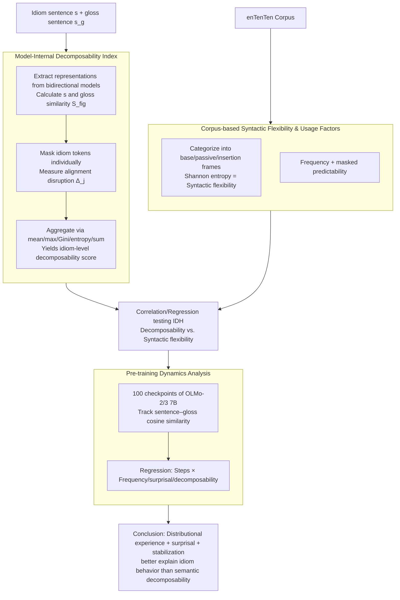

# Rethinking the Idiomaticity Decomposability Hypothesis: Evidence from Distributional Learning

**Conference**: ACL2026  
**arXiv**: [2606.03817](https://arxiv.org/abs/2606.03817)  
**Code**: https://github.com/mi-m1/idiom_decomp  
**Area**: NLP Understanding / Phrasal Semantics / Language Model Analysis  
**Keywords**: idiom decomposability, syntactic flexibility, distributional learning, contextual representations, OLMo

## TL;DR
This paper re-examines the Idiom Decomposability Hypothesis (IDH) by using contextualized language models as "controlled distributional learners." It finds that model-derived decomposability is only weakly correlated with human judgments and exhibits a small but stable negative correlation with syntactic flexibility. This suggests that idiomatic behavior is more likely shaped by distributional experience, surprisal, and representation stabilization processes.

## Background & Motivation
**Background**: Idiom research has long focused on decomposability, referring to the extent to which the literal meanings of the constituent words contribute to the overall metaphorical meaning. The classical Idiom Decomposability Hypothesis (IDH) posits that more decomposable idioms are more likely to undergo syntactic variations such as passivization, modifier insertion, and nominalization.

**Limitations of Prior Work**: This hypothesis primarily relies on human decomposability ratings and acceptability judgments, but psycholinguistic research has shown these ratings to be task-dependent, speaker-variable, and unstable. Human judgments also conflate world knowledge, semantic intuition, familiarity, and linguistic experience, making it difficult to answer "what can be learned solely through distributional exposure."

**Key Challenge**: If idiomatic syntactic behavior is truly determined by internal semantic structure, then decomposability should stably predict syntactic flexibility. If behavior primarily stems from usage experience, then frequency, predictability, and representation stability during training might be more critical than constituent semantic mapping.

**Goal**: The authors aim to construct a decomposability diagnostic index using the internal representations of language models and relate it to human ratings, corpus-based syntactic flexibility, frequency, predictability, and pre-training dynamics to test whether the IDH holds in a distributional learner.

**Key Insight**: Contextualized models learn only from text distributions without explicit semantic role labeling or human acceptability judgments, thus serving as a control system for "distributional experience only." If the IDH is naturally recovered within the model, it suggests a distributional learning basis for the IDH; if not, the role of decomposability requires re-interpretation.

**Core Idea**: The similarity between an idiom sentence and its gloss representation is treated as the overall semantic alignment. The contribution of each idiom word to the overall meaning is then estimated via leave-one-out masking to derive a model-internal decomposability score, which is used to test whether semantic structure predictions match actual usage.

## Method

### Overall Architecture
The paper's pipeline is divided into four steps. First, contextualized representations are extracted from bidirectional transformers (e.g., BERT, ModernBERT) for each idiom-containing sentence $s$ and its corresponding gloss-replaced sentence $s_g$. Second, the similarity between the full idiom sentence and the gloss is calculated, followed by masking idiom tokens one by one to observe the change in similarity; token contributions are aggregated into an expression-level decomposability score. Third, the occurrence frequency of idioms in different constructional frames is statistically collected from the enTenTen corpus, using Shannon entropy to measure syntactic flexibility alongside frequency and predictability. Fourth, beyond static analysis, the study tracks 100 pre-training checkpoints of OLMo-2 7B and OLMo-3 7B to analyze how the similarity between idiom and gloss representations evolves during training. Steps 1 and 2 form the decomposability index, while steps 3 and 4 provide evidence for syntactic flexibility and learning trajectories, culminating in correlation/regression tests of the IDH.

### Key Designs

**1. Model-Internal Decomposability Index: Using representation perturbation to replace human ratings**
Traditional tests rely on offline human ratings of "decomposability," which are confounded by familiarity, world knowledge, and speaker variation. The authors instead estimate the contribution of each constituent word to the overall metaphorical meaning directly from hidden-state geometry. They first calculate the representation similarity $S_{fig}$ between the full sentence $s$ and its gloss $s_g$. Then, for each token $j$ in the idiom span, they construct a masked version $s^{(-j)}$ and calculate $S_{mask}^{(j)}$. Token contribution is defined as the magnitude of alignment disruption: $\Delta_j=|S_{fig}-S_{mask}^{(j)}|$. Finally, these token contributions are aggregated into an idiom-level decomposability score using functions such as mean, maximum, Gini dispersion, entropy, or sum.

**2. Corpus-based Syntactic Flexibility and Usage Factors: Testing IDH via actual usage distributions**
The IDH claims decomposability constrains whether an idiom can undergo syntactic transformations. Therefore, it should be tested against actual usage in a corpus rather than offline human acceptability judgments. The authors categorize idiom occurrences in the corpus into constructional types (e.g., base form, adverb insertion, adjective insertion, passivization, action nominalization) and measure syntactic flexibility using the Shannon entropy of these types: $H(i)=-\sum_c p_{i,c}\log_2 p_{i,c}$. Higher entropy indicates greater acceptance of diverse syntactic constructions. Usage factors like frequency and masked predictability are included to distinguish flexibility from pure experience.

**3. Pre-training Dynamics Analysis: Observing when and what drives idiom representation stability**
Static correlations only describe the final model state. The authors track the cosine similarity between idiom and gloss sentences across 100 checkpoints of OLMo-2 7B and OLMo-3 7B. They model these using linear regression with interaction terms between training steps and log frequency, surprisal, and decomposability. This identifies whether representation stability occurs early or late and reveals which factors (frequency, predictability, or decomposability) most influence the stabilization process.

### Loss & Training
This work does not train new models; it focuses on diagnostic evaluation. Bidirectional models used include BERT-base/large (cased/uncased) and ModernBERT-base/large. Pre-training dynamics analysis utilizes 100 checkpoints each from OLMo-2-1124-7B and OLMo-3-1025-7B. Statistical tools include Spearman rank correlation, regression analysis, bootstrap confidence intervals, partial correlation, Pearson correlation, and VIF. The authors also compare various similarity functions, including cosine, CKA, and Wasserstein distance.

## Key Experimental Results

### Main Results
| Analytical Question | Sample/Model | Key Results | Explanation |
|----------|-----------|----------|------|
| Human decomposability vs. syntactic flexibility | 90 idioms overlapping Bulkes & Tanner and IMPLI | No significant relationship | Human decomposability ratings do not stably predict corpus-based flexibility |
| Model decomposability vs. human ratings | BERT-large uncased, final layer, Wasserstein + sum | $r(90)=.24$, $p=.005$ | Weak positive correlation exists between model and humans, but overlap is limited |
| Model decomposability vs. syntactic flexibility | IMPLI 527 samples | Max correlation approx. $r(527)=-.16$, $p=.0002$ | Relationship is small and often negative, contradicting IDH's positive prediction |
| PP idioms subset | 127 Prepositional Phrase idioms | $\rho=-0.24$, $p=0.01$ | Higher decomposability in PP idioms correlates with lower actual flexibility |
| VP idioms subset | 284 Verb Phrase idioms | $\rho=-0.02$, $p=0.68$ | No significant relationship for VP idioms, which are central to IDH |

### Ablation Study
| Analysis Config | Key Metrics | Description |
|----------|---------|------|
| Human ratings: frequency | coef = -0.20, z = -2.26, p = 0.02 | Higher corpus frequency correlates with humans judging idioms as less decomposable |
| Human ratings: predictability | coef = -0.52, z = -0.33, p = 0.73 | Predictability has no significant effect on human decomposability ratings |
| BERT-large cased: frequency | coef = -0.29, z = -4.07, p < .001 | Model-derived decomposability also correlates negatively with frequency |
| Bootstrap CI | 95% CI = [0.07, 0.40] | The best model-human correlation is unlikely to be purely noise, though uncertainty remains |
| VIF | All values near 1 | No severe multicollinearity among frequency, predictability, and decomposability |

### Key Findings
- Data scale: IMPLI contains 527 samples (382 unique idioms); Bulkes & Tanner subset contains 90 idioms. Analysis covers 8 models (6 bidirectional encoders, 2 OLMo causal LMs).
- In pre-training dynamics, interactions between steps and all three attributes are significantly negative: Steps x Frequency is -0.0008 ($z = -24.69$); Steps x Surprisal is -0.0007 ($z = -22.301$); Steps x Decomposability is -0.0010 ($z = -36.367$). Decomposability shows the largest training-dependency effect.
- Frequency is not the sole explanation. Frequency alone cannot account for the formation of idiom representations; surprisal and decomposability both contribute to the stabilization process.

## Highlights & Insights
- The study transforms a traditional linguistic hypothesis into a computable, reproducible representation diagnostic rather than a simple classification task for LLMs.
- The "leave-one-out mask + gloss similarity" design is ingenious: it operationalizes whether constituent words contribute to the metaphorical whole as a perturbation to representation alignment.
- The most compelling finding is the negative correlation: if decomposability supported syntactic transformation, a positive correlation should appear. The opposite result suggests that high-frequency holistic storage and constructional constraints are more explanatory.
- Pre-training dynamics analysis advances static probing by investigating when correlations emerge or decay during the learning process.

## Limitations & Future Work
- The decomposability metric is one of many possible operationalizations and may not exhaust the complex linguistic concept.
- Using BERT-large derived decomposability to predict OLMo learning trajectories introduces architectural bias; ideally, metrics should be calculated directly on the target model (though causal LMs are less suited for bidirectional masking).
- The experiments cover only English idioms, which may not generalize to morphologically rich languages.
- Corpus-based syntactic flexibility statistics rely on predefined frames, which might compress information about finer constructional variants.
- Future work could investigate architecture-agnostic metrics and apply stabilization analysis to cross-lingual contexts and generative model internal states.

## Related Work & Insights
- **vs. Idiom Decomposability Hypothesis**: IDH predicts a positive correlation between decomposability and flexibility. This study finds no robust support and even observes negative correlations.
- **vs. usage-based / constructionist accounts**: These theories emphasize frequency and predictability; the frequency effects and pre-training dynamics found here align more closely with these accounts.
- **vs. traditional human norming**: Human ratings capture subjective transparency but conflate familiarity; this study isolates what distributional exposure can explain using LMs as controlled learners.

## Rating
- Novelty: ⭐⭐⭐⭐⭐ 
- Experimental Thoroughness: ⭐⭐⭐⭐☆ 
- Writing Quality: ⭐⭐⭐⭐☆ 
- Value: ⭐⭐⭐⭐☆ 

<!-- RELATED:START -->

## Related Papers

- [\[CVPR 2026\] Rethinking Occlusion Modeling for UAV Tracking](../../CVPR2026/video_understanding/rethinking_occlusion_modeling_for_uav_tracking.md)
- [\[CVPR 2025\] ViTED: Video Temporal Evidence Distillation](../../CVPR2025/video_understanding/vited_video_temporal_evidence_distillation.md)
- [\[CVPR 2026\] FlexHook: Rethinking Two-Stage Referring-by-Tracking in RMOT](../../CVPR2026/video_understanding/rethinking_two-stage_referring-by-tracking_in_referring_multi-object_tracking_ma.md)
- [\[ICML 2026\] Foresee-to-Ground: From Predictive Temporal Perception to Evidence-Driven Reasoning](../../ICML2026/video_understanding/foresee-to-ground_from_predictive_temporal_perception_to_evidence-driven_reasoni.md)
- [\[CVPR 2026\] HERBench: A Benchmark for Multi-Evidence Integration in Video Question Answering](../../CVPR2026/video_understanding/herbench_a_benchmark_for_multi-evidence_integration_in_video_question_answering.md)

<!-- RELATED:END -->
