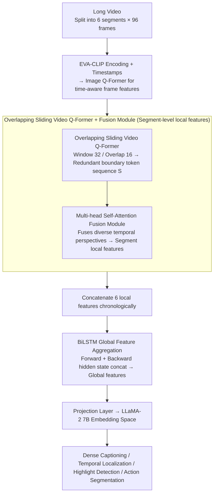

# TemporalVLM: Video LLMs for Temporal Reasoning in Long Videos

**Conference**: ACL 2026  
**arXiv**: [2412.02930](https://arxiv.org/abs/2412.02930)  
**Code**: None  
**Area**: Image Segmentation  
**Keywords**: Video Large Language Models, Time-aware encoding, BiLSTM, Long video understanding, Industrial assembly dataset

## TL;DR

This paper proposes TemporalVLM, which extracts local fine-grained temporal features through a time-aware segment encoder (overlapping sliding Video Q-Former + fusion module) and aggregates global long-range dependencies using a BiLSTM. This marks the first introduction of LSTM into Video LLMs, outperforming previous methods across four tasks: dense video captioning, temporal localization, highlight detection, and action segmentation.

## Background & Motivation

**Background**: Video LLMs achieve video understanding by combining video encoders with LLMs. Existing methods typically map videos to a fixed number of tokens, which leads to performance degradation in long videos and poor temporal reasoning due to separate encoding of frames and timestamps.

**Limitations of Prior Work**: (1) Treating the entire video as a single segment with a fixed token count loses fine-grained information in long videos; (2) Using pooling or query-based aggregation for global features fails to capture long-range temporal dependencies; (3) Separate encoding of frames and timestamps results in time-insensitivity.

**Key Challenge**: Temporal reasoning in long videos requires both local fine-grained understanding (precise localization of individual events) and global semantic understanding (temporal relationships between events), but existing architectures struggle to balance both.

**Goal**: Design a "coarse-to-fine" video encoder that simultaneously extracts time-aware local and global features.

**Key Insight**: Segment long videos into multiple short segments, use a time-aware encoder to extract local features at the segment level, and then use a BiLSTM to aggregate global features across segments—combining segment-level granularity with sequence-level long-range modeling.

**Core Idea**: Overlapping sliding windows + fusion module for time-aware local encoding, and BiLSTM for bidirectional long-range aggregation—marking the first introduction of LSTM into Video LLMs.

## Method

### Overall Architecture

Input videos are divided into $C=6$ segments, with 96 frames sampled per segment. Time-aware segment encoder: Frames are encoded via EVA-CLIP and combined with timestamps through an Image Q-Former to obtain time-aware frame features. Subsequently, an overlapping sliding Video Q-Former and a fusion module generate local features. BiLSTM module: Local features from all segments are concatenated chronologically and passed through a bidirectional LSTM to aggregate global features. Finally, features are mapped to the embedding space of LLaMA-2 7B via a projection layer.

### Key Designs

**1. Overlapping Sliding Video Q-Former + Fusion Module: Extracting time-aware local features within segments**

Existing methods (e.g., TimeChat) process frame features with non-overlapping windows, where window boundaries do not intersect, resulting in a single temporal perspective. Addressing the "loss of local fine-grained information," this work employs a sliding Video Q-Former with window size $q=32$ and overlap $o=16$. This produces a sequence of features $\mathbf{S}$ containing redundant boundary tokens—tokens that are spatially redundant but temporally complementary.

A multi-head self-attention fusion module is then applied to $\mathbf{S}$, merging diverse temporal perspectives of the same time interval into context-aware segment embeddings. Consequently, the overlap redundancy, originally a "defect," becomes a source of diversity for the fusion module, generating richer and more fine-grained segment-level features than non-overlapping windows.

**2. BiLSTM Global Feature Aggregation: Capturing bidirectional long-range dependencies across segments with recurrent structures**

Pooling or query-based aggregation flattens the chronological order between segments, and positional encodings in Transformers under fixed contexts are less suited for temporal structures than recurrent architectures. This is why existing methods fail to capture long-range temporal dependencies. This work concatenates the local features of all segments into a sequence, feeding them into forward and backward LSTMs, and uses the concatenated hidden states $\mathbf{h}_t = [\mathbf{h}_t^f, \mathbf{h}_t^b]$ as global features.

This is the first time LSTM is introduced into Video LLMs—the inductive bias of recurrence is naturally suited for modeling the "event-followed-by-event" temporal structure. Ablation studies confirm that BiLSTM consistently outperforms average pooling, linear layers, unidirectional LSTM, and Transformers, indicating that the advantages of recurrent structures are not replaced by attention in this scenario.

**3. IndustryASM Dataset: Filling the benchmark gap for temporal segmentation in industrial manufacturing**

Existing temporal segmentation datasets lean toward cooking activities or multi-shot web clips, which differ significantly from continuous single-shot recordings of real industrial production lines. The authors constructed IndustryASM, containing 4851 videos with an average duration of 105 seconds, covering 47 industrial assembly tasks. Industrial engineers provided frame-level action segmentation annotations, achieving a 92% consistency rate.

This dataset is both practical for manufacturing applications and provides continuous single-shot long videos, serving to test TemporalVLM's capability in real-world long-range temporal reasoning and filling a gap in Video LLM evaluation.

### Mechanism: How an industrial assembly video is encoded

Taking a 105-second assembly video as an example: It is first split into $C=6$ segments, with 96 frames sampled per segment. Each frame is encoded by EVA-CLIP and passed to the Image Q-Former along with timestamps to obtain time-aware frame features. Then, an overlapping sliding Video Q-Former (window 32, overlap 16) scans these 96 frames, with adjacent windows covering half of each other, outputting a sequence $\mathbf{S}$ with redundant boundary tokens. The fusion module compresses these complementary perspectives into the local features for that segment. After all 6 segments complete this process, the 6 local features are concatenated chronologically and processed by forward and backward BiLSTMs to produce global features spanning the entire video. Finally, these features are mapped via a projection layer into the LLaMA-2 7B embedding space, where the LLM performs downstream reasoning such as dense captioning and temporal localization.

### Loss & Training

Standard autoregressive cross-entropy loss (Eq. 8) is used. The LLM and vision encoder are frozen; only the BiLSTM, projection layer, and LoRA are fine-tuned. Training is conducted on 8×A100 GPUs.

## Key Experimental Results

### Main Results

**Zero-shot comparison on Dense Video Captioning (YouCook2) and Temporal Localization (Charades-STA)**

| Method | SODA_c | CIDEr | R@1(IoU=0.5) |
|------|--------|-------|-------------|
| VideoChat-Embed | 0.2 | 0.6 | 3.2 |
| TimeChat | — | — | — |
| LongVLM | 0.8 | 2.5 | 13.9 |
| **Ours** | **Best** | **Best** | **Best** |

### Ablation Study

**Comparison of Global Aggregation Methods**

| Aggregation Method | Description |
|---------|------|
| Average Pooling | Loses temporal information |
| Linear Layer | No sequence modeling |
| Unidirectional LSTM | Only forward information |
| Transformer | Fixed positional encoding inferior to recurrence |
| **BiLSTM** | **Bidirectional long-range dependency, Best** |

### Key Findings

- TemporalVLM outperforms previous methods across all four temporal reasoning tasks.
- BiLSTM as a global aggregation module consistently outperforms all alternatives.
- Overlapping windows + fusion module significantly improves performance over non-overlapping windows.
- The model is effective on the IndustryASM industrial dataset, proving practical application value.
- It proves for the first time that LSTMs have unique advantages in Video LLMs and should not be entirely replaced by Transformers.

## Highlights & Insights

- The choice to "return to LSTM" is counter-intuitive but effective—the inductive bias of recurrent structures is superior to general attention in temporal modeling.
- Redundant information from overlapping windows serves as a source of diversity for the fusion module—turning a potential defect into an advantage.
- The IndustryASM dataset fills a critical gap in industrial scenarios.

## Limitations & Future Work

- Fixed division into 6 segments may not suit all video lengths; adaptive segmentation strategies warrant exploration.
- The sequential processing of BiLSTM limits parallelism; SSM/Mamba might be more efficient.
- Evaluated only on LLaMA-2 7B; larger or newer LLMs have not been assessed.
- Generalizability of IndustryASM—whether 47 assembly tasks cover the full diversity of industrial scenarios.

## Related Work & Insights

- **vs TimeChat**: The latter uses non-overlapping Video Q-Formers without global aggregation; TemporalVLM's overlapping+fusion+BiLSTM design provides a comprehensive upgrade.
- **vs LongVLM**: The latter also uses segments but aggregates global features via pooling and does not utilize timestamps; TemporalVLM's time-aware encoding and BiLSTM aggregation are more effective.

## Rating

- Novelty: ⭐⭐⭐⭐ First introduction of BiLSTM in Video LLMs; novel overlapping fusion design.
- Experimental Thoroughness: ⭐⭐⭐⭐ 4 tasks + detailed ablation + new dataset.
- Writing Quality: ⭐⭐⭐⭐ Clear architecture diagrams and intuitive comparison with prior methods.
- Value: ⭐⭐⭐⭐ IndustryASM dataset and BiLSTM findings are valuable to the community.

<!-- RELATED:START -->

## Related Papers

- [\[CVPR 2026\] Thinking with Drafts: Speculative Temporal Reasoning for Efficient Long Video Understanding](../../CVPR2026/video_understanding/thinking_with_drafts_speculative_temporal_reasoning_for_efficient_long_video_und.md)
- [\[CVPR 2026\] Learning Transferable Temporal Primitives for Video Reasoning via Synthetic Videos](../../CVPR2026/video_understanding/learning_transferable_temporal_primitives_for_video_reasoning_via_synthetic_vide.md)
- [\[AAAI 2026\] R-AVST: Empowering Video-LLMs with Fine-Grained Spatio-Temporal Reasoning in Complex Audio-Visual Scenarios](../../AAAI2026/video_understanding/r-avst_empowering_video-llms_with_fine-grained_spatio-temporal_reasoning_in_comp.md)
- [\[ICML 2026\] Video-MTR: Reinforced Multi-Turn Reasoning for Long Video Understanding](../../ICML2026/video_understanding/video-mtr_reinforced_multi-turn_reasoning_for_long_video_understanding.md)
- [\[CVPR 2026\] MS-Temba: Multi-Scale Temporal Mamba for Understanding Long Untrimmed Videos](../../CVPR2026/video_understanding/ms-temba_multi-scale_temporal_mamba_for_understanding_long_untrimmed_videos.md)

<!-- RELATED:END -->
