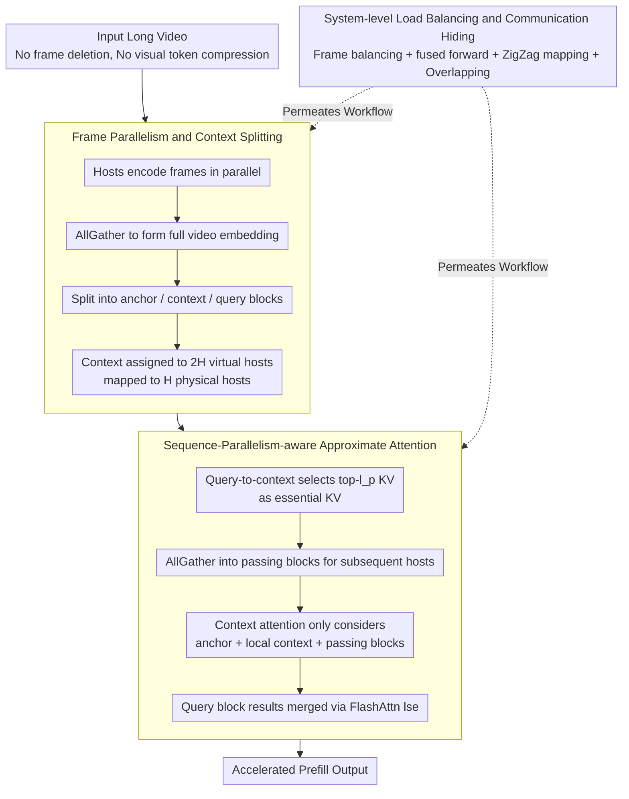

# APB-V: Accelerating Long-Video Understanding via Sequence-Parallelism-aware Approximate Attention

**Conference**: ACL2026  
**arXiv**: [2601.21444](https://arxiv.org/abs/2601.21444)  
**Code**: https://github.com/thunlp/APB  
**Area**: Video Understanding / Multimodal Reasoning Acceleration  
**Keywords**: Long-video understanding, Sequence Parallelism, Approximate Attention, Multi-GPU Inference, KV Compression  

## TL;DR
APB-V accelerates long-video LMM inference using sequence-parallelism-aware approximate attention and system-level load balancing. While preserving full visual embeddings, it achieves speedups of 12.72×, 1.70×, and 1.18× compared to FlashAttn, ZigZagRing, and APB, respectively, under a 64-frame 1440p setting without significant performance loss.

## Background & Motivation
**Background**: Long-video understanding relies on LMMs to encode a large number of frames into visual tokens, which are then fed into long-context LLM backbones. As video duration, resolution, and frame counts increase, the costs of visual encoding, attention, and FFN during the prefill stage grow rapidly.

**Limitations of Prior Work**: Existing methods fall into two categories. One optimizes attention or KV cache, but typically only alleviates part of the LLM backbone burden, failing to address visual encoding and FFN costs. The other explicitly compresses input tokens (e.g., token pruning or pooling), which reduces computation but risks losing fine-grained video evidence. Notably, the paper points out that SlowFast suffers an approximately 25% drop in accuracy despite achieving less than 3× speedup in experiments.

**Key Challenge**: Long-video inference requires more computational resources for longer inputs while prohibiting crude compression that sacrifices key frames and detailed evidence. Single-GPU optimizations often fall into an efficiency-performance trade-off, while multi-GPU sequence parallelism encounters communication and load imbalance bottlenecks.

**Goal**: APB-V aims to solve both efficiency and performance issues by "increasing parallel computation + suppressing quadratic attention costs." It avoids compressing visual embeddings and instead performs approximate attention, communication compression, and system-level scheduling across multiple GPUs/hosts.

**Key Insight**: Long-video scenarios are naturally suited for parallelism: frame-level visual encoding is independent, and LLM input sequences can be split into blocks. However, exact sequence parallelism is communication-intensive, necessitating a mechanism where each host exchanges only the critical KV pairs truly needed by subsequent queries.

**Core Idea**: Use local KV compression and passing blocks to approximate global attention, transmitting only essential context blocks between hosts. Simultaneously, unlock multi-GPU performance for long videos through frame parallelism, ZigZag load balancing, fused forward passes, and communication-computation overlapping.

## Method

### Overall Architecture
APB-V aims to accelerate the prefill of long-video LMMs without dropping frames or compressing a single visual token. It assumes each host holds a complete LMM copy. Input videos are distributed by frame to hosts for parallel encoding. After an AllGather operation assembles the full video embedding, the sequence is split into an initial anchor block, a trailing query block, and intermediate context blocks. Context blocks are allocated to $2H$ virtual hosts and mapped back to $H$ physical hosts. In each attention layer, hosts compress only the KV pairs most critical to the query into a passing block to be sent to subsequent hosts. This significantly reduces the remote KV count accessed by each query, while Algorithm and System layers overlap the saved communication with computation.

### Key Designs

**1. Frame Parallelism and Context Splitting: Distributing Encoding and Prefill**

The bottleneck in long-video processing is a single GPU handling visual encoding for all frames and prefill for all tokens. APB-V leverages the independence of frame-level encoding, allowing each host to encode a subset of frames before an AllGather combines the embeddings. The sequence is then partitioned into an anchor block $B_a$, a query block $B_{qr}$, and context blocks $B^{(h)}$. The anchor provides the global prefix, the query contains the actual question, and the context forms the bulk of the video evidence. This pipeline ensures no single card bears the entire video burden.

**2. Sequence-Parallelism-aware Approximate Attention: Transmitting Only Essential KV**

Exact sequence parallelism requires exchanging all KV pairs, which is communication-heavy; conversely, StarAttn omits inter-host communication, losing long-range dependencies. APB-V takes a middle ground: each virtual host uses query-to-context attention scores to select the $l_p$ most important KV pairs from the local context, forming essential KV sets. These are AllGathered as passing blocks for subsequent hosts. Context block attention only computes against the anchor, local context, and these compressed passing blocks, while query block results are merged across hosts using FlashAttn LSE. This preserves long-range dependencies better than StarAttn while saving significant communication compared to exact parallelism.

**3. System-level Load Balancing and Communication Hiding: Achieving High Throughput**

Algorithmic approximation alone is insufficient—short query forward passes become memory-bound, passing block lengths become unbalanced, and inter-host communication causes stalls. APB-V implements three optimizations: balancing visual load via $F^{(h)}=\lfloor F/H\rfloor+\mathbb{I}[h<F\bmod H]$, using fused context-query forward passes to handle short queries, and ZigZag mapping (placing virtual hosts $h$ and $2H-1-h$ on the same physical host) to cancel out length imbalances. Overlapped communication allows passing block transmission to run concurrently with attention computation.

### Loss & Training
APB-V is an inference acceleration framework and does not require training new LMMs or task-specific losses. The APB baseline's retaining heads are trained on NextQA, while APB-V primarily controls anchor length and passing length via hyperparameters: default $l_a=n/64$ and $l_p=n/128$ to maintain computational parity with APB under 8 physical hosts and $2H$ virtual hosts.

## Key Experimental Results

### Main Results
APB-V was tested on VNBench and LongVideoBench using InternVL3-2B, Qwen2.5VL-3B, and Qwen2.5VL-7B. Core metrics demonstrating minimal performance degradation are shown below.

| Dataset / Model | FullAttn | APB | APB-V | Conclusion |
|-----------------|----------|-----|-------|------------|
| VNBench / InternVL3-2B Overall | 44.89 | 41.11 | 43.26 | APB-V is close to FullAttn, significantly better than APB |
| VNBench / Qwen2.5VL-3B Overall | 52.81 | 43.93 | 50.67 | Retains most accuracy, far superior to token pruning |
| VNBench / Qwen2.5VL-7B Overall | 58.44 | 49.93 | 56.22 | Minimal loss on synthetic long-video tasks |
| LongVideoBench / InternVL3-2B Overall | 55.35 | 55.20 | 55.42 | APB-V slightly outperforms FullAttn |
| LongVideoBench / Qwen2.5VL-7B Overall | 58.38 | 59.16 | 59.76 | APB-V exceeds APB and FullAttn on real world videos |

In terms of speed, APB-V achieves 12.72×, 1.70×, and 1.18× speedups over FlashAttn, ZigZagRing, and APB, respectively, when processing 64-frame 1440p video with Qwen2.5-VL-3B.

### Ablation Study

| Configuration | 16 frames req/s | 32 frames req/s | 56 frames req/s | Note |
|---------------|-----------------|-----------------|-----------------|------|
| APB-V | 1.846 | 0.916 | 0.471 | Full system is fastest |
| -O | 1.827 | 0.911 | 0.470 | Without communication overlap |
| -O-F | 1.646 | 0.854 | 0.450 | Without fused forward |
| -O-F-Z | 1.618 | 0.813 | 0.415 | Without ZigZag (unbalanced load) |
| -O-F-Z-V | 0.381 | 0.189 | 0.107 | Without system optimizations (~4× slower) |
| FlashAttn | 0.226 | 0.092 | 0.042 | Single GPU exact attention (slowest) |

### Key Findings
- On synthetic long-video tasks, token pruning methods (e.g., SlowFast) significantly damage fine-grained capabilities like retrieval and counting; APB-V avoids this by preserving full visual embeddings.
- On real-world long videos, APB-V (Overall 59.76) outperforms FullAttn (58.38) on Qwen2.5VL-7B, suggesting approximate attention can achieve a better trade-off through embedding preservation.
- Passing blocks are more critical than anchor blocks: in counting tasks, removing passing blocks drops accuracy from 30.00 to 17.33, while removing anchors drops it to 25.33.
- APB-V scales well: with H=8, it reaches 6.171/2.013 req/s at 720p 16/56 frames, higher than ZigZagRing and APB.

## Highlights & Insights
- Instead of "seeing less video," the paper preserves visual tokens and approximates the attention calculation. This is crucial for long-video QA where the answer might reside in a transient subtitle or action.
- APB-V codesigns algorithms and systems: approximate attention must be paired with solutions for memory-bound short queries, load imbalance, and communication stalls.
- Case studies show regions containing critical information (e.g., "secret word is Nick") are more frequently selected for passing blocks, proving query-aware KV selection effectively propagates relevant evidence.

## Limitations & Future Work
- Primarily targets decoder-only Transformer-based LMMs; incompatible with CNNs or non-standard architectures.
- Dependent on multi-GPU inference; performance regresses to FlashAttn on a single GPU, making it unsuitable for resource-constrained deployments.
- Focuses on TTFT/end-to-end prefill for latency-sensitive applications (e.g., surveillance, autonomous driving); benefits for multi-turn dialogue or the decoding stage require further analysis.
- Passing and anchor lengths remain hyperparameters that require tuning.

## Related Work & Insights
- **vs FlashAttn / ZigZagRing**: FlashAttn is single-GPU exact; ZigZagRing is exact sequence parallelism. APB-V trades exactness for better scalability.
- **vs SlowFast / token pruning**: SlowFast reduces tokens at the cost of fine-grained evidence; APB-V keeps all tokens, making it better for precise search.
- **vs StarAttn**: StarAttn eliminates inter-host communication but loses dependencies; APB-V uses compressed communication to maintain critical KV flow.
- **Insight**: The core of long-context multimodal reasoning is not just reducing tokens, but enabling the low-cost flow of "query-relevant remote evidence" across devices.

## Rating
- Novelty: ⭐⭐⭐⭐ Solid system-level integration of approximate attention and sequence parallelism for long-video LMMs.
- Experimental Thoroughness: ⭐⭐⭐⭐⭐ Covers two benchmarks, three LMMs, multiple resolutions/frame counts, and extensive ablations.
- Writing Quality: ⭐⭐⭐⭐ Clear architectural breakdown, though notation density requires careful reading of charts.
- Value: ⭐⭐⭐⭐⭐ Highly practical for multi-GPU long-video LMM deployment, particularly for high-resolution TTFT acceleration.

<!-- RELATED:START -->

## Related Papers

- [\[ICML 2025\] MMInference: Accelerating Pre-filling for Long-Context VLMs via Modality-Aware Permutation Sparse Attention](../../ICML2025/vlm_efficiency/mminference_accelerating_pre-filling_for_long-context_vlms_via_modality-aware_pe.md)
- [\[CVPR 2026\] TimeViper: A Hybrid Mamba-Transformer Vision-Language Model for Efficient Long Video Understanding](../../CVPR2026/vlm_efficiency/timeviper_a_hybrid_mamba-transformer_vision-language_model_for_efficient_long_vi.md)
- [\[ACL 2026\] HERMES: KV Cache as Hierarchical Memory for Efficient Streaming Video Understanding](hermes_kv_cache_as_hierarchical_memory_for_efficient_streaming_video_understandi.md)
- [\[ACL 2025\] Sharper and Faster mean Better: Towards More Efficient Vision-Language Model for Hour-scale Long Video Understanding](../../ACL2025/vlm_efficiency/sophia_efficient_long_video.md)
- [\[CVPR 2026\] Accelerating Streaming Video Large Language Models via Hierarchical Token Compression](../../CVPR2026/vlm_efficiency/accelerating_streaming_video_large_language_models_via_hierarchical_token_compre.md)

<!-- RELATED:END -->
