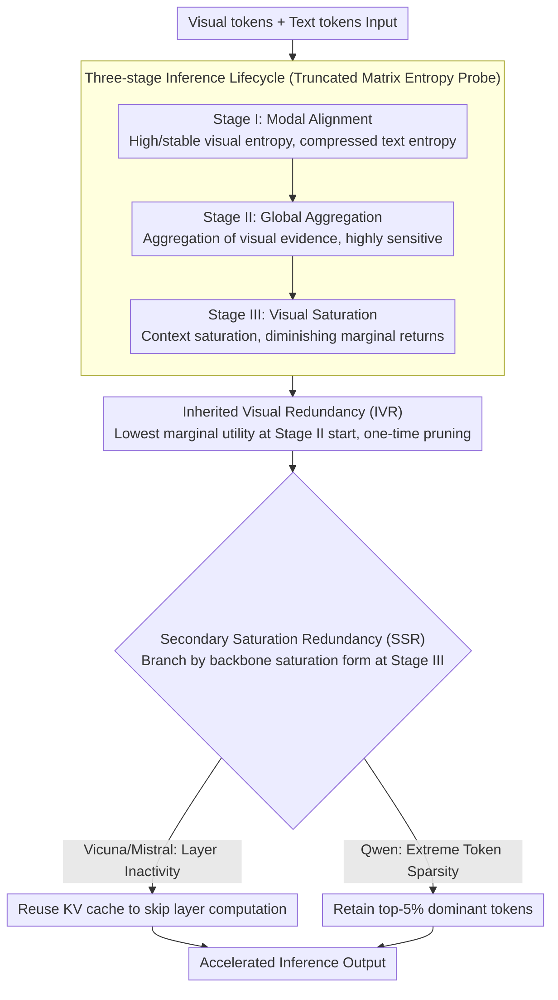

# From Inheritance to Saturation: Disentangling the Evolution of Visual Redundancy for Architecture-Aware MLLM Inference Acceleration

**Conference**: ACL 2026  
**arXiv**: [2604.16462](https://arxiv.org/abs/2604.16462)  
**Code**: [https://github.com/civilizwa/HalfV](https://github.com/civilizwa/HalfV)  
**Area**: Multimodal VLM / Inference Acceleration  
**Keywords**: Visual Redundancy, MLLM Acceleration, Architecture-Aware, Token Pruning, Matrix Entropy

## TL;DR

This work reveals two sources of visual redundancy in MLLM inference: Inherited Visual Redundancy (IVR) caused by dense ViT tokenization and Secondary Saturation Redundancy (SSR) caused by deep semantic saturation, which manifests differently across backbone architectures. The proposed HalfV framework handles these two types of redundancy separately, achieving a 4.1x FLOPs acceleration on Qwen2.5-VL while preserving 96.8% of the performance.

## Background & Motivation

**Background**: High-resolution MLLMs incur extremely high computational costs during inference due to visual token explosion. Existing acceleration methods include token-level pruning and layer-level sparsity.

**Limitations of Prior Work**: Existing acceleration strategies exhibit severe "backbone dependency"—performing well on Vicuna/Mistral-based architectures (e.g., LLaVA) but suffering performance degradation of 5.7%-22.4% when migrated to Qwen-based architectures. Control experiments using LLaVA-Next with identical visual front-ends confirm that the bottleneck lies in the differing intrinsic mechanisms of various LLM backbones for processing visual information.

**Key Challenge**: Different backbone architectures process visual information in fundamentally different ways, yet existing methods assume "one strategy fits all." Understanding the essential differences in visual redundancy across different architectures is necessary to design a general acceleration scheme.

**Goal**: Systematically track the evolution of visual information across different architectures using truncated matrix entropy as a probe, and design an architecture-aware acceleration framework accordingly.

**Key Insight**: By using truncated matrix entropy to track the evolution of the eigenvalue spectrum of visual representations, a three-stage inference lifecycle universal across architectures is discovered: Modal Alignment → Global Aggregation → Visual Saturation.

**Core Idea**: Visual redundancy is decoupled into universal IVR (from ViT dense tokenization) and architecture-dependent SSR (from deep saturation). The former is handled with a unified pruning strategy, while the latter is adaptively processed based on architecture-specific manifestations (layer inactivity in Vicuna/Mistral vs. extreme token sparsity in Qwen).

## Method

### Overall Architecture

HalfV operates in two steps: (1) One-time token pruning is executed at the start of Stage II for all architectures to eliminate IVR; (2) SSR is handled in Stage III based on architecture specificity—reusing KV cache to skip layer computations for Vicuna/Mistral, and retaining only the top-5% dominant tokens for Qwen. This approach is predicated on using truncated matrix entropy as a "ruler" to partition the inference process into three stages and identify where to address IVR and SSR.

### Key Designs

**1. Three-Stage Inference Lifecycle: Aligning Visual Information Evolution**

To explain why a single acceleration strategy fails across different backbones, a universal metric is required. The authors track the eigenvalue spectrum evolution of visual and text representations using truncated matrix entropy. They found that Vicuna, Mistral, and Qwen all undergo three identical stages. In Stage I (Modal Alignment), visual entropy is high and stable while text entropy is rapidly compressed; attention shifts quickly from balanced to text-dominated. In Stage II (Global Aggregation), visual entropy begins to decrease as scattered visual evidence aggregates into key semantic regions; this stage is extremely sensitive to local perturbations—suppressing only 1% of tokens can cause severe degradation. In Stage III (Visual Saturation), visual context is saturated, and further computation yields diminishing marginal returns.

This lifecycle decomposes "redundancy" into a chronological process, allowing the two subsequent designs to target the correct layers.

**2. Inherited Visual Redundancy (IVR): One-time Pruning at Stage II Start**

Dense ViT tokenization inherently brings significant spatial redundancy, which is independent of the backbone. The challenge is "when to prune"—as Stage II is sensitive to perturbations, layer-wise pruning disrupts the ongoing evidence aggregation. The authors quantify the "information lost per unit of computation saved" using marginal utility $\text{MU}_{l,r} = -\Delta\mathcal{M} / (\Delta\mathcal{C} + \epsilon)$. They found that the starting layer of Stage II is the unique "sweet spot" (MU=0.21, significantly lower than 0.29–0.87 elsewhere). Pruning here avoids interfering with Stage I alignment and does not disrupt subsequent Stage II aggregation.

**3. Secondary Saturation Redundancy (SSR): Branching by Backbone Saturation Form**

SSR is redundancy arising after deep semantic saturation, but its manifestation varies by backbone. In Vicuna/Mistral, SSR appears as layer inactivity (KL divergence between adjacent layers $\approx 0$), allowing layer skipping by reusing KV caches. In Qwen, SSR appears as extreme token sparsity: the layers remain active, but the information flow collapses into a very small number of dominant tokens. Thus, only the top-5% of tokens must be retained for full-precision computation. This architectural distinction is critical; suppressing all visual updates in Qwen lead to catastrophic collapse (-86.2%), whereas retaining only 5% of tokens was nearly lossless.

### Loss & Training

HalfV is a training-free inference-time acceleration method. It only requires a pre-analysis step on a small set of data (100 samples) to determine stage boundaries. Evaluations were conducted on LLaVA-1.5v-7B (Vicuna), LLaVA-1.5v-7B (Mistral), and Qwen2.5-VL-7B across benchmarks including GQA, MME, POPE, SQA, and AI2D.

## Key Experimental Results

### Main Results

| Model | Method | FLOPs Accel. | Avg. Performance Retention |
|------|------|-----------|------------|
| Qwen2.5-VL | HoloV (Prior Work) | High | Poor (5.7-22.4% degradation) |
| Qwen2.5-VL | HalfV | **4.1×** | **96.8%** |
| LLaVA-1.5v (Vicuna) | HalfV | High | Excellent |
| LLaVA-1.5v (Mistral) | HalfV | High | Excellent |

### Ablation Study

| Configuration | Effect | Description |
|------|------|------|
| IVR only | Medium Accel. | Universal pruning is effective but insufficient |
| SSR only | Limited Accel. | Only addresses deep-layer redundancy |
| IVR + SSR (Full HalfV) | Optimal | Two stages are complementary |
| Incorrect SSR Strategy | Catastrophic Degradation | Validates the necessity of architecture-awareness |

### Key Findings

- The root cause of degradation for existing methods on Qwen is the different manifestation of SSR—Qwen's deep layers remain active but are sparse, so layers cannot be simply skipped.
- The starting layer of Stage II is the optimal timing for one-time pruning (lowest marginal utility).
- Suppressing just 1% of tokens in Stage II leads to performance collapse, confirming the highly coupled nature of global aggregation.
- The three-stage lifecycle is consistent across architectures, but SSR manifestation is architecture-dependent.

## Highlights & Insights

- **Systematic Reveal and Explanation of "Backbone Dependency"**: The study first confirms that the failure of MLLM acceleration methods stems from backbone architecture differences rather than visual front-end differences, providing a mechanistic explanation via matrix entropy.
- **Elegant Decoupling of IVR/SSR**: The framework decomposes complex visual redundancy into two independently addressable components with optimal strategies for each.
- **Positioning via Marginal Utility**: The use of quantitative MU analysis rather than heuristics to select pruning layers provides significant methodological value.

## Limitations & Future Work

- The pre-analysis phase requires 100 samples to determine boundaries; different data distributions might shift these boundaries.
- Validated primarily on Vicuna, Mistral, and Qwen; the SSR manifestations of more architectures remain unknown.
- The top-5% ratio in the extreme token sparsity strategy might need adjustment for different tasks.
- No direct comparison with the latest dynamic token management methods.

## Related Work & Insights

- **vs. HoloV/DART (Token Pruning)**: These methods implicitly assume identical redundancy patterns across all architectures, leading to severe degradation on Qwen. HalfV resolves this through architecture-aware SSR handling.
- **vs. ShortV (Layer-wise Methods)**: ShortV assumes deep layers can be skipped, which holds for Vicuna but not for Qwen. HalfV distinguishes between "layer inactivity" and "token sparsity" modes of SSR.

## Rating

- Novelty: ⭐⭐⭐⭐⭐ The IVR/SSR decoupling and architecture-aware analysis are original contributions; the three-stage lifecycle discovery has independent value.
- Experimental Thoroughness: ⭐⭐⭐⭐⭐ Comprehensive evaluation across three architectures, eight benchmarks, MU analysis, and SSR cross-validation.
- Writing Quality: ⭐⭐⭐⭐ Deep analysis and rich visualization, though some descriptions are highly technical.

<!-- RELATED:START -->

## Related Papers

- [\[AAAI 2026\] Filter, Correlate, Compress: Training-Free Token Reduction for MLLM Acceleration](../../AAAI2026/vlm_efficiency/filter_correlate_compress_training-free_token_reduction_for_.md)
- [\[ACL 2026\] MACS: Modality-Aware Capacity Scaling for Efficient Multimodal MoE Inference](macs_modality-aware_capacity_scaling_for_efficient_multimodal_moe_inference.md)
- [\[AAAI 2026\] Global Compression Commander: Plug-and-Play Inference Acceleration for High-Resolution Large Vision-Language Models](../../AAAI2026/vlm_efficiency/global_compression_commander_plug-and-play_inference_acceler.md)
- [\[ICML 2025\] CoreMatching: A Co-adaptive Sparse Inference Framework with Token and Neuron Pruning for Comprehensive Acceleration of Vision-Language Models](../../ICML2025/vlm_efficiency/corematching_a_co-adaptive_sparse_inference_framework_with_token_and_neuron_prun.md)
- [\[ACL 2025\] RedundancyLens: Revealing and Exploiting Visual Token Processing Redundancy for Efficient Decoder-Only MLLMs](../../ACL2025/vlm_efficiency/redundancylens_revealing_and_exploiting_visual_token_processing_redundancy_for_e.md)

<!-- RELATED:END -->
