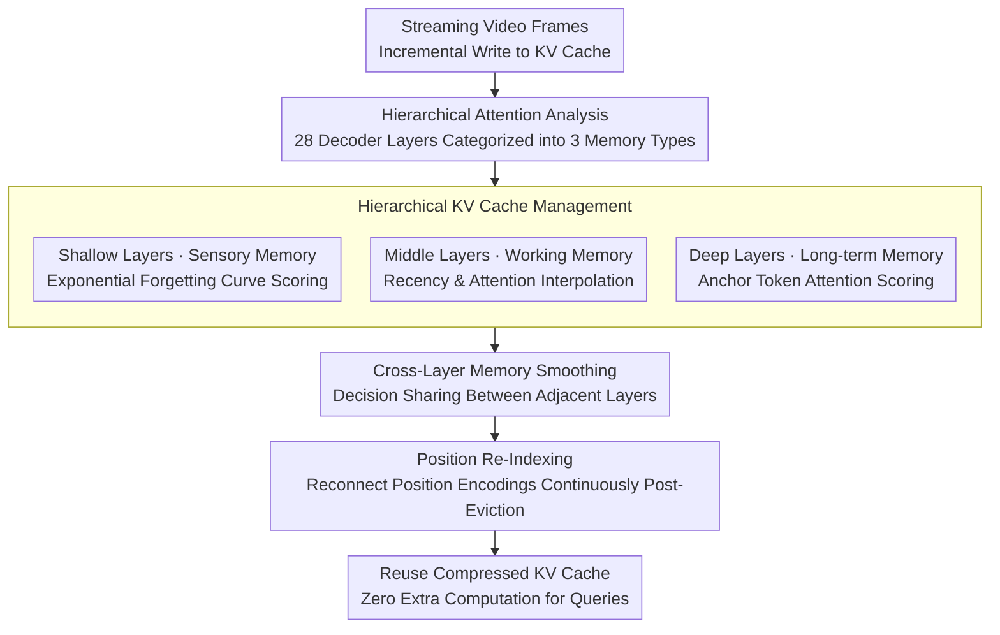

# HERMES: KV Cache as Hierarchical Memory for Efficient Streaming Video Understanding

**Conference**: ACL 2026  
**arXiv**: [2601.14724](https://arxiv.org/abs/2601.14724)  
**Code**: [GitHub](https://github.com/haowei-freesky/HERMES)  
**Area**: Video Understanding / Streaming Inference  
**Keywords**: Streaming Video, KV Cache Management, Hierarchical Memory, Real-time Response, Training-free

## TL;DR

This paper proposes HERMES, which conceptualizes KV cache as a hierarchical memory framework (shallow = sensory memory, middle = working memory, deep = long-term memory) based on a mechanistic analysis of MLLM decoder hierarchical attention preferences. It achieves training-free efficient streaming video understanding, maintaining or improving accuracy while reducing video tokens by 68%. The TTFT latency is <30ms, 10x faster than the previous SOTA.

## Background & Motivation

**Background**: MLLMs have made significant progress in offline video understanding, but extending them to streaming video inputs remains challenging—requiring simultaneous maintenance of performance, real-time response, and low GPU memory overhead. Existing streaming methods are categorized into external memory (storing video content as descriptions or patches for retrieval) and internal memory (direct management within the KV cache).

**Limitations of Prior Work**: (1) External memory methods require retrieval and multimodal pre-filling when a query arrives, leading to high latency and a lack of end-to-end coherence; (2) Cache methods like ReKV and LiveVLM offload video segments to CPU/disk, requiring additional retrieval operations during querying, which results in significant latency; (3) Existing methods use coarse-grained eviction strategies (e.g., applying FIFO uniformly to all layers), ignoring differences in attention preferences across layers.

**Key Challenge**: While the KV cache is inherently the model's internal latent memory and suitable for training-free management in streaming scenarios, existing methods fail to exploit inter-layer attention patterns—different layers "remember" video information in different ways.

**Goal**: Design a KV cache management method based on hierarchical attention analysis that can be integrated into existing MLLMs without training, enabling true real-time streaming video QA.

**Key Insight**: An attention visualization analysis of the 28-layer LLaVA-OV-7B decoder reveals three distinct hierarchical memory patterns.

**Core Idea**: Shallow layers exhibit strong recency preference (sensory memory), managed by exponential decay; deep layers focus on frame-level "anchor tokens" (long-term memory), managed by attention weights; middle layers transition between the two (working memory), managed by interpolation. Cross-layer smoothing and position re-indexing are added to ensure consistency.

## Method

### Overall Architecture

HERMES aims to solve the long-standing problem in streaming video QA: maintaining performance while ensuring real-time response and bounded GPU memory. Its starting point is treating the KV cache as the model's internal "latent memory," managed directly without training. The methodology centers on an observation: attention visualization of the 28-layer LLaVA-OV-7B decoder shows that different layers have vastly different "memory modes." Shallow layers strongly prefer recent frames (sensory memory), deep layers focus solely on frame-level anchor tokens (long-term memory), and middle layers transition between them (working memory). Accordingly, HERMES incorporates three components: Hierarchical KV Cache Management applying different scoring and eviction strategies per layer type; Cross-Layer Memory Smoothing to prevent inconsistency across layers; and Position Re-indexing to repair position encodings after eviction. During inference, the compressed KV cache is reused directly, requiring zero extra computation when a user asks a question.

### Key Designs

**1. Hierarchical KV Cache Management: Different "Forgetting Rules" for Different Layers**

Existing cache methods use coarse, uniform eviction strategies (e.g., applying FIFO to all layers), ignoring inter-layer attention preference differences. Based on attention analysis, HERMES assigns token importance scores for three categories: shallow layers use an exponential forgetting curve $S_i^l = \alpha_i^l \cdot e^{-k\Delta t_i}$, where newer tokens are more important; deep layers use attention weights based on pseudo-queries $S_i^l = \alpha_i^l \cdot W_i^l$, retaining only anchors; middle layers use a layer-dependent weight $\omega_l$ to interpolate between recency and attention scores: $S_i^l = (1-\omega_l) A_i^l + \omega_l R_i^l$.

The justification for this differentiation is direct—attention visualization clearly shows unique memory functions per layer. A "one-size-fits-all" FIFO or pure attention eviction cannot simultaneously satisfy the shallow layers' need for "freshness" and the deep layers' need for "anchors." Supporting evidence shows the interval between deep-layer anchor tokens exactly matches the tokens per frame (196), confirming deep layers capture key points frame-by-frame.

**2. Cross-Layer Memory Smoothing: Preventing Disparate Token Fates**

If each layer evicts independently, information from the same frame might be kept in some layers but discarded in others, fragmenting visual memory and breaking end-to-end inference coherence. HERMES allows adjacent layers to share partial eviction decisions, ensuring consistency for video tokens across multiple layers. This balances the flexibility of hierarchical management with the coherence of cross-layer inference.

**3. Position Re-Indexing: Reconnecting Indices After Eviction**

Directly removing intermediate tokens creates jumps in position indices, to which position-based attention mechanisms like RoPE are sensitive, leading to anomalous calculations. After each eviction, HERMES re-maps the positions of retained tokens into a continuous sequence $[0, |M|)$, preventing attention disordered caused by position discontinuity and ensuring the compressed cache remains functional.

### Loss & Training

Completely training-free. The design draws inspiration from Ebbinghaus's Forgetting Curve theory and cognitive psychology models of hierarchical memory. To calculate deep-layer attention weights, a generic guidance prompt serves as a pseudo-query. The exponential decay rate $k$ and interpolation parameters are manually set hyperparameters.

## Key Experimental Results

### Main Results

**Streaming Video Benchmarks (LLaVA-OV-7B)**

| Method | StreamingBench | EgoSchema | MVBench | Video-MME | Average |
|------|---------------|-----------|---------|-----------|------|
| Full (No Comp.) | 53.2 | 58.1 | 69.3 | 61.8 | 60.6 |
| ReKV | 51.8 | 55.2 | 67.1 | 59.4 | 58.4 |
| StreamMem | 52.1 | 56.8 | 68.5 | 60.1 | 59.4 |
| **HERMES** | **59.3** | **58.9** | **69.8** | **62.4** | **62.6** |

### Ablation Study

**Efficiency Comparison (Single A800 GPU)**

| Method | TTFT (ms) | GPU Memory | Token Reduction |
|------|----------|---------|-----------|
| Full | ~3000+ | Linear Growth | 0% |
| ReKV | ~1500 | Requires CPU Mem | ~50% |
| **HERMES** | **<30** | **Constant** | **68%** |

### Key Findings

- While reducing video tokens by 68%, HERMES improves performance on streaming benchmarks by 11.4%—proving that removing redundant tokens actually improves inference quality.
- TTFT < 30ms with constant GPU memory ensures zero OOM risk as input frames increase—zero extra computation when a query arrives.
- The hierarchical memory model generalizes across multiple MLLMs—it is not limited to LLaVA-OV.
- The recency preference in shallow layers aligns with the Ebbinghaus Forgetting Curve, and the anchor pattern in deep layers matches the per-frame token count (196).

## Highlights & Insights

- The hierarchical memory concept from cognitive psychology maps precisely to Transformer layer attention patterns—this is not just an analogy but a finding supported by quantitative attention analysis.
- The zero-extra-latency design is critical for real-time applications—methods like ReKV reduce storage but still require retrieval during querying.
- Its training-free and plug-and-play nature allows for direct application to existing MLLMs, lowering the barrier to practical use.

## Limitations & Future Work

- The definition of hierarchical boundaries (shallow/middle/deep) depends on specific model analysis; different architectures may require re-determination.
- Using pseudo-queries instead of real user queries might introduce bias in specific scenarios.
- Validation was limited to video streaming; applicability to text or multimodal streaming has not been explored.
- The exponential decay rate $k$ and interpolation parameters require manual tuning.

## Related Work & Insights

- **vs ReKV/LiveVLM**: These require CPU offloading and retrieval, causing high latency; HERMES reuses the KV cache directly on the GPU.
- **vs StreamMem**: Uses chat template tokens to guide compression but lacks fine-grained management; HERMES implements precise management based on hierarchical attention.
- **vs StreamingLLM**: The attention sink mechanism retains initial tokens but ignores inter-layer differences; HERMES uses hierarchical specialization for smarter eviction.

## Rating

- Novelty: ⭐⭐⭐⭐⭐ Hierarchical memory conceptualization and differentiated management strategies are highly novel.
- Experimental Thoroughness: ⭐⭐⭐⭐⭐ Multiple streaming benchmarks, efficiency analysis, attention visualization, and ablations.
- Writing Quality: ⭐⭐⭐⭐⭐ Clear logical chain from mechanistic analysis to methodology design.
- Value: ⭐⭐⭐⭐⭐ A practical solution for real-time streaming video understanding with 10x TTFT speedup.

<!-- RELATED:START -->

## Related Papers

- [\[CVPR 2026\] Accelerating Streaming Video Large Language Models via Hierarchical Token Compression](../../CVPR2026/vlm_efficiency/accelerating_streaming_video_large_language_models_via_hierarchical_token_compre.md)
- [\[ICLR 2026\] SURGE: Surprise-Guided Token Reduction for Efficient Video Understanding with VLMs](../../ICLR2026/vlm_efficiency/surge_surprise-guided_token_reduction_for_efficient_video_understanding_with_vlm.md)
- [\[ICLR 2026\] ST-SimDiff: Balancing Spatiotemporal Similarity and Difference for Efficient Video Understanding with MLLMs](../../ICLR2026/vlm_efficiency/st-simdiff_balancing_spatiotemporal_similarity_and_difference_for_efficient_vide.md)
- [\[ACL 2026\] HiPrune: Hierarchical Attention for Efficient Token Pruning in Vision-Language Models](hiprune_hierarchical_attention_for_efficient_token_pruning_in_vision-language_mo.md)
- [\[CVPR 2026\] FlashCache: Frequency-Domain-Guided Outlier-KV-Aware Multimodal KV Cache Compression](../../CVPR2026/vlm_efficiency/flashcache_frequency_kv_cache_compression.md)

<!-- RELATED:END -->
