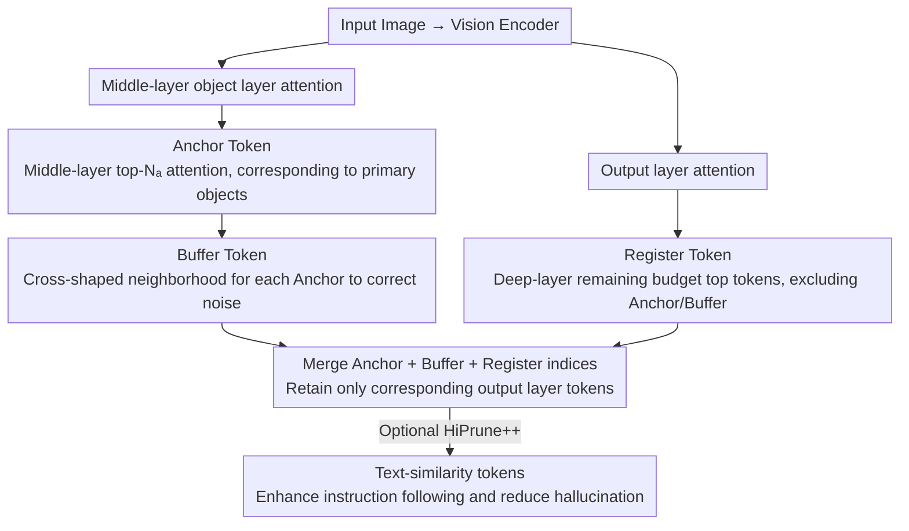

# HiPrune: Hierarchical Attention for Efficient Token Pruning in Vision-Language Models

**Conference**: ACL 2026 Findings  
**arXiv**: [2508.00553](https://arxiv.org/abs/2508.00553)  
**Code**: [GitHub](https://github.com/Danielement321/HiPrune)  
**Area**: Multimodal Efficiency / Vision Token Compression  
**Keywords**: Vision Token Pruning, Hierarchical Attention, Training-free, Model-agnostic, VLM Acceleration

## TL;DR

This paper identifies a hierarchical attention pattern in vision encoders—middle layers focus on primary objects while deep layers capture global information. Based on this, it proposes HiPrune, a training-free and model-agnostic vision token pruning method. By selecting three types of tokens (Anchor/Buffer/Register) to preserve multi-level visual information, it maintains 99.3% performance using only 1/3 of the tokens, reducing FLOPs by 58.7%.

## Background & Motivation

**Background**: VLMs encode images into a large number of tokens (576 in LLaVA-1.5, and over 10,000 in high-resolution scenarios), leading to significant computational and memory overhead. Visual tokens exhibit high redundancy—randomly removing 50% of visual tokens results in much lower performance degradation compared to removing 5% of text tokens.

**Limitations of Prior Work**: (1) Methods like FastV perform pruning within the LLM decoder based on attention scores but fail to utilize the intrinsic properties of the vision encoder itself; (2) Methods based on CLS token attention are inapplicable to encoders without a CLS token (e.g., SigLIP); (3) Most methods are sensitive to specific models and require targeted tuning.

**Key Challenge**: Existing pruning methods either depend on feedback from the LLM side (causing computational waste by encoding all tokens before pruning) or use single-dimensional metrics (such as only using the last layer's attention), ignoring the fact that different layers of a vision encoder capture information at different semantic hierarchies.

**Goal**: Design a universal token pruning strategy by leveraging the intrinsic hierarchical attention patterns of vision encoders.

**Key Insight**: Systematically analyzing the hierarchical attention patterns of various vision encoders, such as CLIP, SigLIP, DeiT, and VJEPA2, reveals consistent laws of hierarchical specialization.

**Core Idea**: High-attention tokens in middle layers correspond to primary objects (Anchor), which, combined with spatial neighborhoods (Buffer), preserve local semantics. High-attention tokens in deep layers are uniformly distributed across the image (Register) to preserve global information. Allocating the token budget across these three categories allows for a compact image representation.

## Method

### Overall Architecture

HiPrune operates before the vision encoder output: (1) Extract attention scores from an intermediate layer to select high-attention tokens as Anchors; (2) Select spatial neighbors of Anchors as Buffers; (3) Extract attention scores from the output layer to select high-attention tokens for the remaining budget as Registers; (4) HiPrune++ optionally adds tokens based on text similarity. Finally, only the output layer tokens corresponding to these indices are retained.

### Key Designs

**1. Anchor Token (Middle-layer Object Tokens): Extracting primary objects from intermediate attention to preserve local details.**

Most prior attention-based pruning methods only consider the last layer. However, high-attention tokens in the last layer represent globally distributed information rather than specific objects, causing local details to be pruned. HiPrune instead extracts attention scores $\mathbf{a}^{[l]}$ from a designated object layer $l$ (a middle layer of the vision encoder) and selects the top-$N_a$ tokens as Anchors. This design is supported by quantitative evidence: the authors found that the top 10% high-attention tokens in the middle layers have the highest IoU with COCO object segmentation masks. Crucially, this pattern is consistent across CLIP, SigLIP, DeiT, and VJEPA2, making Anchor selection independent of specific model architectures.

**2. Buffer Token (Spatial Neighborhood Tokens): Correcting attention noise with cross-neighborhoods to complete objects.**

Attention maps are inherently noisy; a few high-attention tokens may be scattered across the image rather than cleanly landing on objects. Relying solely on Anchors might miss object edges or be misled by isolated noise. The Buffer approach adds the four spatial neighbors (up, down, left, right) for each Anchor token:

$$\mathcal{I}_B = \cup\{\mathcal{I}_A - 1,\ \mathcal{I}_A + 1,\ \mathcal{I}_A - c,\ \mathcal{I}_A + c\}$$

where $c$ is the number of tokens per row. This spatial continuity ensures that scattered high-attention points are supported by surrounding tokens of the same object, resulting in more complete object regions. Experiments show that the Buffer's contribution is stable (improving performance from 97.5% to 99.3%) and robust to neighborhood shapes.

**3. Register Token (Deep-layer Global Tokens): Recovering scene-level global context from the output layer.**

Retaining only object tokens discards global information such as scene type and spatial layout. HiPrune fills the remaining budget with Register tokens selected from the output layer (final layer) attention scores, excluding already selected Anchors and Buffers. Deep layers are chosen because their high-attention tokens are uniformly distributed across the image, encoding global information that complements the object-focused middle layers.

### Loss & Training

This is a completely training-free method that does not modify any model parameters. HiPrune++ additionally utilizes the cosine similarity between the text encoder and visual tokens to select a small number of tokens to enhance instruction following.

## Key Experimental Results

### Main Results

**LLaVA-1.5-7B (576→192 tokens, 33.3%)**

| Method | GQA | MMB | MME | POPE | SQA | VQAv2 | Average |
|------|-----|-----|-----|------|-----|-------|------|
| Original (576 tokens) | 61.9 | 64.7 | 1862 | 85.9 | 69.5 | 78.5 | 100% |
| ToMe | 54.3 | 60.5 | — | — | — | — | — |
| FastV | 58.2 | 62.1 | — | — | — | — | — |
| **HiPrune** | **61.4** | **64.2** | **1852** | **85.6** | **69.1** | **78.1** | **99.3%** |

### Ablation Study

| Configuration | Average Performance Retention |
|------|-----------|
| Anchor Only (Middle) | 94.2% |
| Register Only (Deep) | 92.8% |
| Anchor + Register | 97.5% |
| **Anchor + Buffer + Register** | **99.3%** |

### Key Findings

- Maintaining 99.3% performance with 1/3 of the tokens reduces FLOPs by 58.7%, proving the high redundancy of visual tokens.
- The hierarchical attention pattern exists consistently across 6 different architectures (CLIP-L/B, SigLIP, SigLIP2, DeiT, VJEPA2), suggesting it is an inherent property of vision encoders rather than a product of specific training.
- HiPrune++ maintains 96.1% performance at extremely low budgets (1/9 tokens) and significantly reduces hallucinations.
- The contribution of Buffer tokens is small but stable—improving results from 97.5% to 99.3%—and is insensitive to neighborhood shapes (cross vs. square).

## Highlights & Insights

- The discovery that "middle layers focus on objects while deep layers focus on global information" is simple yet powerful, validated by both quantitative IoU analysis and qualitative attention map visualization.
- The training-free and model-agnostic design makes it a true "plug-and-play" tool.
- The three-token-type design captures three levels of image understanding: local details, spatial context, and global semantics.

## Limitations & Future Work

- The selection of the object layer $l$ needs to be determined for each encoder (typically the middle layer).
- Pruning may lose critical information for tasks requiring precise pixel-level understanding (e.g., OCR).
- Extensions to video token pruning have not been fully explored.
- Integration with dynamic resolution encoders requires further verification.

## Related Work & Insights

- **vs FastV**: FastV prunes inside the LLM decoder and requires encoding all tokens first; HiPrune prunes during the vision encoder stage, offering higher efficiency.
- **vs CLS-based Methods**: Reliance on the CLS token is not universal (SigLIP lacks CLS); HiPrune uses hierarchical attention scores, making it applicable to any ViT.
- **vs ToMe**: ToMe merges tokens via similarity, requiring training or extra computation; HiPrune uses pure index selection with zero additional overhead.

## Rating

- Novelty: ⭐⭐⭐⭐ The discovery of hierarchical attention patterns is novel, though the pruning method itself is relatively straightforward.
- Experimental Thoroughness: ⭐⭐⭐⭐⭐ Consistent validation across 4 VLMs and 6 vision encoders.
- Writing Quality: ⭐⭐⭐⭐⭐ Clear motivation and a complete logical chain from observation to method.
- Value: ⭐⭐⭐⭐⭐ Extremely high practical value as a plug-and-play tool with 58.7% FLOPs reduction.

<!-- RELATED:START -->

## Related Papers

- [\[ICLR 2026\] LearnPruner: Rethinking Attention-based Token Pruning in Vision Language Models](../../ICLR2026/vlm_efficiency/learnpruner_rethinking_attention-based_token_pruning_in_vision_language_models.md)
- [\[CVPR 2026\] SCoRe: Salience-Coverage Reduction for Vision Token Pruning in Vision-Language Models](../../CVPR2026/vlm_efficiency/score_salience-coverage_reduction_for_vision_token_pruning_in_vision-language_mo.md)
- [\[CVPR 2026\] TransPrune: Token Transition Pruning for Efficient Large Vision-Language Model](../../CVPR2026/vlm_efficiency/transprune_token_transition_pruning_for_efficient_large_vision-language_model.md)
- [\[ACL 2026\] HERMES: KV Cache as Hierarchical Memory for Efficient Streaming Video Understanding](hermes_kv_cache_as_hierarchical_memory_for_efficient_streaming_video_understandi.md)
- [\[CVPR 2026\] Attention-aware Inference Optimizations for Large Vision-Language Models with Memory-efficient Decoding](../../CVPR2026/vlm_efficiency/attention-aware_inference_optimizations_for_large_vision-language_models_with_me.md)

<!-- RELATED:END -->
