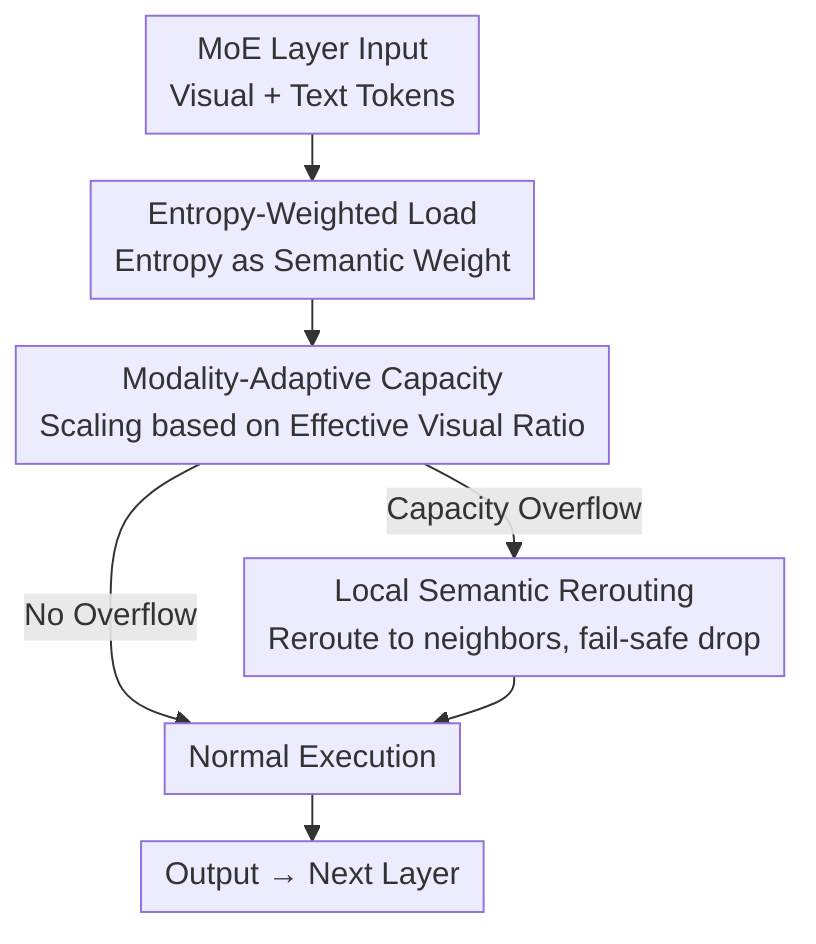

# MACS: Modality-Aware Capacity Scaling for Efficient Multimodal MoE Inference

**Conference**: ACL2026  
**arXiv**: [2605.05225](https://arxiv.org/abs/2605.05225)  
**Code**: TBD  
**Area**: LLM Efficiency / Multimodal VLM  
**Keywords**: MoE MLLM, Expert Parallelism, straggler effect, entropy-weighted load, training-free inference

## TL;DR
To address the "straggler" problem where Multimodal MoE models are bottlenecked by the "slowest expert" during Expert Parallelism (EP) inference, MACS re-estimates expert load using the Shannon entropy of visual tokens as semantic importance weights. It dynamically scales expert capacity based on the real-time modality composition of the batch. MACS is a training-free inference framework that maintains nearly identical performance (averaging 99.7% of vanilla MoE) across 12 multimodal benchmarks, significantly outperforming token-counting methods like CAI-MoE.

## Background & Motivation
**Background**: MoE has become a mainstream architecture for scaling Multimodal Large Language Models (MLLMs)—each token sparsely activates only a small subset of experts, decoupling parameter count from inference computation. Deployment usually employs Expert Parallelism (EP), distributing different experts across multiple GPUs to improve throughput.

**Limitations of Prior Work**: EP inherently faces a synchronization bottleneck—at the end of each layer, all devices must wait for the GPU with the heaviest load to finish before proceeding. CAI-MoE formally defines this as the **straggler effect**: the latency of the entire layer is determined by the "straggler expert" with the maximum load, i.e., $\mathcal{L}_{\mathrm{MoE}}\propto\max_{j}|\mathcal{I}_j|$ (where $\mathcal{I}_j$ is the set of tokens assigned to expert $E_j$). CAI-MoE solves this by setting a static capacity limit $C=\gamma\cdot\frac{|\mathcal{T}|\cdot k}{N}$ and performing token dropping.

**Key Challenge**: Methods like CAI-MoE assume "every token has equal computational value" by simply counting token numbers. This assumption holds for text but fails completely in multimodal contexts for two reasons: (1) **Information Heterogeneity**—an image is encoded into hundreds of patch tokens, many of which are low-information background regions, yet they are treated equally with tokens carrying critical semantics (objects/text), leading to a severe misestimation of actual load. (2) **Modality Dynamics**—the ratio of visual tokens to text tokens fluctuates wildly across tasks (from image-heavy OCR to text-heavy reasoning), and fixed capacity allocation cannot adapt to these changes, further exacerbating load imbalance and synchronization delays.

**Goal**: To redesign expert capacity allocation during EP inference without additional training or weight modification, ensuring load estimation reflects true semantic value and adapts to input modality compositions.

**Key Insight & Core Idea**: The authors observe that "the information content of a visual token can be approximated by its entropy"—background regions have flat feature distributions (high entropy), while critical regions have low entropy. Consequently, **entropy-weighted load** replaces token counting, **modality-adaptive capacity** redistributes capacity between visual and text experts based on real-time visual ratios, and **local semantic rerouting** handles remaining overflow tokens.

## Method

### Overall Architecture
MACS is a training-free inference-time framework applied during the capacity allocation phase of each MoE layer. It consists of three sequential components: first, re-estimating expert load from "token counts" to "entropy-weighted sums" (addressing information heterogeneity); second, dynamically redistributing capacity between visual and text experts based on the effective visual ratio of the current batch (addressing modality dynamics); and third, utilizing local semantic rerouting plus fail-safe dropping to minimize information loss for overflow tokens. This pipeline introduces no trainable parameters and only requires a one-time statistical modaltiy preference check on a calibration set.

### Key Designs

**1. Entropy-Weighted Expert Load: Measuring Load by Information instead of Token Count**

This step directly addresses the issue where background and semantic tokens are treated equally. For a visual token $x_v$, the Shannon entropy $H(x_v)$ of its feature $z\in\mathbb{R}^D$ after Softmax is used as a proxy for "information flatness"—background regions are uniform with high entropy, while critical regions have low entropy. To ensure stability across images and models, z-score normalization is applied to visual tokens within a batch:

$$\tilde{H}(x_v)=\frac{H(x_v)-\mu_{\mathcal{B}}}{\sigma_{\mathcal{B}}+\epsilon}$$

Then, semantic weights $w(x)$ are defined: visual tokens use $\sigma(-\delta\cdot\tilde{H}(x))$ (where $\sigma$ is Sigmoid and $\delta$ controls sensitivity), and text tokens are assigned a full weight of $1.0$ due to high density. The **effective load** of an expert becomes the weighted sum $\tilde{L}_j=\sum_{x\in\mathcal{I}_j}w(x)$. This allows experts to process more low-information background tokens without reaching capacity, reserving space for critical semantic tokens.

**2. Modality-Adaptive Capacity Scaling: Dynamic Allocation based on Real-time Ratios**

Static capacity factors are blind to the modality composition of a batch; visual experts overload during image-dense tasks while text experts remain idle, and vice versa. MACS calculates the **effective visual ratio**:

$$R_v=\frac{\sum_{x\in\mathcal{T}_{vis}}w(x)}{\sum_{x\in\mathcal{T}}w(x)}$$

This reflects actual compute demand better than a raw token count ratio. Experts are categorized as visual $\mathcal{E}_{vis}$, text $\mathcal{E}_{txt}$, or shared $\mathcal{E}_{shared}$ based on activation frequency on a held-out calibration set, represented by modality bias $m_j\in\{+1,-1,0\}$. The capacity of each expert is scaled as:

$$C_j=C_{base}\cdot\left(1+\rho\cdot m_j\cdot(R_v-0.5)\right)$$

Where $\rho$ controls adaptation intensity. When $R_v > 0.5$ (visual dominant), visual expert capacities increase while text capacities decrease. This real-time oscillation of capacity supply mitigates the straggler effect amplified by multimodal inputs.

**3. Local Semantic Rerouting: Two-stage Overflow Handling**

Even with optimized allocation, some tokens may exceed capacity. MACS implements a two-stage process: first, attempting to **reroute** overflow tokens to semantically similar experts in the same group that still have capacity; second, performing a fail-safe drop only if rerouting is impossible. This minimizes the penalty of "necessary drops" and acts as a safety net for strict capacity constraints.

### Loss & Training
MACS is entirely training-free: no fine-tuning or weight changes are required. The only offline step is calculating modality activation frequencies on a calibration set to classify experts. All inference-time calculations (entropy, normalization, scaling, rerouting) are lightweight plug-and-play operations.

## Key Experimental Results

### Main Results
Evaluation was conducted on three MoE MLLM backbones (Qwen3-VL-30B-A3B-Instruct, InternVL3.5-30B-A3B, Kimi-VL-A3B-Instruct) across 12 benchmarks. Results are normalized against Vanilla MoE (no constraints, maximum accuracy) at 100%. Table shows average relative performance (capacity factor $\gamma_0=1.0$):

| Method | Qwen3-VL-30B-A3B | InternVL3.5-30B-A3B | Description |
|------|------|------|------|
| Vanilla MoE | 100.00 | 100.00 | No capacity limit, speed baseline |
| CAI-MoE (Token Drop) | 91.80 | 90.22 | Token count + drop, highest loss |
| CAI-MoE (Expanded) | 94.69 | 93.93 | Expanded capacity, still loses points |
| MACS (w/o Expanded) | 99.20 | 98.96 | Entropy-weighted + Adaptive only |
| MACS (**Ours**) | **99.78** | **99.72** | Full MACS, nearly lossless |

On Kimi-VL-A3B, CAI-MoE dropped to 92.24%, while MACS remained near vanilla levels. Conclusion: Under the same capacity constraints (identical acceleration), MACS recovers the 8–10% performance loss caused by CAI-MoE's incorrect token dropping.

### Ablation Study

| Configuration | Relative Perf (Qwen3-VL) | Description |
|------|------|------|
| MACS (**Ours**) | 99.78 | Full: Entropy + Adaptive + Rerouting |
| MACS (w/o Expanded) | 99.20 | Slight drop without expansion but beats CAI-MoE |
| CAI-MoE (Expanded) | 94.69 | Equivalent expansion but using token counts |
| CAI-MoE (Token Drop) | 91.80 | Pure token counting + dropping |

### Key Findings
- Shifting load measurement from "token counting" to "entropy weighting" is the primary source of gain: MACS (w/o Expanded) improves performance from ~92-95% to ~99%, suggesting semantic value variance is the root cause of multimodal stragglers.
- Modality-adaptive scaling further reduces loss to <0.3%, proving that adapting to modality composition has marginal value.
- The method is consistently effective across different MoE MLLM backbones and is easy to deploy due to being training-free.

## Highlights & Insights
- **Entropy as a proxy for "Compute Value" is clever**: It distinguishes background from semantic tokens without extra labels or training. This "measuring info instead of tokens" philosophy can be applied to other sparse architectures (e.g., KV cache compression, token pruning).
- **Modality allocation as Zero-sum Redistribution** ($m_j\cdot(R_v-0.5)$) is intuitive: It uses a single scalar $R_v$ to drive global rebalancing between experts based on batch needs.
- **Training-free and Plug-and-play** are the biggest selling points: It can be integrated into deployed models at near-zero cost, making it more practical than schemes requiring re-training.

## Limitations & Future Work
- Entropy as a semantic proxy is heuristic; it might not hold monotonically for all vision encoder feature distributions.
- Expert categorization (visual/text/shared) relies on a calibration set; if the deployment distribution shifts significantly, categorization might drift.
- The evaluation focuses on relative accuracy; absolute numbers for end-to-end wall-clock latency/throughput improvements are needed to quantify the exact speedup.
- Robustness ranges for hyperparameters like $\delta$ (entropy sensitivity) and $\rho$ (adaptation strength) are not fully explored.

## Related Work & Insights
- **vs CAI-MoE**: Both manage capacity to fight stragglers in EP. CAI-MoE assumes token equivalence; MACS uses entropy weighting and adaptive capacity to break this assumption, outperforming it in multimodal scenarios.
- **vs Expert Pruning (Stun / MoE-Pruner)**: Pruning methods reduce compute by removing experts, which often causes performance drops in multimodal settings. MACS focuses on intelligent capacity redistribution without reducing the total number of experts or changing weights.

## Rating
- Novelty: ⭐⭐⭐⭐ Introducing entropy-weighted load and modality-adaptive capacity to MoE MLLM EP inference is a fresh and targeted perspective.
- Experimental Thoroughness: ⭐⭐⭐⭐ Broad coverage (3 backbones, 12 benchmarks) with clear ablation, though lacking absolute latency figures.
- Writing Quality: ⭐⭐⭐⭐ Clear problem decomposition (heterogeneity/dynamics) with well-aligned formulas and motivation.
- Value: ⭐⭐⭐⭐ Training-free and plug-and-play; direct practical value for efficient inference of MoE MLLMs.

<!-- RELATED:START -->

## Related Papers

- [\[CVPR 2026\] MASQuant: Modality-Aware Smoothing Quantization for Multimodal Large Language Models](../../CVPR2026/vlm_efficiency/masquant_modality-aware_smoothing_quantization_for_multimodal_large_language_mod.md)
- [\[ACL 2025\] MadaKV: Adaptive Modality-Perception KV Cache Eviction for Efficient Multimodal Long-Context Inference](../../ACL2025/vlm_efficiency/madakv_adaptive_modality-perception_kv_cache_eviction_for_efficient_multimodal_l.md)
- [\[ACL 2026\] From Inheritance to Saturation: Disentangling the Evolution of Visual Redundancy for Architecture-Aware MLLM Inference Acceleration](from_inheritance_to_saturation_disentangling_the_evolution_of_visual_redundancy_.md)
- [\[CVPR 2026\] Attention-aware Inference Optimizations for Large Vision-Language Models with Memory-efficient Decoding](../../CVPR2026/vlm_efficiency/attention-aware_inference_optimizations_for_large_vision-language_models_with_me.md)
- [\[CVPR 2026\] SegMo: Co-Designing Content-Aware Sparsity and Locally-Cohesive Segment Parallelism for Efficient VLM Inference](../../CVPR2026/vlm_efficiency/segmo_co-designing_content-aware_sparsity_and_locally-cohesive_segment_paralleli.md)

<!-- RELATED:END -->
