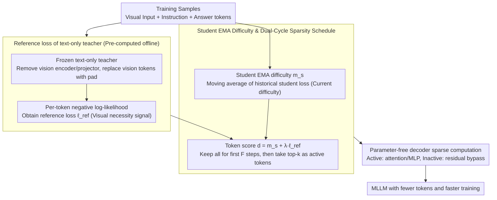

# ReGATE: Learning Faster and Better with Fewer Tokens in MLLMs

**Conference**: ACL 2026  
**arXiv**: [2507.21420](https://arxiv.org/abs/2507.21420)  
**Code**: https://people-robots.github.io/regate (Project Page)  
**Area**: Multimodal VLM / Training Acceleration / Token Pruning  
**Keywords**: Multimodal Large Language Models, Training Acceleration, Token Elision, Teacher-Student, Sparse Computation

## TL;DR
ReGATE utilizes a frozen text-only teacher to estimate which output tokens require visual information, combined with the student's historical learning difficulty to dynamically select training tokens. This allows MLLMs to train faster with fewer tokens without changing architecture or adding parameters, achieving or exceeding standard fine-tuning performance on multiple image and video benchmarks.

## Background & Motivation
**Background**: The training cost of MLLMs is primarily driven by long-sequence self-attention and large-scale visual inputs. This is particularly evident in video tasks, where multiple frames are expanded into a massive number of visual tokens entered into the LLM backbone alongside instruction and answer tokens, making each forward/backward pass expensive.

**Limitations of Prior Work**: Most token reduction, merging, and compression methods are designed for the inference phase. While they speed up generation, they fail to reduce the number of tokens that must be processed during each training step. Existing training-time acceleration methods either come from text-only LMs or rely on additional modules, specialized visual token scorers, or heuristic pruning, making them difficult to transfer seamlessly across different MLLMs.

**Key Challenge**: Not all tokens are equally worth calculating during training. Functional words, template words, or tokens directly predictable from textual context provide limited contribution to multimodal grounding. However, simply pruning tokens based on naive rules might mistakenly delete critical clues for color, action, object attributes, and temporal sequences that require visual evidence.

**Goal**: Construct a training-time token elision framework that can identify key tokens requiring visual grounding while dynamically adjusting the computational budget based on the student's current learning state, all without altering model structure or adding trainable parameters.

**Key Insight**: The authors use "whether the textual context can predict the token" as a proxy signal for visual dependence. If a frozen text-only teacher can easily predict a token after masking visual input, the marginal value of that token for multimodal training is likely low. Conversely, a high reference loss often indicates a need for visual information.

**Core Idea**: Use the reference loss from a text-only teacher to represent visual necessity and the student's EMA loss to represent current learning difficulty. By summing these signals, high-scoring tokens are selected for sparse computation, focusing training power on tokens that are "both visually dependent and still difficult to learn."

## Method
ReGATE stands for Reference-Guided Adaptive Token Elision. Instead of crudely deleting visual tokens, it calculates an importance mask for output tokens during training and allows the transformer decoder to perform primary computations only on selected tokens. Inactive tokens do not participate in the recomputation of attention and MLP but retain their original representations via residuals. This maintains the functional form and ensures compatibility with pre-trained weights while processing fewer low-value tokens per step.

### Overall Architecture
The workflow is divided into two phases. The first phase is reference loss generation: a frozen text-only teacher is constructed from the student MLLM's LLM backbone by removing the visual encoder and projector and replacing visual tokens with `<pad>` placeholders to keep sequence length consistent. The teacher calculates the per-token negative log-likelihood for the answer, obtaining $\ell^{ref}_{b,i}$. High reference loss indicates that the teacher struggles to predict the token using text alone, suggesting reliance on visual evidence.

The second phase is student training: during training, the EMA difficulty $m_{s,i}$ for each token of every sample is maintained and updated with the current student loss. ReGATE combines the two into a token score $d_{b,i}=m_{s,i}+\lambda\ell^{ref}_{b,i}$, then selects the top-$k$ tokens as active tokens according to the current sparsity schedule. Active tokens undergo normal attention, MLP, and backpropagation; inactive tokens skip major computations, reducing token usage, training time, and activation memory.

### Key Designs

**1. Reference loss of text-only teacher: Using "textual predictability" as a proxy for visual necessity**

In multimodal training, the truly expensive part is learning cross-modal evidence rather than repeatedly training functional or template words. However, these low-value tokens are mixed with tokens for color, action, and object attributes that require visual input, and simple rules can easily cause collateral damage. ReGATE's solution is to copy a frozen text-only teacher from the student's own LLM backbone, remove the vision encoder and projector, and replace all visual tokens with `<pad>` placeholders to keep sequence length unchanged. The teacher is forced to predict answer tokens based only on textual context, calculating $\ell^{ref}_{b,i}$ per token. High reference loss implies the teacher cannot guess the token from text, indicating a high likelihood of visual grounding dependence. This signal requires no manual labeling, can be pre-computed offline, and effectively labels each output token for "visual necessity."

**2. Student EMA difficulty and dual-cycle sparsity schedule: Adapting pruned tokens over training progress**

The teacher only reflects static visual dependence, but a token that is difficult now might not remain so—calculating already-learned tokens is wasteful. ReGATE thus maintains an EMA difficulty $m_{s,i}$ of historical student loss for each token, updated via $m_{s,i}\leftarrow\beta m_{s,i}+(1-\beta)\ell^{stu}_{b,i}$. This is combined with the teacher signal to form a token score:

$$d_{b,i}=m_{s,i}+\lambda\ell^{ref}_{b,i}$$

Training operates in cycles of $C$ steps. In the first $F$ steps of each cycle, all tokens are kept to stabilize difficulty estimates, after which only the highest-scoring $p_{sparse}$ proportion are kept as active tokens. This selection ensures the model neither dwells on tokens that have become easy nor follows static teacher signals while ignoring the student's current learning state. Compute is guided toward the intersection of "visually necessary" and "still difficult to learn."

**3. Parameter-free decoder sparse computation: Translating token masks into actual compute savings**

Simply masking tokens at the loss layer does not save the bulk of forward/backward overhead. ReGATE sinks sparsity into the decoder layers: query/key/value generation and attention are performed only for active tokens. The MLP also only gathers hidden states of active tokens for calculation before scattering them back. Inactive tokens pass through the residual path directly without receiving gradients. Since the functional form of the model is unchanged and pre-trained weights remain compatible, this sparsification reduces training time and activation memory without adding trainable parameters.

### Loss & Training
ReGATE maintains the original MLLM fine-tuning objective; only the tokens participating in primary computations change. In experiments, the teacher reference loss is pre-computed and cached for the entire fine-tuning dataset before training to avoid running the teacher at each step. Default hyperparameters include a cycle $C=128$, stable full-token steps $F=16$, sparsity ratio $p_{sparse}=0.5$, global warm-up of 100 iterations, EMA decay $\beta=0.9$, and teacher loss weight $\lambda=0.5$. VideoLLaMA2 and VideoChat2 experiments use 4 H100 GPUs, while InternVL3.5 uses 16 H100 GPUs. The method covers both full fine-tuning and LoRA fine-tuning.

## Key Experimental Results

### Main Results
Image understanding experiments show that while reducing tokens by 41% to 44%, ReGATE often improves performance on tasks like ScienceQA, MME, and VizWiz. The two MME metrics correspond to perception / cognition.

| Model | Tokens | ScienceQA | MME | VizWiz | POPE | SEED-I |
|------|--------|-----------|-----|--------|------|--------|
| VideoChat2 | 3.93B | 40.8 | 314.6 / 1244.0 | 28.5 | 86.2 | 45.9 |
| VideoChat2-ReGATE | 2.22B (↓43.51%) | 46.6 | 360.7 / 1287.8 | 32.5 | 85.1 | 47.2 |
| VideoLLaMA2 | 83.82M | 61.4 | 376.4 / 1474.0 | 46.8 | 86.7 | 70.4 |
| VideoLLaMA2-ReGATE | 49.27M (↓41.22%) | 80.5 | 391.1 / 1507.1 | 48.0 | 87.5 | 70.0 |
| InternVL3.5 | 3.96B | 93.3 | 681.6 / 1694.3 | 60.6 | 91.6 | 76.8 |
| InternVL3.5-ReGATE | 2.32B (↓41.41%) | 94.4 | 689.3 / 1698.8 | 61.5 | 93.1 | 76.6 |

Long and short video experiments further verify that ReGATE is not limited to static images. It shows improvements on most Video-MME, MLVU, MVBench, and Perception tasks, though slight declines occur in EgoSchema, LongVideoBench, or NExT-QA, indicating limitations of fixed sparsity ratios.

| Model | Tokens | Video-MME | LongVideoBench | MLVU | EgoSchema | MVBench | Perception |
|------|--------|-----------|----------------|------|-----------|---------|------------|
| VideoChat2 | 3.93B | 26.0 | 21.8 | 36.0 | 55.6 | 55.7 | 48.4 |
| VideoChat2-ReGATE | 2.22B | 32.7 | 24.3 | 40.5 | 54.8 | 56.6 | 50.0 |
| VideoLLaMA2 | 83.82M | 53.7 | 47.7 | 53.2 | 58.2 | 52.0 | 53.0 |
| VideoLLaMA2-ReGATE | 49.27M | 54.5 | 47.6 | 54.5 | 56.4 | 53.6 | 54.1 |
| InternVL3.5 | 3.96B | 62.4 | 57.9 | 63.7 | 64.7 | 68.3 | 65.3 |
| InternVL3.5-ReGATE | 2.32B | 63.0 | 58.0 | 64.2 | 63.9 | 69.6 | 66.7 |

The efficiency table directly demonstrates the "learning faster" conclusion. Aggressive ReGATE approaches the baseline in significantly fewer GPU-hours, while extended ReGATE exceeds baseline average accuracy with less training time.

| Model | Setting | Tokens ↓ | Teacher Cost | Train Time | Avg. Mem/GPU | Avg. Acc. ↑ |
|------|------|----------|--------------|------------|--------------|-------------|
| VideoLLaMA2 | Baseline | 83.82M | - | 129.6 | 69.1 GB | 48.2 |
| VideoLLaMA2 | ReGATE extended | 49.27M | 2.1 | 107.6 | 61.3 GB | 48.9 |
| VideoLLaMA2 | ReGATE fast | 29.32M | 2.1 | 64.0 | - | 48.0 |
| VideoChat2 | Baseline | 3.93B | - | 148.8 | 70.8 GB | 46.1 |
| VideoChat2 | ReGATE extended | 2.22B | 10.0 | 130.0 | 63.7 GB | 47.8 |
| VideoChat2 | ReGATE fast | 1.51B | 10.0 | 86.4 | - | 46.0 |
| InternVL3.5 | Baseline | 3.96B | - | 435.2 | 58.3 GB | 61.8 |
| InternVL3.5 | ReGATE extended | 2.32B | 11.3 | 374.4 | 51.9 GB | 62.2 |
| InternVL3.5 | ReGATE fast | 1.63B | 11.3 | 262.4 | - | 61.6 |

### Ablation Study
Ablations in the appendix show both signals are necessary. Using only student EMA or only reference loss is inferior to combined signals, and a capacity-aligned teacher is more suitable than one that is too small or too large.

| Ablation Target | Setting | Avg. Acc. | Explanation |
|----------|------|-----------|------|
| λ weight | λ=0.0, Student EMA only | 47.7 | Considers difficulty only; lacks visual dependency signal |
| λ weight | λ=1.0, Reference Loss only | 46.4 | Considers teacher only; ignores student's current state |
| λ weight | λ=0.5, Combined signal | 48.9 | Complementary signals yield best performance |
| Teacher Capacity | Qwen2-1.5B | 45.4 | Teacher too weak; misidentifies linguistic difficulty as visual focus |
| Teacher Capacity | Qwen2-57B | 46.8 | Teacher too strong; guesses via world knowledge, underestimating visual dependency |
| Teacher Capacity | Qwen2-7B | 48.9 | Aligned with student capacity and tokenizer; most reliable signal |

### Key Findings
- ReGATE reduces tokens by approximately 41% to 44% across three different MLLMs and improves most zero-shot image and video understanding metrics.
- Acceleration effects vary by fine-tuning method: VideoLLaMA2 (full fine-tuning) benefited most, while VideoChat2 (LoRA) saw smaller time gains because its backward pass is already light.
- Reference teacher capacity is not "the larger, the better." An overly strong teacher might use world knowledge to "guess" visual words, causing the model to prune tokens the student actually needs for grounding.
- A fixed $p_{sparse}=0.5$ is simple and stable, but failure cases in the appendix show some useful tokens are still skipped due to the fixed ratio.
- Attention visualization reveals that models trained with ReGATE focus more on task-relevant regions like hands and manipulated objects, suggesting token elision shifts the learning focus besides saving compute.

## Highlights & Insights
- The most ingenious aspect is using a text-only teacher as a visual dependency probe. It doesn't require labeling which words need the image—just checking predictability without visual input provides a fine-grained token signal.
- The paper avoids complex architectural changes. ReGATE adds no trainable parameters and doesn't require rewriting model structures, making it easier to migrate than many training-time compression methods.
- Combining student EMA and teacher reference loss is natural: the former identifies what the model hasn't learned, and the latter identifies what likely requires vision. The combination is more robust than either alone.
- Results suggest that training acceleration doesn't necessarily sacrifice precision. Removing low-value tokens from training may reduce background noise, allowing the model to focus on learning cross-modal evidence.

## Limitations & Future Work
- The current sparsity schedule is fixed and cannot adapt based on sample complexity, task type, or training stability.
- Reference supervision comes from a frozen text-only teacher, with limited coverage of fine-grained spatial/temporal reasoning; future work could explore stronger multimodal-aware teachers with aligned capacity.
- Per-token reference loss relies on tokenizer alignment, making it difficult to use cross-architecture teachers directly.
- The method was primarily validated on publicly trainable 7B/14B MLLMs; engineering benefits for larger-scale closed-source or web-scale training remain unclear.
- Fixed sparsity may miss a few critical tokens; failure cases such as "static" or "NASA" being skipped suggest that adaptive sparsity is a natural next step.

## Related Work & Insights
- **vs RHO-1**: RHO-1 uses a reference model to select high-value tokens in text-only LMs; ReGATE extends this to MLLMs and interprets reference loss as a visual dependency signal.
- **vs LaVi**: LaVi skips visual tokens via an extra visual modulation module, requiring architectural changes and new parameters; ReGATE is parameter-free and primarily gates the training compute of output text tokens.
- **vs LLaVA-Meteor**: Meteor uses visual token scorers and heuristic pruning for image instruction tuning; ReGATE combines teacher loss with student EMA to cover both images and videos across LoRA/full fine-tuning.
- **vs inference-time token pruning**: Inference pruning does not reduce training costs. ReGATE acts directly on the forward/backward pass, making it more suitable for large-scale MLLM fine-tuning.

## Rating
- Novelty: ⭐⭐⭐⭐ Simple yet effective idea of using text-only reference loss as a visual dependency signal for MLLM training.
- Experimental Thoroughness: ⭐⭐⭐⭐⭐ Comprehensive evidence across three models, image/long video/short video benchmarks, efficiency gains, and detailed ablations.
- Writing Quality: ⭐⭐⭐⭐ Clear methodological flow and rich experiments, though tables are dense.
- Value: ⭐⭐⭐⭐⭐ Highly practical for reducing MLLM fine-tuning costs, especially for video models and resource-constrained training.

<!-- RELATED:START -->

## Related Papers

- [\[CVPR 2026\] Better, Stronger, Faster: Tackling the Trilemma in MLLM-based Segmentation with Simultaneous Textual Mask Prediction](../../CVPR2026/vlm_efficiency/better_stronger_faster_tackling_the_trilemma_in_mllm-based_segmentation_with_sim.md)
- [\[ACL 2025\] Sharper and Faster mean Better: Towards More Efficient Vision-Language Model for Hour-scale Long Video Understanding](../../ACL2025/vlm_efficiency/sophia_efficient_long_video.md)
- [\[AAAI 2026\] EM-KD: Distilling Efficient Multimodal Large Language Model with Unbalanced Vision Tokens](../../AAAI2026/vlm_efficiency/em-kd_distilling_efficient_multimodal_large_language_model_w.md)
- [\[ICCV 2025\] ShortV: Efficient Multimodal Large Language Models by Freezing Visual Tokens in Ineffective Layers](../../ICCV2025/vlm_efficiency/shortv_efficient_multimodal_large_language_models_by_freezing_visual_tokens_in_i.md)
- [\[CVPR 2026\] MiniCPM-V 4.5: Cooking Efficient MLLMs via Architecture, Data and Training Recipes](../../CVPR2026/vlm_efficiency/minicpm-v_45_cooking_efficient_mllms_via_architecture_data_and_training_recipe.md)

<!-- RELATED:END -->
