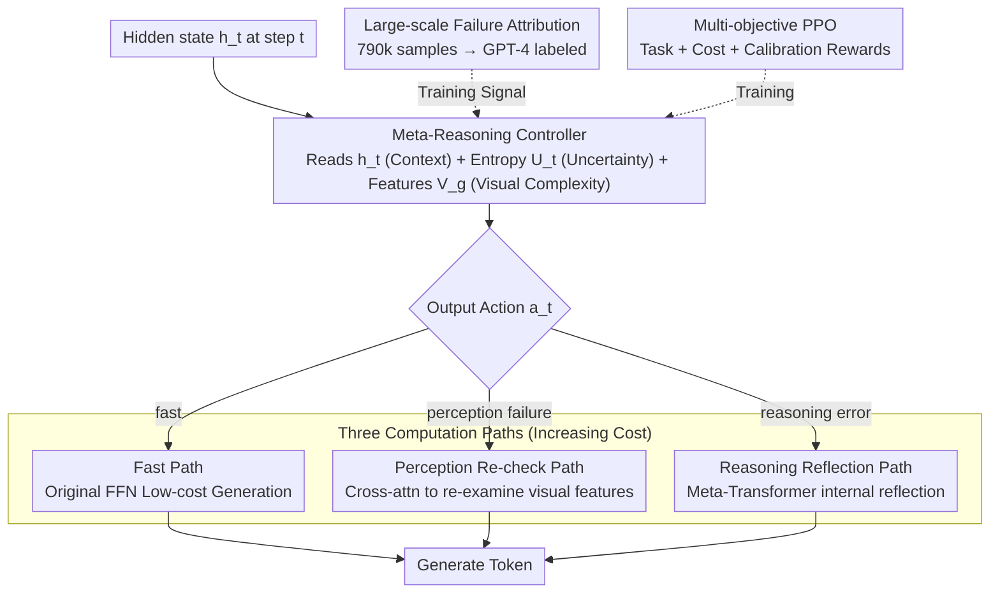

# Addressing Overthinking in Large Vision-Language Models via Gated Perception-Reasoning Optimization

**Conference**: ACL 2026  
**arXiv**: [2601.04442](https://arxiv.org/abs/2601.04442)  
**Code**: None  
**Area**: Multimodal VLM / Adaptive Computation  
**Keywords**: Overthinking, Perception-Reasoning Separation, Meta-Reasoning Controller, Adaptive Computation, Multi-Objective Reinforcement Learning

## TL;DR

The GPRO framework is proposed to address overthinking in LVLMs by dynamically routing computation to three paths (Fast/Perception Re-check/Reasoning Reflection) at each token generation step through a meta-reasoning controller, simultaneously improving both accuracy and efficiency.

## Background & Motivation

**Background**: Large Vision-Language Models (LVLMs) demonstrate powerful reasoning capabilities through chain-of-thought mechanisms. However, this "slow thinking" approach often leads to overthinking—generating lengthy reasoning chains even for simple questions.

**Limitations of Prior Work**: (1) Overthinking wastes computational resources and sometimes introduces errors; (2) Existing adaptive reasoning methods ignore a critical bottleneck: visual perception failure. Large-scale analysis indicates that the frequency of perception failures in LVLM errors is more than double that of reasoning errors.

**Key Challenge**: When an error stems from "perception failure" rather than "reasoning failure," increasing reasoning depth is not only useless but may introduce more errors. Existing methods focus solely on reasoning adaptation, completely neglecting perception adaptation.

**Goal**: Design an adaptive computation framework that simultaneously considers perception uncertainty and reasoning uncertainty.

**Key Insight**: Drawing from the dual-process theory in cognitive science (Kahneman), humans flexibly switch between fast intuition, visual re-checking, and deep reasoning when solving problems.

**Core Idea**: Distinguish between perception and reasoning errors through large-scale failure attribution supervision (790k samples) to train a meta-reasoning controller for three-way dynamic computation allocation.

## Method

### Overall Architecture

GPRO replaces the standard "token-by-token slow thinking" with "token-by-token thinking on demand." Within alternating layers of the Transformer decoder, the original FFN is replaced by a GPR module. Each GPR module contains a meta-reasoning controller and three computation paths. For each token generated, the controller first reads the current internal state and then decides which path to take: direct fast generation, looking back at the image, or performing internal reflection. The computational cost increases across the three paths, allowing simple tokens to be passed quickly while extra effort is reserved for error-prone tokens, reducing cost while improving accuracy. The decision-making capability of the controller is derived from a failure attribution dataset constructed from approximately 790k samples, labeling each error as "perception-based" or "reasoning-based" to provide supervised training signals for routing decisions.

### Key Designs

**1. Meta-Reasoning Controller: Enabling token-level autonomous decisions on "whether to think more and in which direction."**

The essence of overthinking is the inability to "stop." To achieve adaptation, a mechanism must make decisions at each step. The controller is a 2-layer lightweight Transformer that simultaneously receives three complementary signals: the current hidden state $h_t$ reflecting the semantic context, the prediction entropy $U_t$ reflecting uncertainty, and global image features $V_g$ reflecting visual complexity. Based on these, it outputs a discrete action $a_t \in \{\text{fast}, \text{perception}, \text{reasoning}\}$. All three signals are essential: relying only on entropy might mistake "linguistic hesitation" for "visual re-checking"; incorporating image complexity allows the controller to distinguish between "not seeing clearly" and "not thinking clearly."

**2. Three Computation Paths: Separately addressing perception and reasoning errors.**

Existing adaptive reasoning methods only adjust reasoning depth. However, failure attribution shows perception failures are twice as frequent as reasoning errors in LVLMs. When the model "sees wrong," adding reasoning is counterproductive. GPRO splits remediation into three specialized paths: the Fast Path uses the original FFN for low-cost generation; the Slow Perception Path uses cross-attention to re-examine visual features, $\text{Perc}(h_t, V) = \text{CrossAttn}(h_t, V, V)$; and the Slow Reasoning Path uses a meta-Transformer for internal self-reflection, $\text{Reas}(h_t, H_{<t}) = \text{MetaTrans}(h_t, H_{<t})$. This divide-and-conquer approach allows each path to address specific issues, unlike uniform reasoning deepening which is ineffective for perception errors.

**3. Large-Scale Failure Attribution: Supervised training signals for routing.**

Standard benchmarks indicate if an answer is correct but do not specify if the error was in "perceiving" or "reasoning." The authors collected error cases by running Qwen2.5-VL on approximately 790k samples and then used GPT-4 to attribute each error to "visual perception failure" or "reasoning error." This large-scale attribution data transforms the "perception vs. reasoning" distinction into a supervised signal and quantifies that perception is the primary bottleneck.

### Loss & Training

Multi-objective PPO training is employed with a reward function $R(\tau) = R_{task} + \alpha_c R_{cost} + \alpha_l R_{cal}$. The Task Reward awards +1 for correct answers; the Cost Reward penalizes slow path activation to prevent the controller from overusing expensive paths; and the Calibration Reward ensures uncertainty scores align with actual errors (high before errors, low before correct tokens), making the controller's uncertainty signal reliable.

## Key Experimental Results

### Main Results (Qwen2.5-VL-7B Base)

| Method | MathVision Acc | MathVerse Acc | MathVista Acc | Avg Response Length |
| :--- | :--- | :--- | :--- | :--- |
| Base Qwen2.5-VL-7B | 24.1 | 38.5 | 65.1 | ~350 |
| Mulberry | Gain over base | Gain over base | Gain over base | Longer |
| GPRO-7B | Significant Gain | Significant Gain | Significant Gain | **Significant Reduction** |

### Ablation Study

| Configuration | Key Metric | Description |
| :--- | :--- | :--- |
| Remove Perception Path | Significant Acc Drop | Perception re-check is vital for error correction |
| Remove Reasoning Path | Slight Acc Drop | Reasoning self-reflection has an auxiliary role |
| Remove Calibration Reward | Route Degeneracy | Uncertainty calibration is critical for the controller |
| Failure Attribution Analysis | Perception > Reasoning (2:1) | Validates the "perception is the main bottleneck" thesis |

### Key Findings
- GPRO improves both accuracy and efficiency (shorter responses) across five benchmarks, breaking the "better = longer" assumption.
- Visual perception failure is indeed the primary source of LVLM errors (over 2/3), rather than insufficient reasoning talent.
- The three-way controller learns meaningful routing strategies—simple questions use the Fast Path, while visual ambiguity triggers the Perception Path.

## Highlights & Insights
- "The root of overthinking might not be thinking too little, but seeing too vaguely"—this insight shifts the direction of LVLM reasoning optimization.
- The construction method for large-scale failure attribution is reusable—using a strong model to label error types of a weaker model is a general strategy for supervised generation.
- The three-path architecture elegantly engineers the dual-process theory from cognitive science.

## Limitations & Future Work
- GPT-4's failure attribution may contain its own biases; more reliable attribution methods are needed.
- The meta-reasoning controller increases model complexity, requiring additional engineering for deployment.
- Validated on 3B and 7B models, but applicability to larger scales remains untested.
- Future work could explore fine-grained perception paths (e.g., regional vs. global re-checking).

## Related Work & Insights
- **vs. Adaptive Reasoning (e.g., FAST)**: First to incorporate perception adaptation, adjusting both reasoning and perception depth.
- **vs. Mixture-of-Experts (MoE)**: MoE selects across parameter dimensions, while GPRO selects across computation types.
- **vs. Vision-R1/LMM-R1**: These methods enhance reasoning via RL but do not explicitly distinguish between perception and reasoning errors.

## Rating
- Novelity: ⭐⭐⭐⭐⭐ The perception-reasoning separation in adaptive computation is a new paradigm.
- Experimental Thoroughness: ⭐⭐⭐⭐ 5 benchmarks, ablations, and attribution analysis.
- Writing Quality: ⭐⭐⭐⭐ Strong motivation and clear architectural description.
- Value: ⭐⭐⭐⭐⭐ Paradigmatic impact on LVLM reasoning optimization.

<!-- RELATED:START -->

## Related Papers

- [\[ACL 2026\] GeoArena: Evaluating Open-World Geographic Reasoning in Large Vision-Language Models](geoarena_evaluating_open-world_geographic_reasoning_in_large_vision-language_mod.md)
- [\[ACL 2026\] OMIBench: Benchmarking Olympiad-Level Multi-Image Reasoning in Large Vision-Language Models](omibench_benchmarking_olympiad-level_multi-image_reasoning_in_large_vision-langu.md)
- [\[ACL 2026\] VL-Calibration: Decoupled Confidence Calibration for Large Vision-Language Models Reasoning](vl-calibration_decoupled_confidence_calibration_for_large_vision-language_models.md)
- [\[ACL 2026\] ChemVLR: Prioritizing Reasoning in Perception for Chemical Vision-Language Understanding](chemvlr_prioritizing_reasoning_in_perception_for_chemical_vision-language_unders.md)
- [\[ACL 2026\] MMErroR: A Benchmark for Erroneous Reasoning in Vision-Language Models](mmerror_a_benchmark_for_erroneous_reasoning_in_vision-language_models.md)

<!-- RELATED:END -->
