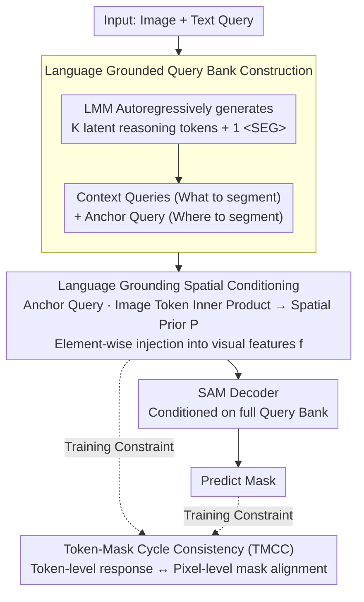

# AnchorSeg: Language Grounded Query Banks for Reasoning Segmentation

**Conference**: ACL 2026  
**arXiv**: [2604.18562](https://arxiv.org/abs/2604.18562)  
**Code**: [https://github.com/rui-qian/AnchorSeg](https://github.com/rui-qian/AnchorSeg)  
**Area**: Reasoning Segmentation / Multimodal VLM  
**Keywords**: Reasoning Segmentation, Language Grounded Query Banks, Spatial Prior, Token-Mask Consistency, SAM

## TL;DR

Ours proposes AnchorSeg, reframing reasoning segmentation as a structured conditional generation process based on a language-grounded query bank. It explicitly decouples spatial localization and semantic reasoning via anchor queries and a Token-Mask cycle consistency training objective, achieving SOTA on ReasonSeg (67.7% gIoU, 68.1% cIoU).

## Background & Motivation

**Background**: Reasoning segmentation requires models to predict pixel-level masks based on complex, implicit text queries (e.g., "the object providing shade in this scene"). Methods like LISA introduce a `<SEG>` token and feed its hidden state as a single query into a SAM decoder for mask prediction.

**Limitations of Prior Work**: Existing methods compress both semantic reasoning and spatial localization into the hidden representation of a single `<SEG>` token. This implicit compression limits the model's ability to explicitly distinguish between "what to segment" (semantic reasoning) and "where to segment" (spatial localization), leading to restricted performance in complex reasoning scenarios.

**Key Challenge**: A single embedding must simultaneously encode two essentially different types of information: semantic understanding and spatial position. This creates a representation bottleneck—as reasoning complexity increases, a single vector becomes increasingly incapable of carrying both signals.

**Goal**: Redefine reasoning segmentation as a structured conditional generation problem, explicitly modeling spatial localization at the image token level and conditioning it on language-guided queries.

**Key Insight**: Introduce a "query bank" composed of multiple learnable tokens, assigning different roles—context queries handle semantic reasoning, while anchor queries handle spatial localization.

**Core Idea**: Replace the single `<SEG>` token with a language-grounded query bank to explicitly decouple spatial localization (anchor queries) and semantic modulation (context queries) via a factorized conditional distribution.

## Method

### Overall Architecture

Given an input image and a text query, the LMM (e.g., LLaVA) autoregressively generates $K$ latent reasoning tokens and one segmentation anchor token `<SEG>`, forming the query bank $\mathbf{Q} = (\boldsymbol{q}_1, ..., \boldsymbol{q}_K, \boldsymbol{q}_{anc})$. The anchor query computes similarity with image tokens to generate a spatial prior. After injecting this into visual features, the entire query bank is fed into the SAM decoder to predict the final mask.

### Key Designs

**1. Language Grounded Query Bank: Decoupling "What" and "Where" across different tokens**

Prior paradigms compressed semantic reasoning and spatial localization into a single `<SEG>` token, which fails as reasoning complexity grows. AnchorSeg expands the LMM vocabulary by introducing $K$ latent reasoning tokens `<LAT_1>,...,<LAT_K>` and a segmentation token `<SEG>`. During autoregressive generation, `<SEG>` is explicitly conditioned on the preceding reasoning tokens. Context queries $\boldsymbol{q}_{1:K}$ encode intermediate reasoning states ("what to segment"), while the anchor query $\boldsymbol{q}_{anc}$ specifically carries spatial signals ("where to segment"). This establishes an ordered internal division of labor: reason first, then locate.

**2. Language Grounded Spatial Conditioning: Generating spatial priors directly from the anchor query**

To transform the anchor query into an explicit localization signal, AnchorSeg models spatial localization as a factorized conditional distribution over image tokens: $p(\boldsymbol{S}|\mathbf{Q}) = \prod_i p(s_i | \boldsymbol{i}_i, \boldsymbol{q}_{1:K}, \boldsymbol{q}_{anc})$. Practically, this is implemented as the inner product between the anchor query and each image token: $s_i = \boldsymbol{i}_i^\top \boldsymbol{q}_{anc}$. This is reshaped into a spatial prior map $\mathbf{P}$ and element-wise added to visual features $\tilde{\mathbf{f}} = \mathbf{f} \oplus \mathbf{P}$ before entering the SAM decoder. The anchor query produces the localization response, while context queries implicitly shape the anchor query's content via the autoregressive chain, making semantic modulation of space explicit in the features rather than buried in an indecipherable vector.

**3. Token-Mask Cycle Consistency (TMCC): Resolving resolution gaps between token responses and pixel masks**

Spatial responses are calculated on a low-resolution token grid, بينما supervised by high-resolution pixel masks. TMCC applies bi-directional constraints to align these: Token-to-Mask upsamples token-level responses to image resolution to match Gaussian-smoothed ground truth (GT) masks using BCE+Dice loss. Mask-to-Token downsamples GT masks to token resolution to align with token-level responses. This cross-calibration ensures consistency in spatial reasoning across semantic and visual hierarchies.

### Loss & Training

The total loss consists of three parts: autoregressive text generation loss $\mathcal{L}_{txt}$, SAM mask prediction loss $\mathcal{L}_{mask}$ (BCE+Dice), and TMCC losses $\mathcal{L}_{T2M} + \mathcal{L}_{M2T}$. The BCE and Dice weights for TMCC are shared with the mask loss.

## Key Experimental Results

### Main Results

Performance on the ReasonSeg test set:

| Method | gIoU | cIoU |
|------|------|------|
| LISA-7B | 54.3 | 58.1 |
| GSVA-7B | 55.6 | 59.4 |
| READ-7B | 57.2 | 60.5 |
| RSVP-7B | 63.7 | 64.8 |
| **AnchorSeg-7B (Ours)** | **67.7** | **68.1** |

### Ablation Study

| Configuration | gIoU | Description |
|------|------|------|
| Single SEG token (baseline) | 54.3 | Original LISA design |
| + Query Bank (No spatial prior) | ~62 | Multi-token reasoning helps |
| + Spatial Prior Injection | ~65 | Explicit localization signal provides large gain |
| + TMCC | 67.7 | Bi-directional consistency provides further boost |

### Key Findings

- The improvement from a single SEG token to a query bank is most significant, indicating that the multi-token reasoning structure is a core contribution.
- Explicit injection of the spatial prior (rather than just using it as a query) yields clear additional gains, validating the necessity of the decoupling design.
- TMCC acts as an effective stabilizer for training, preventing divergence and refining mask quality.
- Competitive results on RefCOCO/+/g demonstrate the high generalizability of the method.

## Highlights & Insights

- Modeling spatial localization as a factorized conditional distribution over "correlations of image tokens" is mathematically elegant and physically interpretable. This token-level spatial reasoning can be transferred to other multimodal tasks requiring precise localization.
- The role specialization within the query bank (context vs. anchor) mimics human cognitive processes: understanding semantics first, then performing spatial localization, and finally refining the segmentation.
- TMCC is a concise yet effective regularization for cross-resolution representation alignment.

## Limitations & Future Work

- The value of $K$ (number of latent tokens) is a hyperparameter; queries of varying complexity may require different counts of reasoning tokens.
- The spatial prior relies on simple inner products, which may be insufficient for complex spatial reasoning like occlusion handling.
- Evaluation is currently limited to reasoning and referring segmentation; generalization to VQA or other tasks remains unexplored.
- The method's performance ceiling is constrained by the underlying SAM mask decoder.

## Related Work & Insights

- **vs LISA**: LISA uses a single SEG token, entangling semantic and spatial info; AnchorSeg achieves a 13.4 point gIoU gain through explicit decoupling via a query bank.
- **vs GSVA**: GSVA extends to multi-object reasoning but retains the single-token paradigm; AnchorSeg fundamentally changes the representation architecture.
- **vs RSVP**: RSVP introduces multimodal CoT, but reasoning is tightly coupled with the segmentation module; AnchorSeg’s factorized design is more modular and interpretable.

## Rating
- Novelty: ⭐⭐⭐⭐⭐ Elegant design of query bank + factorized spatial conditioning.
- Experimental Thoroughness: ⭐⭐⭐⭐ Comprehensive evaluation on ReasonSeg and RefCOCO.
- Writing Quality: ⭐⭐⭐⭐ Clear formalization, though notation is somewhat heavy.
- Value: ⭐⭐⭐⭐ Provides a more structured paradigm for reasoning segmentation.

<!-- RELATED:START -->

## Related Papers

- [\[CVPR 2026\] Fast Reasoning Segmentation for Images and Videos](../../CVPR2026/vlm_reasoning/fast_reasoning_segmentation_for_images_and_videos.md)
- [\[CVPR 2026\] DPAD: Discriminative Perception via Anchored Description for Reasoning Segmentation](../../CVPR2026/vlm_reasoning/discriminative_perception_via_anchored_description_for_reasoning_segmentation.md)
- [\[ICLR 2026\] CoPRS: Learning Positional Prior from Chain-of-Thought for Reasoning Segmentation](../../ICLR2026/vlm_reasoning/coprs_learning_positional_prior_from_chain-of-thought_for_reasoning_segmentation.md)
- [\[CVPR 2026\] SegCompass: Exploring Interpretable Alignment with Sparse Autoencoders for Enhanced Reasoning Segmentation](../../CVPR2026/vlm_reasoning/segcompass_exploring_interpretable_alignment_with_sparse_autoencoders_for_enhanc.md)
- [\[CVPR 2026\] Grounded Chain-of-Thought for Multimodal Large Language Models](../../CVPR2026/vlm_reasoning/grounded_chain-of-thought_for_multimodal_large_language_models.md)

<!-- RELATED:END -->
