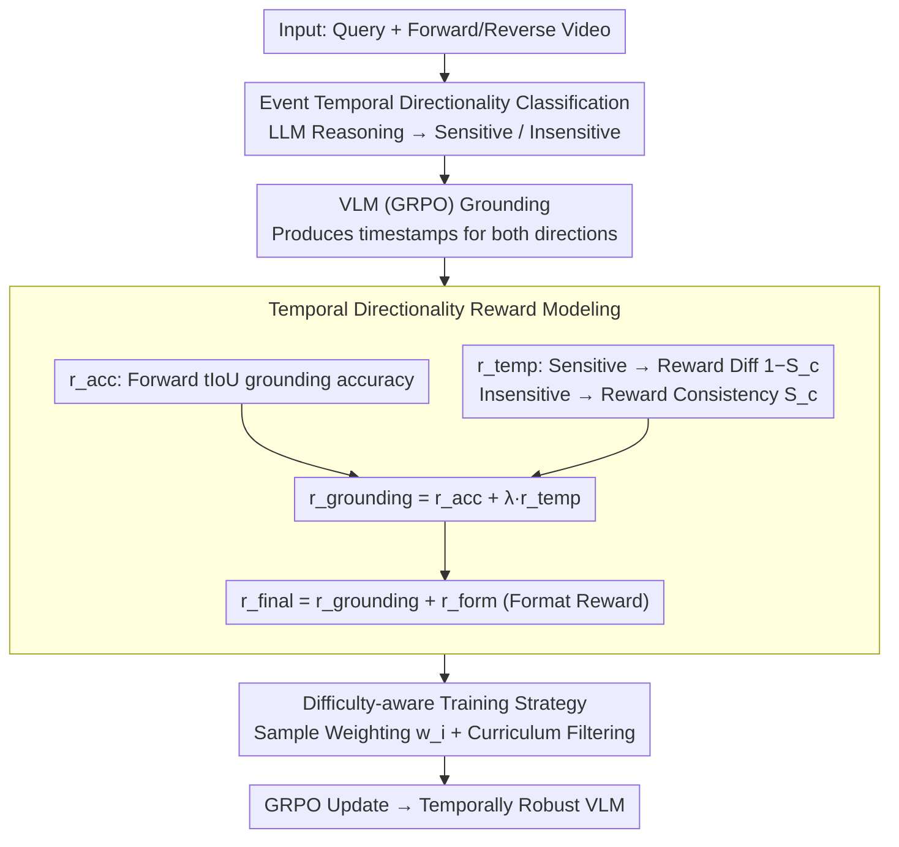

# ArrowGEV: Grounding Events in Video via Learning the Arrow of Time

**Conference**: ACL 2026 Findings  
**arXiv**: [2601.06559](https://arxiv.org/abs/2601.06559)  
**Code**: [Yes](https://arxiv.org/abs/2601.06559) (Code / Model / Data are all public)  
**Area**: Video Understanding  
**Keywords**: Video Event Grounding, Temporal Directionality, Reinforcement Learning, Vision-Language Models, Temporal Understanding

## TL;DR

ArrowGEV is proposed, a reinforcement learning framework inspired by the "Arrow of Time" in physics. It models temporal directionality by distinguishing between time-sensitive and time-insensitive events, enhancing the event grounding accuracy and temporal understanding of VLMs.

## Background & Motivation

**Background**: Grounding Events in Video (GEV) is a fundamental task in video analysis. Recently, VLMs have become the mainstream approach due to their end-to-end reasoning capabilities, achieving event grounding through large-scale timestamp annotation training, temporal token embeddings, or video segmentation adaptation.

**Limitations of Prior Work**: Existing methods only align events with timestamps in forward-playing videos, ignoring the inherent temporal structure and directionality of events. Experiments show that VLMs fail to distinguish semantic changes in events between forward and reverse videos—for example, "picking up a cup" becomes "putting down a cup" when reversed, but the model still incorrectly grounds the original event in the reverse video.

**Key Challenge**: VLMs overfit text timestamps rather than video semantics and lack an understanding of the temporal directionality of events, leading to insufficient generalization in tasks requiring temporal reasoning.

**Goal**: Improve VLM event grounding accuracy and temporal structure understanding by explicitly modeling temporal directionality.

**Key Insight**: Drawing on the concept of the "Arrow of Time" from physics, events are categorized into two types: time-sensitive (reversal changes semantics) and time-insensitive (reversal-invariant). Differentiated reward signals are then designed for each.

**Core Idea**: Use reverse videos as additional training signals—penalize grounding in reverse videos for time-sensitive events, and enforce forward-reverse consistency for time-insensitive events.

## Method

### Overall Architecture

ArrowGEV formulates "temporal directionality" as a reinforcement learning reward signal. Based on the GRPO framework, each sample is simultaneously fed with forward and reverse videos. The model first determines the temporal structure category of the event and then calculates differentiated rewards for the grounding results of both directions. After training, the VLM not only aligns timestamps in forward videos but also learns whether "this event remains valid when reversed," making it more robust to temporal sequences.

### Key Designs

**1. Event Temporal Directionality Classification: Identifying semantic changes after reversal**

Existing VLMs only align timestamps in forward videos and do not distinguish whether "reversal changes event semantics." ArrowGEV uses LLM reasoning to assign a category label $c(q) \in \{\text{sensitive}, \text{insensitive}\}$ to each query. For instance, "opening a door" is time-sensitive (reversal makes it "closing a door"), while "a ball on the table" is time-insensitive (valid regardless of playback direction). This classification is a prerequisite for differentiated rewards—the expected behavior under temporal reversal for these two types of events is fundamentally different.

**2. Temporal Directionality Reward Modeling: Integrating grounding accuracy and directional understanding**

To address the issue of VLMs overfitting text timestamps without understanding direction, ArrowGEV designs a unified reward $r_{\text{grounding}} = r_{\text{acc}} + \lambda \cdot r_{\text{temp}}$. Here, $r_{\text{acc}}$ measures forward grounding accuracy using tIoU, while $r_{\text{temp}}$ encodes directionality: it rewards forward-reverse consistency (via similarity $S_c$) for time-insensitive events and rewards forward-reverse divergence ($1 - S_c$) for time-sensitive events. Consequently, the model is forced to observe the semantic changes in the video itself rather than memorizing timestamps—"opening a door" should not be grounded in a reverse video, whereas "a ball on the table" should match in both.

**3. Difficulty-aware Training Strategy: Dynamically maintaining learning signals**

In the later stages of RL training, samples may become too simple, weakening the gradient signal. ArrowGEV maintains difficulty through two mechanisms: first, sample weighting $w_i = \exp((1 - \text{avg\_tIoU}) / \tau)$ focuses the model on difficult, unlearned samples; second, dynamic curriculum filtering removes mastered samples (worst IoU $>\eta=0.7$) from the training set at the end of each epoch. Together, these ensure the training process focuses on truly informative samples.

### Loss & Training

Beyond the grounding reward, the final reward includes a format reward: $r_{\text{final}} = r_{\text{grounding}} + r_{\text{form}}(o)$, where $r_{\text{form}}$ requires the output to follow the template `<think>...</think><answer>$t_s$ to $t_e$</answer>`. The backbone is Qwen2.5-VL-7B-Instruct, with videos sampled at 2 FPS.

## Key Experimental Results

### Main Results

| Method | Charades-STA R1@0.5 | ActivityNet R1@0.5 | TVGBench R1@0.5 |
| :--- | :---: | :---: | :---: |
| Gemini-2.5-Pro | 25.5 | 31.9 | 25.7 |
| GPT-5 | 18.3 | 33.0 | 18.8 |
| TimeSuite* | 67.1 | - | - |
| **Ours** (ArrowGEV) | **Significant Gain** | **Significant Gain** | **Significant Gain** |

### TDD Metric (Temporal Directionality Understanding)

The Temporal Directionality Discrepancy (TDD) metric is introduced: $$\text{TDD}(m) = \frac{R1@m(\text{fwd}) - R1@m(\text{rev})}{R1@m(\text{fwd})}$$. For time-sensitive events, TDD should approach 1 (distinguishing forward from reverse); for time-insensitive events, TDD should approach 0 (consistency).

### Key Findings

- ArrowGEV significantly improves grounding accuracy across three GEV benchmarks.
- It substantially enhances VLM understanding of temporal directionality (via the TDD metric).
- Performance gains are also observed in OOD general video understanding and reasoning tasks (e.g., TempCompass, MVBench, VideoMME).
- Time-sensitive events constitute a significant portion of common benchmarks, especially in Charades-STA.

## Highlights & Insights

- The "Arrow of Time" concept from physics is introduced to video understanding, providing a novel and intuitive perspective.
- Reverse videos are utilized as "free" training signals without requiring additional manual annotation.
- The TDD metric is proposed to quantitatively evaluate the model's understanding of event temporal directionality for the first time.
- The difficulty-aware training strategy (weight adjustment + curriculum filtering) effectively maintains learning efficiency.

## Limitations & Future Work

- Event classification relies on LLM reasoning, which may introduce classification noise.
- Validated only on a 7B model; performance on larger models remains to be explored.
- A video sampling rate of 2 FPS may be insufficient to capture rapid events.
- Future work could explore more fine-grained temporal directionality modeling.

## Related Work & Insights

- GRPO / DeepSeek-R1: Foundation for the RL training paradigm.
- TimeSuite / ChatVTG: Supervised learning methods for GEV tasks.
- Self-supervised learning related to temporal directionality (shuffle-and-learn, order prediction).
- Treating temporal directionality as a fundamental inductive bias for video understanding is a promising direction.

## Rating

- **Novelty**: ⭐⭐⭐⭐⭐ (Unique perspective using physics-inspired temporal directionality modeling)
- **Experimental Thoroughness**: ⭐⭐⭐⭐ (Three GEV benchmarks + six general benchmarks, extensive ablation)
- **Writing Quality**: ⭐⭐⭐⭐ (Clear motivation, persuasive pilot study)
- **Value**: ⭐⭐⭐⭐ (Identifies flaws in VLM temporal understanding and provides an effective solution)

<!-- RELATED:START -->

## Related Papers

- [\[ICML 2026\] Learning GUI Grounding with Spatial Reasoning from Visual Feedback](../../ICML2026/vlm_reasoning/learning_gui_grounding_with_spatial_reasoning_from_visual_feedback.md)
- [\[ICML 2026\] Temporal-Aware Reasoning Optimization for Video Temporal Grounding](../../ICML2026/vlm_reasoning/temporal-aware_reasoning_optimization_for_video_temporal_grounding.md)
- [\[CVPR 2026\] Incentivizing Versatile Video Reasoning in MLLMs via Data-Efficient Reinforcement Learning](../../CVPR2026/vlm_reasoning/incentivizing_versatile_video_reasoning_in_mllms_via_data-efficient_reinforcemen.md)
- [\[NeurIPS 2025\] iFinder: Structured Zero-Shot VLM Grounding for Dash-Cam Video Reasoning](../../NeurIPS2025/vlm_reasoning/ifinder_structured_zero-shot_vision-based_llm_grounding_for_dash-cam_video_reaso.md)
- [\[CVPR 2026\] Learning Transferable Temporal Primitives for Video Reasoning via Synthetic Videos](../../CVPR2026/vlm_reasoning/learning_transferable_temporal_primitives_for_video_reasoning_via_synthetic_vide.md)

<!-- RELATED:END -->
