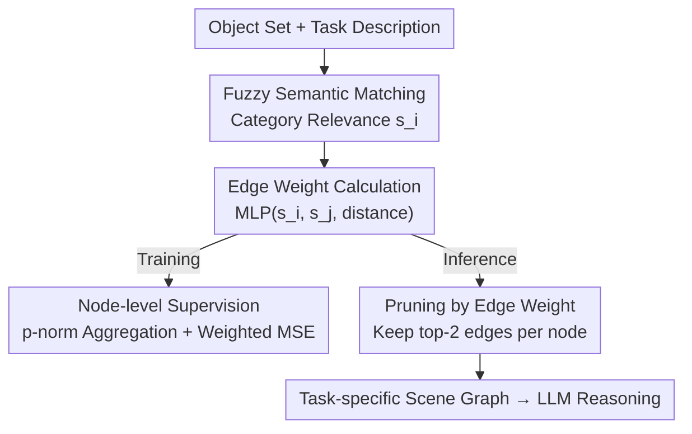

# CAPruner: Conceptual-Adjacent Scene Graph Pruner for Enhancing 3D Spatial Reasoning of Large Language Models

**Conference**: ACL 2026  
**arXiv**: [2606.07529](https://arxiv.org/abs/2606.07529)  
**Code**: https://github.com/fz-zsl/CAPruner  
**Area**: 3D Vision-Language / LLM Spatial Reasoning / Scene Graph Pruning  
**Keywords**: Scene Graph Pruning, 3D-VL, Spatial Reasoning, Fuzzy Semantic Matching, Node-level Supervision

## TL;DR
To address the conflict where feeding complete 3D scene graphs to LLMs leads to token explosion while existing distance-based KNN pruning often removes task-critical relations, this paper proposes CAPruner. It integrates "query semantic relevance" and "spatial proximity" into a lightweight MLP (only 1219 parameters) to score the importance of each edge. The model is trained via weak supervision by "aggregating edge weights into node weights" using only target object labels. Under a fixed edge budget, it preserves relations truly useful for specific 3D-VL tasks, significantly improving the spatial reasoning accuracy of downstream LLMs.

## Background & Motivation

**Background**: Utilizing pre-trained LLMs to assist in 3D Vision-Language (3D-VL) tasks (e.g., locating a target object based on descriptions like "the chair next to the table") has become a new paradigm. To enable LLMs to perceive relative positions, a common practice is to construct a **scene graph**: nodes represent objects, and edges represent relative spatial relations, which are then converted into token sequences for LLM input.

**Limitations of Prior Work**: $n$ objects generate $\binom{n}{2}$ pairwise relations, causing the number of relations to grow **quadratically** with the number of objects. Directly sending all descriptions to an LLM leads to token explosion—in the InteriorGS dataset, a single scene averages over 554 objects, and full encoding would result in millions of tokens, exceeding the length limits of most LLMs and drowning useful information. To mitigate this, 3DGraphLLM adopts **proximity-based KNN pruning**, keeping only the relations with the two nearest neighbors for each object.

**Key Challenge**: Proximity does not equal "importance for solving a specific task." KNN has two major flaws: (1) **Semantic and Structural Gap**—relying solely on distance leads to redundant connections (e.g., between a bookshelf and books) while missing long-distance relations crucial for queries (e.g., "bookshelf-wall"); (2) **Lack of Connectivity Guarantees**—the authors found that in 707 ScanNet scenes, only 232 (less than 33%) remained connected after KNN pruning, with over 67% of scene graphs fragmenting into multiple components, failing to represent the global layout. Since LLMs rely heavily on the preserved relations, these issues directly cause spatial reasoning errors.

**Goal**: To determine "which relations in the scene graph should be preserved" under a limited edge budget, ensuring the pruning results **align with specific task queries without discarding critical relations**.

**Key Insight**: The authors observe that 3D-VL text queries usually refer to anchors using **object category names + spatial relation terms** (e.g., "locate the chair next to the table"). Thus, the importance of a relation can be measured by the attributes of its terminal objects and their positional relevance. Since LLMs are sensitive to "missing critical relations" but relatively robust to "slight redundancy," the objective is to **minimize the risk of erroneous pruning** within the budget.

**Core Idea**: Utilize dual signals of "fuzzy semantic matching (weighting relevant objects by category) + spatial proximity (weighting by distance)" to calculate importance scores for each edge via a lightweight MLP. For training, a weak supervision approach is used, "aggregating edge weights into node weights and supervising only nodes," to bypass expensive relation-level annotations.

## Method

### Overall Architecture

CAPruner is a lightweight pruner inserted between "scene graph construction" and "LLM reasoning." The input consists of a set of objects (with categories and 3D coordinates) and a natural language task description. The output is a **task-specific scene graph** pruned to a fixed budget (e.g., 2 edges per node), formatted as a token sequence for the downstream LLM. The backbone first computes semantic relevance scores for each object, then feeds the semantic scores of both endpoints and their distance into an MLP to obtain edge weights. The training branch aggregates edge weights into node weights using a $p$-norm and applies node-level supervision via weighted MSE; the inference branch directly preserves the top edges for each node based on edge weights.

### Key Designs

**1. Fuzzy Semantic Matching: Weighting relevant objects by category rather than detailed attributes**

To address the issue where "filtering by detailed attributes (color/shape) easily leads to erroneous pruning"—given current limitations in aligning 3D point cloud features with text—strictly matching "red round table" might misidentify the true target as unimportant if color or shape is misclassified. The authors instead perform **semantic matching based solely on categories**: when a query mentions "table," all tables in the scene and semantically similar objects like "desk" receive extra weight without verifying attributes. Formally, let $\mathcal{T}$ be the set of tokens in the task description and $c_i$ be the category of object $i$; the semantic relevance score is the maximum similarity between the category and task tokens:

$$s_i = \max_{t \in \mathcal{T}} \{\text{Similarity}(c_i, t)\}$$

Implementation-wise, objects are mapped to NYUv2 general categories, and an object receives a similarity of 1 only if a same-category object appears in the description. This design adopts a conservative strategy of "rather keeping duplicates than missing the referent" to ensure downstream robustness.

**2. Distance Weighted Fusion: Handling view-dependent relations via the Maxim of Relation**

Since relations like "front/back/left/right" heavily depend on the viewpoint and are difficult for a compact pruning model to determine accurately, the authors avoid explicit relation classification. Instead, following the **Maxim of Relation** from pragmatics, higher weights are assigned to spatially closer object pairs. The final edge weight is determined by both endpoint semantic relevance and Euclidean distance, aggregated by an MLP $f(\cdot)$:

$$w_{ij} = f(s_i, s_j, \|P_i - P_j\|_2)$$

where $P_i, P_j$ are 3D coordinates. This 3-layer MLP has only 1219 parameters, entailing minimal computational cost. The semantic path handles "task relevance" while the distance path handles "spatial plausibility," and their multiplicative fusion ensures pruning considers both "what the query needs" and "who is geometrically adjacent."

**3. Node-level Weak Supervision: Backpropagating from target-only labels to edge weights**

Existing 3D-VL datasets only label target objects; relation-level labels grow quadratically and are impractical to annotate manually. CAPruner avoids direct edge weight supervision by **aggregating edge weights into node weights** and supervising only the nodes. Specifically, a GNN-like $p$-norm aggregation aggregates all incident edge weights of node $i$ into a node weight:

$$v_i = \text{sigmoid}\left(\sum_j w_{ij}^p\right)^{1/p}$$

$p$ is a hyperparameter (set to $p=3$ in experiments). Since target objects are much fewer than non-targets, **Weighted MSE (WMSE)** is used to balance their contributions:

$$\mathcal{L} = \frac{1}{|\mathcal{O}|}\sum_{i\in\mathcal{O}}(v_i-1)^2 + \frac{1}{|\widetilde{\mathcal{O}}|}\sum_{i\in\widetilde{\mathcal{O}}}v_i^2$$

where $\mathcal{O}$ is the target set and $\widetilde{\mathcal{O}}$ is the non-target set. The first term pushes target node weights toward 1, while the second pushes non-targets toward 0. As sigmoid restricts $v_i$ to $(0,1)$, supervision signals propagate back to edge weights via the $p$-norm, causing **edges around target objects to receive higher weights**. Thus, the model indirectly learns "which relations to keep" and balances semantic relevance with proximity using only target labels.

### Loss & Training

A two-stage training approach: first, the CAPruner pruner is trained independently (50 epochs, batch 16, learning rate $10^{-3}$, $p=3$). Then, the downstream LLM is fine-tuned using LoRA ($r=16$) for 3 epochs (batch 8, learning rate $2\times10^{-5}$). For fair comparison with 3DGraphLLM's KNN (2 neighbors per node), the top 2 edges per node are preserved. Backbones used include Llama-3.2-1B and Llama-3-8B.

## Key Experimental Results

### Main Results

Comparison with 3DGraphLLM on ScanRefer, ScanQA, and SQA3D using identical backbones (A./M. denotes overall/multi splits; @0.25/@0.5 are IoU thresholds):

| Model | ScanRefer A.@0.25 | A.@0.5 | M.@0.25 | M.@0.5 | ScanQA BLEU-4 | SQA3D EM@1 |
|-------|-------------------|--------|---------|--------|---------------|------------|
| 3DGraphLLM-1B | 52.5 | 47.5 | 45.0 | 40.5 | 12.2 | 52.6 |
| CAPruner + Llama-3.2-1B | 55.0 | 49.6 | 48.0 | 42.8 | 13.0 | 52.8 |
| 3DGraphLLM-8B | 60.2 | 54.6 | 54.7 | 49.4 | 12.5 | 55.2 |
| CAPruner + Llama-3-8B | **61.7** | **56.0** | **55.3** | **49.9** | **13.2** | **56.3** |

Under the same backbone, CAPruner consistently outperforms 3DGraphLLM: on the 1B model, ScanRefer A.@0.25 improves by 2.5 points; on 8B, it reaches 61.7/56.0, achieving or nearing SOTA across multiple metrics.

### Ablation Study

Replacing the pruning strategy under a fixed budget, comparing against proximity-based KNN (CAPruner(MST) is a variant ensuring connectivity):

| Pruning Method | ScanRefer A.@0.25 | A.@0.5 | M.@0.25 | ScanQA BLEU-4 | SQA3D EM@1 |
|----------------|-------------------|--------|---------|---------------|------------|
| Proximity-based KNN | 52.5 | 47.5 | 45.0 | 12.2 | 52.6 |
| CAPruner (MST Variant) | 54.4 | 49.0 | 47.1 | 11.7 | 52.4 |
| Gain | +1.9 | +1.5 | +2.1 | -0.5 | -0.2 |

The pruning strategy alone provides a stable gain of approximately 1.5–2.1 points on ScanRefer localization metrics, validating that "preserving task-relevant relations is more important than preserving nearest neighbors."

### Key Findings
- **LLMs are highly dependent on preserved relations**: Perturbation experiments show that replacing task-critical relations with irrelevant ones significantly degrades downstream accuracy, identifying why pruning must "keep the right relations" rather than just the "closest ones."
- **KNN destroys connectivity**: Over 67% of ScanNet scenes fragment under KNN pruning. CAPruner avoids the dilemma between "global connectivity vs. query relevance" because it focuses only on the relations needed to solve the task.
- **Ultra-lightweight pruner**: The core MLP has only 1219 parameters, adding negligible inference overhead while consistently improving localization precision.

## Highlights & Insights
- **Redefining pruning goal from "describing the scene" to "solving the task"**: This perspective shift is the most critical contribution. Once it is accepted that pruning results only need to serve a specific query rather than maintaining global connectivity, the connectivity dilemma naturally dissolves.
- **Fuzzy semantic matching as pragmatic wisdom**: Acknowledging that 3D point cloud-text alignment is still unreliable, the authors opt for category-based matching to "keep more rather than miss the target." this "conservative for robustness" logic is applicable to other scenarios where fine-grained matching is unreliable.
- **Weak supervision via node aggregation**: Converting the unlabelable edge problem into a labelable node (target object) problem and using $p$-norm aggregation + WMSE to backpropagate signals provides a transferable paradigm for graph learning tasks lacking edge labels.

## Limitations & Future Work
- Semantic matching relies on the fixed NYUv2 category system, which lacks discriminative power for open-vocabulary or fine-grained categories (e.g., distinguishing tables with different functions).
- The fixed budget of 2 edges per node is chosen to align with KNN; "adaptive budgets" based on query/scene complexity remain unexplored.
- Pruning intentionally ignores relation types (e.g., left/right) in favor of distance approximations, which may limit performance on queries heavily dependent on directional terms.
- Weak supervision relies only on target object labels; the importance of "anchor object" relations is learned indirectly through sparse signals.

## Related Work & Insights
- **vs. 3DGraphLLM (KNN Pruning)**: Both compress scene graph tokens, but KNN is distance-only and frequently disconnects the graph; CAPruner fuses semantic relevance with proximity for dynamic, task-aware pruning.
- **vs. 3D-LLM / LEO / Chat-Scene**: These methods either encode scenes into global features (losing detail) or encode objects without effectively extracting relations; CAPruner explicitly preserves task-relevant spatial relations.
- **vs. OVSG / 3DGraphQA / FFL-3DOG**: While these use scene graphs for retrieval or QA, they lack task-context-aware pruning tailored for LLM token limits, often missing critical spatial relations that CAPruner successfully captures.

## Rating
- Novelty: ⭐⭐⭐⭐ Introducing "task-relevant pruning" to 3D scene graphs with node-level weak supervision is a clear and effective perspective.
- Experimental Thoroughness: ⭐⭐⭐⭐ Covers three major benchmarks with two backbone scales and pruning ablations, though adaptive budgets are not explored.
- Writing Quality: ⭐⭐⭐⭐ Findings use empirical evidence to motivate the approach, with clear formulas and methodology.
- Value: ⭐⭐⭐⭐ Lightweight, plug-and-play, and provides stable improvements, offering significant practical value for LLM-driven 3D-VL.

<!-- RELATED:START -->

## Related Papers

- [\[AAAI 2026\] Graph-of-Mark: Promote Spatial Reasoning in Multimodal Language Models with Graph-Based Visual Prompting](../../AAAI2026/vlm_reasoning/graph-of-mark_promote_spatial_reasoning_in_multimodal_langua.md)
- [\[ICML 2026\] 3D-RFT: Reinforcement Fine-Tuning for Video-based 3D Scene Understanding](../../ICML2026/vlm_reasoning/3d-rft_reinforcement_fine-tuning_for_video-based_3d_scene_understanding.md)
- [\[CVPR 2026\] Beyond 3D VQAs: Injecting 3D Spatial Priors into Vision-Language Models for Enhanced Geometric Reasoning](../../CVPR2026/vlm_reasoning/beyond_3d_vqas_injecting_3d_spatial_priors_into_vision-language_models_for_enhan.md)
- [\[ACL 2026\] TRACE: Unleashing Spatial Reasoning in Multimodal Large Language Models via Textual Representation Guided Reasoning](unleashing_spatial_reasoning_in_multimodal_large_language_models_via_textual_rep.md)
- [\[CVPR 2026\] InfiniBench: Infinite Benchmarking for Visual Spatial Reasoning with Customizable Scene Complexity](../../CVPR2026/vlm_reasoning/infinibench_infinite_benchmarking_for_visual_spatial_reasoning_with_customizable.md)

<!-- RELATED:END -->
