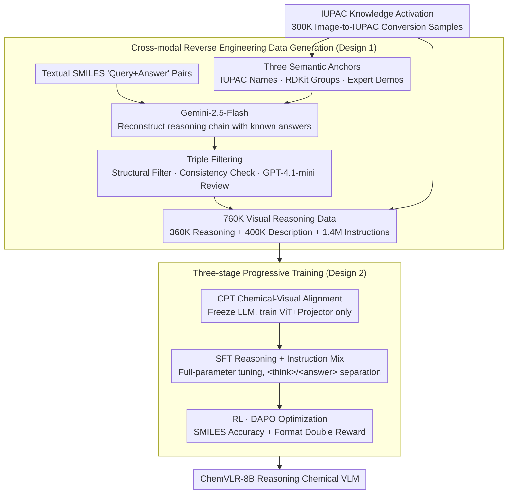

# ChemVLR: Prioritizing Reasoning in Perception for Chemical Vision-Language Understanding

**Conference**: ACL 2026 Findings  
**arXiv**: [2604.06685](https://arxiv.org/abs/2604.06685)  
**Code**: [https://github.com/xxlllz/ChemVLR](https://github.com/xxlllz/ChemVLR)  
**Area**: Interpretability  
**Keywords**: Chemical Visual Understanding, Reasoning VLM, Cross-modal Reverse Engineering, Three-stage Training, Molecular Recognition

## TL;DR
ChemVLR is proposed as the first reasoning-based VLM in the chemical domain. It constructs a 760K reasoning dataset via a cross-modal reverse engineering strategy and employs a three-stage training pipeline (CPT-SFT-RL), significantly outperforming proprietary models and domain-specific VLMs in molecular recognition and reaction prediction.

## Background & Motivation

**Background**: VLMs in the chemical field (e.g., ChemVLM, TinyChemVL) have made progress but primarily follow an end-to-end direct answering paradigm relying on SFT. Meanwhile, RLVR has demonstrated powerful reasoning enhancement capabilities in domains like mathematics and programming.

**Limitations of Prior Work**: Existing chemical VLMs are "black box" systems that jump directly from molecular images to answers without generating interpretable reasoning paths. They fail to fully utilize the LLM's ability to infer underlying reaction mechanisms and perform poorly on complex visual chemical problems. Furthermore, high-quality chemical reasoning data, especially vision-based reasoning annotations, is extremely scarce.

**Key Challenge**: Chemical image understanding requires fine-grained substructure analysis (e.g., functional group recognition). However, general VLMs lack specific chemical domain knowledge, and direct SFT is insufficient to activate pre-trained knowledge effectively.

**Goal**: To build a chemical VLM that prioritizes reasoning during perception—explicitly identifying fine-grained chemical descriptors (e.g., functional groups) before deriving the final answer.

**Key Insight**: Utilize textual chemical queries combined with ground-truth answers to reconstruct reasoning processes via LLMs, followed by image rendering to generate visual reasoning data.

**Core Idea**: Generation of large-scale reasoning data through cross-modal reverse engineering combined with a progressive CPT $\rightarrow$ SFT $\rightarrow$ RL three-stage training process.

## Method

### Overall Architecture
For data construction, reasoning processes are reconstructed from textual SMILES QA pairs using Gemini-2.5-Flash, utilizing IUPAC names, RDKit functional groups, and expert demonstrations as semantic anchors. High-quality samples (760K) are generated after three-stage filtering. Training follows a progressive process: CPT (chemical-visual alignment) $\rightarrow$ SFT (mixed reasoning and instruction training) $\rightarrow$ RL (DAPO optimization).

### Key Designs

**1. Cross-modal Reverse Engineering: Reversing reasoning processes from answers to solve the zero-annotation dilemma in visual chemistry.**

As manual annotation for "image-reasoning-answer" triplets is not scalable, ChemVLR reverses the process. Given existing textual SMILES QA pairs, Gemini-2.5-Flash reconstructs reasoning chains leading to known answers. To prevent hallucinations, three semantic anchors are provided: IUPAC names from PubChem, RDKit-calculated functional groups, and curated expert demonstrations. Samples undergo structural filtering, answer consistency checks, and external LLM verification, increasing data retention from 55%–78% to 73%–95%.

**2. Three-stage Progressive Training: Grounding visual perception before teaching reasoning and optimizing with RL.**

General VLMs struggle with molecular images initially. Directly applying SFT or RL is ineffective because the model cannot accurately recognize functional groups. ChemVLR builds capabilities layer by layer: 
- **CPT**: Aligns vision and chemical domains using 500K pairs with a frozen LLM backbone.
- **SFT**: Full-parameter fine-tuning on 360K reasoning and 1.4M instruction samples using `<think>/<answer>` tags.
- **RL**: DAPO optimization using rewards based on SMILES accuracy ($Tanimoto\ similarity = 1.0$) and format correctness.

**3. IUPAC Knowledge Activation: Awakening pre-trained chemical knowledge through alternative representations.**

VLMs encounter chemical knowledge during pre-training primarily in IUPAC nomenclature rather than SMILES strings. ChemVLR constructs 300K image-to-IUPAC conversion samples to trigger the model's inherent chemical common sense. This increased the data generation retention rate from 78% to 92%, demonstrating that utilizing pre-trained knowledge depends heavily on whether the data representation aligns with the pre-training distribution.

### Loss & Training
The RL stage utilizes DAPO (Decoupled Clip and Dynamic Sampling Policy Optimization) with binary rewards for accuracy and format. Training is performed on 100K medium-difficulty samples filtered by the SFT model.

## Key Experimental Results

### Main Results

| Model | MMChemOCR Avg Sim. | MMChemOCR Tani@1.0 | img2smiles Tani@1.0 | ChemRxn-V Pred |
| :--- | :---: | :---: | :---: | :---: |
| ChemVLR-8B | **93.8** | **84.6** | **92.7** | **67.8** |
| TinyChemVL | 91.2 | 77.4 | 75.6 | 52.4 |
| Gemini-3-Flash | 77.6 | 61.2 | 63.8 | 51.7 |
| ChemDFM-X | 70.9 | 36.5 | 77.6 | 0.7 |

### Ablation Study

| Configuration | Gain | Description |
| :--- | :---: | :--- |
| SFT only | Baseline | Lacks chemical visual understanding |
| CPT + SFT | Improvement | Visual alignment improves perception |
| CPT + SFT + RL | **Optimal** | RL improves average performance by 9% |
| RL only | Minimal | Ineffective without domain foundations |

### Key Findings
- ChemVLR achieves accuracy comparable to specialized SMILES OCR models (e.g., Decimer) for the first time in a VLM.
- RL training exhibits an "Aha! moment," where rewards rise sharply between steps 200 and 400.
- IUPAC data serves as a crucial catalyst for activating pre-trained knowledge.

## Highlights & Insights
- The **reverse engineering data generation strategy** is highly practical for specialized domains where reasoning annotations are scarce.
- The **IUPAC knowledge activation finding** suggests that the utility of pre-trained knowledge depends on the alignment of the representation format.
- The **RL "Aha! moment"** validates the effectiveness of RLVR for enhancing reasoning in professional domains.

## Limitations & Future Work
- The high resource requirement (16xH800 GPUs) for training.
- Reasoning correctness depends on filtering quality; logical inconsistencies may still exist despite correct answers.
- Evaluation is limited to organic molecules/reactions; inorganic chemistry and complex mechanisms are not yet covered.

## Related Work & Insights
- **vs TinyChemVL**: While both are chemical VLMs, ChemVLR enhances reasoning via RL whereas TinyChemVL relies solely on SFT.
- **vs ChemDFM-R/Chem-R**: These models enhance reasoning in the text domain; ChemVLR extends this to multimodal visual reasoning.

## Rating
- Novelty: ⭐⭐⭐⭐ First chemical reasoning VLM with a novel reverse engineering strategy.
- Experimental Thoroughness: ⭐⭐⭐⭐⭐ Extensive benchmarks, baselines, and ablations.
- Writing Quality: ⭐⭐⭐⭐ Clear descriptions of data construction and training.
- Value: ⭐⭐⭐⭐ Significant advancement for AI in chemistry and scientific reasoning.

<!-- RELATED:START -->

## Related Papers

- [\[ACL 2026\] Decoding Scientific Experimental Images: The SPUR Benchmark for Perception, Understanding, and Reasoning](decoding_scientific_experimental_images_the_spur_benchmark_for_perception_unders.md)
- [\[ACL 2026\] Addressing Overthinking in Large Vision-Language Models via Gated Perception-Reasoning Optimization](addressing_overthinking_in_large_vision-language_models_via_gated_perception-rea.md)
- [\[ICCV 2025\] Understanding Museum Exhibits using Vision-Language Reasoning](../../ICCV2025/vlm_reasoning/understanding_museum_exhibits_using_vision-language_reasoning.md)
- [\[ICML 2026\] Bad Seeing or Bad Thinking? Rewarding Perception for Vision-Language Reasoning](../../ICML2026/vlm_reasoning/bad_seeing_or_bad_thinking_rewarding_perception_for_vision-language_reasoning.md)
- [\[ICML 2026\] Native Active Perception as Reasoning for Omni-Modal Understanding](../../ICML2026/vlm_reasoning/native_active_perception_as_reasoning_for_omni-modal_understanding.md)

<!-- RELATED:END -->
