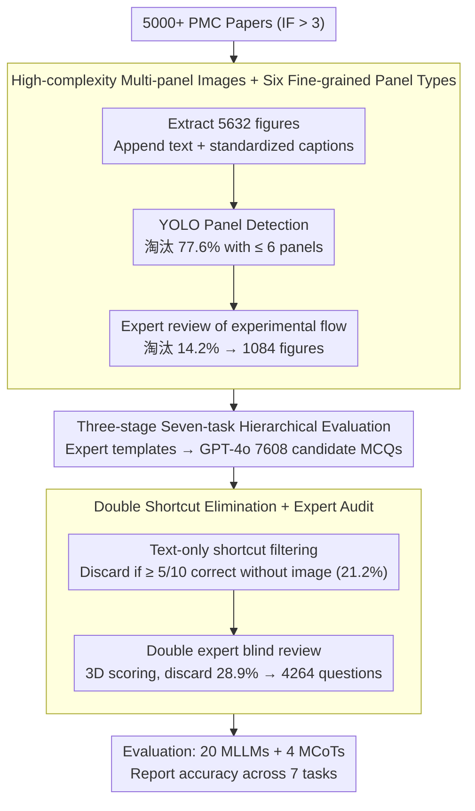

# Decoding Scientific Experimental Images: The SPUR Benchmark for Perception, Understanding, and Reasoning

**Conference**: ACL 2026  
**arXiv**: [2604.27604](https://arxiv.org/abs/2604.27604)  
**Code**: https://github.com/BUPT-Reasoning-Lab/SPUR (Available)  
**Area**: Multimodal VLM / Scientific Image Understanding / AI4S  
**Keywords**: Experimental Images, Multi-panel Understanding, Quantitative Reasoning, MCoT, PMC

## TL;DR
SPUR is the first benchmark designed for the "Perception $\rightarrow$ Understanding $\rightarrow$ Reasoning" three-stage evaluation of biomedical experimental images (multi-panel staining, Western blots, and statistical charts). It contains 4,264 expert-verified MCQs, revealing that current MLLMs (with Gemini 3 Pro Preview barely exceeding 60%) generally perform 12.76%–31.41% lower in quantitative reasoning than in qualitative reasoning.

## Background & Motivation
**Background**: MLLM performance on scientific images (statistical charts, tables, biological diagrams, chemical structures) is improving rapidly, leading to benchmarks such as ScienceQA, MMMU, M3CoT, MMSci, SciAssess, and MicroVQA. Concurrently, MCoT methods (prompt-based, plan-based, training-based) are employed to strengthen multimodal reasoning.

**Limitations of Prior Work**: The true test of "image reading" capabilities in scientific papers lies in **multi-panel experimental figures** (e.g., Western blot + staining + trend curves telling a single story). However, existing benchmarks suffer from three deficiencies: (1) an extremely low proportion of experimental images, mostly consisting of statistical charts or academic diagrams; (2) low complexity, with an average of $\leq 8$ panels per figure, lacking cross-panel relationship modeling; (3) a predominant focus on qualitative conclusions ("A promotes B") rather than quantitative reasoning ("A increases by 50%").

**Key Challenge**: The capability truly required for AI4S is "deriving quantifiable scientific conclusions from complex multi-panel visual evidence via cross-panel comparison and trend synthesis." Existing benchmarks only test specific segments of this chain, masking the true bottlenecks of MLLMs.

**Goal**: To construct a benchmark specifically targeting **multi-panel experimental figures**, explicitly decomposed into **Perception $\rightarrow$ Understanding $\rightarrow$ Reasoning** stages, covering both **qualitative and quantitative** reasoning. The study systematically evaluates 20 MLLMs and 4 MCoT methods to analyze capability shortfalls.

**Key Insight**: Experimental figures from PMC open-access papers with IF > 3 were curated, requiring **$\geq 6$ panels per figure** (77.6% were filtered out via YOLO detection). Expert-level hierarchical auditing and GPT-4o were used for QA generation, followed by a "text-only shortcut" filter to ensure questions require visual input.

**Core Idea**: A seven-task hierarchy—"Perception (NP/MP/IL) $\rightarrow$ Understanding (TA/HI) $\rightarrow$ Reasoning (Qual./Quant.)"—is used to decompose the understanding of experimental figures into independently diagnosable sub-capabilities. This identifies MLLM bottlenecks in "fine-grained numerical perception" and "cross-panel trend analysis."

## Method

### Overall Architecture
SPUR is a benchmark and evaluation framework rather than a model. The pipeline consists of: ① **Image Acquisition**: Scraping 5,000+ papers (IF > 3) from PMC, extracting 5,632 figures with associated text, standardized captions, and domain classifications; ② **Image Filtering**: Removing figures with $\leq 6$ panels using a YOLO detector (77.6% rejection), followed by expert review to remove incomplete experimental processes (14.2% rejection), leaving 1,084 figures; ③ **QA Generation**: Experts created prompts based on 7 task templates, and GPT-4o produced 7,608 candidate MCQs; ④ **Quality Assurance**: Textual shortcut elimination (discarding questions where GPT-4o scores $\geq 5/10$ without images, 21.2% rejection) and double expert blind review (28.9% rejection), resulting in 4,264 questions; ⑤ **Evaluation**: Testing accuracy across 20 MLLMs and 4 MCoT methods.

### Key Designs

**1. High-complexity Multi-panel Images + Six Fine-grained Panel Types: Pushing image complexity to realistic journal density**

Low-complexity figures (1–3 panels) fail to test cross-panel relationships, and MLLMs can often guess correctly by reading the caption. SPUR enforces an average of 14.3 panels per figure (far exceeding MMSci's 7.4, SFE's 2.3, and MicroVQA's 1.9), with up to 6 mixed fine-grained panel types (4 staining types + statistical charts + Western blots). Staining images are further categorized into Cell, Tissue, Microorganism, and Subcellular, allowing the MP task to perform fine-grained analysis by panel category.

**2. Three-stage Seven-task Hierarchical Evaluation: Decomposing experimental image understanding into a diagnosable capability chain**

Traditional VQA-style benchmarks provide only an overall accuracy. SPUR explicitly decomposes the process: **Perception** is panel-level (NP: estimating numerical values in curves; MP: identifying cell morphology; IL: mapping panels to conditions); **Understanding** is cross-panel (TA: trend analysis of isomorphic panels; HI: cross-modal integration of heterogeneous panels); **Reasoning** is expert-level (Qual.: directional conclusions; Quant.: quantitative ratios or significance).

**3. Double Shortcut Elimination + Expert Audit: Forcing visual reliance and blocking caption/common-sense exploits**

Scientific image QA often suffers from answer leakage in captions or pre-training knowledge. SPUR uses three "gates": (a) **Textual shortcut filter**: GPT-4o attempts the MCQs 10 times without the image; if it succeeds $\geq 5$ times, the question is discarded (21.2%); (b) **Double expert blind review**: 4 domain experts (>40 papers) and 2 senior experts (>100 papers) score based on Scientific Validity, Task Alignment, and Visual Reasoning Necessity; (c) **Visual-centric generation**: Prohibits deriving questions directly from captions, forcing questions to rely on visual panel data.

## Key Experimental Results

### Main Results

Overall accuracy of 20 MLLMs on SPUR (Excerpt):

| Model | NP | MP | IL | TA | HI | Qual. | Quant. | Overall |
|------|------|------|------|------|------|--------|---------|---------|
| Gemini 3 Pro Preview | 61.26 | 67.74 | 59.67 | 51.04 | 59.23 | 90.31 | 58.90 | **60.57** |
| Claude 3.7 Sonnet (thinking) | 59.67 | 64.32 | 57.45 | 51.30 | 60.80 | 87.58 | 59.96 | 59.52 |
| Gemini 2.5 Pro Preview | 56.47 | 62.97 | 56.47 | 53.30 | 61.54 | 86.54 | 57.94 | 59.00 |
| GPT-5.1 | 58.73 | 61.72 | 54.47 | 51.18 | 50.78 | 86.52 | 56.36 | 57.68 |
| GLM-4.5V (Best Open-source) | 57.70 | 61.99 | 57.65 | 55.71 | 68.46 | 80.94 | 58.48 | 59.87 |
| InternVL3-78B | 46.30 | 51.97 | 49.84 | 49.52 | 61.24 | 75.24 | 51.06 | 51.94 |
| Qwen2.5-VL-72B | 38.10 | 45.34 | 49.11 | 51.87 | 61.90 | 73.10 | 52.51 | 48.21 |
| LLaVA-v1.5-13B | 33.05 | 28.11 | 34.15 | 34.52 | 44.96 | 62.19 | 35.58 | 35.97 |

**Conclusion**: All models except Gemini 3 Pro Preview fail to surpass 60%. The best open-source model, GLM-4.5V, approaches middle-tier closed-source models. NP is consistently the lowest-scoring task.

### Ablation Study

Four MCoT methods vs. Direct prompting (Excerpt for GLM-4.5V):

| Configuration | NP | TA | Qual. | Quant. | Overall |
|------|-----|------|--------|---------|---------|
| Direct | 57.70 | 55.71 | 80.94 | 58.48 | 59.87 |
| DDCoT (prompt) | 47.11 | 45.24 | 71.52 | 53.27 | 48.90 |
| VoT (prompt) | 55.82 | 53.65 | 78.44 | 57.77 | 58.47 |
| VIC (plan) | 35.50 | 27.20 | 34.59 | 36.52 | 32.02 |
| Cantor (plan) | 53.41 | 51.23 | 77.12 | 56.61 | 55.59 |

Decoupled reasoning accuracy based on Perception correctness (Qwen3-VL-30B-A3B-Instruct):

| Condition | Direct | DDCoT | VoT | VIC | Cantor |
|-----------|--------|--------|------|------|---------|
| Perception Correct | 71.66 | 82.66 ($\uparrow$11.0) | 98.59 ($\uparrow$26.9) | 65.66 ($\downarrow$6.0) | 79.65 ($\uparrow$8.0) |
| Perception Incorrect | 32.40 | 23.68 ($\downarrow$8.7) | 9.32 ($\downarrow$23.1) | 30.30 ($\downarrow$2.1) | 40.23 ($\uparrow$7.8) |

### Key Findings
- **MCoT is an "Amplifier," not a "Fixer"**: If perception is correct, MCoT can increase scores by 8–27 points. If perception is incorrect, MCoT amplifies errors (VoT drops by 23 points).
- **TA is inversely correlated with relationship complexity**: As cross-panel relationships increase from 1 to 4, TA accuracy for Claude 3.7 thinking drops from 60.70% to 34.00%.
- **MP shows significant discipline bias**: Ministral 3 14B scores 70.52% on Subcellular images but only 42.80% on Microorganism images.
- **Closed-source "thinking" models approach the ceiling for Qualitative Reasoning**: Gemini 3 Pro Preview / Claude 3.7 score 87–90% in Qual., but only 59–60% in Quant.

## Highlights & Insights
- **Diagnostic rather than Leaderboard-centric**: The seven-task hierarchy allows a single overall accuracy figure to be traced back to specific broken links in the pipeline, which is more informative for AI4S development than MMMU-style overall scores.
- **Reusable "Double Filter + Review" Pipeline**: The combination of text-only shortcut detection and multi-panel enforcement provides a general template for visual-dependent QA that can be migrated to other scientific domains.
- **Comparison reveals MCoT's performance is conditional**: By decoupling MCoT gains based on perception correctness, the study quantifies that perceptual ability must be prioritized before layering CoT.
- **High Figure Density**: The average of 14.3 panels per figure is the highest to date, closely mimicking the density of figures in top-tier journals.

## Limitations & Future Work
- **MCQ format obscures the reasoning process**: It is impossible to directly observe whether a model's error was due to numerical misestimation, trend reversal, or logical gaps. Future work should introduce free-form rationales.
- **Biomedical-centric discipline coverage**: The current dataset covers 7 life science sub-disciplines. Physics, chemistry, and materials science (e.g., SEM, spectra, crystal structures) are not yet covered.
- **Absence of a training set**: SPUR is a zero-shot evaluation benchmark. A matching SPUR-Train for instruction tuning is suggested for future release.
- **Training-free MCoTs only**: The baseline lacks training-based MCoT (e.g., R1-V, MM-R1) for comparison.

## Related Work & Insights
- **vs. MicroVQA (CVPR 2025)**: MicroVQA also handles experimental images but features only 1.9 panels/figure and targets only qualitative tasks. SPUR provides a significant increase in panel complexity (14.3) and quantitative coverage.
- **vs. MMMU / M3CoT / ScienceQA**: These benchmarks focus on 1–2.5 panel "non-experimental" figures. SPUR fills the gap in complex multi-panel and cross-panel relationship modeling.
- **Insight**: In any "Multimodal + Scientific Reasoning" project, perception accuracy and reasoning accuracy should be reported separately; otherwise, the source of improvements from MCoT, SFT, or RL remains ambiguous.

## Rating
- Novelty: ⭐⭐⭐⭐ While experimental images have been explored (e.g., MicroVQA), pushing complexity to 14.3 panels and defining a 7-task hierarchy is a significant step forward.
- Experimental Thoroughness: ⭐⭐⭐⭐⭐ Comprehensive testing with 20 MLLMs, 4 MCoTs, and perception-reasoning decoupling.
- Writing Quality: ⭐⭐⭐⭐ Strong narrative flow; figures for diagnosis are clear and support the core arguments.
- Value: ⭐⭐⭐⭐ Strong utility as a diagnostic benchmark for the AI4S community, with actionable insights on the limitations of MCoT.

<!-- RELATED:START -->

## Related Papers

- [\[ICLR 2026\] GIR-Bench: Versatile Benchmark for Generating Images with Reasoning](../../ICLR2026/vlm_reasoning/gir-bench_versatile_benchmark_for_generating_images_with_reasoning.md)
- [\[ACL 2026\] SciMDR: Advancing Scientific Multimodal Document Reasoning](scimdr_advancing_scientific_multimodal_document_reasoning.md)
- [\[ACL 2026\] ChemVLR: Prioritizing Reasoning in Perception for Chemical Vision-Language Understanding](chemvlr_prioritizing_reasoning_in_perception_for_chemical_vision-language_unders.md)
- [\[ICLR 2026\] ExpVid: A Benchmark for Experiment Video Understanding & Reasoning](../../ICLR2026/vlm_reasoning/expvid_a_benchmark_for_experiment_video_understanding_reasoning.md)
- [\[ICML 2026\] Native Active Perception as Reasoning for Omni-Modal Understanding](../../ICML2026/vlm_reasoning/native_active_perception_as_reasoning_for_omni-modal_understanding.md)

<!-- RELATED:END -->
