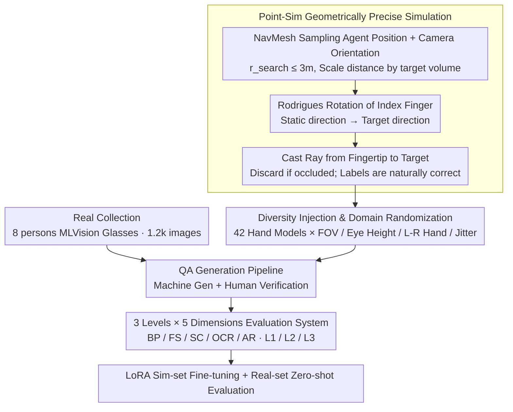

# Do MLLMs Understand Pointing? Benchmarking and Enhancing Referential Reasoning in Egocentric Vision

**Conference**: ACL 2026  
**arXiv**: [2604.21461](https://arxiv.org/abs/2604.21461)  
**Code**: https://guyyyug.github.io/EgoPoint-Bench/ (Project Page)  
**Area**: Multimodal VLM / Egocentric Vision / Pointing Understanding  
**Keywords**: Egocentric Pointing, Referential Hallucination, Sim-to-Real, MLLM Benchmark, LoRA Fine-tuning

## TL;DR
The authors construct EgoPoint-Bench, the first hybrid real+physical simulation benchmark for egocentric "finger pointing" QA (11.7k QA / 5 dimensions / 3 semantic referential levels). They confirm that current SOTA MLLMs generally rely on "visual proximity / saliency" pseudo-correlations rather than truly parsing the fingertip ray. Through LoRA fine-tuning on simulated data, they achieve an average improvement of up to +25 points and robust sim-to-real generalization.

## Background & Motivation

**Background**: Wearable devices such as smart glasses have catalyzed egocentric agent scenarios, where natural user interaction highly relies on deictic pronouns ("this / that") combined with pointing gestures. While MLLMs like GPT-5 / Gemini 3 / Qwen3-VL perform well on general image QA, their pointing understanding remains under-explored.

**Limitations of Prior Work**: Empirical tests by the authors show that when provided with egocentric images containing pointing gestures, models do not truly project a ray along the index finger to find the target. Instead, they capture the "object closest to the hand" or the "most salient object in the frame." The paper defines this phenomenon as **Referential Hallucination**.

**Key Challenge**: Scarcity of high-quality "vision-language-spatial" aligned data—RefCOCO/Visual Genome are third-person; Ego4D/EPIC-KITCHENS lack pointing QA annotations; Ges3ViG uses synthetic avatars rather than real hands; and YouRefIt is not egocentric. Models have never encountered dense supervision from "fingertip geometry $\rightarrow$ target object," making it difficult to learn the underlying mechanism.

**Goal**: (1) Provide a benchmark to quantitatively evaluate MLLMs' egocentric pointing understanding; (2) Provide a scalable synthetic pipeline to generate geometrically precise data; (3) Verify if simulation data is sufficient for models to truly "learn pointing" and transfer to real-world scenarios.

**Key Insight**: Utilize Habitat-Sim + ray-casting to generate geometrically rigorous pointing samples in 3D scenes (ensuring rays reach targets without occlusion), combined with 1.2k real-collected samples for zero-shot cross-domain testing.

**Core Idea**: Use a scalable simulation with "physical ray casting + diverse hand models" to create 10k+ geometrically unambiguous egocentric pointing QA samples. This allows smaller models to outperform closed-source models like GPT-5 / Gemini 3 after LoRA fine-tuning.

## Method

### Overall Architecture
EgoPoint-Bench consists of two data collection pipelines, a QA generation pipeline, and a five-dimensional evaluation system. On the simulation side, Point-Sim generates 10,567 samples across 1,838 high-fidelity 3D scenes using 42 hand models. On the real-world side, eight volunteers wearing MLVision smart glasses collected 1,162 images in indoor and outdoor scenes. All images undergo a "machine generation + human verification" QA pipeline, outputting samples with three question types (Choice / Judgment / Open-ended) and three referential levels (L1 Explicit description / L2 Visual positioning / L3 Implicit pronoun). Samples are classified into five capability dimensions for train/val/test splits.

### Key Designs

**1. Point-Sim Geometrically Precise Simulation: Downgrading "Pointing Correctness" to a Geometric Constraint**

The primary challenge in egocentric pointing data is annotation noise—manually bounding the object an index finger points to is expensive and subjective. Models trained on noisy labels often learn biases. Point-Sim avoids human judgment by enforcing label correctness via ray geometry. It first samples the agent's position $P_{agent}$ on a NavMesh with $r_{search} \leq 3.0\text{m}$ (minimum obstacle avoidance of 0.4 m, with distance dynamically scaled by target volume). It then constructs the camera rotation $R_{cam} \in SO(3)$ according to $\mathbf{f}=(P_{obj}-P_{agent})/\|P_{obj}-P_{agent}\|$, ensuring the target falls naturally within the field of view.

The index finger's static direction $\mathbf{u}_{rest}$ is then rotated to the target direction $\mathbf{u}_{target}$ using the Rodrigues formula, where the rotation angle and axis are:

$$\theta=\arccos(\mathbf{u}_{rest}\cdot\mathbf{u}_{target}),\quad \mathbf{k}=\frac{\mathbf{u}_{rest}\times\mathbf{u}_{target}}{\|\mathbf{u}_{rest}\times\mathbf{u}_{target}\|}$$

Finally, a ray is cast from the fingertip toward $P_{obj}$; the sample is discarded if intercepted by any obstacle. This ensures that "ray hit and no occlusion" is equivalent to "correct label," eliminating annotation noise and providing dense multi-modal alignment data (RGB / Depth / Semantic / BBox).

**2. Diversity Injection and Domain Randomization: Forcing Models to Perceive Geometric Direction**

If the simulation uses a single hand model or fixed viewpoint, the model may overfit to specific hand textures rather than the pointing intent, causing failure on real smart glasses footage. To address this sim-to-real gap, the authors inject noise into the visual signal: camera FOV is uniformly sampled in $[100^\circ, 115^\circ]$, viewpoint height $h_{eye} \sim \mathcal{U}(1.45, 1.70)$ meters, and hand side is randomized. 3D arm/hand models from ArtStation are parameterized in Blender with adjusted joints, overlaid with 3 skin tones × 7 sleeve types for a total of 42 hand models. Small perturbations are added to camera pitch/yaw to simulate natural hand jitter. These variations break superficial features, forcing the model to rely on the stable cue: the geometric direction of the fingertip.

**3. 3-Level Referential × 5-Dimensional Capability Taxonomy: Dissecting Pointing Understanding**

Pointing understanding is a composite capability. The authors split it along two axes. Referential language is divided into three levels: L1 "This X I am pointing to" (with category), L2 "The one on the left I am pointing to" (with spatial terms), and L3 "How to use this?" (pure deictic pronoun, requiring true ray parsing). Capabilities are categorized into five types: BP Basic Perception, FS Function & State, SC Spatial Context, OCR, and AR Adversarial Robustness (counterfactual/empty pointing). This taxonomy reveals that models scoring high on BP but low on AR rely on visual proximity rather than true pointing understanding.

### Loss & Training
Evaluation is performed via zero-shot inference. For the enhancement experiments, open-source MLLMs are fine-tuned using LoRA on the Point-Sim training set ($\sim$10k samples) with standard language modeling objectives. The real-world test set is kept strictly zero-shot to assess sim-to-real generalization.

## Key Experimental Results

### Main Results
Comparison of 4 closed-source models and 5 open-source models (Direct vs. LoRA) on Sim and Real test sets. Metrics represent accuracy (%) across capability dimensions.

| Model | Method | Sim Mean | Real Mean | Overall Avg | LoRA Gain |
|------|------|----------|-----------|-------------|-----------|
| Random | - | 31.14 | 28.94 | 30.24 | - |
| Human | - | 95.80 | 96.00 | 95.90 | - |
| Gemini 3 Pro | Direct | 56.44 | 72.00 | 62.29 | - |
| Gemini 3 Flash | Direct | 57.21 | 71.84 | 62.71 | - |
| GPT-5.2 Instant | Direct | 54.80 | 66.76 | 59.29 | - |
| GPT-5 mini | Direct | 57.66 | 60.57 | 58.75 | - |
| LLaVA-1.5-7B | Direct / LoRA | 48.82 / **73.18** | 47.19 / **54.54** | 48.21 / **66.17** | **+17.96** |
| LLaVA-NeXT-7B | Direct / LoRA | 48.17 / **80.93** | 46.44 / **59.64** | 47.52 / **72.93** | **+25.41** |
| GLM-4.6V-Flash | Direct / LoRA | 53.29 / 74.86 | 56.42 / 61.26 | 54.47 / 69.74 | +15.27 |
| InternVL3.5-2B | Direct / LoRA | 51.74 / 75.43 | 53.73 / 62.03 | 52.49 / 70.39 | +17.90 |
| InternVL3.5-8B | Direct | 52.62 | 57.09 | 54.30 | - |

The strongest closed-source model, Gemini 3 Pro, scores only 62.3%, nearly 34 points below human performance. LLaVA-NeXT-7B after LoRA reaches 72.93%, surpassing all closed-source models and proving that the deficiency lies in training data rather than model scale.

### Ablation Study
Horizontal comparisons using different architectures and data scales.

| Configuration | Overall Avg | Description |
|------|-----------------|------|
| LLaVA-1.5-7B Direct | 48.21 | Old architecture without pointing training |
| LLaVA-NeXT-7B Direct | 47.52 | Upgraded vision encoder but no supervision; negligible gain |
| InternVL3.5-2B Direct | 52.49 | Small model but stronger general VLM |
| InternVL3.5-8B Direct | 54.30 | 8B vs 2B only gain 1.8 points $\rightarrow$ pure scaling has low returns |
| LLaVA-1.5-7B + LoRA | 66.17 | +17.96; supervision signal is effective |
| LLaVA-NeXT-7B + LoRA | **72.93** | +25.41; best vision backbone × best data $\rightarrow$ max gain |
| InternVL3.5-2B + LoRA | 70.39 | 2B model can approach GPT-5 performance |

### Key Findings
- **Referential Hallucination is Universal**: Direct models score poorly (30–60) on the AR dimension, significantly lower than other dimensions, indicating they guess even when no reasonable target exists.
- **Scale Cannot Replace Supervision**: InternVL3.5 gains only 1.8 points from 2B to 8B, while 7B LLaVA-NeXT outperforms the 8B model after LoRA.
- **Significant Sim-to-Real Transfer**: LoRA fine-tuning on pure simulation data leads to consistent gains on the real test set (+7~+13), validating the Point-Sim design.
- **Closed-source $\neq$ Stronger**: While Gemini 3 Pro performs well on the real set, its lower Sim score suggests a weakness in precise geometric alignment compared to models with targeted supervision.

## Highlights & Insights
- **Annotation as Geometric Constraint**: Using ray-casting + hit validation ensures label accuracy, bypassing the cost and subjectivity of manual annotation.
- **Diverse Hand Models & Domain Randomization**: Active injection of "irrelevant variables" forces the model to prioritize geometric direction over appearance features.
- **Conceptualizing "Referential Hallucination"**: The paper distills a vague failure mode into a quantifiable diagnostic framework.
- **Efficiency of LoRA 7B**: Lightweight fine-tuning allows small models to surpass closed-source giants in vertical capabilities, confirming the cost-effectiveness of targeted data for narrow tasks.

## Limitations & Future Work
- **Small Real Dataset**: The real test set (1.2k) is limited and may contain biases regarding user habits and hand distribution.
- **Single-frame focus**: The benchmark is image-based, whereas real pointing is a temporal process (extend-lock-retract). Single frames may not fully capture deployment complexity.
- **Static Scenes**: 3D scenes are derived from static indoor datasets, lacking dynamic crowds or moving targets.
- **Grounding Potential**: While the data includes BBox and 2D coordinates, the paper focuses on QA, leaving the potential for direct 3D ray-hit regression untapped.

## Related Work & Insights
- **vs YouRefIt**: Transitions from 3rd-person + real gestures to egocentric + geometrically precise simulation.
- **vs Ges3ViG**: Upgrades from synthetic avatars to 42 diverse arm models and emphasizes QA over pure coordinate localization.
- **vs RefEgo**: Adds the gesture modality to complement text-only egocentric grounding.
- **vs EOC-Bench / ECBench**: Replaces artificial visual prompts (boxes/circles) with natural hand gestures, aligning with real AR terminal inputs.

## Rating
- Novelty: ⭐⭐⭐⭐ First to treat "pointing geometry" as a first-class citizen in an egocentric benchmark; the "Referential Hallucination" concept is impactful.
- Experimental Thoroughness: ⭐⭐⭐⭐ Covers various closed/open models and dual-axis taxonomy, though fine-grained ablation of domain randomization components could be deeper.
- Writing Quality: ⭐⭐⭐⭐ Clear logical flow from motivation to failure mode analysis; standardized formulas and excellent visualization.
- Value: ⭐⭐⭐⭐⭐ Directly addresses a core interaction bottleneck for AR assistants and demonstrates a deployable paradigm for specialized model capability.

<!-- RELATED:START -->

## Related Papers

- [\[NeurIPS 2025\] MMPerspective: Do MLLMs Understand Perspective? A Comprehensive Benchmark for Perspective Perception, Reasoning, and Robustness](../../NeurIPS2025/vlm_reasoning/mmperspective_do_mllms_understand_perspective_a_comprehensive_benchmark_for_pers.md)
- [\[ACL 2026\] OMIBench: Benchmarking Olympiad-Level Multi-Image Reasoning in Large Vision-Language Models](omibench_benchmarking_olympiad-level_multi-image_reasoning_in_large_vision-langu.md)
- [\[CVPR 2026\] EgoProx: Evaluating MLLMs on Egocentric 3D Proximity Reasoning Across a Cognitive Hierarchy](../../CVPR2026/vlm_reasoning/egoprox_evaluating_mllms_on_egocentric_3d_proximity_reasoning_across_a_cognitive.md)
- [\[ACL 2026\] Can MLLMs Reason Beyond Language? VisReason: A Comprehensive Benchmark for Vision-Centric Reasoning](can_mllms_reason_beyond_language_visreason_a_comprehensive_benchmark_for_vision-.md)
- [\[ACL 2026\] MMErroR: A Benchmark for Erroneous Reasoning in Vision-Language Models](mmerror_a_benchmark_for_erroneous_reasoning_in_vision-language_models.md)

<!-- RELATED:END -->
