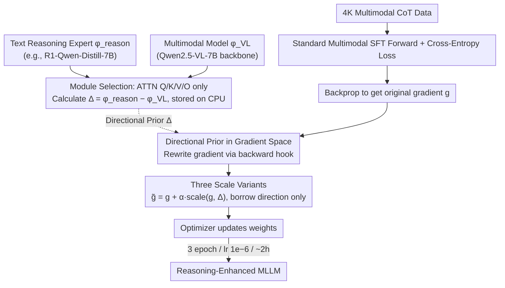

# DRIFT: Transferring Reasoning Priors for Efficient MLLM Fine-Tuning

**Conference**: ACL 2026  
**arXiv**: [2510.15050](https://arxiv.org/abs/2510.15050)  
**Code**: https://wikichao.github.io/DRIFT/ (Project Page available)  
**Area**: Multimodal VLM / Fine-tuning / Reasoning Transfer  
**Keywords**: MLLM, reasoning transfer, gradient prior, SFT, model merging

## TL;DR
DRIFT treats the "parameter difference between a text reasoning expert and a multimodal model" as a directional prior. During multimodal SFT backpropagation, it applies a lightweight bias to gradients (without modifying weights). Using only 4K multimodal CoT data and approximately 2 hours of training, it consistently pushes Qwen2.5-VL-7B performance on benchmarks like MathVista, MathVerse, and WeMath beyond parameter merging baselines and heavy SFT/RL methods.

## Background & Motivation

**Background**: Current mainstream approaches to enhance MLLM reasoning follow two paths: large-scale multimodal CoT SFT (e.g., R1-OneVision, OpenVLThinker) or multimodal RL (e.g., R1-VL). Both rely on expensive multimodal reasoning data and multi-day training. Meanwhile, pure text reasoning models (DeepSeek-R1-Distill series, Qwen-Math, etc.) have become easily accessible due to abundant CoT text data.

**Limitations of Prior Work**: MLLMs generally "see clearly but reason poorly"—they possess strong perception but fail in multi-step reasoning. Conversely, text reasoning experts are powerful but lack vision. Merging their parameters (BR2V, Task Arithmetic, TIES, DARE, Layer Swap) seems like a "free lunch," but the authors' tests in Tab.1 across four backbones reveal that while LLaMA/Mistral series (with relatively close parameter spaces) see small gains (+1~2 points), the Qwen series (Qwen2-VL, Qwen2.5-VL) suffers from large parameter space distribution shifts, causing merging to fail (Qwen2.5-VL+R1 drops −8.2 on MathVerse).

**Key Challenge**: The success of parameter space merging depends entirely on the alignment of the two experts' distributions on the backbone. Significant deviations in magnitude or direction cause linear interpolation to destroy multimodal alignment, leading to instability or gradient explosion. Furthermore, learning an optimal interpolation coefficient $\beta$ requires loading all candidate models into VRAM simultaneously, which is computationally expensive.

**Goal**: To identify a lightweight mechanism that transfers capabilities from text reasoning experts to MLLMs without requiring massive multimodal CoT data or facing the instability of merging.

**Key Insight**: The authors observe that the parameter difference between an expert and the base model essentially encodes "domain knowledge direction." Instead of directly interpolating in weight space (which disrupts alignment), this directional prior should be injected into the **gradients** during SFT. This "gently pulls" the optimization trajectory toward the reasoning direction without forcibly overwriting parameters.

**Core Idea**: Treat $\Delta = \phi_{\text{reason}} - \phi_{\text{VL}}$ as a directional prior. During backpropagation, bias the gradient using $\tilde{g} = g + \alpha \cdot \text{scale}(g, \Delta)$. This maintains the standard SFT pipeline while stably transferring text reasoning capabilities to the multimodal domain.

## Method

### Overall Architecture
DRIFT embeds "reasoning injection" into the backpropagation of standard multimodal SFT through a three-stage process:

1.  **Offline Reasoning Prior Calculation**: Take a text reasoning expert $\phi_{\text{reason}}$ (e.g., DeepSeek-R1-Qwen-Distill-7B) and a multimodal variant $\phi_{\text{VL}}$ (e.g., Qwen2.5-VL-7B backbone) derived from the same base LLM. Calculate the parameter difference $\Delta = \phi_{\text{reason}} - \phi_{\text{VL}}$ layer-by-layer and module-by-module. $\Delta$ is retained only for selected "reasoning-related" modules (default: ATTN projections Q/K/V/O) and **stored on CPU**, then moved to GPU as needed.
2.  **Standard Multimodal SFT Forward Pass**: Train Qwen2.5-VL-7B-Instruct using 4K high-quality multimodal CoT data (distilled from ThinkLiteVL-11K + error filtering, with CoT wrapped in `<think></think>`). The forward pass, loss calculation, and autograd remain unchanged.
3.  **Directional Prior Injection via Gradient Hooks**: Register a hook during `backward()`. For each selected parameter $w$, rewrite the original gradient $g$ into a guided gradient $\tilde{g} = g + \alpha \cdot \text{scale}(g, \Delta)$ before passing it to the optimizer. Training concludes in 3 epochs with a learning rate of $1\times 10^{-6}$ and $\alpha=-1$, taking about 2 hours.

### Key Designs

**1. Directional Prior in Gradient Space: Using the expert→VL difference as a compass for gradients instead of weight modification**

The failure of parameter merging in the Qwen series stems from its "one-step jump" approach. Original BR2V uses $\phi_{\text{VL}\oplus\text{reason}} = \phi_{\text{base}} + \beta(\phi_{\text{VL}}-\phi_{\text{base}}) + (1-\beta)(\phi_{\text{reason}}-\phi_{\text{base}})$, which is extremely sensitive to $\beta$. Large distribution shifts cause linear interpolation to shatter multimodal alignment. DRIFT moves $\Delta$ from weight space to gradient space: at each SFT step, it modifies the gradient of selected modules via $\tilde{g} = g + \alpha \cdot \text{scale}(g, \Delta)$. Weights still originate from $\phi_{\text{VL}}$ and are guided by multimodal loss, but are "gently pulled" by $\Delta$. This "incremental guidance" replaces the "one-step jump," and when coupled with multimodal CoT data, it avoids $\beta$ tuning while preserving visual alignment.

**2. Three Scale Variants: Borrowing direction without magnitude for stability**

Directly adding the absolute magnitude of $\Delta$ to the gradient would forcibly pull weights toward the reasoning expert. The authors compared three formulas: (i) Absolute $\tilde{g} = g + \alpha \Delta$; (ii) Grad-Norm $\tilde{g} = g + \alpha \|g\| \frac{\Delta}{\|\Delta\|}$ which takes only the direction of $\Delta$ and retains the magnitude of $g$; (iii) Grad-Norm w/ Adaptive $\alpha$ where $\alpha' = \alpha \cdot \frac{1 + \cos(g, \Delta)}{2}$, pushing more when the gradient aligns with the prior and less when it conflicts. Results showed "Absolute" caused drops of 3 points on MathVista and 19.7 on LogicVista, confirming that absolute magnitude destroys alignment. Grad-Norm ensured stability by scaling with the current gradient, and Adaptive $\alpha$ performed best by dynamically adjusting based on directional consistency.

**3. Module Selection: Focus on Attention Projections**

The choice of sub-modules for injection is crucial. Ablations on ATTN(Q/K/V/O), MLP, Norm, and LM Head showed that selecting {ATTN} alone was most stable (LogicVista +3.8, MathVerse +2.4). Adding MLP reduced gains, adding Norm introduced noise, and LM Head yielded inconsistent results. Attention projections are central to "deciding where to look" (token routing), which is vital for long-range dependencies in reasoning chains. MLP functions more as "local knowledge retrieval" with high cross-domain noise, while Norm parameters are sensitive to scale and easily destabilize training. Thus, the default targets ATTN projections only.

### Loss & Training
-   **Training Objective**: Standard multimodal SFT cross-entropy loss; no auxiliary losses or new parameters.
-   **Data**: 4K multimodal CoT (ThinkLiteVL-11K → ThinkLite distill CoT → filtering → wrapped in `<think></think>`).
-   **Optimization**: 3 epochs, lr $1\times10^{-6}$, $\alpha=-1$ (shifting weight updates toward the reasoning expert since $\Delta = \phi_{\text{reason}} - \phi_{\text{VL}}$).
-   **Engineering**: Based on LLaMAFactory, $\Delta$ resides on CPU and is moved to GPU as needed; only backpropagation hooks are modified; zero additional trainable parameters.

## Key Experimental Results

### Main Results

Comparison of DeepSeek-R1-Qwen-Distill-7B → Qwen2.5-VL-7B-Instruct against 5 merging and 4 reasoning SFT methods (Combined Tab.2 + Tab.3):

| Method | MathVista | MathVision | MathVerse | WeMath-strict | LogicVista | Avg. |
| :--- | :--- | :--- | :--- | :--- | :--- | :--- |
| Qwen2.5-VL-7B (baseline) | 67.9 | 25.0 | 41.4 | 34.3 | 46.7 | 44.7 |
| Task Arithmetic | 65.8 (−2.1) | 22.7 (−2.3) | 33.2 (−8.2) | 30.1 (−4.2) | 42.0 (−4.7) | 40.8 |
| TIES | 63.6 | 23.1 | 39.5 | 33.4 | 42.1 | 42.2 |
| DARE-TIES | 66.3 | 23.6 | 38.3 | 33.7 | 42.0 | 42.8 |
| Layer Swap | 63.6 | 22.9 | 37.9 | 32.1 | 35.1 | 40.3 |
| Pure SFT (4K) | 68.7 | 25.1 | 42.0 | 33.3 | 45.6 | — |
| **DRIFT (Ours)** | **69.9 (+2.0)** | **26.6 (+1.6)** | **43.9 (+2.5)** | **38.5 (+4.2)** | **47.2 (+0.5)** | **47.7 (+3.0)** |

DRIFT is the only method that improves across all 5 benchmarks, outperforming much heavier methods like OpenVLThinker / R1-OneVision / X-Reasoner in average score while using only 4K data and ~2h training.

### Ablation Study

Tab.4 scale strategy × module combinations (SFT baseline: MathVista 68.7 / MathVerse 42.0 / LogicVista 45.6):

| Configuration | MathVista | MathVerse | LogicVista | Note |
| :--- | :--- | :--- | :--- | :--- |
| Absolute @ {ATTN, MLP} | 65.7 (−3.0) | 39.5 (−2.5) | 25.9 (**−19.7**) | Disrupted alignment |
| Grad-Norm @ {ATTN, MLP} | 68.8 (+0.1) | 43.9 (+1.9) | 46.1 (+0.5) | Stable |
| Grad-Norm + Adaptive $\alpha$ @ {ATTN, MLP} | 69.9 (+1.2) | 43.9 (+1.9) | 47.2 (+1.6) | **Full Model** |
| Grad-Norm @ {ATTN only} | 68.8 | 44.4 (+2.4) | **49.4 (+3.8)** | Best for MV/LV |
| Grad-Norm @ {MLP only} | 68.5 (−0.5) | 42.6 (+0.6) | 46.3 (+0.7) | Minimal gain |
| Grad-Norm @ {ATTN, MLP, Norm} | 68.6 (−0.1) | 43.0 (+1.0) | 46.8 (+1.2) | Norm adds noise |

### Key Findings
-   **Direction vs. Magnitude**: The "Absolute" strategy crashed LogicVista by 19.7 points, proving that pulling weights directly shatters multimodal alignment. "Grad-Norm" is stable, while "Adaptive $\alpha$" is the most robust by leveraging $\cos(g, \Delta)$.
-   **Module Sensitivity**: ATTN projections are the best carriers for reasoning transfer. Injecting ATTN alone is more stable than full injection, suggesting reasoning resides more in "attention routing" than in "FFN knowledge storage."
-   **Perception Preservation**: Tab.6 shows DRIFT maintains or slightly improves scores on HallusionBench/RealWorldQA/MMStar (e.g., RWQA 68.6→69.2), whereas Pure SFT drops on RWQA/MMStar (−1.83 / −1.90), proving gradient-level injection is "lossless" for original vision capabilities.
-   **Cross-Family Generalization**: Tab.5 confirms DRIFT benefits various pairs like LLaVA-Next-8B + DART or Qwen2.5-VL + Qwen2.5-Math, showing it is not tied solely to the R1 family.

## Highlights & Insights
-   **Perspective Shift from "Weight Space Merging" to "Gradient Space Injection"**: This captures the root cause of merging failures—manifold disruption by large jumps—and replaces it with incremental guidance, bypassing $\beta$ tuning and multi-model memory overhead.
-   **CPU-Resident $\Delta$ + Backward Hook**: Merging is treated as a plug-and-play addition to the SFT backpropagation path without modifying forward passes, losses, or trainable parameters, making it highly reproducible.
-   **Elegant Adaptive Formula**: $\alpha_{adaptive} = \alpha \cdot \frac{1+\cos(g,\Delta)}{2}$ provides a simple geometric modulation that prevents pushing in conflicting directions. This could generalize to any scenario involving prior vectors and gradients (e.g., Continual Learning).
-   **Empirical Proof regarding ATTN**: The finding that "attention projections primarily carry reasoning" has independent value for guiding future LoRA/DoRA target module selection.

## Limitations & Future Work
-   **Scope of Reasoning**: Main benchmarks are math-heavy; effectiveness in multimodal scientific reasoning, coding, or agentic planning remains unverified.
-   **Backbone Consistency**: Requires the expert and VL model to be derived from the same base (e.g., Qwen2.5-VL with Qwen2.5-Math). If backbones are heterogeneous (e.g., LLaVA with DeepSeek), the meaning of $\Delta$ becomes noisy.
-   **Hyperparameter $\alpha$**: $\alpha=-1$ is an empirical value; while Adaptive $\alpha$ is dynamic, the global scale/sign may still require manual tuning for different backbones.
-   **Lack of RL Comparisons**: Comparisons focused on SFT/merging baselines; direct head-to-head results against GRPO/RLOO are missing.
-   **Future Extensions**: Extending $\Delta$ to multiple experts (reasoning + code + tool-use) or applying a decay schedule to the directional prior are logical next steps.

## Related Work & Insights
-   **vs. BR2V**: BR2V operates in weight space and is sensitive to interpolation coefficients; DRIFT moves to gradient space and uses Adaptive scaling to solve instability for distribution-shifted models like Qwen.
-   **vs. Task Arithmetic / TIES / DARE**: These are one-time post-training merges; DRIFT is a continuous guidance during SFT, making it a more robust alternative for models with divergent parameter distributions.
-   **vs. LoRA / DoRA**: While LoRA adds parameters, DRIFT modifies only the gradient direction of existing parameters and can be combined with LoRA.
-   **vs. R1-OneVision / OpenVLThinker**: These require 59K+ multimodal CoT data and heavy RL/SFT; DRIFT matches or exceeds their performance with 4K data and 2 hours of training, highlighting the efficiency of "prior injection."
-   **Insights**: The paradigm of using a "pre-trained expert" as a gradient directional prior can be extended to cross-lingual transfer, cross-modal transfer, or anti-forgetting in Continual Learning.

## Rating
-   Novelty: ⭐⭐⭐⭐ Shifting from weight space to gradient space is a clean and under-explored perspective.
-   Experimental Thoroughness: ⭐⭐⭐⭐ Strong main tables, multiple ablations, cross-backbone tests, and perception checks; missing RL comparisons and $\alpha$ sensitivity analysis.
-   Writing Quality: ⭐⭐⭐⭐ Tab.1 provides a compelling motivation; methods and formulas are clear.
-   Value: ⭐⭐⭐⭐ A low-resource reasoning transfer paradigm that is engineering-friendly and compatible with existing pipelines.

<!-- RELATED:START -->

## Related Papers

- [\[ICML 2026\] 3D-RFT: Reinforcement Fine-Tuning for Video-based 3D Scene Understanding](../../ICML2026/vlm_reasoning/3d-rft_reinforcement_fine-tuning_for_video-based_3d_scene_understanding.md)
- [\[NeurIPS 2025\] To Think or Not To Think: A Study of Explicit Thinking in Rule-Based Visual Reinforcement Fine-Tuning](../../NeurIPS2025/vlm_reasoning/think_or_not_think_a_study_of_explicit_thinking_in_rule-based_visual_reinforceme.md)
- [\[ACL 2026\] Forest Before Trees: Latent Superposition for Efficient Visual Reasoning](forest_before_trees_latent_superposition_for_efficient_visual_reasoning.md)
- [\[NeurIPS 2025\] Retrv-R1: A Reasoning-Driven MLLM Framework for Universal and Efficient Multimodal Retrieval](../../NeurIPS2025/vlm_reasoning/retrv-r1_a_reasoning-driven_mllm_framework_for_universal_and_efficient_multimoda.md)
- [\[ACL 2025\] Chart-based Reasoning: Transferring Capabilities from LLMs to VLMs](../../ACL2025/vlm_reasoning/chart-based_reasoning_transferring_capabilities_from_llms_to_vlms.md)

<!-- RELATED:END -->
