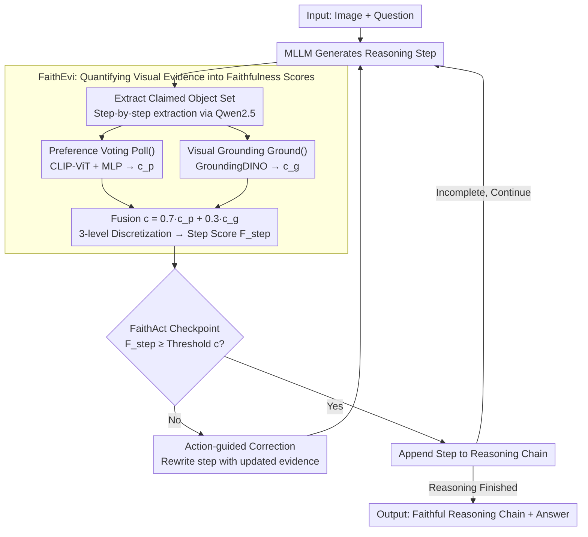

# Faithful-First Reasoning, Planning, and Acting for Multimodal LLMs

**Conference**: ACL 2026 Findings  
**arXiv**: [2511.08409](https://arxiv.org/abs/2511.08409)  
**Code**: [GitHub](https://github.com/lijunxian111/Faithful-First-RPA)  
**Area**: Multimodal VLM / Reasoning Faithfulness  
**Keywords**: Perceptual Faithfulness, Reasoning Planning and Execution, Multimodal Hallucination, Visual Evidence Verification, Step-by-step Reasoning

## TL;DR

This paper proposes the Faithful-First RPA framework, which evaluates perceptual faithfulness (whether claimed objects truly exist in the image) at each reasoning step via the FaithEvi pipeline and enforces evidence-based planning and action through the FaithAct mechanism during generation. This approach improves perceptual faithfulness by up to 24% without compromising task accuracy.

## Background & Motivation

**Background**: Multimodal Large Language Models (MLLMs) have achieved significant progress in tasks like VQA and visual reasoning. However, their reasoning trajectories often exhibit "unfaithfulness"—where generated explanations contradict visual evidence or represent post-hoc rationalizations of predictions.

**Limitations of Prior Work**: (1) Existing research primarily focuses on behavioral faithfulness (whether the reasoning chain reflects the model's decision process), neglecting perceptual faithfulness (whether reasoning steps are grounded in verifiable visual input); (2) Reasoning frameworks like CoT and ReAct do not verify the perceptual foundations of intermediate steps; (3) Models may arrive at a correct answer while relying on erroneous visual descriptions (e.g., describing a black bicycle as yellow).

**Key Challenge**: Current reasoning frameworks adopt a "generate-then-verify" paradigm, where perceptual errors are only discovered after the reasoning chain is completed, making correction costly and limited in effectiveness. Faithfulness should be a design principle rather than a post-hoc evaluation metric.

**Goal**: To establish a unified framework that can both quantitatively evaluate the perceptual faithfulness of reasoning chains and actively enforce evidence verification during the reasoning process.

**Key Insight**: Based on the principle that "a perceptually faithful model only reasons about what is visually observable," the reasoning process is formalized as a planning problem under faithfulness constraints.

**Core Idea**: At each step of reasoning, the framework extracts claimed objects, verifies their existence through preference voting and visual grounding, and calculates a faithfulness score. Steps that fail to meet a threshold must be corrected before proceeding further in the reasoning chain.

## Method

### Overall Architecture

Faithful-First RPA addresses "plausible-sounding but visually ungrounded" steps in MLLM reasoning chains (e.g., misidentifying a black bike as yellow). While CoT/ReAct check the full chain post-generation, this framework integrates verification into the generation loop. For each step generated by the MLLM given an image and question: FaithEvi evaluates if claimed objects exist and provides a score; if the score is below a threshold, FaithAct forces the MLLM to rewrite the step with updated evidence. The step is only appended to the chain once verified. These two components represent "measurement" (FaithEvi scoring) and "governance" (FaithAct checkpoint correction).

### Key Designs

**1. FaithEvi: Quantifying the Presence of Visual Evidence**

The root of unfaithful reasoning is the lack of step-by-step verification of whether "claimed objects actually exist." FaithEvi calculates this in three stages. First, Qwen2.5-7B-Instruct extracts the set of claimed objects $O_t = \{O_t^1, \dots, O_t^{m_t}\}$ from each step. Second, dual-path verification is performed for each object: one path uses a frozen CLIP-ViT-Large to encode the image and object text, passing them through a two-layer MLP (trained on POPE) to predict existence probability $c_p$ (preference voting); the other path uses a frozen GroundingDINO for spatial localization to get detection confidence $c_g$. Third, these are fused into $c_t^i = 0.7 \cdot c_p + 0.3 \cdot c_g$ and discretized into a three-level score ($<0.4\to0$, $0.4\text{-}0.6\to c_t^i$, $>0.6\to1$). These are aggregated into a step-level score $F_{\text{step},t} = \frac{1}{m_t}\sum f_t^i$ and a chain-level score $F_{\text{chain}} = \frac{1}{n}\sum F_{\text{step},t}$. The dual-path approach ensures robustness; preference voting provides global existence judgment when visual cues are weak, while grounding provides regional evidence.

**2. FaithAct: Reasoning as "Planning with Faithfulness Constraints"**

FaithEvi provides the score, but FaithAct acts as the gatekeeper. It formalizes reasoning as a constrained planning objective:

$$S^* = \arg\max F_{\text{step}}(s_t) \quad \text{s.t.} \quad \forall t,\; F_{\text{step}}(s_t) \geq c,$$

Immediately after a step is generated, it is validated. Steps below threshold $c$ are sent back to the MLLM with updated evidence (existence labels, bounding boxes, counts) for regeneration. To support this cycle, it exposes an extensible set of function interfaces: `Poll()` for existence probability, `Ground()` for bounding box detection, `Select()` to confirm existence, `Abstain()` to confirm absence, and `Count()` for counting. Unlike post-hoc verification, this catches perceptual errors before they propagate.

**3. Action-guided Reasoning Correction: Rewriting with Evidence**

Handling failed steps requires care; simply deleting them breaks logical coherence. Instead, FaithAct feeds the failed step along with updated visual evidence back to the model, using a correction prompt to guide the MLLM to revise only the perceptual description while maintaining logical continuity. This correction is particularly beneficial in later stages of the reasoning chain, consistent with observations that longer CoTs are more susceptible to noise.

### Loss & Training

This is an inference-time framework and does not involve MLLM training. The preference voting head (two-layer MLP) is trained on the POPE dataset. GroundingDINO and CLIP are used frozen. GroundingDINO settings: box threshold = 0.35, text threshold = 0.25.

## Key Experimental Results

### Main Results

**Perceptual Faithfulness Evaluation ($F_{\text{chain}}$, %)**

| Model + Method | LLaVA-bench | RealWorldQA | POPE | MMHal | Average |
|------------|-------------|-------------|------|-------|------|
| Qwen + CoT | 46.05 | 48.11 | 45.21 | 53.34 | 48.18 |
| Qwen + ReAct | 54.82 | 56.82 | 45.02 | 33.76 | 47.61 |
| **Qwen + FaithAct** | **55.10** | **57.22** | **56.87** | **66.45** | **58.91** |
| InternVL + CoT | 45.63 | 44.23 | 43.25 | 53.17 | 46.57 |
| **InternVL + FaithAct** | **52.64** | **57.35** | **56.01** | **61.71** | **56.93** |
| LLaVA + CoT | 47.56 | 52.31 | 52.28 | 30.63 | 45.70 |
| **LLaVA + FaithAct** | **52.82** | **58.11** | **56.09** | **39.91** | **51.73** |

**Task Accuracy Maintenance**

| Model | Method | RealWorldQA (%) | MMHal (rating) |
|------|------|---------------|---------------|
| Qwen | CoT | 70.1 | 3.40 |
| Qwen | FaithAct | **74.5** | **3.48** |
| InternVL | CoT | 70.8 | 3.61 |
| InternVL | FaithAct | 71.2 | 3.58 |

### Ablation Study

**Core Component Ablation (Qwen, RealWorldQA / MMHal)**

| Configuration | RealWorldQA (%) | MMHal (%) |
|------|---------------|----------|
| FaithAct (Full) | 57.22 | 66.45 |
| w/o Poll() | 54.24 (-3.0) | 63.25 (-3.2) |
| w/o Ground() | 53.16 (-4.1) | 62.47 (-4.0) |

### Key Findings

- FaithAct achieves an average perceptual faithfulness of 55.86%, a 7.76 percentage point increase over the strongest baseline, ReAct (48.10%).
- The largest gains occurred on the hallucination-sensitive MMHal benchmark: 21.99% higher than CoT and 9.81% higher than tool-augmented methods on average.
- Improved faithfulness does not hurt task accuracy; Qwen's accuracy on RealWorldQA even rose from 70.1% to 74.5%.
- `Ground()` contributes slightly more than `Poll()`, indicating that spatial localization provides more critical visual evidence.
- Replacing GroundingDINO with SAM3 led to a ~5% performance drop, suggesting the framework requires specialized localization models.
- FaithAct gains are more significant in later reasoning steps, verifying that later steps are more prone to hallucination.
- Manual verification showed LLM object extraction accuracy reached 99.42% (7550 object-level labels).
- Inference time increases roughly 2-3x (FaithAct 14-19s vs CoT 3-11s).

## Highlights & Insights

- The philosophy that "faithfulness should be a design principle rather than a post-hoc metric" is compelling—embedding constraints into the loop ensures each step is evidence-based.
- The distinction between perceptual and behavioral faithfulness is theoretically valuable: a model can be "right for the wrong reason" (behaviorally faithful but perceptually unfaithful) or "wrong for the right reason" (perceptually faithful but behaviorally unfaithful).
- The extensible function interface (Poll/Ground/Select/Abstain/Count) makes it easy to generalize the framework to attribute and relationship verification.

## Limitations & Future Work

- Currently only verifies faithfulness at the object existence level, excluding attributes (color, size) and relationships (spatial, action).
- Inference latency increases by 2-3x.
- Behavioral faithfulness is not directly evaluated; it is only assumed that perceptual faithfulness promotes behavioral consistency.
- Advantages are less pronounced on benchmarks with weak perceptual requirements (e.g., MathVista).

## Related Work & Insights

- **vs Grounded-CoT (Wu et al., 2025)**: The latter appends localization after reasoning; Ours verifies in real-time. FaithAct outperforms Grounded-CoT in 11/12 settings.
- **vs ReAct (Yao et al., 2022)**: ReAct allows tool use but doesn't enforce faithfulness constraints; This work proves that the $F_{\text{chain}}$ of ReAct is theoretically bounded by FaithAct.
- **vs VAT (Liu et al., 2025)**: Visual Abstraction Thinking degrades significantly on POPE (21.46%), suggesting abstraction may worsen perceptual decoupling.

## Rating

- Novelty: ⭐⭐⭐⭐ The formal definition of perceptual faithfulness and the "verify-while-generating" paradigm are innovative.
- Experimental Thoroughness: ⭐⭐⭐⭐ Tested across 3 models, 4 benchmarks, with complete ablations and manual verification.
- Writing Quality: ⭐⭐⭐⭐ Clear distinction between perceptual/behavioral faithfulness; rigorous framework design.
- Value: ⭐⭐⭐⭐ Provides a practical framework for MLLM reliability; extensible function interfaces.

<!-- RELATED:START -->

## Related Papers

- [\[ACL 2026\] ShredBench: Evaluating the Semantic Reasoning Capabilities of Multimodal LLMs in Document Reconstruction](shredbench_evaluating_the_semantic_reasoning_capabilities_of_multimodal_llms_in_.md)
- [\[NeurIPS 2025\] To See or To Read: User Behavior Reasoning in Multimodal LLMs](../../NeurIPS2025/vlm_reasoning/to_see_or_to_read_user_behavior_reasoning_in_multimodal_llms.md)
- [\[NeurIPS 2025\] SpatialThinker: Reinforcing 3D Reasoning in Multimodal LLMs via Spatial Rewards](../../NeurIPS2025/vlm_reasoning/spatialthinker_reinforcing_3d_reasoning_in_multimodal_llms_via_spatial_rewards.md)
- [\[CVPR 2026\] CodeV: Code with Images for Faithful Visual Reasoning via Tool-Aware Policy Optimization](../../CVPR2026/vlm_reasoning/codev_code_with_images_for_faithful_visual_reasoning_via_tool-aware_policy_optim.md)
- [\[ICLR 2026\] Evaluating VLMs' Spatial Reasoning Over Robot Motion: A Step Towards Robot Planning with Motion Preferences](../../ICLR2026/vlm_reasoning/evaluating_vlms_spatial_reasoning_over_robot_motion_a_step_towards_robot_plannin.md)

<!-- RELATED:END -->
