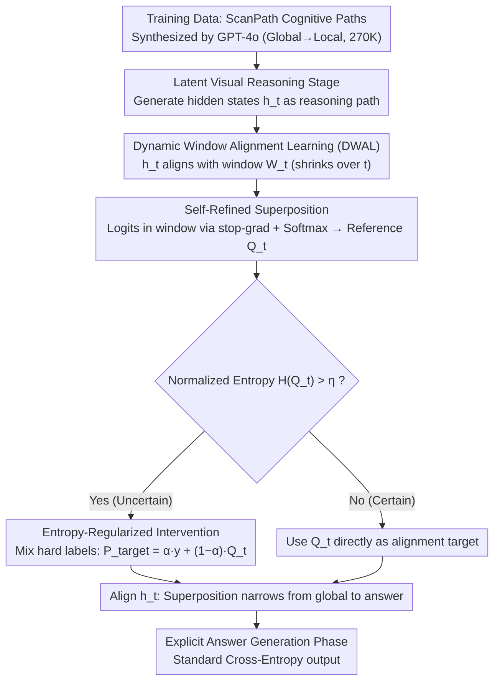

# Forest Before Trees: Latent Superposition for Efficient Visual Reasoning

**Conference**: ACL 2026  
**arXiv**: [2601.06803](https://arxiv.org/abs/2601.06803)  
**Code**: [GitHub](https://github.com/Laser-VLM/Laser)  
**Area**: Interpretability  
**Keywords**: Latent reasoning, dynamic window alignment, semantic superposition, visual reasoning, token efficiency

## TL;DR

This paper proposes Laser, which performs visual reasoning in latent space via Dynamic Window Alignment Learning (DWAL). By maintaining a "probabilistic superposition" of future semantics rather than precise token-by-token prediction, the model achieves a "global-to-local" cognitive hierarchy. Laser reaches SOTA among latent reasoning methods across six benchmarks using only 6 reasoning tokens (a 97%+ reduction), outperforming Monet by an average of 5.03%.

## Background & Motivation

**Background**: Vision-Language Models (VLMs) have achieved powerful visual understanding by integrating LLMs with visual encoders, with Chain-of-Thought (CoT) introduced to enable multi-step reasoning. Meanwhile, latent space reasoning methods (e.g., Coconut, SoftCoT, Monet) attempt to reason within high-dimensional hidden states to avoid information loss from explicit tokenization.

**Limitations of Prior Work**: (1) Explicit textual reasoning faces an information bandwidth bottleneck, where continuous visual details are lost during discrete tokenization. (2) Existing latent reasoning methods still follow standard autoregressive objectives, forcing each hidden state to strictly minimize prediction error for the next token, leading to "premature semantic collapse"—being forced to focus on a single specific token before grasping the global context. (3) This point-to-point mapping is inconsistent with the hierarchical nature of visual perception, which progresses from global semantics to local features.

**Key Challenge**: The strict token-by-token prediction objective fundamentally mismatches the hierarchical characteristics of visual reasoning, where early reasoning should maintain global semantic openness before narrowing down to specific answers.

**Goal**: To design a latent reasoning paradigm that allows reasoning states to encode a "superposition" of global semantics in the early stages and gradually narrow down to precise local information as reasoning progresses.

**Key Insight**: Inspired by the Global Precedence Hypothesis—where human visual perception processes the overall structure before local details—the reasoning objective is redefined from point-to-point prediction to dynamic window alignment.

**Core Idea**: Replace the token-by-token prediction objective with a dynamic semantic window. Instead of predicting the next token, the hidden state at each step aligns with a dynamic window containing all remaining reasoning steps. The window naturally shrinks as reasoning progresses, achieving a gradual transition from global exploration to local precision.

## Method

### Overall Architecture

Laser addresses the issue where existing latent reasoning methods (e.g., Coconut, Monet) use standard autoregressive objectives that force early hidden states to collapse into a single semantic point before understanding the global context. The reasoning process in Laser consists of two stages: first, a latent visual reasoning stage where the model generates a sequence of high-dimensional hidden states as an intermediate path, using DWAL to align hidden states with a dynamic semantic window; second, an explicit answer generation stage that outputs the final answer using standard cross-entropy based on the evolved visual understanding. Training data consists of cognitive ScanPaths (270K samples) synthesized by GPT-4o in a global-to-local order.

### Key Designs

**1. Dynamic Window Alignment Learning (DWAL): Replacing "Next Token Prediction" with "Window Alignment"**

Standard autoregressive objectives force early hidden states to collapse prematurely. DWAL defines a dynamic semantic window $W_t = \{c_k \mid t \leq k \leq T\}$ for reasoning step $t$, encompassing all remaining tokens. The hidden state $h_t$ aligns with the entire window $W_t$ rather than just $c_{t+1}$. As $t$ increases, the window shrinks ($|W_t| \to 1$), allowing the state to maintain a "superposition" for exploration early on and naturally converge to the answer later.

**2. Self-Refined Superposition: Constructing Stable Supervision without External Soft Labels**

DWAL requires a reference distribution for the window's semantics. Without existing soft labels, Laser extracts logits for tokens in $W_t$. By applying stop-gradient and temperature-scaled Softmax, it constructs a reference superposition distribution $Q_t$. The stop-gradient prevents divergent loops, essentially using the model's own estimation of future semantics as a soft target.

**3. Entropy-Regularized Intervention: Injecting Hard Labels based on Uncertainty**

To prevent the latent space from drifting into meaningless high-entropy distributions, Laser calculates the normalized entropy $H(Q_t)$. If $H(Q_t) > \eta$ (high uncertainty), it mixes the hard label with the soft distribution:

$$P^{target}_t = \alpha \cdot \mathbf{y}_{hard} + (1-\alpha) \cdot Q_t,$$

otherwise, it uses $Q_t$ directly. This forms an implicit curriculum: forcing precise alignment when uncertain and allowing free exploration in superposition when certain.

### Loss & Training

The total loss is $\mathcal{L}_{Total} = \mathcal{L}_{DWAL} + \mathcal{L}_{CE}$. The DWAL loss aligns hidden states with the mixed target along the reasoning chain, while the CE loss is used during the answer generation phase. The base model is Qwen2.5-VL-7B-Instruct, with the vision tower frozen and only LLM parameters optimized. Hyperparameters are set to $\eta=0.6$ and $\alpha=0.8$.

## Key Experimental Results

### Main Results

| Method | Type | MMVP | BLINK | SEED2+ | MMStar | Hallusion | HRBench | Overall |
|------|------|------|-------|--------|--------|-----------|---------|---------|
| Qwen2.5-VL-7B | Zero-shot | 65.67 | 53.60 | 65.31 | 59.70 | 56.57 | 68.25 | 61.52 |
| Vision-R1 | RL | 72.67 | 52.71 | 68.95 | 62.67 | 63.83 | 75.12 | 65.99 |
| VL-Rethinker | RL | 72.67 | 55.55 | 70.27 | 63.20 | 71.08 | 63.50 | 66.05 |
| Monet | Latent | 68.00 | 50.71 | 65.88 | 60.33 | 56.36 | 68.00 | 61.55 |
| LVR | Latent | 64.00 | 53.60 | 47.39 | 57.93 | 65.19 | 53.62 | 56.96 |
| **Laser** | Latent | **72.00** | **56.92** | **70.05** | **60.27** | **67.72** | **72.50** | **66.58** |

### Ablation Study

**Efficiency Comparison (Average Reasoning Tokens)**

| Method | BLINK Avg Tokens | HRBench Avg Tokens | Reduction |
|------|-----------------|-------------------|---------|
| Qwen2.5-VL-7B | 223.5 | 55.9 | — |
| VL-Rethinker | 207.0 | 143.8 | +157.2%(HRBench) |
| Monet | 118.3 | 86.8 | — |
| LVR | 8.0 | 8.0 | -96.4% |
| **Laser** | **6.0** | **5.7** | **-97.3%** |

### Key Findings

- Laser outperforms all latent reasoning baselines by an average of 5.03%, even surpassing compute-intensive RL methods like Vision-R1 and VL-Rethinker.
- It requires only 6 reasoning tokens (97.3% reduction) while improving performance, proving that latent superposition can encode rich semantics in an extremely compact space.
- Ablations show that removing DWAL (falling back to token-by-token prediction) primarily hurts fine-grained perception, while removing the dynamic window (using a fixed window) impairs complex reasoning.
- Significant improvements on out-of-domain tasks (Web +8.03%, Chart +5.18%) suggest no catastrophic forgetting.
- Latent trajectories decoded via the LM head show an interpretable multi-hop process: "entity grounding → spatial analysis → semantic inference."

## Highlights & Insights

- The "Semantic Superposition" concept is elegant, introducing quantum-like intuition to visual reasoning by allowing states to hold multiple possibilities before collapsing into an answer.
- A 97%+ reduction in tokens with performance gains challenges the assumption that reasoning requires lengthy thinking chains.
- The implicit curriculum design—using an entropy threshold to switch between exploration and correction—is highly effective.

## Limitations & Future Work

- Slight performance gap in absolute pixel-level localization tasks (e.g., Object Localization, Jigsaw), as the "global-to-local" strategy inherently favors semantic understanding over precise metrics.
- Dependence on synthetic data from GPT-4o may inherit its biases.
- Validation is limited to 7B models; performance on larger scales is unknown.
- The linear shrinkage of the dynamic window might be suboptimal compared to adaptive shrinkage.

## Related Work & Insights

- **vs Monet**: Monet reasons in latent space but generates dense sequences (118 tokens); Laser compresses this to 6 tokens via superposition.
- **vs LVR**: LVR forces strict autoregressive reconstruction leading to semantic degradation (-9.62%); Laser avoids this via flexible window alignment.
- **vs Vision-R1/VL-Rethinker**: These methods use RL and long-form reasoning but are computationally expensive; Laser's latent approach is more efficient.
- **vs CoT**: Explicit CoT is limited by the information bottleneck of discrete tokenization; Laser bypasses this in continuous space.

## Rating

- Novelty: ⭐⭐⭐⭐⭐ The approach of combining dynamic window alignment with semantic superposition is highly original.
- Experimental Thoroughness: ⭐⭐⭐⭐⭐ Includes 6 benchmarks, efficiency analysis, fine-grained task analysis, OOD transfer, and interpretability.
- Writing Quality: ⭐⭐⭐⭐⭐ Concepts are clearly articulated, and the "Forest Before Trees" metaphor is well-integrated.
- Value: ⭐⭐⭐⭐⭐ 97% token reduction with improved performance is significant for real-world VLM deployment.

<!-- RELATED:START -->

## Related Papers

- [\[CVPR 2026\] Latent Implicit Visual Reasoning](../../CVPR2026/vlm_reasoning/latent_implicit_visual_reasoning.md)
- [\[ACL 2026\] DRIFT: Transferring Reasoning Priors for Efficient MLLM Fine-Tuning](drift_transferring_reasoning_priors_for_efficient_mllm_fine-tuning.md)
- [\[CVPR 2026\] Monet: Reasoning in Latent Visual Space Beyond Image and Language](../../CVPR2026/vlm_reasoning/monet_reasoning_in_latent_visual_space_beyond_image_and_language.md)
- [\[CVPR 2026\] Machine Mental Imagery: Empower Multimodal Reasoning with Latent Visual Tokens](../../CVPR2026/vlm_reasoning/machine_mental_imagery_empower_multimodal_reasoning_with_latent_visual_tokens.md)
- [\[ICML 2026\] Imagination Helps Visual Reasoning, But Not Yet in Latent Space](../../ICML2026/vlm_reasoning/imagination_helps_visual_reasoning_but_not_yet_in_latent_space.md)

<!-- RELATED:END -->
