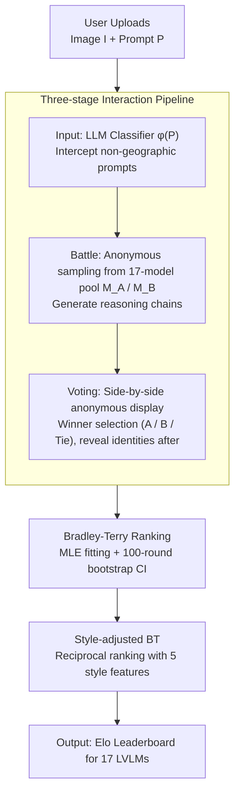

# GeoArena: Evaluating Open-World Geographic Reasoning in Large Vision-Language Models

**Conference**: ACL 2026  
**arXiv**: [2509.04334](https://arxiv.org/abs/2509.04334)  
**Code**: https://github.com/Applied-Machine-Learning-Lab/ACL2026_GeoArena  
**Area**: Multimodal VLM / Geographic Reasoning / Evaluation Benchmark  
**Keywords**: Geographic Reasoning, LVLM Evaluation, Human Preference, Bradley-Terry, Open-world

## TL;DR
Ours proposes **GeoArena**, a "dynamic, label-free, process-oriented" evaluation platform for open-world geographic reasoning in LVLMs. It reformulates geographic localization assessment under in-the-wild images into a pairwise reasoning alignment task, ranking 17 frontier LVLMs using human preferences and Bradley-Terry scores, achieving a 78% expert-crowdsource agreement rate.

## Background & Motivation

**Background**: Existing LVLM geographic reasoning benchmarks (OSV-5M, LLMGeo, IMAGEO-Bench, FairLocator, GeoChain, etc.) are predominantly *outcome-centric*: using static datasets with predefined labels (coordinate distance, country/city accuracy) to calculate "label-match."

**Limitations of Prior Work**:
- *Data Contamination*: Images in static benchmarks are easily absorbed during web-scale pre-training; high scores may result from memorization.
- *Black-box Process*: Collapsing complex reasoning chains into a single label fails to distinguish between "guessed correctly" and "reasoned correctly."
- *Lack/Ambiguity of Labels*: In-the-wild images often lack authoritative ground truth (GT); the concept of "correctness" collapses when multiple hypotheses coexist.
- *Nature of the Open World*: Geographic reasoning is inherently *abductive*—making reasonable guesses by fusing visual evidence with spatial, environmental, and cultural knowledge—rather than deterministic prediction.

**Key Challenge**: A severe mismatch exists between the evaluation paradigm (closed, static, label-only) and the task essence (open, dynamic, reasoning-heavy).

**Goal**: To construct an evaluation framework that is (i) dynamically expandable, (ii) process-oriented, and (iii) free of GT labels, capable of stably ranking LVLMs.

**Key Insight**: Borrowing the "human pairwise preference + Bradley-Terry" paradigm from Chatbot Arena, geographic reasoning evaluation is transformed into *pairwise reasoning alignment*. Parallel models are fed the same image and prompt anonymously, and humans vote based on "reasoning quality + evidence integration + plausibility." This bypasses GT labels while naturally capturing the quality of reasoning chains.

**Core Idea**: Replace "correctness" with "which explanation aligns better with human geographic intuition" and instantiate it as an always-on public web arena.

## Method

### Overall Architecture
GeoArena is an in-the-wild evaluation pipeline: "Upload image → Automatic filtering → Two-model battle → Human voting → BT ranking." Deployed as a public website, it continuously collects data and updates the leaderboard. Formal definition: For each image $I\in\mathcal{I}$ and prompt $P\in\mathcal{P}$, model $M$ outputs a reasoning chain $R\in\mathcal{R}$. The evaluation function is
$E_{\text{reasoning}}(M)=\mathbb{E}_{(I,P)}[\mathcal{A}(M(I,P),\mathcal{H})]$
, where $\mathcal{H}$ is the latent space of "human geographic expectations" and $\mathcal{A}$ measures the alignment between the reasoning chain and human spatial logic.

### Key Designs

**1. Three-stage Interaction Pipeline (Input → Battle → Voting): Transforming casual uploads into observable controlled experiments**

Wild evaluation is vulnerable to noise from irrelevant prompts and brand bias. This pipeline constrains user behavior into a scientific experiment. In the *Input* stage, an LLM classifier $\phi(P)$ filters out non-geographic prompts to ensure the leaderboard evaluates genuine geographic reasoning. In the *Battle* stage, two models $M_A, M_B$ are sampled anonymously to generate explanations for the same image and prompt. In the *Voting* stage, responses are presented side-by-side anonymously; users vote (A wins / B wins / Tie) before model identities are revealed.

These steps mitigate specific biases: anonymous battles eliminate brand bias, pre-filtering blocks irrelevant noise, and side-by-side comparison forces judges to focus on reasoning quality rather than superficial packaging. Oversight reliability was verified using Gemini 2.0 Flash / GPT-3.5 Turbo / GPT-4.1 Mini as classifiers on 100 positive and 100 negative examples (general prompts from Chatbot Arena), achieving 100% accuracy.

**2. Bradley-Terry Ranking + Bootstrap Confidence Intervals: Aggregating streaming votes into a statistically sound global leaderboard**

Pairwise voting is streaming. Direct online Elo expectations $P(M_i \succ M_j)=\frac{1}{1+10^{(\gamma_j-\gamma_i)/\alpha}}$ are sensitive to match order. GeoArena follows Chiang et al. by using Bradley-Terry for maximum likelihood estimation (MLE) of all historical pairwise outcomes:

$$\mathcal{L}(\mathbf{\Gamma})=\sum_{i\neq j}W_{ij}\log\frac{1}{1+10^{(\gamma_j-\gamma_i)/\alpha}}$$

Ratings are aligned to the Elo scale via $\text{rating}_i=400\cdot\hat\gamma_i + 1000$. BT is order-invariant and naturally suits static LVLM evaluation. A 100-round bootstrap resampling provides 95% confidence intervals (CI), ensuring that gaps between models are statistically significant rather than driven by noise.

**3. Style-adjusted BT: Decoupling "fancy writing" from "good reasoning"**

Uncontrolled human preferences are easily deceived by verbosity, lists, and fancy formatting—length bias is a classic pitfall in pairwise evaluation. GeoArena addresses this by including model one-hot vectors and five normalized style features $\{\text{length, list, header, emphasis, GPS\_ratio}\}$ in the logistic regression design matrix. Style coefficients $\beta$ are estimated first, and the leaderboard is reranked using model coefficients after stripping style effects.

Regression results reveal that $\beta_{\text{length}}=0.526$ (strong positive correlation with length), $\beta_{\text{list}}=0.095$, and $\beta_{\text{GPS}}=0.06$, while $\beta_{\text{header}}=-0.153$ and $\beta_{\text{emphasis}}=-0.117$ (excessive headers and emphasis are actually negatively correlated). After style adjustment, rankings shifted significantly—Gemma 3 12B dropped from 4th to 9th, confirming its high rank was partially inflated by verbose output rather than superior reasoning.

### Loss & Training
The platform involves no training. At inference, 17 models are called, and humans provide pairwise votes. Ranking fitting uses logistic regression (BT MLE) with $K$=4 scaling and 100-round bootstrap for CI estimation. Experts validated 100 pairs to verify crowdsourcing reliability.

## Key Experimental Results

### Main Results
Selected BT rankings of 17 frontier LVLMs on GeoArena:

| Rank | Model | Elo | 95% CI | Notes |
|------|------|-----|--------|------|
| 1 | Gemini 2.5 Pro | 1319.7 | [974.8, 1443.8] | Tier 1 |
| 2 | Gemini 2.5 Flash | 1206.5 | [1062.2, 1330.6] | Tier 1 |
| 3 | Qwen 2.5 VL 72B | 1094.5 | [982.6, 1181.9] | Best Open-source |
| 6 | GPT 4.1 Mini | 1059.8 | [970.0, 1161.4] | Middle Tier |
| 10 | Claude Opus 4 | 1042.3 | [933.8, 1130.0] | Overlaps with GPT 4.1 |
| 13 | GPT 4o | 1000.0 | — | Anchor |
| 17 | GPT 4o Mini | 871.6 | [715.2, 1114.7] | Last Place |

The Gemini series leads significantly. Open-source models like Qwen 2.5 VL 72B approach the GPT-4.1 series. GPT 4.1, Llama 4 Maverick, and Claude Opus 4 show no statistically significant difference within the 1040–1050 range.

### Ablation Study

| Experiment | Main Metric | Conclusion |
|------|--------|------|
| Expert vs Crowd Agreement | 78% Avg (Left Win 83.3% / Tie 65.6% / Right Win 84.4%) | Crowdsourced preferences are reliable and consistent with Chiang et al. |
| LVLM as Judge | Gemini 2.5 Pro 65.79% / Qwen 2.5 VL 72B 46.67% | Automatic evaluation is currently insufficient to replace humans. |
| Style Control (Style-adjusted Elo) | Gemma 3 12B 4 → 9, Claude Opus 4 10 → 8 | Verbosity and excessive lists "inflate" rankings. |
| Style Regression Coefficients | $\beta_{\text{length}}=0.526$, $\beta_{\text{header}}=-0.153$ | Strong positive correlation with length; negative with excessive headers. |

### Key Findings
- **Clear Capability Tiering**: Gemini series > Qwen/Gemma middle tier > GPT-mini/nano small models. Scaling remains effective for geographic reasoning; within the Qwen 2.5 VL family, performance increases monotonically from 7B to 72B.
- **High Expert-Crowd Agreement**: 78% average agreement with lower agreement on "Ties" (65.6%) suggests that determining a winner is straightforward, while nuances in draws are harder for crowds, matching LMSYS experiences.
- **Current LVLMs Cannot Judge Yet**: Even Gemini 2.5 Pro only achieves 65.8% agreement with humans, proving geographic reasoning evaluation still requires human intervention.
- **Length Bias Persists**: Significant shifts in style-adjusted rankings (Gemma 3 12B from 4 to 9) prove that "looking comprehensive" differs from "reasoning correctly."
- **In-the-wild Dataset Nature**: 94.2% outdoor, 84.2% without landmarks, 45.2% with text. This forces models to reason from weak signals like vegetation, architectural style, and road textures, closer to real-world scenarios.

## Highlights & Insights
- **Paradigm Contribution**: Systematically migrates the Chatbot Arena concept to *geographic reasoning*, a reasoning-heavy multimodal task that lacks GT. Process-oriented, human-preferred, and dynamically expandable features directly address the three pain points of static benchmarks.
- **Style-Ability Decoupling**: Direct inclusion of style features as confounding variables in BT regression is a lightweight method to control "verbose-wins" bias, transferable to other arena-based systems.
- **Reliable Automatic Filtering**: 100% binary accuracy suggests that identifying geographic queries is trivial for modern LLMs, supporting the use of small LLMs as gatekeepers for other arenas.
- **Case Studies Reveal Capability Gaps**: Stronger models lead significantly on difficult images without landmarks by relying on vegetation/architectural styles, suggesting that the bottleneck in geographic reasoning is *fusing weak multiple cues* rather than landmark recognition.

## Limitations & Future Work
- **Demographic/Geographic Bias**: The current user base determines the image distribution, which may not be "world-uniform," potentially overestimating performance in common regions.
- **No User-level Tracking**: User IDs are not stored for privacy, making it impossible to quantify voting bias from a few heavy users.
- **Static Model Pool**: 17 models cannot cover all frontiers; rankings may fluctuate as new models are added.
- **Focus on Explanatory Quality**: Lack of objective coordinate accuracy assessment makes it less suitable for applications requiring precise localization.
- **Missing Systematic Failure Analysis**: Further empirical work is needed to determine "which types of images are most likely to be misjudged" or if "systemic cultural biases" exist.

## Related Work & Insights
- **vs Chatbot Arena / GenAI Arena**: Shares the same methodology (pairwise + BT), but ours is the first to implement this for *geographic reasoning*.
- **vs OSV-5M / LLMGeo / IMAGEO-Bench**: These use static data and GPS/country labels for outcome evaluation; GeoArena is dynamic, label-free, and process-oriented.
- **vs GeoChain**: Reasoning-oriented but relies on fixed datasets and pass scores; GeoArena replaces pass scores with human pairwise preferences for better scalability.
- **vs Img2Loc / G3**: These focus on methods (RAG/retrieval-augmented LVLM for localization); ours focuses on evaluation, making them complementary.

## Rating
- Novelty: ⭐⭐⭐⭐ First to systematically apply the Arena paradigm to geographic reasoning; technical mechanisms leverage established Arena methods.
- Experimental Thoroughness: ⭐⭐⭐⭐ 17 models, expert validation, style-adjustment, automatic filtering, and multi-dimensional analysis; lacks large-scale long-term tracking.
- Writing Quality: ⭐⭐⭐⭐ Clear motivation, well-formalized method; Paradigm comparisons and BT math are intuitive.
- Value: ⭐⭐⭐⭐⭐ Provides much-needed human preference infrastructure for the GeoAI community; open-sourced code and platform are essential tools for future model alignment.

<!-- RELATED:START -->

## Related Papers

- [\[CVPR 2026\] From Indoor to Open World: Revealing the Spatial Reasoning Gap in MLLMs](../../CVPR2026/vlm_reasoning/from_indoor_to_open_world_revealing_the_spatial_reasoning_gap_in_mllms.md)
- [\[ACL 2026\] Addressing Overthinking in Large Vision-Language Models via Gated Perception-Reasoning Optimization](addressing_overthinking_in_large_vision-language_models_via_gated_perception-rea.md)
- [\[ACL 2026\] OMIBench: Benchmarking Olympiad-Level Multi-Image Reasoning in Large Vision-Language Models](omibench_benchmarking_olympiad-level_multi-image_reasoning_in_large_vision-langu.md)
- [\[NeurIPS 2025\] MM-OPERA: Benchmarking Open-ended Association Reasoning for Large Vision-Language Models](../../NeurIPS2025/vlm_reasoning/mm-opera_benchmarking_open-ended_association_reasoning_for_large_vision-language.md)
- [\[ACL 2026\] MMErroR: A Benchmark for Erroneous Reasoning in Vision-Language Models](mmerror_a_benchmark_for_erroneous_reasoning_in_vision-language_models.md)

<!-- RELATED:END -->
