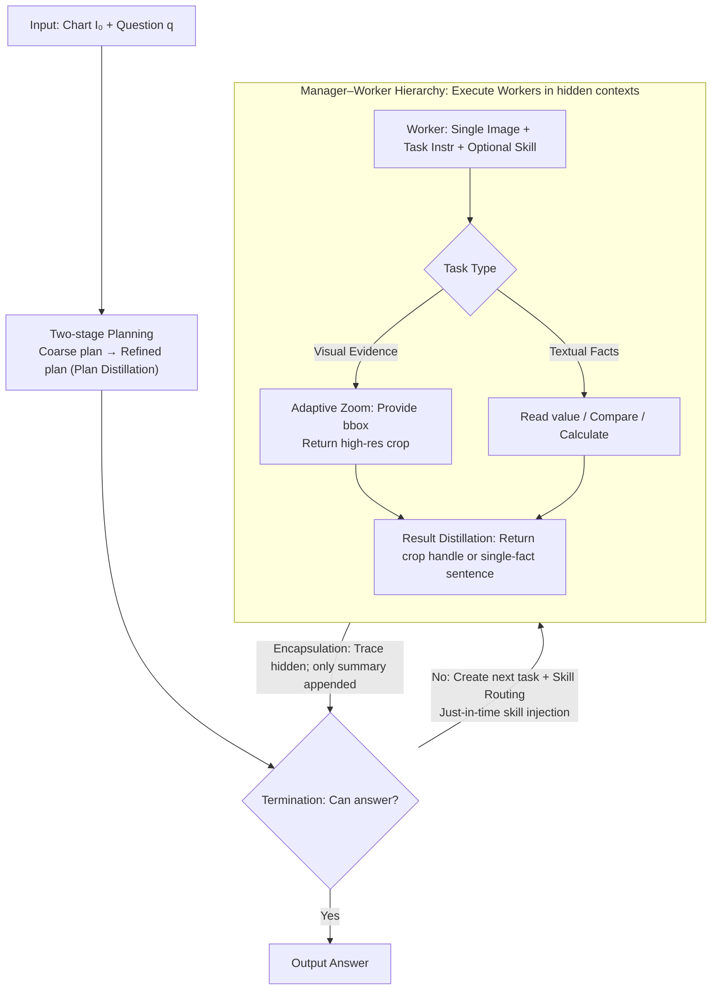

# HierVA: Hierarchical Visual Agent — Managing Contexts in Joint Image-Text Space for Advanced Chart Reasoning

**Conference**: ACL 2026  
**arXiv**: [2605.04304](https://arxiv.org/abs/2605.04304)  
**Code**: To be confirmed  
**Area**: Multimodal VLM / Agent / Chart Reasoning  
**Keywords**: chart QA, hierarchical agent, multimodal context, zoom-in, training-free

## TL;DR
HierVA utilizes a "manager–worker" dual-layer multimodal agent to manage both image and text contexts during chart reasoning through a disciplined "acquisition–limitation–distillation" approach. It outperforms strong baselines like CoT and "thinking with images" on complex chart reasoning benchmarks such as CharXiv in a training-free manner.

## Background & Motivation

**Background**: Chart Question Answering (Chart QA) is a core capability for research assistants and document understanding systems. While Chain-of-Thought (CoT) enables MLLMs to perform explicit reasoning, recent "thinking with images" paradigms (OpenAI 2025, Lai 2025, Zheng 2025) allow models to iteratively acquire additional visual evidence (e.g., zoom-in crops) and incorporate visual details into the reasoning trace.

**Limitations of Prior Work**: MLLMs have reached 90%+ accuracy on single-image, single-step tasks (ChartQA-style). However, existing methods struggle with complex charts involving multiple subplots and multi-step reasoning (CharXiv reasoning split). CoT becomes distracted by irrelevant elements in the global view, while "thinking with images" methods continuously append each zoom-in crop to the context, leading to **monotonic context growth**. This results in images consuming excessive tokens and accumulated intermediate steps diluting global reference information.

**Key Challenge**: Complex chart reasoning is inherently a hybrid image-text task requiring the simultaneous preservation of local region details and multi-step intermediate results. However, LLM context is limited, and text+image information tend to dilute each other, leading to confusion as the reasoning chain lengthens.

**Goal**: To establish rigorous multimodal context management without training any models—ensuring necessary details are acquired while unnecessary intermediate artifacts are distilled.

**Key Insight**: This work transfers the same discipline used for managing text reasoning traces (plan distillation, scope, summarize) to visual contexts, enforced through a **manager–worker hierarchical architecture**.

**Core Idea**: A manager maintains a refined global context, while multiple workers operate within isolated local contexts. Each zoom-in or calculation result only returns a distilled summary back to the manager.

## Method

### Overall Architecture

HierVA addresses the problem of "context clutter" in complex chart reasoning. In scenarios with multiple subplots and multi-step reasoning, models must retain local visual details while maintaining intermediate results, yet these two types of information often dilute each other within limited token budgets. The solution is to port the discipline of text context management—planning, scoping, and distilling—to the visual context, enforced by a hierarchical agent architecture.

Specifically, given an input chart $I_0$ and a natural language question $q$, the system outputs an answer $a$. A Manager maintains a refined global context $C_M = \{q, I_0, \text{refined plan}, \text{distilled summaries}\}$. Several Workers operate within isolated local contexts $C_{W_t} = \{\text{task instr}, \text{optional skill}, \text{single image}\}$. The Manager follows the control loop in Algorithm 1: it performs two-stage planning (coarse plan then refinement, retaining only the refined version), then loops through "termination check → task creation → worker execution → append distilled summary to $C_M$" until a final $\boxed{}$ answer is generated. The main reasoning line only sees the clean context of the Manager, while the internal operations of the Workers are encapsulated.

### Key Designs

**1. Manager–Worker Hierarchy + Encapsulation: Blocking local noise with abstraction barriers**

The pain point addressed is monotonic context growth, where prior thinking-with-images methods dump all worker deliberations into the main context. HierVA adds an encapsulation barrier: the Manager only perceives its own $C_M$. After a Worker completes a task, its internal reasoning trace is not appended to $C_M$; instead, only a "one-sentence fact" or a "crop handle" is returned as a distilled result. Furthermore, each Worker receives only a single image (original or crop) and minimal instructions, forcing scoped evidence. Consequently, the growth of the main reasoning context is decoupled from sub-task complexity.

**2. Adaptive Zoom as an explicit action: Elevating "look closer" to a first-class citizen**

Small text, ticks, and legends in charts are often illegible at a global scale. HierVA abstracts zooming into an image-expected task rather than burying it in CoT natural language. A Worker calls a zoom-in tool with a bounding box and returns a cropped, high-resolution image. The Manager’s action space converges into a binary choice: request new visual evidence (zoom) or request textual facts (read, compare, calculate). Modeling zooming as a typed action makes scheduling and debugging more controllable than vague prompts.

**3. Skill routing + Triple context distillation: Just-in-time injection and stopping inflation**

Instead of putting all skills (e.g., code for precise calculation) into the base system prompt, HierVA maintains a compact skill library $\mathcal{S}$. The Manager selects relevant skills for each task and injects them **just-in-time** into the Worker's system prompt. This routing, combined with triple distillation, prevents context bloat: Plan distillation keeps only the final plan; Worker encapsulation hides individual traces; Result distillation compresses worker responses. These three points address the three sources of context inflation: wordy planning, execution noise, and verbose results.

### Mechanism

Using a multi-step CharXiv-style question as an example ("In the subplot labeled GDP, how much higher is the 2020 value than the 2015 value?"):

- The Manager performs two-stage planning, refining the task into "locate GDP subplot → read values for 2020 and 2015 → calculate difference," keeping only the refined plan in $C_M$.
- In the first round, the Manager issues a zoom task. A Worker takes the original image and bounding box, calls zoom-in to return a high-res crop of the GDP subplot, and **only returns a crop handle**.
- In the second round, the Manager issues a reading task with just-in-time "coordinate reading" skills. The Worker reads the values from the crop and **only returns two sentences of facts**.
- In the third round, the Manager issues a calculation task with a code skill. The Worker calculates the difference and returns the result.
- The Manager finally provides the $\boxed{}$ answer using the refined plan and the three distilled summaries.

Throughout the process, the Manager's context only increases by a few distilled summaries rather than every intermediate token from three rounds of execution.

### Loss & Training
Ours is training-free, involving no parameter updates. All improvements stem from prompt orchestration design, utilizing the same base MLLM (Qwen3VL-A22B in experiments).

## Key Experimental Results

### Main Results: CharXiv reasoning split
Baselines include Direct, CoT, CoT-Plan, and Thinking w/ Images, all using Qwen3VL-A22B as the backbone. Metrics include overall Acc and sub-types: Extr, First, Read, RevR, Comp, Freq, along with Peak Token count.

| Method | Image Tools | Skills | CharXiv-All | Peak Tok # |
|------|-------------|--------|-------------|------------|
| Direct | — | — | 45.7 | 702 |
| CoT | — | — | 62.1 | 1926 |
| CoT-Plan | — | — | 62.4 | 1947 |
| Thinking w/ Images | zoom | — | (See original) | — |
| **HierVA (Ours)** | zoom + code | ✓ | **Outperforms all baselines** | Controlled growth |

On ChartQA + synthetic multi-subplot charts (sp#1 to sp#6): As the number of subplots increases, all methods decline, but HierVA only drops by **1.5%**, compared to 2.6% for CoT, 3.8% for CoT-Plan, and 5.4% for Direct.

| Method | ChartQA | sp#1 | sp#2 | sp#4 | sp#6 |
|------|---------|------|------|------|------|
| Direct | 88.9 | 88.5 | 86.5 | 84.8 | 83.1 |
| CoT | 90.2 | 90.1 | 89.2 | 88.4 | 87.5 |
| Thinking w/ Images | 89.9 | 89.7 | 88.5 | 87.4 | 87.5 |
| **HierVA** | 89.9 | 89.7 | 89.2 | 88.5 | **88.2** |

### Ablation Study

| Configuration | Key Effect | Description |
|------|---------|------|
| Full HierVA | Best Performance | manager+worker + triple distillation |
| w/o Hierarchy | Significant drop | Degenerates to thinking-with-images |
| w/o Scoped visual context | Moderate drop | Worker gets distracted by the full image |
| w/o Distilled context | Moderate drop | Manager context bloats; long-chain reasoning fails |

### Key Findings
- Benefits of context management are smaller for simple single-step retrieval (ChartQA-style); HierVA's strength lies in complex charts requiring multi-step reasoning.
- As complexity (number of subplots) increases, HierVA’s relative advantage grows, confirming that long-chain reasoning tests context management.
- The three distillation mechanisms are complementary; removing any one of them leads to performance degradation.

## Highlights & Insights
- **Transferring text context discipline to image context**: The core insight is that images and text are homogeneous at the token-budget level, making distillation/scoping/encapsulation equally applicable.
- **Just-in-time skill injection**: Unlike traditional "all-skills-in-system-prompt" approaches, this design is generic for any tool-use agent.
- **Zoom as a first-class action**: Modeling zoom as a typed action is more controllable than vaguely mentioning "pay attention to details" in a prompt.

## Limitations & Future Work
- Completely dependent on the instruction-following capability of the base MLLM; may fail with smaller models.
- Peak token usage remains relatively high; further compression is needed for latency-sensitive scenarios.
- Evaluation is limited to CharXiv, ChartQA, and synthetic charts; performance on real-world dashboards or maps is unverified.
- Lack of a learned skill selection strategy; relies on manager prompt heuristics.

## Related Work & Insights
- **vs CoT / CoT-Plan**: Pure text CoT lacks detail visibility; CoT-Plan cannot dynamically acquire evidence. HierVA integrates images into working memory.
- **vs Thinking w/ Images** (Zheng 2025): Both allow zooming, but HierVA uses hierarchy + distillation to prevent monotonic expansion, acting as a structured upgrade.
- **vs ReAct / Tool Agents**: Similar philosophy (agent + tool), but HierVA emphasizes the often-overlooked aspect of multimodal context management.

## Rating
- Novelty: ⭐⭐⭐⭐ The framing of manager-worker + distillation is a clear new perspective in multimodal agents.
- Experimental Thoroughness: ⭐⭐⭐ Primarily focused on CharXiv + ChartQA; synthetic tests are clever but benchmark coverage could be broader.
- Writing Quality: ⭐⭐⭐⭐ Motivation and design principles are tightly linked.
- Value: ⭐⭐⭐⭐ Training-free and ready for use in chart assistant applications.

<!-- RELATED:START -->

## Related Papers

- [\[CVPR 2026\] Monet: Reasoning in Latent Visual Space Beyond Image and Language](../../CVPR2026/vlm_reasoning/monet_reasoning_in_latent_visual_space_beyond_image_and_language.md)
- [\[ICLR 2026\] JointAVBench: A Benchmark for Joint Audio-Visual Reasoning Evaluation](../../ICLR2026/vlm_reasoning/jointavbench_a_benchmark_for_joint_audio-visual_reasoning_evaluation.md)
- [\[ICLR 2026\] OCR-Reasoning Benchmark: Unveiling the True Capabilities of MLLMs in Complex Text-Rich Image Reasoning](../../ICLR2026/vlm_reasoning/ocr-reasoning_benchmark_unveiling_the_true_capabilities_of_mllms_in_complex_text.md)
- [\[CVPR 2026\] MMTIT-Bench: A Multilingual and Multi-Scenario Benchmark with Cognition-Perception-Reasoning Guided Text-Image Machine Translation](../../CVPR2026/vlm_reasoning/mmtit-bench_a_multilingual_and_multi-scenario_benchmark_with_cognition-perceptio.md)
- [\[CVPR 2026\] OASIS: On-Demand Hierarchical Event Memory for Streaming Video Reasoning](../../CVPR2026/vlm_reasoning/oasis_on-demand_hierarchical_event_memory_for_streaming_video_reasoning.md)

<!-- RELATED:END -->
