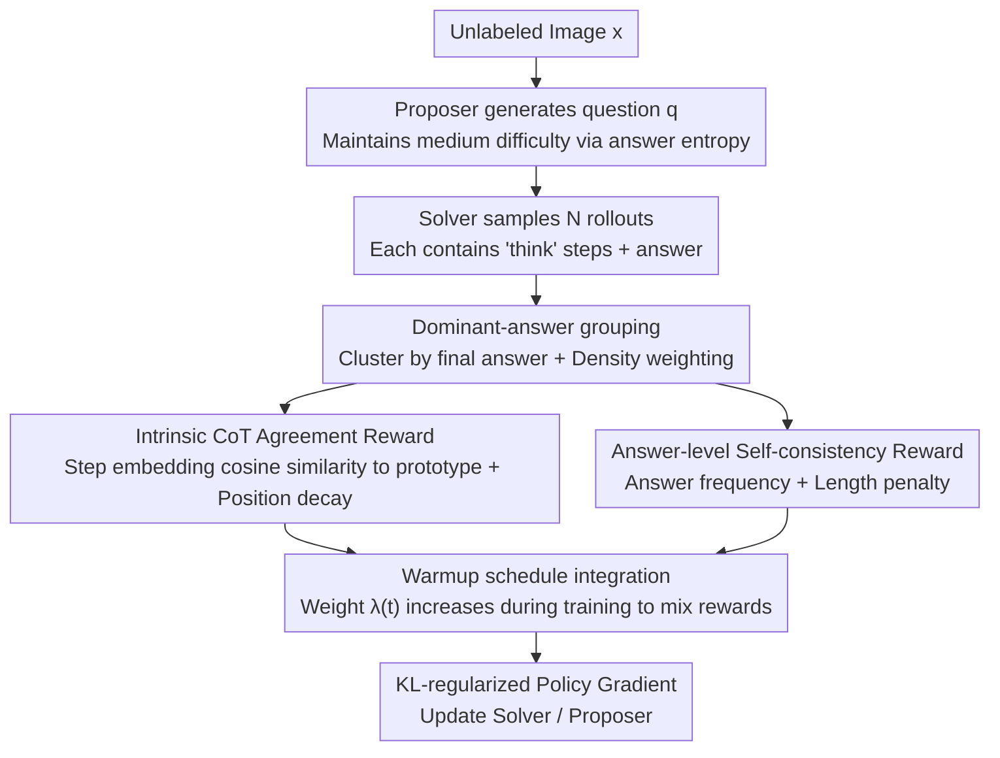

# iReasoner: Trajectory-Aware Intrinsic Reasoning Supervision for Self-Evolving Large Multimodal Models

**Conference**: ACL2026 Findings  
**arXiv**: [2601.05877](https://arxiv.org/abs/2601.05877)  
**Code**: Our code is available here  
**Area**: Multimodal VLM / Self-supervised Reasoning Training  
**Keywords**: Multimodal Reasoning, Self-evolving Training, Chain-of-Thought, Intrinsic Reward, Trajectory Consistency  

## TL;DR
iReasoner enables LMMs to perform self-questioning and answering on unlabeled images, extending final answer consistency into an intrinsic reward for intermediate CoT steps. This leads to a multimodal reasoning improvement of up to +2.13 points on Qwen2.5-VL-7B.

## Background & Motivation
**Background**: Self-evolution training for large multimodal models (LMMs) is shifting from "reliance on manual annotation" to "utilizing unlabeled images to self-generate questions and answers." The Proposer-Solver framework allows a model to propose questions based on images, sample multiple solutions, and use internal consistency as a reward signal.

**Limitations of Prior Work**: Existing self-evolving LMM methods mostly reward only the final answer or the entire response. As long as two reasoning trajectories yield the same answer, they may receive nearly identical rewards, even if one trajectory contains hallucinated intermediate steps, incorrect visual evidence, or calculation errors that luckily cancel out.

**Key Challenge**: In an unsupervised setting, there are no ground-truth answers or external judges to stably evaluate each reasoning step. However, the reliability of multimodal reasoning depends heavily on intermediate visual grounding and step-by-step inference. If only the final answer is considered, the training signal is too coarse.

**Goal**: To provide optimizable intrinsic supervision for intermediate reasoning steps without introducing manual labels, external verifiers, or reward models, ensuring that self-evolution optimizes not just "getting the right answer" but also "how to reason to the answer."

**Key Insight**: The authors utilize the consensus among multiple Solver rollouts under the same image-question pair. If a batch of rollouts converges to the same dominant answer, the reasoning steps at the same positions in these rollouts should possess similar semantics. This cross-trajectory step consistency can serve as an unsupervised signal for reasoning quality.

**Core Idea**: Treat the step-level CoT agreement within the dominant-answer group as an intrinsic reward. Combine this with answer-level self-consistency rewards and train the Solver using KL-regularized policy gradients.

## Method

### Overall Architecture
iReasoner follows the Proposer-Solver self-evolution framework. Given an unlabeled image $x$, the Proposer generates a visually grounded question $q$. The Solver samples $N$ reasoning rollouts for $(x,q)$, each containing explicit `<think>` reasoning steps and an `<answer>` final answer. Multiple answers form an empirical distribution $p(a|x,q)$. The Proposer maintains medium difficulty via answer entropy, while the Solver receives both answer-level self-consistency rewards and step-level consistency rewards.

The core of the method is not generating longer CoT, but making intermediate steps across different rollouts semantically comparable, aggregatable, and rewardable. It transforms the stability of reasoning trajectories leading to the same answer into a training signal.

### Key Designs
**1. Dominant-answer grouping: Clustering by final answer first to build step consistency on relatively reliable answer patterns**

In an unsupervised setting without ground-truth answers, directly rewarding step similarity between any two rollouts risks the model learning to "fail in the same way"—incorrect consensus could receive high rewards. iReasoner first selects a dominant answer $\hat{a}$ from the distribution $p(a|x,q)$ and clusters all rollouts producing that answer into a set $\mathcal{G}$. Step comparison is only performed within this group. Simultaneously, the majority group density $\rho=(|\mathcal{G}|/N)^\gamma$ is used to down-weight the step reward. If the dominant group is small (indicating scattered and unreliable answers), the step reward is suppressed.

This step serves as a "gatekeeper" for step consistency: intermediate reasoning is only deemed worthy of alignment when a batch of rollouts truly converges to a single dominant answer.

**2. Intrinsic CoT Agreement Reward: Measuring semantic consistency of intermediate steps using the model's own embeddings**

Rewarding only the final answer is too coarse. iReasoner breaks each trajectory into steps $s_{i,j}$ based on the `<think>` tag and represents each step using the normalized mean of internal token embeddings $e_{i,j}$. A prototype $\mu_j$ is calculated for the dominant group at each step position $j$, and a score is given by cosine similarity $r_{i,j}=\text{sim}(e_{i,j},\mu_j)$. When aggregating into a step reward, a set of decreasing weights $w_1>w_2>\dots$ is used to prioritize earlier steps.

Early steps are prioritized because they typically involve identifying image information and establishing the problem state; errors here propagate through the CoT to the answer. Position decay focuses the reward on these grounding-heavy foundational steps rather than formulaic concluding remarks. This signal requires no external judge or manual step labels.

**3. Reward integration with self-evolution: Fusing answer-level and step-level rewards using a warmup schedule**

Early in training, answer consensus is unstable. Forcing step consistency too early would align reasoning on incorrect answers, amplifying errors. iReasoner defines the answer reward as $r_i^{ans}=p(a_i|x,q)^\alpha(1-\eta\bar{\ell}_i)$, covering both self-consistency and a length penalty. This is then mixed with the step reward using a weight $\lambda(t)$ that increases during training:

$$r_i^{sol}=(1-\lambda(t))\,r_i^{ans}+\lambda(t)\,r_i^{step}$$

$\lambda(t)$ rises gradually during the warmup phase, allowing the model to first stabilize the answer via self-consistency before shifting the optimization focus toward the trajectory structure of "how to reason to the answer."

### Loss & Training
Both the Solver and Proposer are trained using KL-regularized policy gradients. A frozen reference model is used, and an EMA baseline is employed to reduce variance. The Solver objective includes the REINFORCE term and a KL penalty against the reference policy; the Proposer uses answer entropy to shape the reward, keeping question difficulty within a non-degenerate range.

Training is performed starting from Qwen2.5-VL-7B-Instruct using LoRA. The training pool consists of 2,500 unlabeled images from datasets like ChartQA, AI2D, and Geometry3K. One question is sampled per image, with $N=5$ rollouts per Solver instance. The step reward weight is warmed up to 0.7 over 2.5k steps, taking approximately 35 hours on 8 AMD MI250X GPUs.

## Key Experimental Results

### Main Results

| Benchmark | Qwen2.5-VL-7B Baseline | EvoLMM | iReasoner | Gain vs Baseline |
|-----------|------------------------|--------|-----------|------------------|
| InfoGraphic-VQA | 80.44 | 81.06 | 81.56 | +1.12 |
| AI2D | 82.61 | 83.41 | 83.89 | +1.28 |
| ScienceQA | 88.30 | 89.50 | 89.92 | +1.62 |
| MMMU | 51.11 | 52.01 | 52.37 | +1.26 |
| ChartQA | 84.00 | 86.70 | 85.78 | +1.78 |
| MathVista | 68.47 | 70.52 | 69.74 | +1.27 |
| MathVision | 23.91 | 24.81 | 25.29 | +1.38 |
| MathVerse | 43.78 | 44.88 | 45.91 | +2.13 |

### Ablation Study

| Configuration | ScienceQA | MMMU | ChartQA | MathVerse | Description |
|------|-----------|------|---------|-----------|------|
| Full iReasoner | 89.92 | 52.37 | 85.78 | 45.91 | Full combination of rewards |
| Soft majority reward only / EvoLMM | 89.41 | 51.92 | 86.64 | 44.71 | Stronger on short-answer tasks |
| Step-level reward only | 88.44 | 50.98 | 84.38 | 43.87 | High noise when used alone |
| w/o Warmup schedule | 89.26 | 51.74 | 85.02 | 45.11 | Most significant degradation |
| w/o Position decay | 89.55 | 52.02 | 85.41 | 45.49 | Early step weighting contributes |
| w/o Density weighting | 89.47 | 51.88 | 85.29 | 45.32 | Prevents incorrect consensus |

### Key Findings
- iReasoner outperforms the initial Qwen2.5-VL-7B on all 8 benchmarks, with an average gain of ~+1.32 in general visual understanding and ~+1.64 in visual math.
- Compared to EvoLMM, iReasoner is stronger in ScienceQA and MathVerse, but slightly lower in ChartQA and MathVista, suggesting answer-stability rewards are more suited for highly verifiable short-answer tasks.
- Step-level rewards cannot be used in isolation; they require answer-level stability to filter out obviously incorrect rollouts first.
- The accuracy of the dominant-answer group improves from ~76% early in training to ~93% later, validating the dominant group as a reliable source of intrinsic supervision.

## Highlights & Insights
- The most valuable aspect is transforming the problem of "different reasoning trajectories for the same answer" into an optimizable signal.
- Using the model's internal embeddings to represent steps is lightweight and bypasses the need for external judges or manual step labels.
- The three specific designs—warmup, density weighting, and position decay—are critical for managing noise in unsupervised RL.
- This approach can be ported to text reasoning, code reasoning, or agent trajectory training: wherever multiple trajectories can be sampled and a "same-result group" can be defined.

## Limitations & Future Work
- iReasoner uses intrinsic signals from the model's own sampling, meaning it cannot directly optimize external correctness. If a majority group is confident but wrong, step consistency might reinforce that error.
- Experimental scale is limited to 2,500 images and 2.5k steps, primarily on the Qwen2.5-VL series; wider verification across model families is needed.
- The method requires access to log probabilities and internal embeddings, making it suitable for open-weight models but less applicable to closed APIs.

## Related Work & Insights
- **vs EvoLMM / VisPlay**: These self-evolving LMMs rely primarily on answer or response-level rewards. iReasoner advances supervision to a finer step-level granularity.
- **vs Multimodal-CoT / R3V**: While these focus on CoT quality, they often require labels or external feedback; iReasoner emphasizes pure unlabeled training.
- **vs RLVR Training**: Traditional RLVR requires verifiable answers; iReasoner offers a way to construct weak verification signals for open visual tasks.

## Rating
- Novelty: ⭐⭐⭐⭐☆ Using trajectory consistency as an unsupervised intrinsic reward is insightful.
- Experimental Thoroughness: ⭐⭐⭐⭐☆ Comprehensive main experiments and ablations.
- Writing Quality: ⭐⭐⭐⭐☆ Clear methodology and illustrations.
- Value: ⭐⭐⭐⭐☆ Highly relevant for post-training research on open-source LMMs.

<!-- RELATED:START -->

## Related Papers

- [\[CVPR 2026\] Self-Consistency for LLM-Based Motion Trajectory Generation and Verification](../../CVPR2026/vlm_reasoning/self-consistency_for_llm-based_motion_trajectory_generation_and_verification.md)
- [\[CVPR 2026\] Evolving Contextual Safety in Multi-Modal Large Language Models via Inference-Time Self-Reflective Memory](../../CVPR2026/vlm_reasoning/evolving_contextual_safety_in_multi-modal_large_language_models_via_inference-ti.md)
- [\[ICML 2026\] Breaking Dual Bottlenecks: Evolving Unified Multimodal Models into Self-Adaptive Interleaved Visual Reasoners](../../ICML2026/vlm_reasoning/breaking_dual_bottlenecks_evolving_unified_multimodal_models_into_self-adaptive_.md)
- [\[ICML 2026\] Learn to Think: Improving Multimodal Reasoning through Vision-Aware Self-Improvement Training](../../ICML2026/vlm_reasoning/learn_to_think_improving_multimodal_reasoning_through_vision-aware_self-improvem.md)
- [\[ICLR 2026\] Perception-Aware Policy Optimization for Multimodal Reasoning](../../ICLR2026/vlm_reasoning/perception-aware_policy_optimization_for_multimodal_reasoning.md)

<!-- RELATED:END -->
