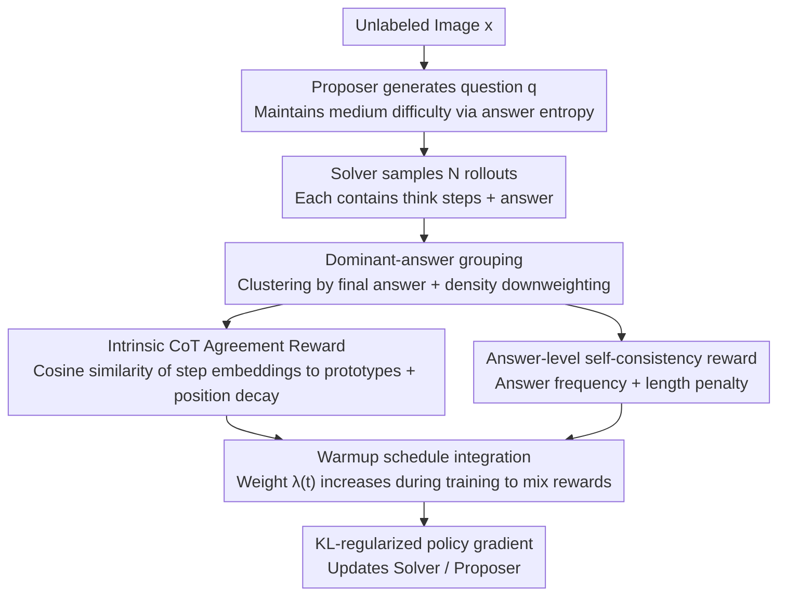

# iReasoner: Trajectory-Aware Intrinsic Reasoning Supervision for Self-Evolving Large Multimodal Models

**Conference**: ACL2026 Findings  
**arXiv**: [2601.05877](https://arxiv.org/abs/2601.05877)  
**Code**: Our code is available here  
**Area**: Multimodal VLM / Self-Supervised Reasoning Training  
**Keywords**: Multimodal Reasoning, Self-Evolving Training, Chain-of-Thought, Intrinsic Reward, Trajectory Consistency  

## TL;DR
iReasoner enables LMMs to perform self-questioning and answering on unlabeled images, extending final answer consistency to consistency rewards for intermediate CoT steps, resulting in an improvement of up to +2.13 points in multimodal reasoning on Qwen2.5-VL-7B.

## Background & Motivation
**Background**: Self-evolution training for large multimodal models has begun shifting from "relying on human annotation" toward "using unlabeled images to self-generate questions and answers." Proposer-Solver frameworks allow models to propose questions based on images, sample multiple solutions, and use internal consistency as a reward signal.

**Limitations of Prior Work**: Existing self-evolving LMM methods mostly reward only the final answer or the entire response. As long as two reasoning trajectories yield the same answer, they may receive nearly identical rewards, even if one trajectory contains hallucinated intermediate steps, incorrect visual grounding, or computational errors that happen to cancel out.

**Key Challenge**: In an unsupervised setting, there are no human-annotated answers and no stable external judges to evaluate each reasoning step. However, the reliability of multimodal reasoning depends heavily on intermediate visual grounding and step-by-step inference. If only the final answer is considered, the training signal is too coarse.

**Goal**: To provide optimizable intrinsic supervision for intermediate reasoning steps of LMMs without introducing annotations, external verifiers, or reward models, ensuring self-evolution optimizes not just "getting the right answer" but also "how to reason to the answer."

**Key Insight**: The authors exploit the consensus among multiple Solver rollouts for the same image-question pair. If a batch of rollouts converges to the same dominant answer, the reasoning steps at the same positions across these rollouts should possess similar semantics; this cross-trajectory step consistency can serve as an unsupervised reasoning quality signal.

**Core Idea**: Step-level CoT agreement within the majority answer group is formulated as an intrinsic reward, mixed with answer self-consistency rewards, and used to train the Solver via KL-regularized policy gradients.

## Method

### Overall Architecture
iReasoner follows the Proposer-Solver self-evolution framework. Given an unlabeled image $x$, the Proposer generates a visually grounded question $q$. The Solver samples $N$ reasoning rollouts for $(x,q)$, each containing explicit `<think>` reasoning steps and an `<answer>` final answer. Multiple answers form an empirical distribution $p(a|x,q)$. The Proposer maintains medium difficulty using answer entropy, while the Solver receives both answer-level self-consistency rewards and step-level consistency rewards.

The core of the method is not generating longer CoT, but making intermediate steps across different rollouts semantically comparable, aggregatable, and rewardable. it transforms the stability of reasoning trajectories under the same final answer into a training signal.

### Key Designs
**1. Dominant-answer group: Clustering by final answers first to establish step consistency on relatively reliable answer patterns**

In an unsupervised setting without annotated answers, rewarding step similarity between any two rollouts risks the model learning to "fail together"—incorrect consensus could receive high scores. iReasoner first selects a dominant answer $\hat{a}$ from the answer distribution $p(a|x,q)$ and clusters all rollouts producing that answer into a set $\mathcal{G}$, comparing steps only within this group. Meanwhile, the step reward is overall downweighted by the majority group density $\rho=(|\mathcal{G}|/N)^\gamma$. If the dominant group is small (indicating scattered and untrustworthy answers), the step reward is suppressed.

This step essentially acts as a "reliable answer first" gate for the subsequent step consistency: intermediate reasoning is only deemed worthy of alignment when a batch of rollouts converges to the same dominant answer, thereby suppressing noise in unsupervised rewards.

**2. Intrinsic CoT Agreement Reward: Using model-internal embeddings to measure semantic consistency of steps within the same group**

Rewarding only the final answer is too coarse—two trajectories could receive nearly identical rewards even if one is full of hallucinated steps and the other has solid grounding, provided their answers match. iReasoner splits each trajectory into steps $s_{i,j}$ based on `<think>` tags, representing each step $e_{i,j}$ via the normalized mean of internal token embeddings. A prototype $\mu_j$ is calculated for each step position $j$ within the dominant group, and each step is scored via cosine similarity $r_{i,j}=\text{sim}(e_{i,j},\mu_j)$. When aggregating into step rewards, a set of decreasing weights $w_1>w_2>\dots$ is used to emphasize earlier steps.

The emphasis on earlier steps is because the first few steps are typically responsible for identifying image information and establishing the problem state; errors here propagate through the CoT to the final answer. Position decay forces the reward to focus on these grounding-based foundational steps rather than formulaic concluding sentences. This entire signal is calculated purely from the model's own representations without external judges or manual step annotations, fitting the unsupervised self-evolution setting.

**3. Warmup schedule integration: Merging answer-level and step-level rewards into a single Solver reward using a warmup approach**

Early in training, answer consensus itself is unstable. Forcing step consistency too early would mean aligning reasoning on incorrect answers, which amplifies errors. iReasoner uses an answer reward $r_i^{ans}=p(a_i|x,q)^\alpha(1-\eta\bar{\ell}_i)$ that accounts for both answer self-consistency and length penalties, and then mixes it with the step reward using a weight $\lambda(t)$ that increases during training:

$$r_i^{sol}=(1-\lambda(t))\,r_i^{ans}+\lambda(t)\,r_i^{step}$$

$\lambda(t)$ gradually increases during the warmup phase, allowing the model to stabilize the answer via self-consistency first before slowly shifting the optimization focus toward the trajectory structure of "how to reason to the answer." Ablations show that removing the warmup causes the most significant and consistent performance degradation, proving the necessity of this sequence.

### Loss & Training
Both Solver and Proposer are trained using KL-regularized policy gradients. A frozen reference model is used, and an EMA baseline is employed to reduce variance. The Solver objective includes a REINFORCE term and a KL penalty against the reference policy; the Proposer uses answer entropy reward shaping to keep question difficulty within a non-degenerate range.

Training details are conservative: initialization from Qwen2.5-VL-7B-Instruct, with LoRA training for both Proposer and Solver. The training pool consists of 2,500 unlabeled images from datasets including ChartQA, AI2D, InfoGraphic-VQA, PlotQA, ChartX, and Geometry3K. One question is sampled per image, the Solver samples $N=5$ rollouts, and the Proposer is updated every 5 iterations. The step reward weight warms up to 0.7 over 2.5k steps. Training used the AdamW optimizer with a learning rate of $10^{-6}$ and was completed in approximately 35 hours on 8 AMD MI250X GPUs.

## Key Experimental Results

### Main Results

| Benchmark | Qwen2.5-VL-7B Baseline | EvoLMM | iReasoner | Gain vs Baseline |
|-----------|------------------------|--------|-----------|------------------|
| InfoGraphic-VQA | 80.44 | 81.06 | 81.56 | +1.12 |
| AI2D | 82.61 | 83.41 | 83.89 | +1.28 |
| ScienceQA | 88.30 | 89.50 | 89.92 | +1.62 |
| MMMU | 51.11 | 52.01 | 52.37 | +1.26 |
| ChartQA | 84.00 | 86.70 | 85.78 | +1.78 |
| MathVista | 68.47 | 70.52 | 69.74 | +1.27 |
| MathVision | 23.91 | 24.81 | 25.29 | +1.38 |
| MathVerse | 43.78 | 44.88 | 45.91 | +2.13 |

### Ablation Study

| Configuration | ScienceQA | MMMU | ChartQA | MathVerse | Description |
|------|-----------|------|---------|-----------|------|
| Full iReasoner | 89.92 | 52.37 | 85.78 | 45.91 | Full combination of answer + step rewards |
| Soft majority reward only / EvoLMM | 89.41 | 51.92 | 86.64 | 44.71 | Stronger on short-answer verifiable tasks, weaker transfer |
| Step-level reward only | 88.44 | 50.98 | 84.38 | 43.87 | Step consistency alone is too noisy |
| w/o Warmup schedule | 89.26 | 51.74 | 85.02 | 45.11 | Absence of warmup causes most significant degradation |
| w/o Position decay | 89.55 | 52.02 | 85.41 | 45.49 | Weighting early steps contributes to performance |
| w/o Density weighting | 89.47 | 51.88 | 85.29 | 45.32 | Reliability downweighting prevents following wrong consensus |

### Key Findings
- iReasoner outperforms the initial Qwen2.5-VL-7B on all 8 benchmarks, with an average improvement of ~+1.32 in general visual understanding and ~+1.64 in visual math.
- Compared to EvoLMM, iReasoner is stronger on InfoGraphic-VQA, AI2D, ScienceQA, MMMU, MathVision, and MathVerse, but slightly lower on ChartQA and MathVista, suggesting that answer stabilization rewards may be more suitable for highly verifiable short-answer tasks.
- Step-level rewards cannot be used in isolation; they require answer-level stability to filter out obviously incorrect rollouts first.
- The accuracy of the dominant answer group improved from ~76% early in training to ~93% later, indicating that the majority group is not a completely blind source of intrinsic supervision.

## Highlights & Insights
- The most valuable contribution of the paper is transforming the issue of "different reasoning trajectories for the same answer" into an optimizable signal. While many self-consistency methods only look at answer voting, iReasoner scrutinizes whether the reasoning path behind the vote is stable.
- Representing steps via internal model embeddings is lightweight and removes the need for external judges or manual annotations, aligning perfectly with the unsupervised self-evolution setting.
- The three specific designs—warmup, density weighting, and position decay—are critical and reflect the authors' experience in handling noise in unsupervised RL.
- This logic could be transferred to text reasoning, code reasoning, or agent trajectory training: as long as multiple trajectories can be sampled and a "same-result group" defined, intermediate step consistency can be compared.

## Limitations & Future Work
- iReasoner relies solely on intrinsic signals from the model's own sampling and cannot directly optimize for external correctness. If the majority answer group is confident but wrong, step consistency may reinforce consistent but incorrect reasoning.
- The experimental scale remains limited: training covers only 2,500 images and 2.5k steps, primarily focused on the Qwen2.5-VL series; validation on larger scales, longer training, and more model families is still needed.
- The method requires access to model log probabilities, internal embeddings, and KL-regularized training, making it suitable for open-weight models but difficult for black-box closed-source APIs.
- CoT itself may have faithfulness issues. While the paper includes no-CoT baselines, more rigorous causal intervention or evaluation of process supervision remains a worthy direction.

## Related Work & Insights
- **vs. EvoLMM / VisPlay**: These self-evolving LMMs mainly rely on answer-level or response-level intrinsic rewards; iReasoner pushes the supervision granularity to intermediate steps.
- **vs. Multimodal-CoT / R3V**: These methods focus on the quality of explicit reasoning chains but often depend on annotations, filtering, or external feedback; iReasoner emphasizes pure unsupervised training.
- **vs. RLVR-style Training**: Traditional RLVR requires verifiable answers; iReasoner provides a way to construct weak verification signals in open-ended visual tasks.
- **Insights for Future Research**: Step agreement could be extended to consistency rewards for graph structures, tool-call sequences, or visual region references, rather than just text-based step similarity.

## Rating
- Novelty: ⭐⭐⭐⭐☆ Using intermediate trajectory consistency as an unsupervised intrinsic reward is insightful, though built on the existing Proposer-Solver framework.
- Experimental Thoroughness: ⭐⭐⭐⭐☆ Main experiments, ablations, step budget, and training dynamics are complete, though model variety and data scale could be expanded.
- Writing Quality: ⭐⭐⭐⭐☆ The method is explained intuitively with clear diagrams.
- Value: ⭐⭐⭐⭐☆ Provides practical references for multimodal self-training and process supervision, especially for post-training research on open-source LMMs.

<!-- RELATED:START -->

## Related Papers

- [\[CVPR 2026\] EvoLMM: Self-Evolving Large Multimodal Models with Continuous Rewards](../../CVPR2026/multimodal_vlm/evolmm_self_evolving_lmm_continuous_rewards.md)
- [\[ACL 2026\] PRISM: Self-Pruning Intrinsic Selection Method for Training-Free Multimodal Data Selection](prism_self-pruning_intrinsic_selection_method_for_training-free_multimodal_data_.md)
- [\[CVPR 2026\] VisPlay: Self-Evolving Vision-Language Models](../../CVPR2026/multimodal_vlm/visplay_self-evolving_vision-language_models.md)
- [\[CVPR 2026\] AutoTraces: Autoregressive Trajectory Forecasting via Multimodal Large Language Models](../../CVPR2026/multimodal_vlm/autotraces_autoregressive_trajectory_forecasting_via_multimodal_large_language_m.md)
- [\[ICML 2026\] Learn to Think: Improving Multimodal Reasoning through Vision-Aware Self-Improvement Training](../../ICML2026/multimodal_vlm/learn_to_think_improving_multimodal_reasoning_through_vision-aware_self-improvem.md)

<!-- RELATED:END -->
