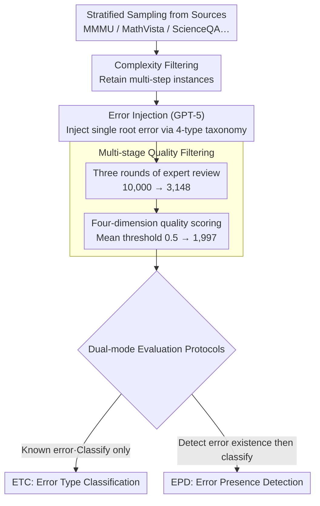

# MMErroR: A Benchmark for Erroneous Reasoning in Vision-Language Models

**Conference**: ACL 2026  
**arXiv**: [2601.03331](https://arxiv.org/abs/2601.03331)  
**Code**: [https://mmerror-benchmark.github.io](https://mmerror-benchmark.github.io)  
**Area**: Multi-modal VLM  
**Keywords**: Error reasoning diagnosis, Vision-Language Model evaluation, process-level evaluation, error classification, multi-modal reasoning

## TL;DR

This paper proposes MMErroR, a multi-modal erroneous reasoning benchmark containing 1,997 samples. Each sample embeds a single reasoning error across 6 domains and 4 error types. It requires VLMs to not only detect the presence of errors in a reasoning chain but also classify the error type (Vision Perception, Knowledge Application, Question Understanding, or Reasoning Error). Evaluation of 12 representative VLMs reveals that the strongest model, Gemini-3-Pro-Preview, achieves only 66.65% accuracy.

## Background & Motivation

**Background**: Vision-Language Models (VLMs) continuously break records on benchmarks like MMMU and MathVista, creating an impression that models are approaching human-level understanding. However, existing evaluations almost entirely adopt a "result-oriented" paradigm—checking only if the final answer is correct without considering whether the reasoning process is sound.

**Limitations of Prior Work**: (1) A correct final answer does not guarantee a correct reasoning process—models may reach correct results via shortcuts or pattern matching, masking deficiencies in inherent reasoning abilities; (2) existing error localization benchmarks (e.g., ProcessBench, ErrorRadar) focus only on "which step is wrong" without diagnosing the type and root cause; (3) these benchmarks are either limited to single-modality (text-only) or lack domain diversity and a comprehensive error classification system.

**Key Challenge**: There is a significant gap between the high scores of VLMs on various benchmarks and their diagnostic capabilities when facing erroneous reasoning chains. Models can generate seemingly plausible reasoning chains but fail to judge errors within them, indicating that "generation capability" and "introspection capability" are distinct.

**Goal**: Construct a multi-modal, multi-domain process-level reasoning evaluation benchmark with error classification to systematically assess whether VLMs possess the ability to "identify erroneous reasoning and diagnose error types."

**Key Insight**: Approach the problem from "error classification" rather than "error localization"—not just detecting where a step failed, but diagnosing whether the root cause was vision perception failure, knowledge application failure, question understanding deviation, or logical reasoning fallacy.

**Core Idea**: Design a controlled benchmark where each sample contains exactly one clear root-cause error. Errors are injected via GPT-5, followed by three rounds of human verification and quality score filtering to ensure uniqueness and attributability of error labels. The benchmark supports two evaluation modes: Error Type Classification (ETC) and Error Presence Detection (EPD).

## Method

### Overall Architecture

The construction of MMErroR follows four steps: (1) Question Curation—stratified sampling from benchmarks like MMMU, MathVista, MathVerse, ScienceQA, and AI2D, followed by complexity filtering to retain multi-step reasoning instances; (2) Error Injection—using GPT-5 to inject a semantically coherent error into a correct reasoning chain, restricted to one of four predefined types; (3) Data Verification—20 experts (6 professors + 14 PhD students) performed three rounds of manual checks, filtering the initial 10,000 samples down to 3,148; (4) Quality Assurance—at least two linguistics experts scored samples across four dimensions: coherence, step clarity, error localizability, and semantic consistency, retaining 1,997 samples with mean scores $> 0.5$. The final benchmark is used with two evaluation protocols (ETC / EPD).

### Key Designs

**1. Four-class Error Taxonomy: Upgrading "Where" to "Why"**

Benchmarks that only locate error steps (e.g., ProcessBench, ErrorRadar) tell you which step failed but not which capability failed. MMErroR decomposes root causes into four mutually exclusive types corresponding to various stages of the VLM pipeline: Vision Perception Error (VPE: misidentification, spatial relation error, symbol misreading), Knowledge Application Error (KDE: wrong formula, misuse of physical laws; largest portion at 44.07%), Question Understanding Error (QCE: misunderstanding intent, ignoring constraints), and Reasoning Error (RE: logical fallacy, missing premises, invalid steps). Each chain contains only one error, making failures uniquely attributable and interpretable.

**2. Controlled Single-Error Design + Multi-stage Quality Filtering: Ensuring Attributability and Quality**

Real-world reasoning failures are often cascaded, making attribution chaotic. MMErroR prioritizes diagnostic clarity by injecting only one root error per chain while keeping other steps locally coherent and logically valid. Quality is maintained via multi-stage filtering: three rounds of expert consensus and four-dimension quality scoring (Coherence / Step Clarity / Localizability / Semantic Consistency). The final annotation consistency reached Cohen's Kappa $\kappa = 0.796$, with a 97.19% observation agreement in the final round.

**3. Dual-mode Evaluation Protocols (ETC + EPD): Assessing Introspection at Two Difficulty Levels**

Classification under the "known error" premise does not test if a model can actively find errors. MMErroR sets two levels: ETC (Error Type Classification) tells the model a chain is definitely wrong and asks for the type, testing diagnostic precision; EPD (Error Presence Detection) requires the model to first judge "if" an error exists before classifying it, serving as a harder stress test. Although EPD could be bypassed by always claiming an error exists, the scoring rule requires correct classification of the type to earn points, forcing the model to truly judge error presence.

### Loss & Training

This paper presents an evaluation benchmark and does not involve model training. Evaluation utilizes a multiple-choice format where models output corresponding labels. Decoding temperature is set to 0 for all models to ensure determinism and reproducibility.

## Key Experimental Results

### Main Results

| Model | ML | PE | CM | BH | EE | DA | Total (ETC) |
|------|-----|-----|-----|-----|-----|-----|---------|
| Gemini-3-Pro-Preview | 66.37 | 66.88 | 69.81 | 64.43 | 65.39 | 69.26 | 66.65 |
| Doubao-Seed-2.0-pro | 65.47 | 67.32 | 61.01 | 59.94 | 66.16 | 66.22 | 64.80 |
| GPT-5.2 (xhigh) | 64.56 | 63.62 | 62.26 | 60.50 | 65.14 | 69.59 | 64.30 |
| Claude-Opus-4.5 | 62.76 | 61.00 | 61.64 | 57.70 | 56.74 | 68.58 | 61.04 |
| Kimi-K2.5 | 63.66 | 55.56 | 51.57 | 58.82 | 66.67 | 61.15 | 60.19 |
| Qwen3-VL-32B-Thinking | 59.46 | 54.90 | 52.20 | 65.83 | 60.81 | 59.80 | 59.29 |
| Human Expert (High) | 91.07 | 88.65 | 87.50 | 90.15 | 88.96 | 90.18 | 89.52 |
| Random Choice | 22.10 | 23.62 | 24.18 | 24.06 | 21.50 | 25.53 | 23.45 |

| Model | ETC Total | EPD Total | EPD Drop |
|------|---------|---------|------------|
| Gemini-3-Pro-Preview | 66.65 | 61.39 | -5.26 |
| GPT-5.2 (xhigh) | 64.30 | 58.54 | -5.76 |
| Claude-Opus-4.5 | 61.04 | 55.18 | -5.86 |
| Kimi-K2.5 | 60.19 | 51.63 | -8.56 |
| LLaMA-4-Maverick | 39.46 | 18.13 | -21.33 |

### Ablation Study

| Input Condition | Gemini-3-Pro | GPT-5.2 | Doubao-Seed | Qwen3-VL-32B |
|---------|-------------|---------|------------|-------------|
| VQA (Original) | 81.0 | 80.0 | 80.5 | 78.5 |
| VQA + Error Chain | 82.5 | 80.5 | 81.5 | 80.0 |
| VQA + Error Chain + Error Step | 84.0 | 82.0 | 83.0 | 82.5 |
| VQA + Error Chain + Error Type | 90.5 | 89.5 | 88.5 | 84.5 |

### Key Findings

- **Significant Gap to Human Experts**: The strongest VLM (66.65%) lags ~23 percentage points behind high-performing human experts (89.52%), highlighting error diagnosis as a major weakness.
- **EPD is Harder than ETC**: All models decline significantly in EPD mode, with LLaMA-4-Maverick dropping from 39.46% to 18.13%, indicating that "actively finding errors" is much harder than "classifying provided errors."
- **Diagnosis Correlates with VQA Performance**: Samples where models correctly diagnose error types show higher original VQA accuracy, suggesting error diagnosis reflects depth of understanding.
- **Error Types Outperform Error Steps for Correction**: Providing the error type improves VQA accuracy by ~9.5 points, whereas providing only the step improves it by only ~2-3 points, proving "why it failed" is more valuable than "where it failed."
- **No Single Champion Across Domains**: Different models excel in different fields, suggesting diagnosis relies on a mix of domain knowledge, grounding, and procedural reasoning.

## Highlights & Insights

- **Paradigm Shift from Result to Process**: MMErroR moves evaluation beyond "is the answer correct" to "can the model diagnose error types," offering a new perspective on VLM reasoning.
- **Corrective Value of Taxonomy**: Ablations show that knowing the "why" (error type) is significantly more effective for self-correction than knowing the "where" (error step), guiding future self-correction designs.
- **Logit Lens Visualization**: Analysis via Qwen3-VL-32B demonstrates precise semantic alignment between visual and text tokens during correct diagnosis, and the collapse of cross-modal alignment in failure cases.
- **Rigorous Quality Control**: The reduction from 10,000 initial samples to 1,997 (20% retention) ensures a highly reliable benchmark.

## Limitations & Future Work

- Each sample contains only one error, whereas real-world failures often involve cascaded or multiple errors.
- The current version only contains erroneous chains; the EPD task cannot test for false positives (over-reporting errors) on correct reasoning chains.
- Use of GPT-5 for initial generation may introduce model-specific biases in error patterns or style.
- Future work could extend to open-ended generation and multi-error cascade scenarios.

## Related Work & Insights

- **vs ProcessBench/PRISM-Bench**: These locate steps but do not classify types; MMErroR requires root cause diagnosis.
- **vs ErrorRadar**: Focuses on localization but lacks multi-domain coverage and a classification system.
- **vs POPE/HallusionBench**: These focus on perception hallucination; MMErroR covers higher-order failures like knowledge application and question understanding.
- **vs MMMU/MathVista**: These are result-oriented; MMErroR provides complementary process-level diagnostic evaluation.

## Rating

- Novelty: ⭐⭐⭐⭐ First systematic evaluation of VLM error reasoning diagnosis with a sound taxonomy.
- Experimental Thoroughness: ⭐⭐⭐⭐⭐ 12 models, 6 domains, dual protocols, plus consistency and logit analysis.
- Writing Quality: ⭐⭐⭐⭐ Clear structure, rigorous experimental design, transparent QC.
- Value: ⭐⭐⭐⭐ Provides critical benchmarks and insights for enhancing VLM introspection.

<!-- RELATED:START -->

## Related Papers

- [\[ICLR 2026\] OmniSpatial: Towards Comprehensive Spatial Reasoning Benchmark for Vision Language Models](../../ICLR2026/vlm_reasoning/omnispatial_towards_comprehensive_spatial_reasoning_benchmark_for_vision_languag.md)
- [\[ACL 2026\] GeoArena: Evaluating Open-World Geographic Reasoning in Large Vision-Language Models](geoarena_evaluating_open-world_geographic_reasoning_in_large_vision-language_mod.md)
- [\[ACL 2026\] Addressing Overthinking in Large Vision-Language Models via Gated Perception-Reasoning Optimization](addressing_overthinking_in_large_vision-language_models_via_gated_perception-rea.md)
- [\[ACL 2026\] Can MLLMs Reason Beyond Language? VisReason: A Comprehensive Benchmark for Vision-Centric Reasoning](can_mllms_reason_beyond_language_visreason_a_comprehensive_benchmark_for_vision-.md)
- [\[ACL 2026\] PROGRESSLM: Towards Progress Reasoning in Vision-Language Models](progresslm_towards_progress_reasoning_in_vision-language_models.md)

<!-- RELATED:END -->
