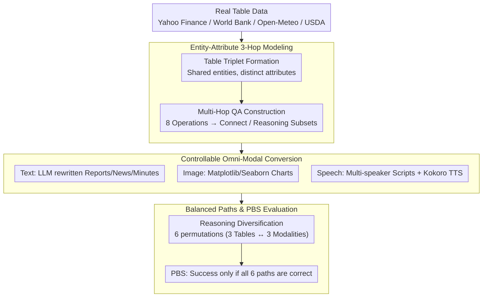

# OMHBench: Benchmarking Balanced and Grounded Omni-Modal Multi-Hop Reasoning

**Conference**: ACL 2026 Findings  
**arXiv**: [2508.16198](https://arxiv.org/abs/2508.16198)  
**Code**: No public code (Dataset: https://huggingface.co/datasets/HYU-NLP/OMHBench)  
**Area**: Multi-modal VLM  
**Keywords**: Omni-modal reasoning, multi-hop QA, speech understanding, path balance, Benchmark

## TL;DR
OMHBench constructs an omni-modal three-hop reasoning benchmark with 6,144 questions covering text, image, and speech contexts. Through entity-attribute chains and 6 balanced reasoning paths, it exposes systematic shortcomings of current MLLMs in speech grounding, path robustness, and cross-modal grounding.

## Background & Motivation
**Background**: Multi-modal large models have evolved from bi-modal (text-image or text-speech) to omni-modal models capable of processing text, vision, and speech simultaneously. Evaluation is generally divided into two categories: Omni-Modal Understanding (OMU) benchmarks, which emphasize the ability to receive three modalities, and Cross-Modal Multi-Hop Reasoning (CMR) benchmarks, which emphasize cross-modal evidence combination.

**Limitations of Prior Work**: Both categories have blind spots. In OMU datasets, while images and speech are provided, text often appears only in the question or options, allowing models to bypass certain modalities through "modality shortcuts." CMR datasets emphasize reasoning chains but mostly cover text and images, lacking speech. Furthermore, reasoning path distributions are highly unbalanced—for example, if many questions follow an I-T or T-I order, high scores on a single path do not necessarily indicate true cross-modal reasoning ability.

**Key Challenge**: Omni-modal evaluation needs to simultaneously examine "whether all modalities are used" and "whether multi-hop reasoning is executed stably." Existing datasets often satisfy only one side. Including three modalities does not guarantee their use; multi-hop QA does not ensure fair path distribution or reliable coverage of different modal sequences.

**Goal**: The authors aim to construct a more controlled benchmark: First, questions must depend on text, image, and speech evidence. Second, each question must have an explicit three-hop entity-attribute reasoning chain. Third, the same question can be instantiated into 6 modal sequences to check for path robustness. Fourth, answer formats should be clear for reproducible exact match evaluation.

**Key Insight**: Abstract multi-hop reasoning into "entities shared across modalities, but attributes visible only in one." For instance, locating a company in an image chart based on goodwill, then reading inventory in text, and finally aggregating a value in speech. This ensures each step falls on a specific modality, allowing explicit path control.

**Core Idea**: Generate three-hop QA based on a triplet of attribute tables for the same set of entities. Convert these tables into text, image, and speech, and permute the modality assignments to obtain content-equivalent evaluations with different reasoning paths.

## Method
OMHBench proposes a benchmark construction pipeline rather than a new model. Its key lies in decoupling "question semantics," "modal modality," and "reasoning path": the underlying entities and answers remain constant, but evidence is placed in different modalities, forcing the model to complete reasoning along a specified sequence.

### Overall Architecture
The pipeline consists of four steps.

Step 1: **Table Triplet Formation**. Real table data is collected from finance, economics, climate, and nutrition (Yahoo Finance, World Bank, Open-Meteo, USDA). For each sample, three small tables are constructed; they share entities but have distinct attributes. Each table contains 10 entities and 3 attributes, mixed with distractor entities and attributes.

Step 2: **Multi-Hop QA Construction**. Three-hop questions are generated from the table triplets. The first two hops typically handle entity localization or filtering, while the last hop handles reading or aggregating the answer. Eight operations are defined: Lookup, Ranking, Comparison, Range, Proximity, Retrieval, Mean, and Summation, combined into "Connect" and "Reasoning" subsets.

Step 3: **Omni-Modal Context Generation**. The tables are converted into three contexts: Text, Image, and Speech. Text is rewritten by LLMs into reports, news, or meeting minutes; Images are generated using Matplotlib and Seaborn as various charts; Speech is synthesized using Kokoro-82M TTS from multi-speaker scripts generated by LLMs.

Step 4: **Reasoning Diversification**. Permutations of the three tables across the three modalities result in six reasoning paths: S-I-T, S-T-I, I-S-T, T-S-I, I-T-S, and T-I-S. While the underlying answer for a question remains identical, the model must access modalities in different orders, allowing for performance comparisons across paths.

### Key Designs

**1. Entity-Attribute 3-Hop Modeling: Structural Constraints for Modality Usage**
The biggest loophole in omni-modal evaluation is the modality shortcut. OMHBench solves this by sharing entities across three tables while scattering attributes; when mapped to text, image, and speech, the model must jump across modalities to track the entity. The Connect subset focuses on Lookup-Comparison-Retrieval for single-entity chains. The Reasoning subset includes Ranking, Range, Proximity, Mean, and Summation for set filtering and numerical aggregation. Since intermediate attributes exist only in speech or images, skipping a modality prevents obtaining the correct answer.

**2. Controllable Conversion to Omni-Modal Context: Consistent Facts, Diverse Styles**
Mechanical table conversion creates a monotonous benchmark, while free generation risks factual drift. OMHBench uses real tables as factual bases and spreads styles through controlled generation: text uses 24 domain prompts (reports/news); images use 10 chart types, 20 fonts, and 20 colors; speech uses 22 scenarios and 27 TTS voices. Table reconstruction and factoid QA checks ensured 100% factual consistency after conversion.

**3. Path Balance Score (PBS): Enforcing Path Robustness**
Existing CMR datasets are often dominated by one or two modality sequences. OMHBench generates $3!=6$ paths (S-I-T, S-T-I, I-S-T, T-S-I, I-T-S, T-I-S) for each question, totaling 6,144 questions (1,024 per path). The Path Balance Score (PBS) counts a group as successful only if the model is correct on all 6 path versions of the same question ($a_{i,j}$ correctness such that $\sum_j a_{i,j}=6$). While average accuracy reflects general performance, PBS reveals asymmetric grounding—Gemini 3 Flash drops from 78.3% average to 32.2% PBS on Connect.

## Loss & Training
This work does not train new models. Evaluation uses zero-shot chain-of-thought prompting without a fixed reasoning format. For models supporting reasoning modes, an 8,192 token thinking budget is set. Outputs are parsed as discrete numerical answers and evaluated using exact match.

## Key Experimental Results

### Main Results
The paper evaluates 13 MLLMs. Key representative results are as follows:

| Model | OMHBench-Connect Avg Acc | PBS | Strongest Path | Weakest Path |
| :--- | :---: | :---: | :---: | :---: |
| Gemini 3 Flash | 78.3 | 32.2 | S-T-I 98.4 | I-T-S 60.2 |
| Gemini 2.5 Pro | 72.5 | 25.0 | S-T-I 96.9 | T-I-S 50.8 |
| Gemini 2.5 Flash | 53.6 | 4.7 | S-T-I 85.9 | T-I-S 21.9 |
| Qwen3-Omni 30B | 46.8 | 2.3 | S-T-I 77.0 | I-T-S/T-I-S 16.0 |
| Phi-4 Multimodal | 15.1 | 0.0 | S-I-T 26.6 | T-I-S 0.0 |

On the more difficult Reasoning subset:

| Model | OMHBench-Reasoning Avg Acc | PBS | Strongest Path | Weakest Path |
| :--- | :---: | :---: | :---: | :---: |
| Gemini 3 Flash | 49.4 | 8.6 | S-T-I 58.8 | I-T-S 40.0 |
| Gemini 2.5 Pro | 48.8 | 10.9 | S-I-T 53.9 | I-T-S 41.4 |
| Qwen3-Omni 30B | 15.0 | 0.0 | S-T-I 28.5 | I-T-S/T-I-S 2.7 |

### Ablation Study
Rather than model ablations, the authors perform diagnostic experiments:

| Analysis | Setting | Key Result |
| :--- | :--- | :--- |
| OMU shortcut verification | Removing vision/speech input | OMHBench has almost zero shortcut-prone samples, unlike prior OMU benchmarks (70-80% still solvable). |
| PBS@k Robustness | Score if at least $k$ paths are correct | Gemini 3 Flash Connect PBS@1 is 100.0, but PBS@6 is 32.2. Correcting one path is easy; six is hard. |
| Input Modality Order | Fix reasoning path, permute input context | Max variance of 12.5 points on Connect. Models are sensitive to "input placement" as well as "reasoning path." |
| Exact Match Validation | Human vs LLM-Judge vs EM | 100% agreement on 600 samples. Positive integer answers make EM highly reliable. |
| TTS Quality Check | ASR and speech metrics | WER 0.03, STOI 99.2. Failure is likely due to speech grounding, not audio distortion. |

### Key Findings
- Closed-source models outperform open-source ones but still fail at path symmetry.
- Speech position is a core bottleneck. Path sequences where speech is accessed early are easier; transitioning to speech in the later stages (e.g., I-S or T-S) is significantly harder, termed "asymmetric omni-modal grounding."
- Path distribution shifts model rankings. Gemini 2.5 Pro outperforms Gemini 3 Flash on I-S-T but lags on T-S-I.
- Operation types matter: Ranking is easier, while Comparison, Proximity, and Range are harder due to errors in intermediate entity sets.
- Advanced prompting (Self-Ask, Plan-and-Solve) provides no stable gain over CoT, indicating the bottleneck is internal cross-modal semantic transfer rather than prompt format.

## Highlights & Insights
- The path permutation design allows for a "clean" measurement of modal preference by keeping question semantics constant.
- PBS is a more rigorous and explanatory metric than average accuracy, exposing the instability of cross-modal grounding.
- Data construction avoids "hallucinating" questions by using real-world tables as a factual anchor, ensuring exact match reliability.
- Elevating speech from "additional input" to a "necessary evidence" within the reasoning chain provides a new paradigm for training speech-aware VLMs.
- The "content equivalent, path varying" design protects against data bias.

## Limitations & Future Work
- Controlled task forms: Still uses fixed 3-hop chains; distance remains to open-world Q&A or long video understanding.
- Synthetic speech: TTS quality is high but lacks real-world nuances like noise, interruptions, and non-native accents.
- Image diversity: Primarily focused on charts; does not yet include natural images or full document scans.
- Answer restriction: Only positive integers are used, excluding open-ended explanations or uncertainty.

## Related Work & Insights
- **vs Omni-Modal Understanding Benchmarks**: Unlike OMU datasets where text is just in the question, OMHBench treats text as an independent evidence source and forces dependence on all three.
- **vs Cross-Modal Reasoning Benchmarks**: OMHBench adds speech and balances the six possible 3-modal paths.
- **Inspiration for Training**: Current MLLMs might require explicit supervision of intermediate states (e.g., "current entity, attribute used, modality found") to fix asymmetric grounding.

## Rating
- Novelty: ⭐⭐⭐⭐☆
- Experimental Thoroughness: ⭐⭐⭐⭐⭐
- Writing Quality: ⭐⭐⭐⭐☆
- Value: ⭐⭐⭐⭐⭐

<!-- RELATED:START -->

## Related Papers

- [\[ACL 2025\] FCMR: Robust Evaluation of Financial Cross-Modal Multi-Hop Reasoning](../../ACL2025/vlm_reasoning/fcmr_robust_evaluation_of_financial_cross-modal_multi-hop_reasoning.md)
- [\[CVPR 2026\] CRIT: Graph-Based Automatic Data Synthesis to Enhance Cross-Modal Multi-Hop Reasoning](../../CVPR2026/vlm_reasoning/crit_graph-based_automatic_data_synthesis_to_enhance_cross-modal_multi-hop_reaso.md)
- [\[ICLR 2026\] ThinkOmni: Lifting Textual Reasoning to Omni-modal Scenarios via Guidance Decoding](../../ICLR2026/vlm_reasoning/thinkomni_lifting_textual_reasoning_to_omni-modal_scenarios_via_guidance_decodin.md)
- [\[ICML 2026\] Native Active Perception as Reasoning for Omni-Modal Understanding](../../ICML2026/vlm_reasoning/native_active_perception_as_reasoning_for_omni-modal_understanding.md)
- [\[ACL 2026\] Structured and Abstractive Reasoning on Multi-modal Relational Knowledge Images](structured_and_abstractive_reasoning_on_multi-modal_relational_knowledge_images.md)

<!-- RELATED:END -->
