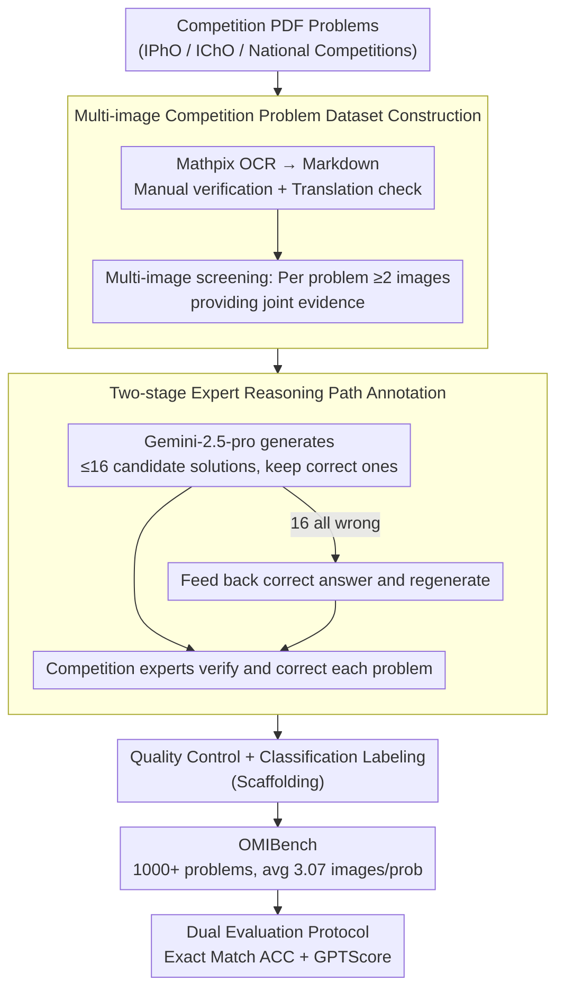

# OMIBench: Benchmarking Olympiad-Level Multi-Image Reasoning in Large Vision-Language Models

**Conference**: ACL 2026  
**arXiv**: [2604.20806](https://arxiv.org/abs/2604.20806)  
**Code**: [GitHub](https://github.com/LightChen233/OMIBench)  
**Area**: Multimodal VLM / LLM Evaluation  
**Keywords**: Multi-image reasoning, Olympiad-level reasoning, Vision-Language Model benchmark, Cross-image association, Scientific reasoning

## TL;DR
This paper introduces OMIBench—the first large-scale benchmark for Olympiad-level multi-image reasoning. It covers over 1000 competition problems across biology, chemistry, mathematics, and physics. The study finds that even the strongest LVLM (Gemini-3-Pro) achieves only about 50% accuracy, representing a drop of over 25% compared to single-image benchmarks.

## Background & Motivation

**Background**: LVLMs have made significant progress on standard reasoning tasks, and Chain-of-Thought (CoT) prompting has achieved major breakthroughs on single-image Olympiad benchmarks. Existing benchmarks like OlympiadBench are nearing saturation for top-tier models.

**Limitations of Prior Work**: (1) Existing Olympiad-level multimodal benchmarks are almost entirely restricted to single-image settings, whereas many real-world science competition problems rely on multiple interrelated charts and experimental diagrams; (2) current multi-image benchmarks (e.g., MuirBench, MMIU) focus on perception and cross-image referencing but have low difficulty and lack strong semantic/quantitative cross-image associations, making them insufficient for evaluating Olympiad-level reasoning; (3) there is a lack of expert reasoning path annotations, preventing in-depth analysis of specific failure points in model reasoning.

**Key Challenge**: Olympiad-level multi-image reasoning requires models to not only understand individual images but also (1) maintain coherence of information flow across images and (2) perform deep cross-image and cross-modal reasoning. This represents a qualitative leap from perception to integrated reasoning that existing benchmarks cannot effectively evaluate.

**Goal**: Build an Olympiad-level multi-image reasoning benchmark covering four major science subjects, including expert reasoning annotations and various evaluation protocols, to systematically expose the reasoning deficiencies of LVLMs in multi-image scenarios.

**Key Insight**: Collect authentic competition problems from international and national subject competitions that require joint multi-image reasoning, rather than using synthetic or simplified tasks.

**Core Idea**: Extend Olympiad-level reasoning evaluation from single-image to multi-image—when evidence is scattered across multiple images, the reasoning difficulty undergoes a qualitative transformation rather than a mere quantitative increase.

## Method

### Overall Architecture
OMIBench contains 1000+ Olympiad-level multi-image reasoning problems, averaging 3.07 images per problem. It supports multiple-choice and open-ended question formats. Each problem is equipped with an expert-verified rationale, supporting both exact match and semantic equivalence evaluation modes. The data construction pipeline integrates three core contributions: multi-image competition problem dataset construction, two-stage expert reasoning path annotation, and a dual evaluation protocol, supported by quality control and classification labeling.

### Key Designs

**1. Multi-image competition problem dataset construction: Scattering evidence to force cross-image reasoning**

Existing Olympiad benchmarks are almost entirely single-image, which masks model deficiencies in integrating info across multiple sources. This step ensures every problem requires multi-image integration. Problems are collected from international Olympiads (IPhO, IChO, etc.) and national competitions, converted via Mathpix OCR to Markdown, and manually verified. Multi-language problems are translated via Google Translate and human-checked. The critical criterion is that each problem must contain $\geq 2$ images that jointly provide reasoning evidence—where the absence of any one image makes the problem unsolvable. This ensures an average of 3.07 images per problem with non-trivial semantic/quantitative dependencies.

**2. Two-stage expert reasoning path annotation: Machine drafting followed by expert refinement**

Most competition datasets provide only the final answer, making it impossible to locate where a model failed. OMIBench adds expert-verified rationales for each problem. To manage costs, a "machine draft + human refinement" process is used: Gemini-2.5-pro-thinking generates up to 16 candidate solutions, retaining those with correct answers. If all 16 are wrong, the correct answer is fed back to the model for regeneration, reducing manual annotation effort by approximately 20%. Competition experts then verify and correct each step to ensure accuracy and rigor.

**3. Dual evaluation protocol (Exact Match + GPTScore): Addressing the undervaluation of open-ended answers**

Open-ended scientific answers often have multiple equivalent expressions (different units, equivalent chemical formulas, etc.). Character-level exact matching systematically underestimates model capability. OMIBench uses two parallel metrics: Exact Match (ACC) as a strict lower bound, and GPTScore, which determines semantic equivalence between open-ended answers and references within the multimodal context, accounting for expression variations.

### Loss & Training
This work is a benchmark and does not involve model training.

## Key Experimental Results

### Main Results

| Model | Biology Score | Chemistry Score | Math Score | Physics Score | Total Score |
|------|-----------|-----------|-----------|-----------|-----------|
| Gemini-3-Pro | 71.31 | 25.35 | 62.56 | 38.92 | **50.53** |
| GPT-5 | 62.55 | 29.03 | 56.51 | 40.80 | 48.11 |
| GPT-5-mini | 59.36 | 24.42 | 56.74 | 43.63 | 47.73 |
| Qwen3-VL-32B | 58.57 | 20.74 | 40.70 | 25.00 | 35.78 |
| InternVL3-78B | 46.61 | 20.74 | 17.21 | 18.63 | 23.83 |

### Comparison with single-image benchmark

| Analysis | Data |
|------|------|
| Gemini-3-Pro: OlympiadBench → OMIBench | 75.67% → 50.53% (↓25%+) |
| Model Ranking Correlation (Spearman ρ) | 0.614 < 0.7 (Moderate correlation) |
| Human Audit of o4-mini Reasoning Error Rate | 46% of key steps contain logical errors |

### Key Findings
- The strongest model, Gemini-3-Pro, only reaches 50.53%, showing that multi-image Olympiad reasoning remains highly challenging.
- Performance drops by over 25% when moving from single-image to multi-image tasks, and model rankings shift significantly (ρ = 0.614), indicating multi-image ability cannot be simply extrapolated from single-image performance.
- A significant gap exists between closed-source and open-source models; while Gemini-3-Pro outperforms the best open-source model by 15%, GPT-4o is comparable to open-source versions.
- Long CoT, test-time scaling, and ICL provide limited but consistent gains; parameter scaling and think-with-image methods show minimal or even negative returns.
- Chemistry and physics are the most difficult, while biology is the "easiest," likely due to its higher reliance on knowledge recall rather than multi-step reasoning.

## Highlights & Insights
- The **qualitative leap** hypothesis from single to multi-image is supported by substantial performance drops and ranking reorders.
- Human auditing revealed logical errors in 46% of key reasoning steps—models can generate fluent reasoning chains that lack actual logic, serving as a caution for CoT evaluation.
- The four-subject coverage reveals imbalances in reasoning capabilities across disciplines, offering insights for educational assessment.

## Limitations & Future Work
- The dataset size (approx. 1000 problems) results in smaller subsets for some subjects, limiting statistical power.
- Dependence on GPTScore for semantic evaluation requires further validation of LLM-as-a-judge reliability for scientific equivalence.
- Types of dependencies between multiple images (complementary, contradictory, temporal, etc.) are not yet classified in a fine-grained manner.
- Multi-modal RAG or tool-augmented strategies were not tested.
- Problem sources are biased toward international and Chinese competitions, potentially affecting models from different cultural backgrounds.

## Related Work & Insights
- **vs OlympiadBench (He et al., 2024)**: Both are competition-level, but OlympiadBench has <5% multi-image problems. OMIBench is entirely multi-image, exposing deficiencies previously hidden by single-image settings.
- **vs MuirBench / MMIU**: These multi-image benchmarks are lower in difficulty and lack competition-level reasoning and reasoning path annotations.
- **vs ReMI (Kazemi et al., 2024)**: Covers math and physics at H/COL levels but lacks biology/chemistry and reasoning annotations.

## Rating
- Novelty: ⭐⭐⭐⭐ The combination of multi-image and Olympiad-level tasks is a fresh perspective, though the benchmark methodology is standard.
- Experimental Thoroughness: ⭐⭐⭐⭐⭐ Evaluation of 30+ models, analysis of enhancement strategies, and systematic comparison with single-image benchmarks.
- Writing Quality: ⭐⭐⭐⭐ Clear structure and rich data.
- Value: ⭐⭐⭐⭐ Fills a gap in multi-image Olympiad reasoning evaluation and provides valuable insights for model capability analysis.

<!-- RELATED:START -->

## Related Papers

- [\[ACL 2026\] GeoArena: Evaluating Open-World Geographic Reasoning in Large Vision-Language Models](geoarena_evaluating_open-world_geographic_reasoning_in_large_vision-language_mod.md)
- [\[ACL 2026\] Addressing Overthinking in Large Vision-Language Models via Gated Perception-Reasoning Optimization](addressing_overthinking_in_large_vision-language_models_via_gated_perception-rea.md)
- [\[ICLR 2026\] FRIEDA: Benchmarking Multi-Step Cartographic Reasoning in Vision-Language Models](../../ICLR2026/vlm_reasoning/frieda_benchmarking_multi-step_cartographic_reasoning_in_vision-language_models.md)
- [\[ACL 2026\] ErrorRadar: Benchmarking Complex Mathematical Reasoning of Multimodal Large Language Models Via Error Detection](errorradar_benchmarking_complex_mathematical_reasoning_of_multimodal_large_langu.md)
- [\[ICML 2026\] From Correspondence to Actions: Human-Like Multi-Image Spatial Reasoning in Multi-modal Large Language Models](../../ICML2026/vlm_reasoning/from_correspondence_to_actions_human-like_multi-image_spatial_reasoning_in_multi.md)

<!-- RELATED:END -->
