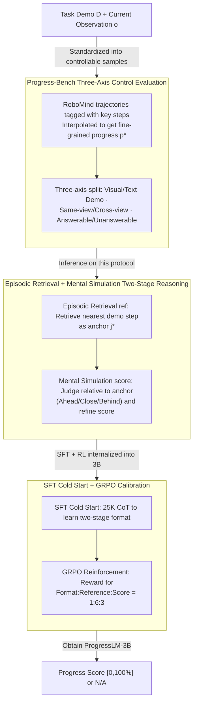

# PROGRESSLM: Towards Progress Reasoning in Vision-Language Models

**Conference**: ACL2026  
**arXiv**: [2601.15224](https://arxiv.org/abs/2601.15224)  
**Code**: Website / Code / Model / Dataset are noted in markers, but specific URLs are not expanded  
**Area**: Multimodal VLM / Embodied Task Progress Reasoning  
**Keywords**: Progress Reasoning, VLM Evaluation, Embodied AI, Two-Stage Reasoning, RL Fine-tuning

## TL;DR
This paper defines the ability to "judge task completion stages from a single-frame observation" as the VLM's progress reasoning capability. It constructs Progress-Bench and ProgressLM-45K, demonstrating that explicit learning of "episodic retrieval + mental simulation" is more stable than simple prompt-based reasoning.

## Background & Motivation
**Background**: Existing VLMs excel at describing "what is present" in a single image and can answer local state questions in robotic or embodied tasks. However, many practical systems are more concerned with "how far the task has progressed," such as whether a robot execution is stalled, if a Web agent is nearing its goal, or if online RL requires dense rewards.

**Limitations of Prior Work**: Traditional progress estimation typically relies on task-specific regressors or transforms the problem into indirect objectives like trajectory reordering or pairwise comparisons. These methods either depend heavily on specific task distributions or require the entire trajectory as context, failing to answer a more general question: given a complete task demonstration and a current single-frame observation, can a VLM directly infer the normalized progress?

**Key Challenge**: A single-frame observation contains static visual evidence, whereas progress is essentially a state variable in the temporal dimension. The model cannot simply perform image matching; it must place the current observation back into the task trajectory, determine its stage, and quantify how much progress has been made within that stage.

**Goal**: The authors first construct a controllable benchmark to systematically differentiate between visual and text demonstrations, same-view and cross-view scenarios, and answerable vs. unanswerable samples. They then evaluate 14 VLMs. Finally, a small-scale ProgressLM-3B is trained to verify if progress reasoning can be acquired through explicit supervision and reinforcement learning.

**Key Insight**: The paper draws inspiration from how humans understand task progress: first finding a coarse-grained reference point in memory, then imagining how the state continues to evolve around that reference. This perspective is more interpretable than direct percentage regression and better handles uncertainties introduced by cross-view or text-based demonstrations.

**Core Idea**: Decompose progress estimation into two stages: "episodic retrieval to locate anchors" and "mental simulation to refine percentages," and explicitly teach this reasoning format to the VLM using ProgressLM-45K.

## Method
The proposed method consists of a benchmark, a reasoning paradigm, and a training pipeline. Progress-Bench standardizes progress reasoning problems; training-free prompting is used to test if existing VLMs can activate these capabilities via prompts; and ProgressLM-3B internalizes the two-stage reasoning into model parameters.

### Overall Architecture
The input consists of a task demonstration $D$ and a current observation $o$. The demonstration can be a sequence of keyframes with progress annotations or text-based action steps; the observation is a single frame from some moment during task execution. The model outputs a progress score within $[0, 100\%]$; if the demonstration is inconsistent with the observation or progress cannot be inferred, it outputs N/A.

Progress-Bench is built upon RoboMind. Each task trajectory is first annotated with key steps, then intermediate frames are sampled between adjacent steps, with fine-grained progress $p^*=p_j+\delta(p_{j+1}-p_j)$ obtained via linear interpolation. Visual demonstrations are further divided into same-view and cross-view to test if the model truly understands task states rather than performing pixel-level similarity matching. Unanswerable samples are constructed by modifying demonstrations or editing observations to check if the model proactively refuses to answer when semantic mismatches occur.

The reasoning output of ProgressLM follows a fixed structure: it first generates `<ref_think>` and `<ref>` to find the demonstration step closest to the current observation, then generates `<score_think>` and `<score>` to estimate whether the current state is ahead of, close to, or behind that anchor. The training phase uses Supervised Fine-Tuning (SFT) to learn this format, followed by GRPO reinforcement learning to optimize the format, reference points, and progress scores.

### Key Designs

**1. Three-Axis Control Evaluation of Progress-Bench: Measuring error, order consistency, and refusal capability using a unified task definition**

If one only focuses on the final percentage error, a model might cheat using fixed templates or discrete scores, creating an illusion of progress understanding. To expose this, the benchmark decomposes samples along three axes: demonstration modality (visual keyframes vs. text steps), visual view (same-view vs. cross-view), and answerability (answerable vs. unanswerable). By crossing these axes, any failure can be localized to a specific pattern—whether it's an inability to understand progress at all, a collapse of ordering under cross-view conditions, or a failure to refuse when appropriate. This structure reveals behaviors like score collapse, cumulative failures in text states, and overly conservative refusals that would otherwise be hidden by average error metrics.

**2. Episodic Retrieval + Mental Simulation Two-Stage Reasoning: Decomposing continuous progress estimation into anchor selection and local comparison**

Directly asking a model for a progress percentage often results in heuristic answers like 0%, 50%, or 100%. ProgressLM mimics human judgment by splitting the process: the first stage retrieves the step $j^\star$ from the demonstration closest to the current observation as a reference anchor; the second stage focuses solely on the state difference between $j^\star$ and the current observation to decide if the frame is before, near, or after that step, providing a refined score. The output format is fixed—`<ref_think>`/`<ref>` for anchoring, followed by `<score_think>`/`<score>` for estimation. Explicit anchors constrain the score near an interpretable task state, suppressing heuristic collapse and making it easier to diagnose whether errors stem from anchor selection or detail estimation.

**3. SFT Cold Start + GRPO Calibration: Enabling small models to generate the two-stage format and align it with correct anchors and scores**

Simply being able to write the `<ref>`/`<score>` format is insufficient; small models may produce the correct format but incorrect anchors or scores. ProgressLM first uses ProgressLM-25K-CoT for auto-regressive supervised cold starting, with the loss defined as $\mathcal{L}_{SFT}=-\frac{1}{N}\sum_i\log P_\theta(r_i^*|D_i,o_i)$ to establish the two-stage reasoning skeleton. Subsequently, another 20K samples are used for GRPO reinforcement learning, where the reward is split into format, reference point, and score: $R=\alpha R_{format}+\beta R_{ref}+\gamma R_{score}$. With weights set to $1:6:3$, the majority of the reward is placed on anchor accuracy. SFT teaches "how to reason," while RL specifically penalizes anchor errors and score deviations, particularly calibrating the difficult cross-view and unanswerable scenarios.

### Loss & Training
The training data is ProgressLM-45K, with 25K used for CoT supervised cold start and 20K for RL refinement; training tasks do not overlap with Progress-Bench. SFT utilized LLaMA-Factory with LoRA rank 8, a learning rate of $1\times10^{-4}$, and an effective batch size of 64 across 4 H100 GPUs for 2 epochs. RL utilized EasyR1/GRPO with an actor learning rate of $1\times10^{-6}$, a KL coefficient of 0.01, and $n=16$ rollouts per prompt, training for 2 epochs (approx. 23 hours) on 16 H100 GPUs.

Inference evaluation uses a large maximum output length to ensure the model can generate the complete two-stage reasoning. The paper compares direct prediction, training-free prompting, and training-based ProgressLM to avoid attributing prompt format gains to training gains.

## Key Experimental Results

### Main Results
Progress-Bench consists of 240 task trajectories and 3,325 sampled observations, evaluating 14 VLMs. Metrics for answerable samples include NSE↓ (Normalized Squared Error), PRC↑ (Pearson Correlation), and AFRR↓ (Answerable-as-Unanswerable Failure Rate). Lower NSE indicates smaller percentage errors, higher PRC indicates better progress ordering along the trajectory, and lower AFRR indicates fewer answerable samples are mistakenly refused.

| Model | Macro Avg NSE↓ | Macro Avg PRC↑ | Macro Avg AFRR↓ | Note |
|------|-------------|-------------|--------------|------|
| GPT-5 | 21.3 | 72.6 | 4.2 | Strong closed-source baseline; still affected by modality |
| GPT-5-mini | 20.9 | 71.4 | 5.1 | Small closed-source model; PRC close to GPT-5 |
| Qwen2.5-VL-3B | 39.0 | 20.2 | 0.01 | Base model for ProgressLM; weak at direct prediction |
| ProgressLM-3B-SFT | 24.0 | 59.3 | 7.8 | Error drops significantly after SFT; ordering improves |
| ProgressLM-3B-RL | 17.5 | 77.0 | 7.0 | Macro Avg NSE/PRC outperforms GPT-5 |

### Ablation Study

| Configuration | Key Metrics | Note |
|------|----------|------|
| Qwen2.5-VL-3B, same-view | NSE 29.2 / PRC 43.0 / AFRR 9.9 | Small model has basic visual matching in same-view |
| Qwen2.5-VL-3B, cross-view | NSE 33.4 / PRC 28.9 / AFRR 6.5 | Ordering ability drops significantly in cross-view |
| ProgressLM-3B-RL, same-view | NSE 10.3 / PRC 93.5 / AFRR 0.1 | Two-stage training is highly stable in same-view |
| ProgressLM-3B-RL, cross-view | NSE 15.2 / PRC 88.8 / AFRR 11.7 | Error rises in cross-view, but PRC remains high |
| Qwen2.5-VL-7B, vision no-think | PRC 33.7 / NSE 34.0 / AFRR 28.3 | Direct prediction for 7B is still unreliable |
| Qwen2.5-VL-7B, vision training-based | PRC 85.7 / NSE 13.4 / AFRR 32.4 | Training-based reasoning significantly improves ordering and error |
| Qwen2.5-VL-7B, text training-based | PRC 50.5 / NSE 26.6 / AFRR 1.4 | Text demos are harder, but training still yields gains |

### Key Findings
- Existing VLMs often collapse progress scores into a few heuristic values (e.g., 0%, 50%, or 100%), leading to negative or undefined PRC; ProgressLM-SFT/RL produces a more continuous distribution.
- Training-free reasoning only provides conditional gains for strong models; small models often merely follow the output format without truly improving progress understanding.
- Text demonstrations are more difficult than visual ones because the model must accumulate implicit states; for instance, the same "handle lid" text step might correspond to entirely different object states.
- Unanswerable recognition cannot rely solely on UDA; while Intern3.5-VL-38B can refuse many abnormal samples, its high AFRR on answerable samples shows that excessive conservatism can damage system usability.

## Highlights & Insights
- Transforming the vague "task progress" of a VLM into a measurable metric is the most valuable contribution of this paper. It asks not just if the model understands the image, but if it can place a single-frame state into a complete task timeline.
- The two-stage reasoning design is simple yet captures a key truth: finding anchors before estimating details is more aligned with human judgment and makes errors easier to diagnose.
- ProgressLM-3B's ability to outperform GPT-5 in Macro Avg NSE/PRC suggests that these capabilities do not rely solely on model scale; targeted supervision and reward design can push small models to a more stable performance level.
- The unanswerable samples in the benchmark are crucial. If progress estimation is used for robot monitoring or agent self-improvement, providing an "erroneously precise" percentage can be more dangerous than refusing to answer.

## Limitations & Future Work
- The authors acknowledge that Progress-Bench focuses primarily on robotic manipulation tasks where progress is relatively clear and monotonic; progress may not be representable by a single percentage in open-ended, cyclic, or dynamic tasks.
- The training data for ProgressLM consists of structurally similar manipulation tasks; migrating to Web agents, code agents, or human activities might require new demonstration formats and progress annotations.
- Experiments show that AFRR still rises in cross-view scenarios, indicating the model is not yet perfectly calibrated between "conservative refusal" and "robust estimation."
- Future work could integrate progress scores into online control: for example, using low progress growth to detect stalls, using high uncertainty to trigger re-planning, or using ProgressLM as a dense reward generator for RL.

## Related Work & Insights
- **vs. Task-specific Progress Regressors**: Traditional methods often train regression models on fixed tasks or environments, with generalization depending on the training distribution; this paper treats progress estimation as a general VLM reasoning problem and requires only a single-frame observation.
- **vs. Trajectory Reordering / Pairwise Comparison**: These methods obtain estimates indirectly by reordering frames or comparing relative progress, relying on full trajectory context; ProgressLM infers absolute progress directly from the demo and a single frame, making it better suited for online monitoring.
- **vs. Inference-time CoT Prompting**: Training-free prompting can make models explicitly state reference steps, but gains are unstable; the results here remind us that complex reasoning formats require training and reward alignment, otherwise they remain mere "formatted explanations."
- **Insight**: For agent evaluation, one could similarly design "task progression benchmarks": given a goal, history, and current state, let the model judge completion, next-step bottlenecks, and answerability.

## Rating
- Novelty: ⭐⭐⭐⭐☆ Defines progress estimation as a structured VLM reasoning capability and builds a clear three-axis benchmark.
- Experimental Thoroughness: ⭐⭐⭐⭐⭐ Covers 14 VLMs, same/cross-view, text/visual demos, unanswerable samples, and 3B/7B training scaling with solid evidence.
- Writing Quality: ⭐⭐⭐⭐☆ Clear main narrative with information-dense tables, though some large tables require the reader to synthesize macro conclusions.
- Value: ⭐⭐⭐⭐⭐ Directly inspiring for embodied AI, long-horizon agent monitoring, and RL reward shaping.

<!-- RELATED:START -->

## Related Papers

- [\[CVPR 2026\] Progress-Think: Semantic Progress Reasoning for Vision-Language Navigation](../../CVPR2026/vlm_reasoning/progress-think_semantic_progress_reasoning_for_vision-language_navigation.md)
- [\[ACL 2026\] VL-Calibration: Decoupled Confidence Calibration for Large Vision-Language Models Reasoning](vl-calibration_decoupled_confidence_calibration_for_large_vision-language_models.md)
- [\[ACL 2026\] MMErroR: A Benchmark for Erroneous Reasoning in Vision-Language Models](mmerror_a_benchmark_for_erroneous_reasoning_in_vision-language_models.md)
- [\[ACL 2026\] GeoArena: Evaluating Open-World Geographic Reasoning in Large Vision-Language Models](geoarena_evaluating_open-world_geographic_reasoning_in_large_vision-language_mod.md)
- [\[ACL 2026\] Addressing Overthinking in Large Vision-Language Models via Gated Perception-Reasoning Optimization](addressing_overthinking_in_large_vision-language_models_via_gated_perception-rea.md)

<!-- RELATED:END -->
