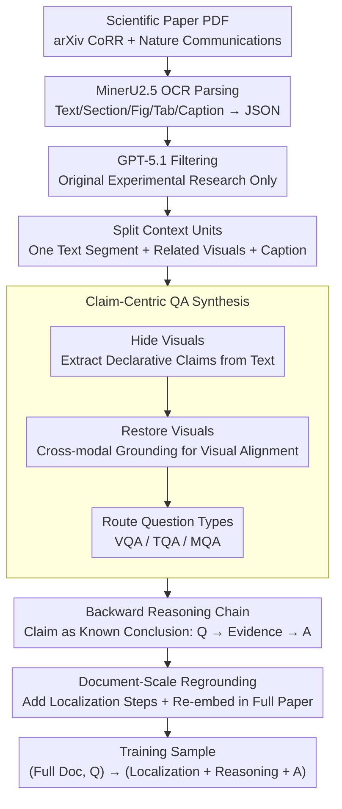

# SciMDR: Advancing Scientific Multimodal Document Reasoning

**Conference**: ACL2026  
**arXiv**: [2603.12249](https://arxiv.org/abs/2603.12249)  
**Code**: No public code link found  
**Area**: Multimodal VLM / Scientific Document Understanding  
**Keywords**: Scientific document reasoning, multimodal QA, data synthesis, long document understanding, evidence localization

## TL;DR
SciMDR proposes a synthesize-and-reground data construction framework that first synthesizes faithful QA and reasoning chains based on atomic claims, then re-embeds them into full scientific papers for model training. This enables a 7B VLM to approach GPT-5 series performance in scientific multimodal document reasoning.

## Background & Motivation
**Background**: Scientific document understanding is evolving from summary-level QA and chart QA toward full-paper level reasoning. Real-world research questions often require simultaneous reading of the main text, figures, tables, captions, and experimental descriptions, alongside locating evidence within long documents.

**Limitations of Prior Work**: High-quality scientific QA data faces a "triangular contradiction": manual annotation is high-quality but small-scale; data constructed from figures or snippets is more faithful but less realistic; direct generation from complete documents is closer to real-world usage but long contexts dilute attention and increase hallucinations, leading to unreliable answers and reasoning chains.

**Key Challenge**: Training scientific assistants requires both faithful supervisory signals and realistic full-document tasks. By training only with short snippets, models fail to learn how to find evidence within a full paper; conversely, synthesizing directly from full papers makes it difficult to guarantee the correctness of annotations.

**Goal**: To build a large-scale training set SciMDR and an expert-annotated evaluation set SciMDR-Eval, allowing models to learn evidence localization, the connection of textual and visual elements, and multi-step scientific reasoning within complete scientific documents, while verifying if synthetic data truly improves scientific QA capabilities.

**Key Insight**: The authors decouple "generating faithful QA" from "constructing realistic training tasks." In the first phase, QA and CoT are generated only within small, verifiable atomic contexts. In the second phase, utilizing evidence locations recorded in the claims, the QA is re-embedded into the full document with added information localization steps.

**Core Idea**: First lock the answers and evidence onto atomic claims, then place the same supervisory signals back into the full paper environment, forcing the model to learn to "find evidence first, then reason, and finally answer" within high-noise long contexts.

## Method
The focus of the SciMDR method is not on a new model architecture, but rather a training data generation paradigm for scientific multimodal documents. It parses scientific papers into text, sections, figures, and tables with captions, generates three types of QA (VQA/TQA/MQA) centered around claims, and transforms these into full-document training samples via document-scale regrounding.

### Overall Architecture
The input consists of scientific paper PDFs filtered from arXiv CoRR and Nature Communications, processed via MinerU2.5 OCR to extract text, sections, figures, tables, and captions into JSON format. GPT-5.1 then identifies whether the paper is an original experimental study, filtering out surveys, position papers, tutorials, and purely conceptual articles. The final training data covers approximately 20K papers and 300K QA pairs; the evaluation set is manually constructed by three CS graduate students from 300 arXiv papers, resulting in 907 high-quality QA pairs.

The framework consists of two stages. Claim-Centric QA Synthesis is responsible for generating faithful data in small contexts; Document-Scale Regrounding converts this data into full-paper level training tasks. The final training format is `(Full Document Context, Question) -> (Information Localization + Reasoning + Final Answer)`.

### Key Designs
**1. Claim-Centric QA Synthesis: Locking answers into small, verifiable contexts before generating QA and reasoning chains**

Providing an entire paper to an LLM for open-ended question generation carries high risks of hallucination and evidence mismatch—long contexts dilute attention, causing models to invent "plausible-sounding" answers not present in the paper. SciMDR takes the opposite approach: each multimodal context unit contains only one text segment, related figures/tables, and captions. The system identifies sentences citing visual elements, hides the visuals, and has the LLM extract discrete declarative claims from the text alone. Then, visuals are restored, and cross-modal grounding determines if each claim has a visual counterpart, routing it to VQA, TQA, or MQA categories. 

The brilliance here is that the claim serves as an "answer blueprint," downgrading reasoning chain generation from "open inference" to "explaining why this answer holds." Since the generation space is confined to a verifiable small scope, hallucinations and evidence mismatches drop significantly.

**2. Backward Reasoning Chain Construction: Treating claims as known conclusions to reverse-engineer the Question-Evidence-Answer chain**

The two true difficulties in scientific QA are evidence retrieval (finding evidence in long text) and open-ended inference (deriving conclusions). If a model is forced to push forward blindly, these two difficulties stack, making CoT quality unstable. SciMDR treats the claim directly as the ground-truth conclusion. The LLM does not need to discover the answer; instead, it constructs a reasoning chain starting from a question, passing through evidence, and concluding at the known claim.

In other words, "finding evidence" is partially outsourced to the previous claim extraction and localization step. The model is only responsible for filling in the logical chain. By decomposing and outsourcing the difficulty, the resulting CoT supervisory signals are more stable, imitable, and verifiable.

**3. Document-Scale Regrounding: Re-inserting atomic QA into complete papers to maintain realistic long-document noise**

The first two steps ensure faithfulness, but at the cost of being divorced from real-world scenarios—real users do not pre-segment relevant paragraphs for the model. Since each QA-bound claim already records the location of textual and visual evidence, SciMDR can automatically generate an Information Localization step, such as "First check Section X, then cross-reference Table Y." This is prepended to the synthetic reasoning chain and packaged with the full paper context as a training sample. The final format is `(Full Document Context, Question) -> (Information Localization + Reasoning + Final Answer)`.

This step bridges the gap of being "faithful but not realistic." The task restores the high-noise long-context environment of a full paper, forcing the model to learn "localize then reason," while the answer chain remains anchored by precise evidence.

### Loss & Training
The paper employs supervised fine-tuning rather than a new loss function. The main experiment uses Qwen2.5-VL-7B as the base model, trained in two stages: Stage 1 uses VQA and TQA data for 1 epoch with a peak learning rate of $1\times10^{-5}$ and a batch size of 64; Stage 2 continues with MQA data for 1 epoch at a learning rate of $1\times10^{-6}$. During fine-tuning, the visual encoder and projector are frozen, and only the language model is trained. The SPIQA baseline is replicated using the same base model to isolate differences in data quality.

## Key Experimental Results

### Main Results
The main table shows the improvement of SciMDR training on Qwen2.5-VL-7B. The final column corresponds to the authors' constructed SciMDR-Eval; `+ SciMDR` refers to the model fine-tuned using the 300K data points from this paper.

| Model | ChartQA | CharXiv-D | CharXiv-R | SPIQA-A | SPIQA-B | SPIQA-C | SciMDR-Eval |
|------|---------|-----------|-----------|---------|---------|---------|-------------|
| GPT-5.1 | - | 90.9 | 58.3 | 79.4 | 79.8 | 71.6 | 47.2 |
| GPT-5.2 | - | 95.2 | 73.1 | 79.9 | 75.4 | 74.0 | 49.9 |
| Qwen-3-VL-8B | 87.4 | 74.2 | 40.1 | 73.2 | 64.0 | 62.3 | 34.2 |
| Qwen2.5-VL-7B | 84.6 | 65.0 | 37.7 | 66.4 | 56.6 | 48.9 | 19.8 |
| Qwen2.5-VL-7B + SPIQA | 81.8 | 50.9 | 33.3 | 62.7 | 44.7 | 40.0 | 5.6 |
| Qwen2.5-VL-7B + SciMDR | 86.3 | 75.6 | 37.9 | 68.6 | 58.8 | 47.3 | 49.1 |

Direct comparison with proprietary models indicates that SciMDR-Eval is highly challenging and that 7B specialized training can significantly close the gap.

### Ablation Study
The key analysis uses LLaVA-1.5-7B as a data quality probe. The authors compare original SPIQA, SciMDR VQA, and SPIQA re-annotated with this paper's claim-centric pipeline at a scale of 50K samples. Re-annotating SPIQA improved results from 35.7 to 39.8, and the output length on CharXiv was approximately 5x longer than original data, indicating gains come from reasoning chain quality rather than just the data source.

| Configuration | Key Experimental Results | Description |
|------|----------|------|
| Qwen2.5-VL-7B base | SciMDR-Eval 19.8 | General VLM struggles with full scientific paper reasoning |
| + SPIQA Data | SciMDR-Eval 5.6 | Short-context synthetic data degrades when migrated to full docs |
| + SciMDR Data | SciMDR-Eval 49.1 | Info Localization + Reasoning Chain significantly improves QA |
| SPIQA Re-annotated | 39.8 vs Original 35.7 | Claim-centric annotation is higher quality given the same docs |

### Key Findings
- `+ SciMDR` provided the largest boost to SciMDR-Eval, from 19.8 to 49.1, an increase of 29.3 points, nearly matching GPT-5.2.
- `+ SPIQA` led to performance drops in most metrics, particularly on SciMDR-Eval (19.8 to 5.6), suggesting existing short-context synthetic data does not naturally teach models to find evidence in full papers.
- On CharXiv-D, SciMDR improved from 65.0 to 75.6, showing that claim-centric data transfers well to chart-based scientific QA.
- A slight drop of 1.6 on SPIQA-C suggests that specialized training for full-document localization might sacrifice some performance on specific sub-tasks or that skill distributions differ across benchmarks.

## Highlights & Insights
- The core insight is decoupling the two goals of data synthesis: faithfulness is guaranteed in small contexts, while realism is restored in full documents. This approach is more stable than "direct long-document generation."
- The claim serves as a powerful intermediate representation. it acts as both the answer blueprint for QA generation and the information localization map for the re-embedding stage.
- Information Localization supervision is an often-overlooked step in training scientific assistants. SciMDR explicitly requires the model to identify which section/table/figure to check, mimicking real research reading.
- The results serve as a reminder that data scale does not equal data effectiveness. Synthetic data like SPIQA can harm models when task formats are mismatched; the full-document training format is the key.

## Limitations & Future Work
- Data quality is bound by the GPT-5.1 proprietary teacher. Even with claims reducing hallucinations, subtle teacher errors in niche scientific fields may be hard-coded into the student model.
- Experiments are primarily focused on STEM. Whether the SciMDR pipeline applies to areas like Humanities or Social Sciences, with different argumentative structures and evidence forms, has not been verified.
- The construction relies heavily on OCR, chart parsing, and section extraction. Errors in MinerU2.5 could affect claim and evidence positioning; the paper does not systematically quantify this error propagation.
- SciMDR-Eval uses an LLM judge for open-ended answers, which may introduce judge bias. Future work could include manual verification and cross-judge stability analysis.

## Related Work & Insights
- **vs ChartQA / CharXiv**: These focus on chart or scientific image understanding; SciMDR emphasizes multimodal evidence localization and reasoning across full papers.
- **vs SPIQA**: SPIQA is recent, but its synthesis is biased toward short contexts. SciMDR shows that full-document reasoning requires explicit full-document regrounding.
- **vs Manual Scientific QA**: ExpertQA and QASPER have high quality but limited scale. SciMDR scales to 300K QA while validating with 907 manual evaluation points.

## Rating
- Novelty: ⭐⭐⭐⭐☆ Not a new model, but a highly practical data construction paradigm; using claims as both answer blueprints and evidence maps is clever.
- Experimental Thoroughness: ⭐⭐⭐⭐☆ Strong main results and proprietary model comparisons, but lacks deep analysis of OCR errors and judge stability.
- Writing Quality: ⭐⭐⭐⭐☆ Clear logic regarding the faithfulness-realism dilemma, though some dataset name rendering issues exist in the PDF text.
- Value: ⭐⭐⭐⭐⭐ Highly insightful for scientific VLM training, especially for building research assistants capable of reading full papers.

<!-- RELATED:START -->

## Related Papers

- [\[ACL 2026\] Position: Multimodal Large Language Models Can Significantly Advance Scientific Reasoning](position_multimodal_large_language_models_can_significantly_advance_scientific_r.md)
- [\[ACL 2026\] ShredBench: Evaluating the Semantic Reasoning Capabilities of Multimodal LLMs in Document Reconstruction](shredbench_evaluating_the_semantic_reasoning_capabilities_of_multimodal_llms_in_.md)
- [\[ACL 2026\] Decoding Scientific Experimental Images: The SPUR Benchmark for Perception, Understanding, and Reasoning](decoding_scientific_experimental_images_the_spur_benchmark_for_perception_unders.md)
- [\[ACL 2025\] LongDocURL: a Comprehensive Multimodal Long Document Benchmark Integrating Understanding, Reasoning, and Locating](../../ACL2025/vlm_reasoning/longdocurl_multimodal_long_doc.md)
- [\[CVPR 2026\] DocSeeker: Structured Visual Reasoning with Evidence Grounding for Long Document Understanding](../../CVPR2026/vlm_reasoning/docseeker_long_document_understanding.md)

<!-- RELATED:END -->
