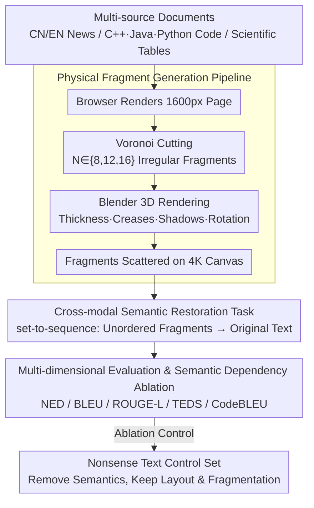

# ShredBench: Evaluating the Semantic Reasoning Capabilities of Multimodal LLMs in Document Reconstruction

**Conference**: ACL2026 Findings  
**arXiv**: [2604.23813](https://arxiv.org/abs/2604.23813)  
**Code**: https://github.com/ythere-y/ShredBench  
**Area**: Multimodal VLM / Document Understanding / Multimodal Reasoning  
**Keywords**: Document Reconstruction, MLLM Evaluation, Fragmented Documents, Semantic Reasoning, OCR Robustness

## TL;DR
ShredBench constructs an evaluation benchmark centered on "restoring content from shredded documents using multimodal large language models," demonstrating that current MLLMs, despite being strong in conventional OCR, generally lack the ability to perform reasoning by integrating visual fragments, reading order, and semantic context.

## Background & Motivation
**Background**: Multimodal Large Language Models (MLLMs) have covered scenarios such as OCR, table parsing, information extraction, and visual question answering in document understanding tasks. Common evaluations mostly assume that input documents are clear, complete, and have stable layouts. Models only need to read text in high-resolution images, parse the layout, and output structured content.

**Limitations of Prior Work**: Real-world document processing does not always encounter perfect scans. Paper may be torn, occluded, folded, or scrambled. Models must not only recognize local text but also infer the sequential relationship between fragments. Existing OCR or document parsing benchmarks typically only test "whether the model sees clearly" and rarely test "whether the model can stitch broken visual evidence with linguistic common sense."

**Key Challenge**: The reconstruction of fragmented documents lies between visual jigsaw puzzles and linguistic reasoning. Traditional jigsaw puzzles rely more on edge matching, whereas document fragments often feature black text on white backgrounds with sparse boundary information. The truly usable clues are grammar, semantics, code structure, and 2D table layouts. Whether MLLMs can fuse these clues is a question that has not been systematically evaluated.

**Goal**: The authors aim to construct an automated, scalable evaluation set with controlled contamination risks, covering natural language, code, and tables, and observing how model capabilities degrade with the degree of structural damage across different fragment counts.

**Key Insight**: The paper defines document restoration as a set-to-sequence task: the input is a set of unordered fragment images, and the output is the text of the original document. This preserves the complexity of visual input while allowing for repeatable evaluation using text similarity and structural metrics.

**Core Idea**: Use a controllable physical rendering pipeline to generate fragmented documents, forcing the model to rely on cross-fragment semantic bridging rather than clean OCR or simple edge matching for restoration.

## Method

### Overall Architecture
The workflow of ShredBench is divided into three steps. First, multi-source documents are collected, including English news, Chinese news, C++/Java/Python code, and scientific tables. Second, the original content is rendered into high-resolution pages, and irregular fragments are generated using Voronoi cutting and 3D physical rendering. Third, the scattered fragments are provided as a single visual input to the MLLM, and the model is required to output text or table content as close to the original document as possible.

The dataset contains a total of 756 documents, with each document generated at three fragment granularities: 8, 12, and 16. The authors emphasize that data sources can be flexibly replaced with the latest or unseen text to mitigate the impact of training set contamination on evaluation effectiveness.

### Key Designs

**1. Physical Fragment Generation Pipeline: Making tear marks too realistic for pixel-edge cheating**

Ordinary rectangular cropping preserves strong pixel continuity, allowing models to bypass semantic reasoning by aligning strokes on adjacent edges. ShredBench therefore makes the generation process as "physical" as possible: first, the text is rendered into a 1600px wide page via a browser; then, $N \in \{8,12,16\}$ Voronoi seed points are randomly sampled to cut the image into irregular fragments; finally, these are sent to Blender to add paper thickness, creases, shadows, and random rotations, outputting a collection of fragments scattered on a 4K canvas. Voronoi cutting makes fragment boundaries irregular and non-parallel, while 3D rendering erases low-level pixel continuity clues. To reconstruct the original text, the model must rely on text, grammar, and layout semantics rather than edge matching—exactly the capability the benchmark aims to elicit.

**2. Cross-modal Semantic Restoration Task: Requiring final text accuracy instead of pixel coordinates**

If the model were required to explicitly predict the position of each fragment, the task would degenerate into a geometric puzzle, which could again be bypassed by low-level matching. ShredBench defines it as set-to-sequence: given a set of unordered fragments $\mathcal{I}=\{f_1,\dots,f_N\}$, the model only needs to output text $\hat{T}$ consistent with the original document $D$ content, without explicitly predicting fragment coordinates. The quality of the final text reflects the implicit stitching capability. This task simultaneously imposes constraints from OCR, reading order, language priors, code syntax, and 2D table layouts, better exposing MLLM weaknesses in global reasoning than simple document OCR.

**3. Multi-dimensional Evaluation & Semantic Dependency Ablation: Using "Nonsense Text" control sets to prove semantic reliance**

Restoration scores alone do not clarify whether the model performs semantic reasoning or visual puzzles. For evaluation, NED, BLEU, and ROUGE-L are used for general text, TEDS is added for tables, and CodeBLEU is included in the appendix for code. For diagnosis, a "Nonsense Text" control set is constructed—keeping layout and character length constant while removing real semantics. The logic is direct: if the model relies on visual edge puzzles, nonsense text performance should not significantly degrade; however, testing shows that models drop significantly on the control set, proving they primarily utilize semantic priors when successful, as pure visual matching is far from sufficient.

### Loss & Training
This paper does not propose a new training method but focuses on benchmarking and evaluation. Inference uses a unified zero-shot prompt, requiring the model to ignore physical noise and reconstruct content verbatim; the temperature is set to 0 or the lowest value supported by the API, and outputs undergo unified post-processing to ensure metrics primarily reflect restored content rather than format noise.

## Key Experimental Results

### Main Results
Overall results show that Gemini 3 Pro and Gemini 3 Flash lead significantly, yet even the strongest models degrade as the number of fragments increases. Open-source models and specialized OCR models are generally weak in fragment restoration, indicating that "capable of OCR" does not equate to "capable of reconstruction."

| Model | 8-piece NED↓ / BLEU↑ / ROUGE↑ | 12-piece NED↓ / BLEU↑ / ROUGE↑ | 16-piece NED↓ / BLEU↑ / ROUGE↑ | Observation |
|------|---------------------------|----------------------------|----------------------------|------|
| Gemini 3 Pro | 0.33 / 0.51 / 0.83 | 0.37 / 0.48 / 0.81 | 0.41 / 0.44 / 0.76 | Globally strongest; degradation is relatively slow as fragments increase |
| Gemini 3 Flash | 0.34 / 0.47 / 0.82 | 0.40 / 0.44 / 0.77 | 0.44 / 0.41 / 0.74 | Close to Pro; stronger in table scenarios |
| Qwen-VL-Plus | 0.59 / 0.26 / 0.58 | 0.63 / 0.22 / 0.53 | 0.65 / 0.20 / 0.50 | Moderate level; significant drop after fragments increase |
| GLM-4.6v | 0.67 / 0.20 / 0.45 | 0.70 / 0.17 / 0.40 | 0.71 / 0.15 / 0.37 | Recovers partial semantics, but global order is unstable |
| DeepSeek-OCR | 0.86 / 0.02 / 0.12 | 0.87 / 0.01 / 0.09 | 0.87 / 0.01 / 0.10 | Specialized OCR fails almost completely with fragmented input |

Performance across different document types is also insightful. For code, average NED for Java and C++ is better than Python; the authors suggest that explicit structures like braces and semicolons provide more restoration anchors. In table scenarios, Gemini 3 Flash achieved an NED of 0.49, performing better than Gemini 3 Pro (0.59), suggesting that semantic-first models are not necessarily the best at rigid 2D layouts.

### Ablation Study
The semantic ablation in the appendix directly addresses whether models are merely performing visual jigsaw puzzles. The authors constructed 50 nonsense text documents, preserving layout, character length, and the fragmentation process, and re-evaluated under the 16-piece condition.

| Model | Real English ROUGE↑ | Nonsense Text ROUGE↑ | ROUGE Gain | Real English NED↓ | Nonsense Text NED↓ | Explanation |
|------|----------------|-------------------|------------|---------------|------------------|------|
| Gemini 3 Pro | 0.73 | 0.33 | -0.40 | 0.35 | 0.65 | Strongest models are highly dependent on semantic bridging |
| Gemini 3 Flash | 0.67 | 0.29 | -0.38 | 0.41 | 0.71 | Visual clues are insufficient for restoration without semantics |
| Qwen-VL-Plus | 0.38 | 0.13 | -0.25 | 0.65 | 0.75 | Moderate models also show significant degradation |
| GLM-4.6v | 0.30 | 0.18 | -0.12 | 0.70 | 0.74 | Weak initial semantic utilization leads to smaller drop |
| GPT-5.1 | 0.15 | 0.08 | -0.07 | 0.80 | 0.81 | Overall restoration capability is weak; small gap on control set |

### Key Findings
- Fragment count is a stable difficulty knob: Gemini 3 Pro's NED only increases by 0.08 from 8 to 16 pieces, while Qwen-VL-Plus increases by approximately 0.14, showing that stronger models have flatter degradation curves.
- Chinese news is more difficult than English news, due to high information density of characters—where semantic loss is high if a character is cut—and BLEU/ROUGE's sensitivity to Chinese segmentation boundaries.
- Code restoration failures mainly stem from row order errors and content omissions; narrow fragments are particularly prone to being ignored as visual noise.
- Semantic ablation proves that models do not complete tasks via simple edge matching; without real semantics, all models converge to a similar low-performance range.

## Highlights & Insights
- This paper pushes "document understanding robustness" from noise, blur, and rotation to the level of structural damage. The task setting is natural and closer to real-world damaged document processing than traditional OCR benchmarks.
- The data generation pipeline is clever: using replaceable text sources reduces contamination risks, 3D rendering weakens visual shortcuts, and three fragment granularities create a continuous difficulty gradient.
- The analysis of code and tables is valuable as it demonstrates that semantic reasoning is not a panacea. Code requires syntactic constraints, and tables require 2D structural constraints; future models might need explicit structural search or constrained decoding.
- The "Nonsense Text" ablation is the most critical insight: the success of current MLLMs highly depends on linguistic priors, while pure visual stitching capability remains weak when semantics are removed.

## Limitations & Future Work
- Data remains synthetic. Although physical rendering is used, real shredded paper may contain occlusions, folds, stains, paper texture variations, and scan angle deviations.
- The evaluation primarily focuses on final text similarity without explicitly evaluating fragment ordering or the geometric reconstruction process, making it difficult to distinguish if a model "stitches then reads" or "reads then guesses."
- Metrics for tables and code are still imperfect; string metrics penalize formatting differences, while structural metrics may not cover semantic equivalence.
- Future work could combine ShredBench with search-based re-ranking, OCR candidates, program syntax checkers, or table structure parsers to construct stronger multi-stage document restoration systems.

## Related Work & Insights
- **vs OmniDocBench / WildDoc**: These benchmarks focus on complete document parsing or document robustness in natural scenes. ShredBench completely scrambles the input structure, emphasizing cross-fragment semantic bridging.
- **vs Jigsaw-Puzzles / RePAIR**: Traditional reconstruction tasks rely more on visual or geometric matching. The core of ShredBench lies in the constraints imposed by text, code, and table semantics on stitching.
- **vs Pure OCR Models**: DeepSeek-OCR and Hunyuan-OCR might be strong in general text recognition but perform poorly on fragmented inputs, indicating that document restoration requires global reasoning modules.
- **Insight**: For automated research systems, "structural damage robustness" can serve as an important evaluation dimension for document parsing models when dealing with paper scans, damaged tables, or low-quality PDFs in the future.

## Rating
- Novelty: ⭐⭐⭐⭐☆ The benchmark task is novel with a clear setting, serving as a distinctive probe for MLLM semantic reasoning.
- Experimental Thoroughness: ⭐⭐⭐⭐⭐ Covers 756 documents, 4 scenarios, 3 fragment granularities, and 14 models, supplemented by semantic ablation and code structural metrics.
- Writing Quality: ⭐⭐⭐⭐☆ The paper logic is smooth with dense information in charts; some model naming and future timelines feel somewhat stylized but do not hinder core understanding.
- Value: ⭐⭐⭐⭐⭐ Highly relevant for document understanding, OCR robustness, multimodal reasoning, and real-world damaged document recovery.

<!-- RELATED:START -->

## Related Papers

- [\[ACL 2025\] Chart-based Reasoning: Transferring Capabilities from LLMs to VLMs](../../ACL2025/vlm_reasoning/chart-based_reasoning_transferring_capabilities_from_llms_to_vlms.md)
- [\[ACL 2026\] SciMDR: Advancing Scientific Multimodal Document Reasoning](scimdr_advancing_scientific_multimodal_document_reasoning.md)
- [\[CVPR 2026\] VisRes Bench: On Evaluating the Visual Reasoning Capabilities of VLMs](../../CVPR2026/vlm_reasoning/visres_bench_on_evaluating_the_visual_reasoning_capabilities_of_vlms.md)
- [\[ACL 2026\] Faithful-First Reasoning, Planning, and Acting for Multimodal LLMs](faithful-first_reasoning_planning_and_acting_for_multimodal_llms.md)
- [\[AAAI 2026\] FinMMDocR: Benchmarking Financial Multimodal Reasoning with Scenario Awareness, Document Understanding, and Multi-Step Computation](../../AAAI2026/vlm_reasoning/finmmdocr_benchmarking_financial_multimodal_reasoning_with_scenario_awareness_do.md)

<!-- RELATED:END -->
